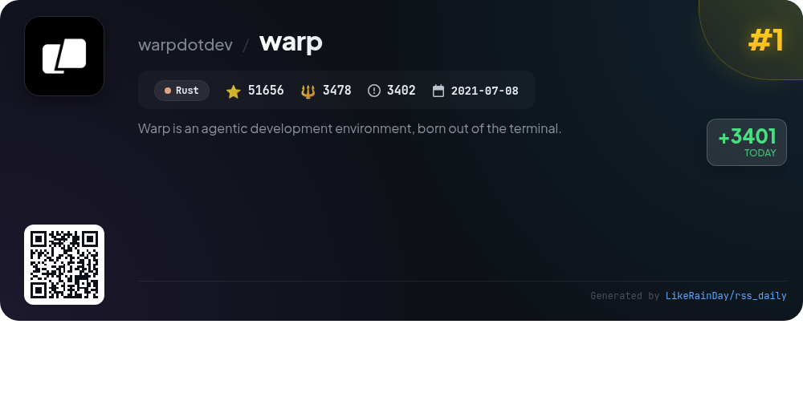
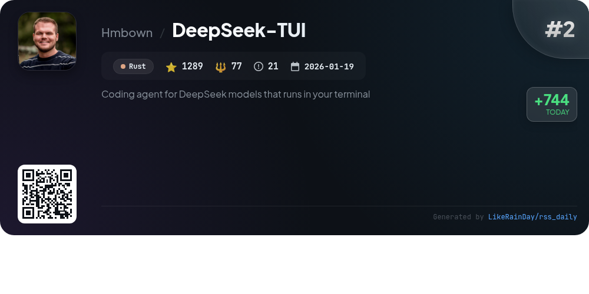
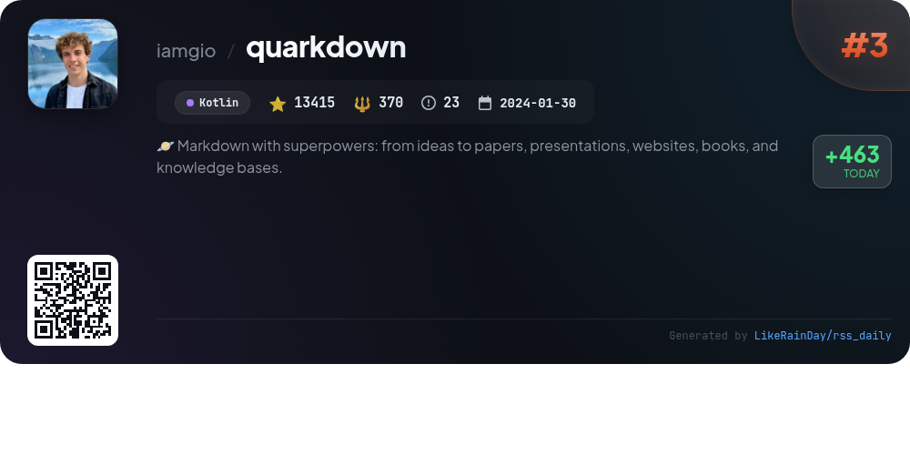
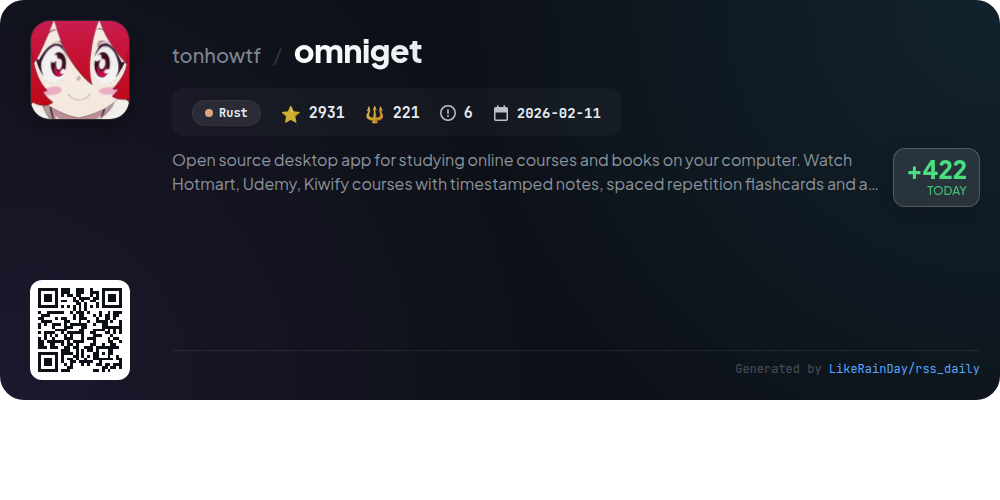
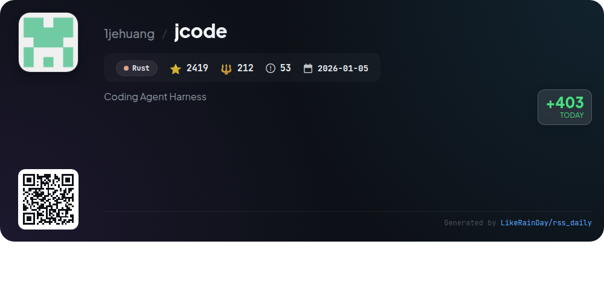
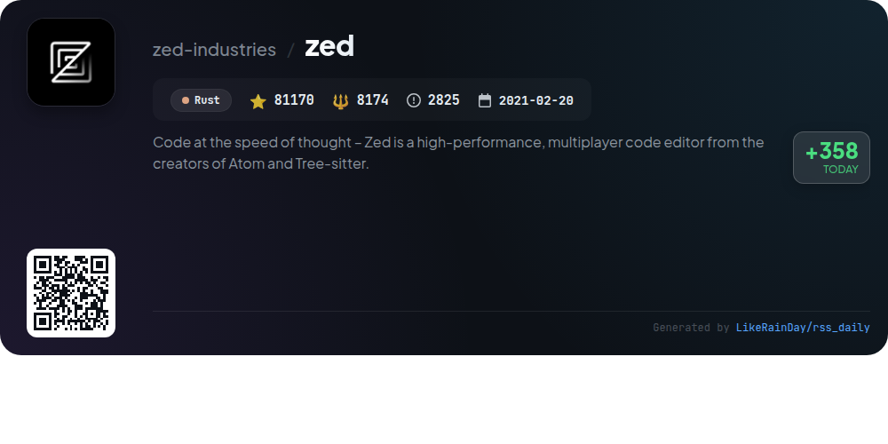
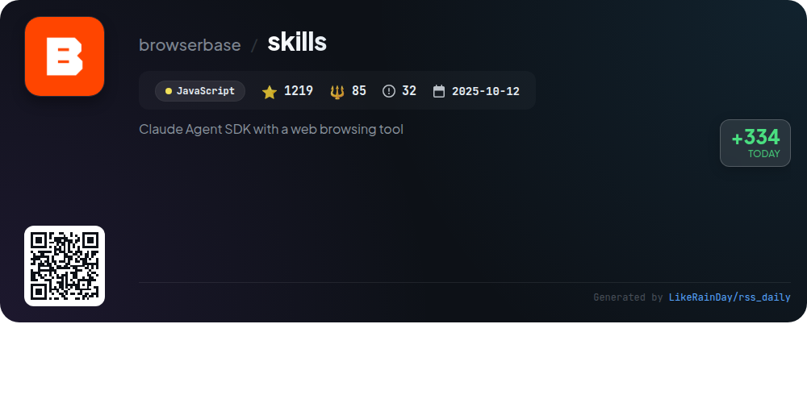
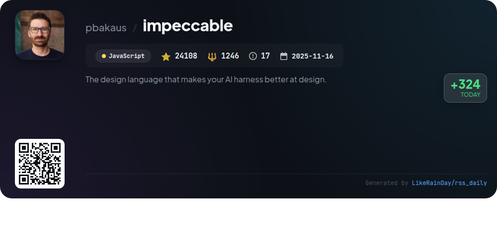
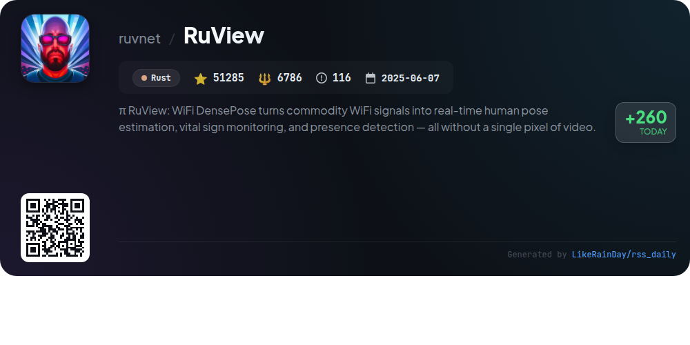
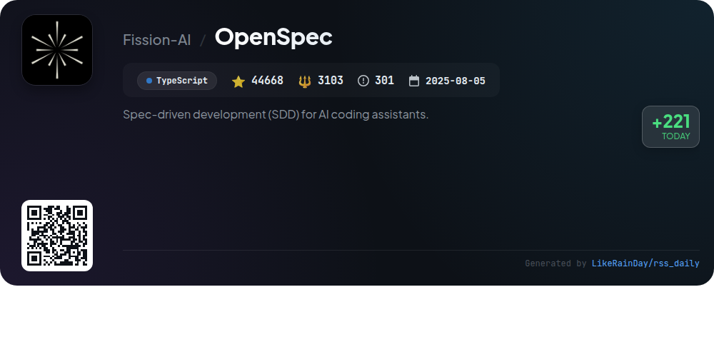

# 📊 🌟 GitHub Trending Daily - 2026-05-02

> > 📅 Daily Picks of GitHub Trending Repositories | Powered by Smart Algorithms

## 📋 Overview

**10** Projects | **274160** ⭐ | **23752** 🍴

**Top Languages:** `Rust` (6) · `JavaScript` (2) · `Kotlin` (1)

**Updated:** 2026-05-02 03:32 UTC

**Categories:**

- 🌟 Daily Top 10 (10 items)

---

## 🌟 Daily Top 10

### 1. [warp](https://github.com/warpdotdev/warp)

> 🤖 **Why Recommend**  
> *Warp is an innovative agentic development environment built from the terminal, designed to enhance coding productivity. With over 51,000 stars on GitHub, it supports built-in coding agents and allows integration of external CLI agents like Claude Code and Codex. Key features include issue triaging, PR reviews, and a collaborative dashboard for tracking contributions. Warp is open-source, encourages community engagement, and provides extensive documentation for users and contributors. Explore more at [warp.dev](https://www.warp.dev).*

- ⭐ 51656 stars
- 💻 Rust
- 📅 Updated: 2026-05-02

### 2. [DeepSeek-TUI](https://github.com/Hmbown/DeepSeek-TUI)

> 🤖 **Why Recommend**  
> *DeepSeek-TUI is a terminal-native coding agent for DeepSeek V4 models, offering 1M-token context and advanced reasoning capabilities. Key features include native RLM for parallel processing, thinking-mode streaming for real-time reasoning, and a comprehensive tool suite for file operations, shell commands, and git management. It supports three interaction modes (Plan, Agent, YOLO), session management, and workspace rollback. The project enables seamless integration with HTTP/SSE APIs and the Model Context Protocol, making it ideal for efficient coding workflows.*

- ⭐ 1289 stars
- 💻 Rust
- 📅 Updated: 2026-05-02

### 3. [quarkdown](https://github.com/iamgio/quarkdown)

> 🤖 **Why Recommend**  
> *Quarkdown is a versatile Markdown-based typesetting system that enables users to create documents ranging from academic papers and books to interactive presentations and knowledge bases. Built with Kotlin, it extends Markdown with scripting capabilities, allowing for dynamic content generation. Key features include seamless compilation to HTML, PDF, or plain text, a powerful VS Code extension, and a rich standard library for customizable layouts and functions. With live preview functionality and quick project setup, Quarkdown is ideal for both simple and complex document creation, boasting over 13,000 stars on GitHub.*

- ⭐ 13415 stars
- 💻 Kotlin
- 📅 Updated: 2026-05-02

### 4. [omniget](https://github.com/tonhowtf/omniget)

> 🤖 **Why Recommend**  
> *OmniGet is an open-source desktop app designed for efficient study of online courses and books. It supports platforms like Hotmart, Udemy, and Kiwify, allowing users to download and organize content with a built-in video player and document reader for PDFs and EPUBs. Key features include timestamped notes, spaced repetition flashcards, a focus timer, and a library management system. OmniGet also facilitates downloading videos from major platforms like YouTube and TikTok, along with support for torrents. With a user-friendly interface and extensive customization options, it enhances the learning experience while keeping all content local.*

- ⭐ 2931 stars
- 💻 Rust
- 📅 Updated: 2026-05-02

### 5. [jcode](https://github.com/1jehuang/jcode)

> 🤖 **Why Recommend**  
> *jcode is a high-performance coding agent harness built in Rust, designed for multi-session workflows with infinite customizability. Key features include efficient memory management through semantic vector embeddings, a powerful UI with real-time updates, and a built-in browser tool for automation. It supports various OAuth providers, allowing integration with existing models and easy multi-account switching. The self-dev mode enables agents to modify their own source code, enhancing adaptability. jcode also facilitates collaborative workflows with swarm capabilities for multiple agents.*

- ⭐ 2419 stars
- 💻 Rust
- 📅 Updated: 2026-05-02

### 6. [zed](https://github.com/zed-industries/zed)

> 🤖 **Why Recommend**  
> *Zed is a high-performance, multiplayer code editor developed by the creators of Atom and Tree-sitter, designed to facilitate coding at the speed of thought. With robust installation options for macOS, Linux, and Windows, Zed offers a seamless coding experience. Key features include real-time collaboration and support for various programming languages. The project encourages community contributions and provides comprehensive documentation for development. Zed Industries, Inc. oversees its development and welcomes financial support through GitHub Sponsors.*

- ⭐ 81170 stars
- 💻 Rust
- 📅 Updated: 2026-05-02

### 7. [skills](https://github.com/browserbase/skills)

> 🤖 **Why Recommend**  
> *The Browserbase Skills project, part of the Claude Agent SDK, enhances browser automation capabilities with a variety of powerful skills. Key features include automated web interactions, serverless deployment, site debugging, and AI-powered UI testing. Users can manage Browserbase functions via the `bb` CLI, sync cookies for authenticated sessions, and fetch data from static pages without a browser. With 1,219 stars, this JavaScript-based SDK streamlines workflows for developers needing robust web automation and debugging tools.*

- ⭐ 1219 stars
- 💻 JavaScript
- 📅 Updated: 2026-05-02

### 8. [impeccable](https://github.com/pbakaus/impeccable)

> 🤖 **Why Recommend**  
> *Impeccable is a powerful design language tool for enhancing AI-driven frontend design, boasting over 24,000 stars on GitHub. It offers a comprehensive skill set with 23 commands to audit, critique, and polish UI designs while providing curated anti-patterns to avoid common mistakes. Key features include domain-specific references for typography, color, spatial design, and more, along with a CLI for detecting design issues. Impeccable integrates seamlessly with various AI tools, making it essential for developers seeking to elevate their design quality. Visit impeccable.style for quick access and bundles.*

- ⭐ 24108 stars
- 💻 JavaScript
- 📅 Updated: 2026-05-02

### 9. [RuView](https://github.com/ruvnet/RuView)

> 🤖 **Why Recommend**  
> *RuView is a cutting-edge WiFi DensePose platform that transforms standard WiFi signals into real-time human pose estimation, vital sign monitoring, and presence detection without any cameras. Key features include through-wall detection, activity recognition, and environmental mapping, all powered by low-cost ESP32 sensors. The system operates entirely on edge hardware, ensuring privacy and low latency. With self-learning capabilities and support for multiple applications in healthcare, retail, and security, RuView provides a comprehensive solution for contactless monitoring and spatial intelligence.*

- ⭐ 51285 stars
- 💻 Rust
- 📅 Updated: 2026-05-02

### 10. [OpenSpec](https://github.com/Fission-AI/OpenSpec)

> 🤖 **Why Recommend**  
> *OpenSpec is a spec-driven development framework designed for AI coding assistants, boasting 44,668 stars on GitHub. Built with TypeScript, it enhances collaboration by allowing developers to define specifications before coding, ensuring alignment between human and AI. Key features include an artifact-guided workflow, support for 25+ tools, and the ability to organize changes into dedicated folders. With commands like `/opsx:propose` and `/opsx:apply`, users can efficiently manage proposals and implementations. OpenSpec is ideal for both personal and enterprise projects, promoting a fluid, iterative development process.*

- ⭐ 44668 stars
- 💻 TypeScript
- 📅 Updated: 2026-05-02

---

## 📡 RSS Subscription

Subscribe via RSS to get daily trending updates:

- 🔔 [RSS XML] (../../daily-top.xml)
- 🔔 [Daily Report] (../../GITHUB_TODAY.md)
- 🔔 [Daily Top 10](../../daily-top.xml)

---

*⚡ Powered by Smart Trending Algorithm | Generated at 2026-05-02 03:32:41 UTC
