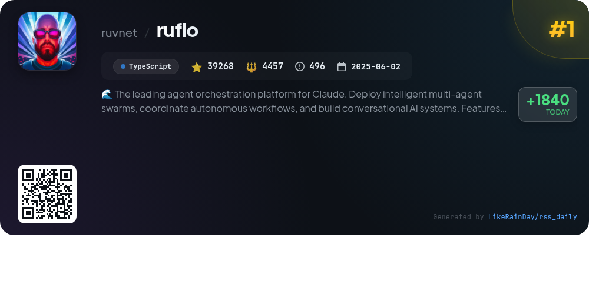
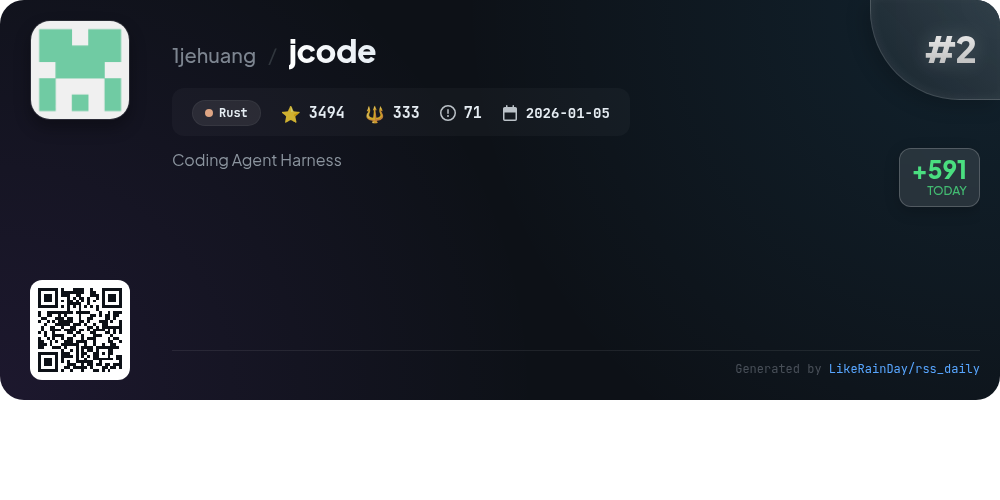
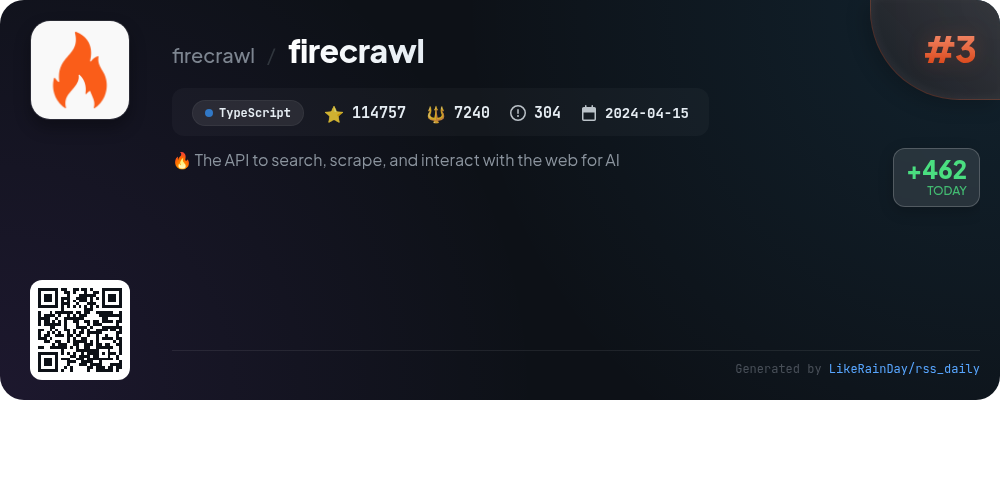
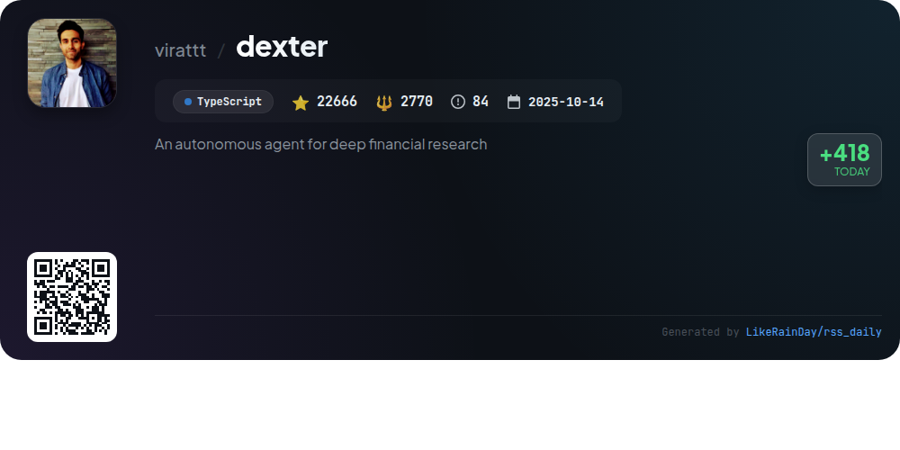
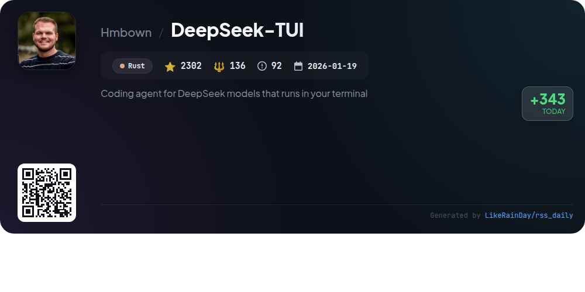
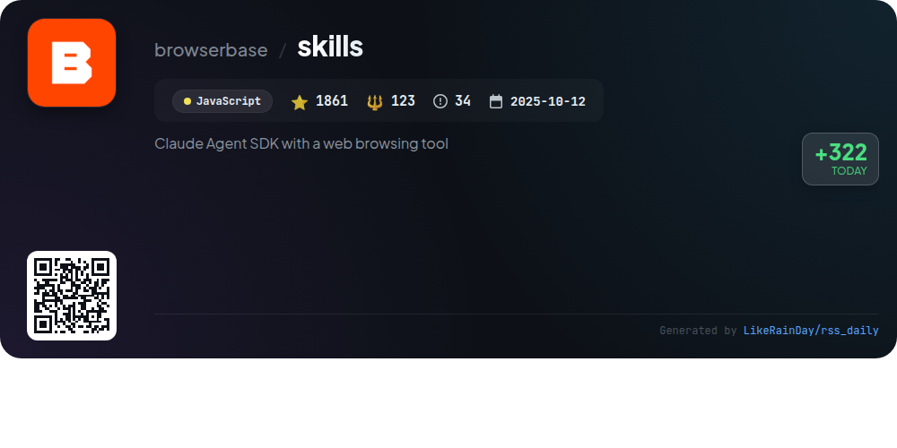
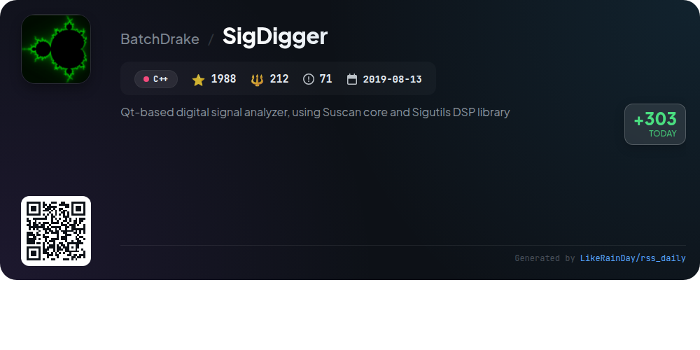
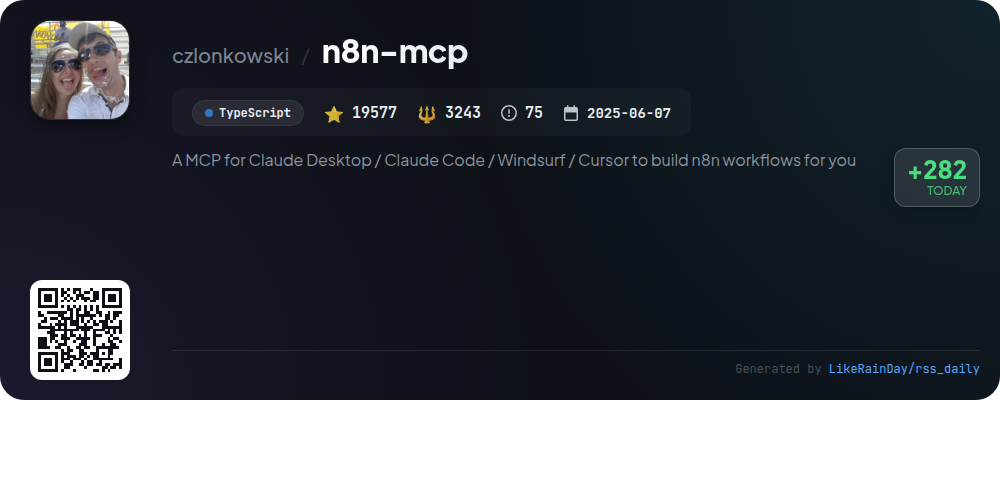
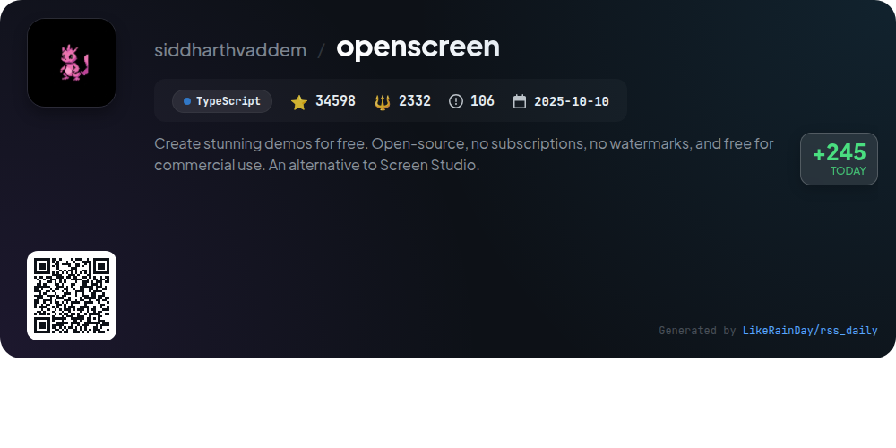
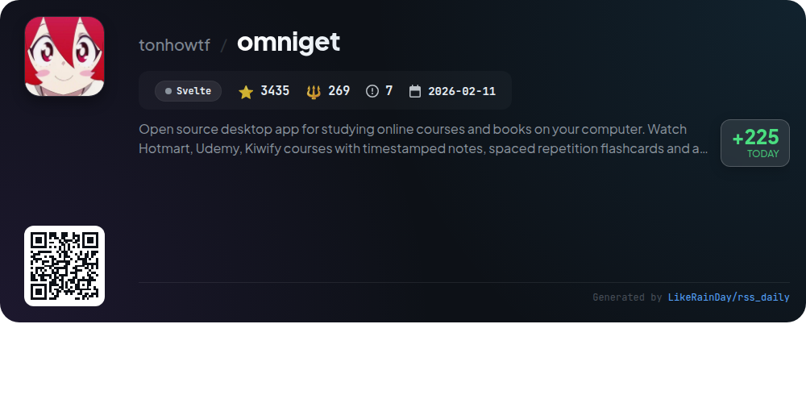

# 📊 🌟 GitHub Trending Daily - 2026-05-04

> > 📅 Daily Picks of GitHub Trending Repositories | Powered by Smart Algorithms

## 📋 Overview

**10** Projects | **243946** ⭐ | **21115** 🍴

**Top Languages:** `TypeScript` (5) · `Rust` (2) · `JavaScript` (1)

**Updated:** 2026-05-04 03:51 UTC

**Categories:**

- 🌟 Daily Top 10 (10 items)

---

## 🌟 Daily Top 10

### 1. [ruflo](https://github.com/ruvnet/ruflo)

> 🤖 **Why Recommend**  
> *Ruflo is a leading agent orchestration platform for Claude, enabling deployment of intelligent multi-agent swarms and autonomous workflows. Key features include self-learning swarm intelligence, robust RAG integration, and seamless Claude Code/Codex integration. With 100+ specialized agents, a powerful memory system, and zero-trust federation capabilities, Ruflo enhances collaboration across machines and teams. It offers a plugin marketplace with 32 native plugins, a user-friendly web UI, and advanced security measures, making it a comprehensive solution for building conversational AI systems.*

- ⭐ 39268 stars
- 💻 TypeScript
- 📅 Updated: 2026-05-04

### 2. [jcode](https://github.com/1jehuang/jcode)

> 🤖 **Why Recommend**  
> *jcode is a cutting-edge coding agent harness built in Rust, designed for multi-session workflows, customizable experiences, and enhanced performance. Key features include efficient memory management, rapid session handling, and a unique memory architecture allowing agents to recall pertinent information seamlessly. With built-in support for various OAuth providers, jcode facilitates easy integration with external models. The platform offers real-time collaboration through swarm functionality and advanced browser automation tools, making it a versatile solution for developers.*

- ⭐ 3494 stars
- 💻 Rust
- 📅 Updated: 2026-05-04

### 3. [firecrawl](https://github.com/firecrawl/firecrawl)

> 🤖 **Why Recommend**  
> *Firecrawl is an open-source API designed for searching, scraping, and interacting with the web, empowering AI applications with clean data. Key features include extensive web coverage (96%), fast response times (P95 latency of 3.4s), and LLM-ready output formats like markdown and JSON. Users can automate data gathering through an AI agent, crawl entire websites, and interact with web pages seamlessly. With robust SDKs in multiple languages and community integrations, Firecrawl simplifies web data extraction while respecting site policies.*

- ⭐ 114757 stars
- 💻 TypeScript
- 📅 Updated: 2026-05-04

### 4. [dexter](https://github.com/virattt/dexter)

> 🤖 **Why Recommend**  
> *Dexter is an autonomous financial research agent designed to analyze complex financial queries through intelligent task planning and real-time market data. Key features include automated decomposition of queries, autonomous execution of data gathering, and self-validation to ensure accuracy. It provides access to crucial financial data like income statements and balance sheets, while incorporating safety features to prevent runaway processes. Dexter can be used interactively or via WhatsApp, making financial research more efficient and accessible. With 22,666 stars, it showcases a strong community interest and support.*

- ⭐ 22666 stars
- 💻 TypeScript
- 📅 Updated: 2026-05-04

### 5. [DeepSeek-TUI](https://github.com/Hmbown/DeepSeek-TUI)

> 🤖 **Why Recommend**  
> *DeepSeek-TUI is a terminal-based coding agent designed for DeepSeek V4 models, featuring a 1M-token context and prefix cache. It offers a single binary without requiring Node/Python runtimes and includes an MCP client, sandbox, and durable task queue. Key features include native RLM for parallel reasoning, thinking-mode streaming, extensive tool support (file operations, shell commands, git management), and session management capabilities like save/resume and workspace rollback. It provides multiple interaction modes (Plan, Agent, YOLO) and live cost tracking for efficient coding workflows.*

- ⭐ 2302 stars
- 💻 Rust
- 📅 Updated: 2026-05-04

### 6. [skills](https://github.com/browserbase/skills)

> 🤖 **Why Recommend**  
> *The **skills** project is a Claude Agent SDK that enhances web browsing capabilities through browser automation and the `bb` CLI. Key features include automated browser interactions, remote session management with anti-bot measures, serverless automation deployment, and a site-debugging tool. Users can fetch data without a browser session, perform AI-powered UI testing, and synchronize cookies for authenticated browsing. Installation is straightforward, making it easy to integrate into Claude Code workflows. With 1861 stars, this JavaScript project offers robust tools for efficient web automation.*

- ⭐ 1861 stars
- 💻 JavaScript
- 📅 Updated: 2026-05-04

### 7. [SigDigger](https://github.com/BatchDrake/SigDigger)

> 🤖 **Why Recommend**  
> *Qt-based digital signal analyzer, using Suscan core and Sigutils DSP library. popular project, actively maintained, recently updated*

- ⭐ 1988 stars
- 🍴 212 forks
- 💻 C++
- 📅 Updated: 2026-05-04

### 8. [n8n-mcp](https://github.com/czlonkowski/n8n-mcp)

> 🤖 **Why Recommend**  
> *n8n-mcp is a Model Context Protocol server designed to enhance AI assistants like Claude with comprehensive access to n8n's 1,650 workflow automation nodes. Key features include detailed node properties, extensive documentation, and a library of 2,352 workflow templates, ensuring users can build and validate workflows efficiently. The platform supports self-hosting and integrates seamlessly with various AI-powered IDEs. It offers tools for workflow management, execution, and credential management, enabling effective automation and integration within n8n environments. With over 19,500 stars, it's a valuable resource for developers.*

- ⭐ 19577 stars
- 💻 TypeScript
- 📅 Updated: 2026-05-04

### 9. [openscreen](https://github.com/siddharthvaddem/openscreen)

> 🤖 **Why Recommend**  
> *OpenScreen is a free, open-source tool for creating product demos and walkthroughs, serving as an alternative to Screen Studio. It enables users to record specific windows or the entire screen, with features like adjustable zooms, audio capture, video cropping, and customizable backgrounds. Users can add annotations, trim clips, and export in multiple resolutions. OpenScreen is free for both personal and commercial use, with no watermarks or subscriptions. Built with TypeScript and Electron, it is currently in beta and invites contributions from the community.*

- ⭐ 34598 stars
- 💻 TypeScript
- 📅 Updated: 2026-05-04

### 10. [omniget](https://github.com/tonhowtf/omniget)

> 🤖 **Why Recommend**  
> *OmniGet is an open-source desktop app designed for studying online courses and reading books on your computer. With support for platforms like Hotmart and Udemy, it allows users to download courses, watch videos with timestamped notes, and utilize spaced repetition flashcards. The app also features a built-in reader for PDFs and EPUBs, offering highlights, bookmarks, and focus modes. Additionally, it supports downloading videos from YouTube, Instagram, and TikTok, alongside torrent files. OmniGet combines powerful study tools with a seamless user experience.*

- ⭐ 3435 stars
- 💻 Svelte
- 📅 Updated: 2026-05-04

---

## 📡 RSS Subscription

Subscribe via RSS to get daily trending updates:

- 🔔 [RSS XML] (../../daily-top.xml)
- 🔔 [Daily Report] (../../GITHUB_TODAY.md)
- 🔔 [Daily Top 10](../../daily-top.xml)

---

*⚡ Powered by Smart Trending Algorithm | Generated at 2026-05-04 03:51:37 UTC
