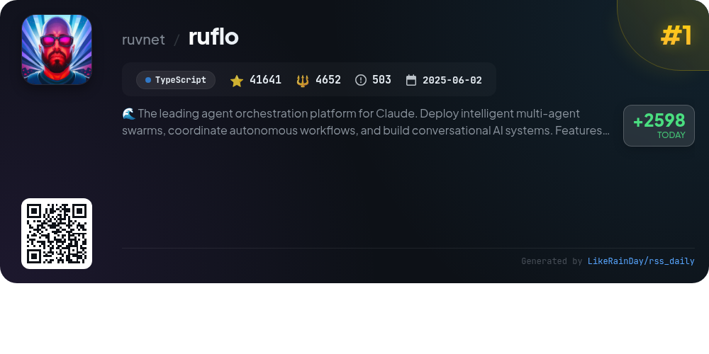
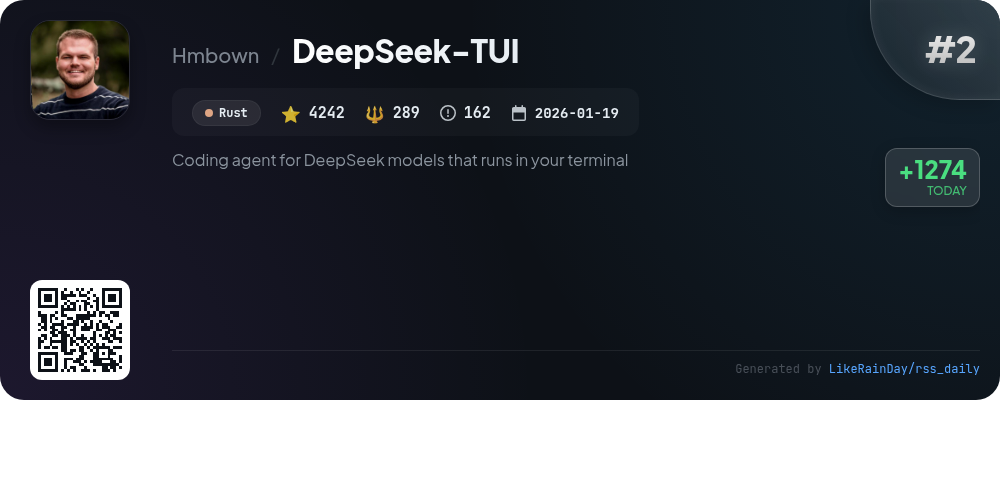
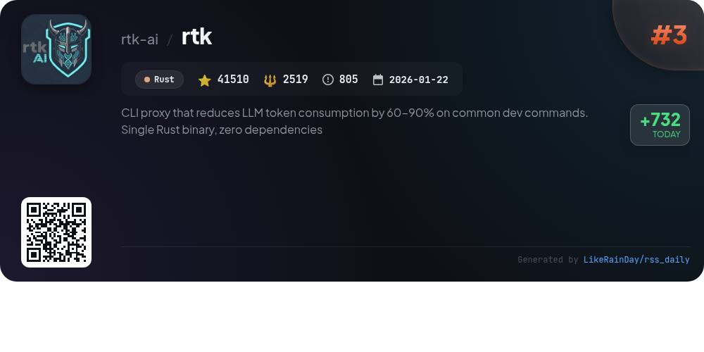
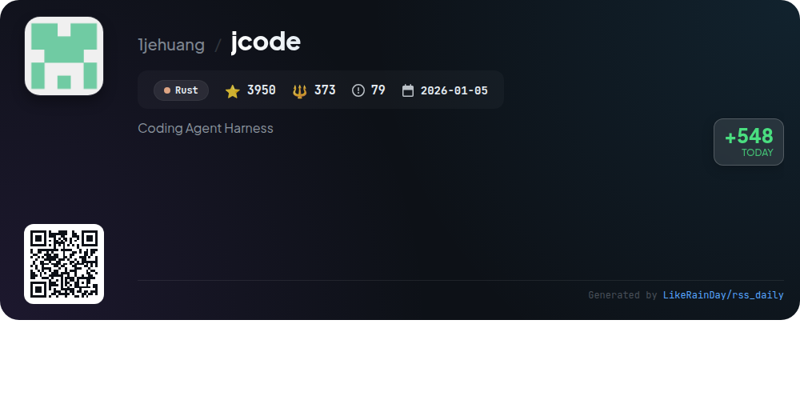
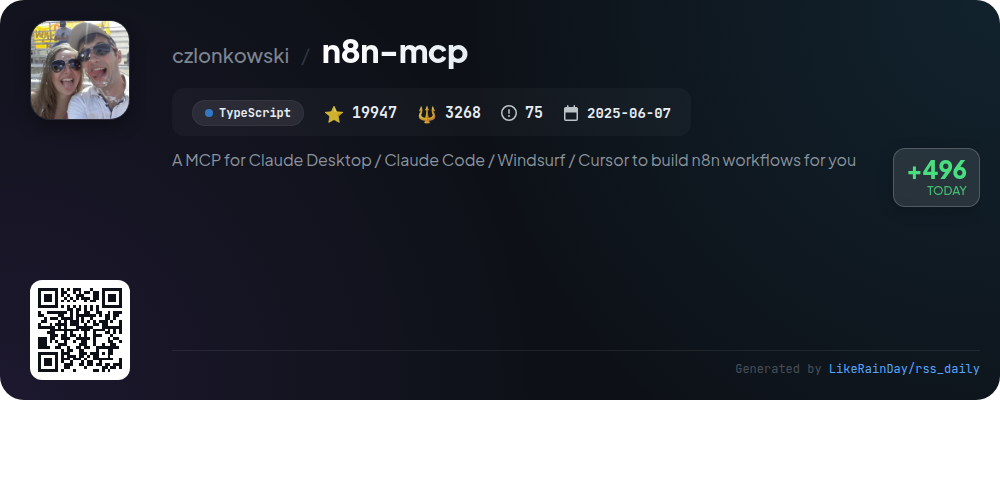
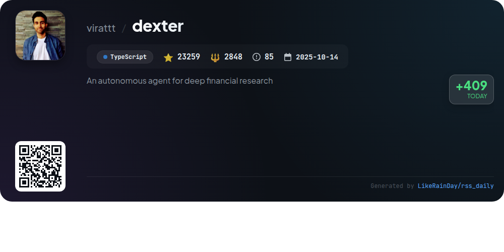
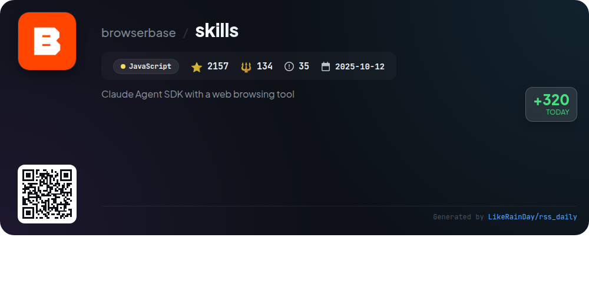
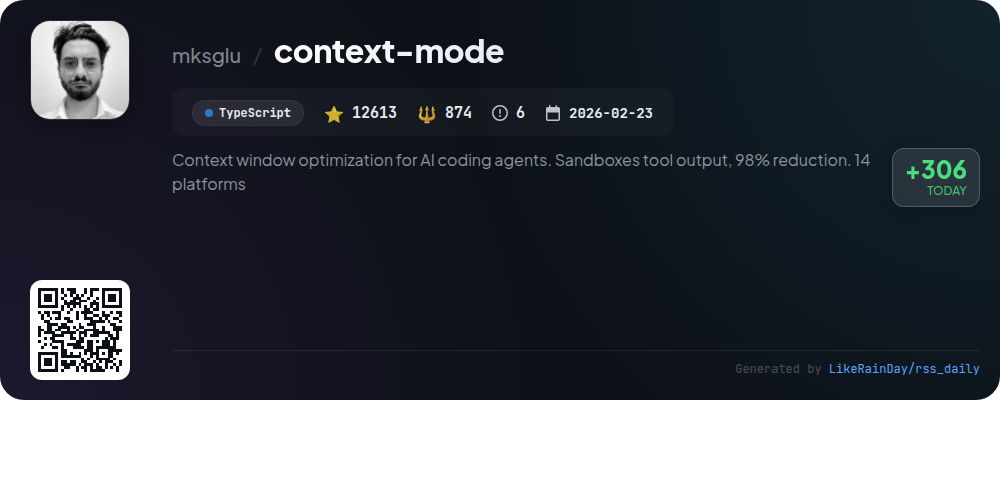
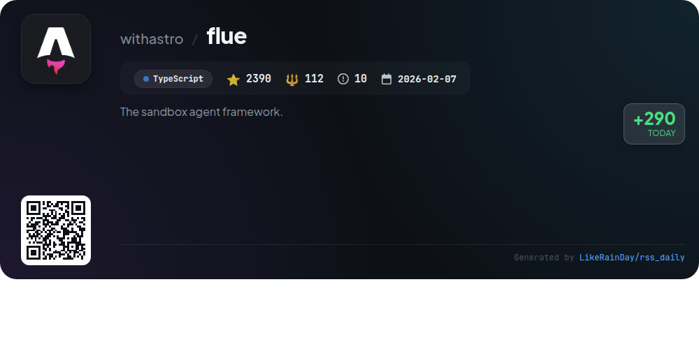
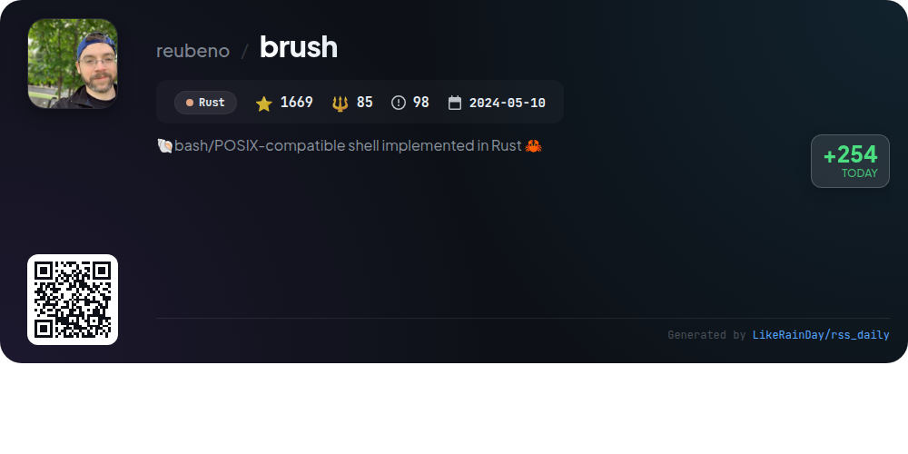

# 📊 🌟 GitHub Trending Daily - 2026-05-05

> > 📅 Daily Picks of GitHub Trending Repositories | Powered by Smart Algorithms

## 📋 Overview

**10** Projects | **153378** ⭐ | **15154** 🍴

**Top Languages:** `TypeScript` (5) · `Rust` (4) · `JavaScript` (1)

**Updated:** 2026-05-05 03:34 UTC

**Categories:**

- 🌟 Daily Top 10 (10 items)

---

## 🌟 Daily Top 10

### 1. [ruflo](https://github.com/ruvnet/ruflo)

> 🤖 **Why Recommend**  
> *Ruflo is a leading agent orchestration platform for Claude, enabling the deployment of intelligent multi-agent swarms and coordination of autonomous workflows. Key features include enterprise-grade architecture, self-learning swarm intelligence, and RAG integration. With over 100 specialized agents, Ruflo supports secure, federated communications and offers a plugin marketplace with 32 native plugins. It features a user-friendly web UI for seamless interaction and a goal planner for translating high-level objectives into actionable plans. Explore more at [flo.ruv.io](https://flo.ruv.io/).*

- ⭐ 41641 stars
- 💻 TypeScript
- 📅 Updated: 2026-05-05

### 2. [DeepSeek-TUI](https://github.com/Hmbown/DeepSeek-TUI)

> 🤖 **Why Recommend**  
> *DeepSeek-TUI is a terminal-based coding agent designed for DeepSeek V4 models, offering a comprehensive suite of tools for file management, shell execution, and web searching. Key features include a 1M-token context, real-time reasoning with thinking-mode streaming, session management, and a durable task queue. It supports multiple languages and customization through skills, enabling users to tailor workflows. The single binary installation eliminates dependencies, making it easy to deploy across platforms. Ideal for efficient coding and automation, DeepSeek-TUI enhances developer productivity directly from the terminal.*

- ⭐ 4242 stars
- 💻 Rust
- 📅 Updated: 2026-05-05

### 3. [rtk](https://github.com/rtk-ai/rtk)

> 🤖 **Why Recommend**  
> *RTK (Rust Token Killer) is a high-performance CLI proxy that significantly reduces LLM token consumption by 60-90% for common development commands. This single Rust binary requires no external dependencies and supports over 100 commands with less than 10ms overhead. Key features include smart filtering, grouping, truncation, and deduplication of command outputs. RTK seamlessly integrates with various AI tools, providing users with concise and optimized outputs for commands like git, test runners, and AWS services, enhancing efficiency and reducing costs in LLM usage.*

- ⭐ 41510 stars
- 💻 Rust
- 📅 Updated: 2026-05-05

### 4. [jcode](https://github.com/1jehuang/jcode)

> 🤖 **Why Recommend**  
> *jcode is a high-performance coding agent harness built in Rust, designed for multi-session workflows and infinite customizability. Key features include efficient memory management with semantic vector embedding, a fast UI with real-time rendering, and the ability to spawn collaborative agent swarms. Jcode supports various OAuth integrations for popular AI models like OpenAI and Claude, enabling seamless provider switching. With robust browser automation capabilities and a self-development mode for customizability, jcode empowers users to elevate their coding experience.*

- ⭐ 3950 stars
- 💻 Rust
- 📅 Updated: 2026-05-05

### 5. [n8n-mcp](https://github.com/czlonkowski/n8n-mcp)

> 🤖 **Why Recommend**  
> *n8n-mcp is a Model Context Protocol server that enhances AI assistants' understanding of n8n’s 1,650 workflow automation nodes (820 core + 830 community). Key features include comprehensive access to node documentation, properties, and operations, with 99% coverage on properties and 87% on official documentation. It offers 2,352 workflow templates and AI tools, enabling efficient automation. Quick deployment options (no installation needed) and integration with various AI-powered IDEs like Claude Code and Visual Studio Code make it accessible for developers. The project is open-source and maintained under the MIT License.*

- ⭐ 19947 stars
- 💻 TypeScript
- 📅 Updated: 2026-05-05

### 6. [dexter](https://github.com/virattt/dexter)

> 🤖 **Why Recommend**  
> *Dexter is an autonomous financial research agent designed to analyze complex financial queries using intelligent task planning, real-time market data, and self-validation. Key features include automatic decomposition of queries into structured research steps, autonomous execution of data gathering, and built-in safety measures to prevent runaway tasks. Dexter can also interact with users via WhatsApp, offering a user-friendly interface for financial insights. With its robust evaluation suite and debugging capabilities, Dexter sets a new standard for deep financial research, boasting over 23,000 stars on GitHub.*

- ⭐ 23259 stars
- 💻 TypeScript
- 📅 Updated: 2026-05-05

### 7. [skills](https://github.com/browserbase/skills)

> 🤖 **Why Recommend**  
> *The **skills** project provides a Claude Agent SDK integrated with Browserbase for web browsing automation. Key features include browser automation with anti-bot measures, serverless deployment of browser tasks, and a suite of diagnostic tools for troubleshooting automation issues. Users can access Browserbase functionalities via the `bb` CLI, manage sessions, fetch data without a browser, and execute AI-driven UI tests. Installation is straightforward through npm, and it supports local and remote browser sessions, enhancing automation workflows for developers.*

- ⭐ 2157 stars
- 💻 JavaScript
- 📅 Updated: 2026-05-05

### 8. [context-mode](https://github.com/mksglu/context-mode)

> 🤖 **Why Recommend**  
> *Context Mode is a TypeScript-based GitHub project designed to optimize context window management for AI coding agents, achieving a remarkable 98% reduction in context size across 14 platforms. Key features include context saving through sandboxing, session continuity tracking with SQLite, output compression for concise responses, and a range of MCP tools like `ctx_execute` and `ctx_search`. It facilitates efficient coding workflows by treating AI as a code generator, enhancing productivity while ensuring privacy with local data handling. The project has garnered over 12,600 stars on GitHub.*

- ⭐ 12613 stars
- 💻 TypeScript
- 📅 Updated: 2026-05-05

### 9. [flue](https://github.com/withastro/flue)

> 🤖 **Why Recommend**  
> *Flue is an experimental TypeScript framework designed for building autonomous agents without human interaction, leveraging a built-in agent harness. It offers a runtime-agnostic environment, enabling deployment across platforms like Node.js and Cloudflare. Core features include lightweight virtual sandboxes, support for CI/CD integrations, and tools for managing sessions and tasks. Flue simplifies the agent development process by allowing logic to reside in Markdown, while providing a CLI for building and running agents. With over 2,390 stars, Flue is poised to revolutionize agent development.*

- ⭐ 2390 stars
- 💻 TypeScript
- 📅 Updated: 2026-05-05

### 10. [brush](https://github.com/reubeno/brush)

> 🤖 **Why Recommend**  
> *🐚bash/POSIX-compatible shell implemented in Rust 🦀. popular project, recently updated*

- ⭐ 1669 stars
- 🍴 85 forks
- 💻 Rust
- 📅 Updated: 2026-05-05

---

## 📡 RSS Subscription

Subscribe via RSS to get daily trending updates:

- 🔔 [RSS XML] (../../daily-top.xml)
- 🔔 [Daily Report] (../../GITHUB_TODAY.md)
- 🔔 [Daily Top 10](../../daily-top.xml)

---

*⚡ Powered by Smart Trending Algorithm | Generated at 2026-05-05 03:34:46 UTC
