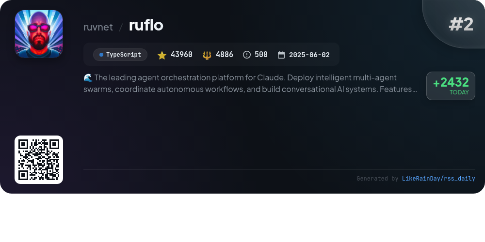
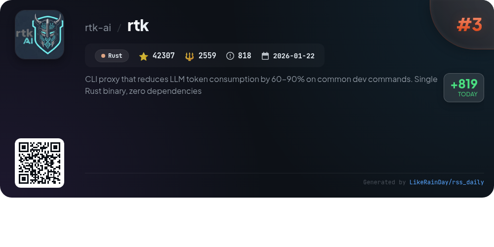
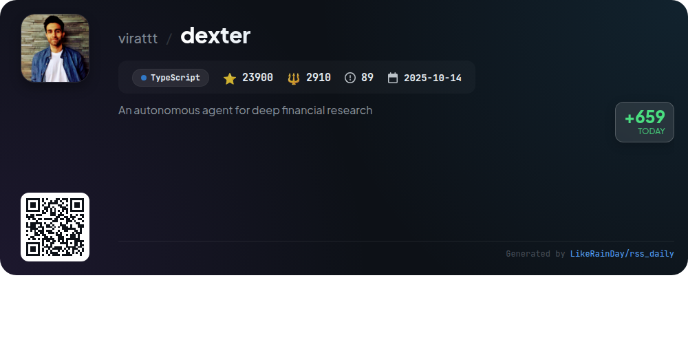
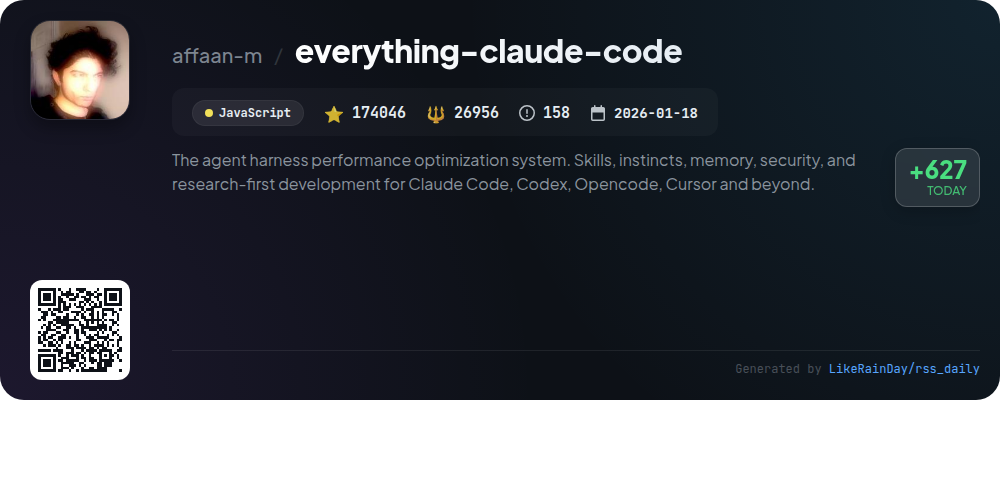
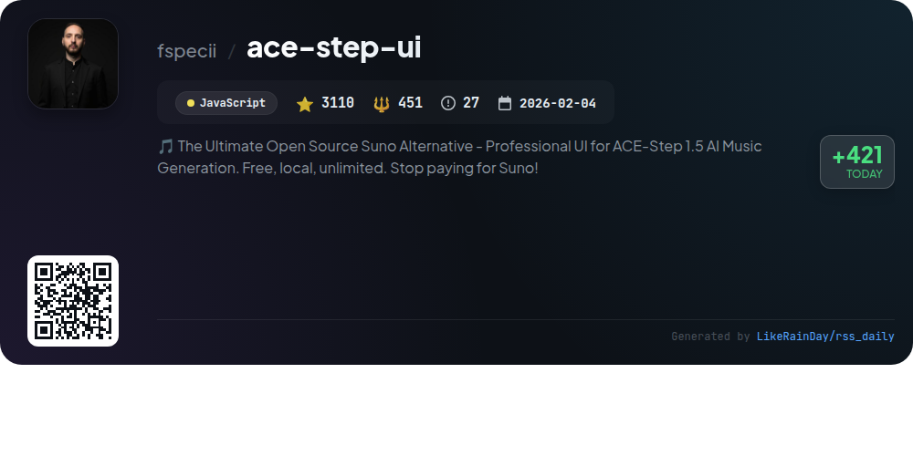
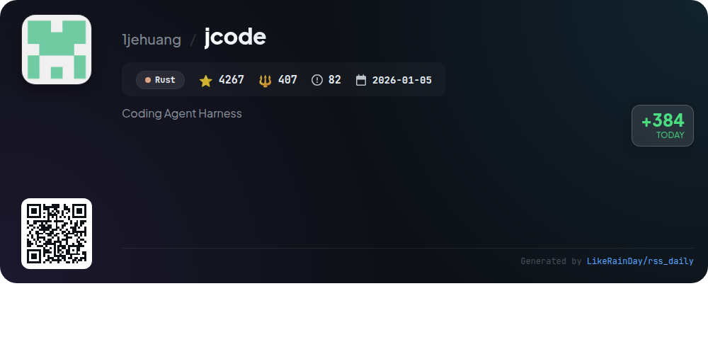
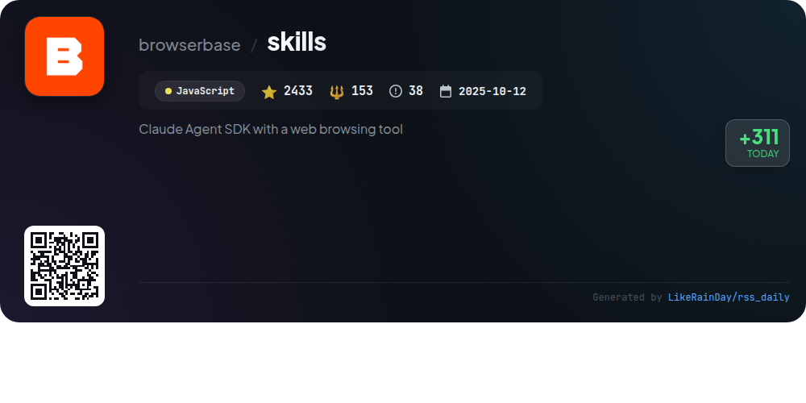
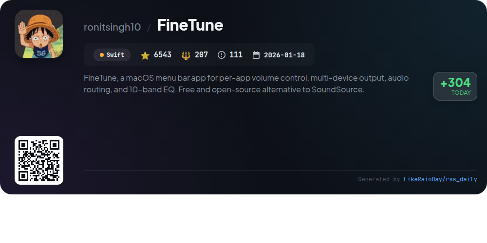
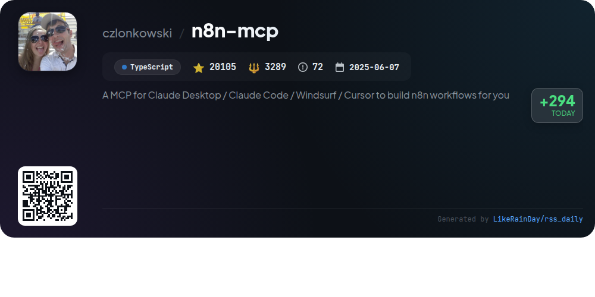

# 📊 🌟 GitHub Trending Daily - 2026-05-06

> > 📅 Daily Picks of GitHub Trending Repositories | Powered by Smart Algorithms

## 📋 Overview

**10** Projects | **329387** ⭐ | **42484** 🍴

**Top Languages:** `TypeScript` (3) · `Rust` (3) · `JavaScript` (3)

**Updated:** 2026-05-06 03:47 UTC

**Categories:**

- 🌟 Daily Top 10 (10 items)

---

## 🌟 Daily Top 10

### 1. [DeepSeek-TUI](https://github.com/Hmbown/DeepSeek-TUI)

> 🤖 **Why Recommend**  
> *DeepSeek-TUI is a terminal-based coding agent for DeepSeek V4, facilitating file editing, shell command execution, web searches, and git management. Key features include an auto mode that selects the optimal model and reasoning level, streaming reasoning blocks, and a comprehensive tool suite for file operations and task management. It supports multiple modes (Plan, Agent, YOLO) for varied interactions and offers user memory, session management, and LSP diagnostics. With a robust architecture, it integrates seamlessly with other tools and services, making it a versatile choice for developers.*

- ⭐ 8716 stars
- 💻 Rust
- 📅 Updated: 2026-05-06

### 2. [ruflo](https://github.com/ruvnet/ruflo)

> 🤖 **Why Recommend**  
> *Ruflo is a leading agent orchestration platform for Claude, enabling the deployment of intelligent multi-agent swarms and autonomous workflows. Key features include enterprise-grade architecture, self-learning swarm intelligence, RAG integration, and seamless Claude Code/Codex integration. It supports over 100 specialized agents, a zero-trust federation for secure cross-machine collaboration, and a powerful vector memory system. Users can quickly set up using CLI commands, and the platform offers a web UI for real-time agent interaction. Ruflo enhances AI coordination, learning, and security for advanced conversational AI systems.*

- ⭐ 43960 stars
- 💻 TypeScript
- 📅 Updated: 2026-05-06

### 3. [rtk](https://github.com/rtk-ai/rtk)

> 🤖 **Why Recommend**  
> *RTK (Rust Token Killer) is a high-performance CLI proxy that dramatically reduces LLM token consumption by 60-90% on common development commands. Built as a single Rust binary with no dependencies, it supports over 100 commands, providing smart filtering, grouping, and deduplication of outputs. Key features include an auto-rewrite hook for seamless integration with AI tools, extensive token savings analytics, and compatibility with major command-line utilities like Git, Docker, and test runners. RTK aims to optimize your development workflow while minimizing costs.*

- ⭐ 42307 stars
- 💻 Rust
- 📅 Updated: 2026-05-06

### 4. [dexter](https://github.com/virattt/dexter)

> 🤖 **Why Recommend**  
> *Dexter is an autonomous financial research agent that intelligently analyzes complex financial questions using task planning, self-reflection, and real-time market data. Key features include intelligent task decomposition, autonomous execution of data-gathering tools, and self-validation to ensure accuracy. It provides access to critical financial data like income statements and balance sheets and includes safety features to prevent excessive execution. Users can interact with Dexter via WhatsApp, making it a versatile tool for deep financial research.*

- ⭐ 23900 stars
- 💻 TypeScript
- 📅 Updated: 2026-05-06

### 5. [everything-claude-code](https://github.com/affaan-m/everything-claude-code)

> 🤖 **Why Recommend**  
> *Everything Claude Code is a performance optimization system for AI agents, integrating skills, instincts, memory optimization, and security scanning. It supports multiple frameworks, including Claude Code, Codex, Cursor, and OpenCode. Key features include 48 agents, 182 skills, a robust command set, and a dashboard GUI for easy navigation. With a focus on continuous learning and research-first development, ECC enables efficient task management and enhances security through AgentShield. The project has garnered over 174,000 stars, showcasing its community impact and usability.*

- ⭐ 174046 stars
- 💻 JavaScript
- 📅 Updated: 2026-05-06

### 6. [ace-step-ui](https://github.com/fspecii/ace-step-ui)

> 🤖 **Why Recommend**  
> *ACE-Step UI is the ultimate open-source alternative to Suno, designed for professional AI music generation using the ACE-Step 1.5 model. It offers a free, local solution with no subscription fees, ensuring privacy and full ownership. Key features include full song generation (up to 4+ minutes), instrumental mode, batch generation, and advanced customization options. The Spotify-inspired interface enhances user experience, while built-in tools like an audio editor and video generator provide additional functionality. With active development and a robust tech stack, ACE-Step UI empowers users to create high-quality music effortlessly.*

- ⭐ 3110 stars
- 💻 JavaScript
- 📅 Updated: 2026-05-06

### 7. [jcode](https://github.com/1jehuang/jcode)

> 🤖 **Why Recommend**  
> *jcode is a powerful coding agent harness built in Rust, designed for multi-session workflows and high customizability. Key features include efficient memory management with a human-like recall system, rapid performance with minimal RAM usage, and browser automation via a built-in tool. It supports various OAuth providers for seamless integration with existing models, enabling collaborative agent workflows. Additionally, jcode allows self-development, enabling agents to modify their own code. With over 4,267 stars, it is optimized for Linux, macOS, and Windows environments.*

- ⭐ 4267 stars
- 💻 Rust
- 📅 Updated: 2026-05-06

### 8. [skills](https://github.com/browserbase/skills)

> 🤖 **Why Recommend**  
> *Browserbase Skills is a powerful SDK enabling Claude Code to automate web browsing via Browserbase. Key features include browser automation with anti-bot measures, serverless deployment of browser tasks, site debugging tools, and CLI integration for Browserbase functionalities. Users can sync cookies for authenticated sessions, fetch data without a browser, and conduct AI-powered UI testing. Installation is straightforward, allowing easy access to a range of skills, from web scraping to session analytics, enhancing the capabilities of Claude agents.*

- ⭐ 2433 stars
- 💻 JavaScript
- 📅 Updated: 2026-05-06

### 9. [FineTune](https://github.com/ronitsingh10/FineTune)

> 🤖 **Why Recommend**  
> *FineTune is a free and open-source macOS menu bar app that offers advanced per-app volume control, multi-device audio output, and a 10-band equalizer. Users can independently adjust volume levels, boost quieter apps up to 4x, and route audio to various devices simultaneously. The app features custom EQ presets, headphone correction, and easy Bluetooth management. With a user-friendly interface, FineTune enhances audio experiences while maintaining system integration. Ideal for anyone seeking to customize their audio environment effortlessly.*

- ⭐ 6543 stars
- 💻 Swift
- 📅 Updated: 2026-05-06

### 10. [n8n-mcp](https://github.com/czlonkowski/n8n-mcp)

> 🤖 **Why Recommend**  
> *n8n-mcp is a Model Context Protocol server designed for AI assistants like Claude, providing comprehensive access to n8n's 1,650 workflow automation nodes. Key features include detailed node documentation, extensive properties and operations coverage, a library of 2,352 templates, and tools for workflow management. It supports multiple AI-powered IDEs and offers both a quick-start dashboard and self-hosting options. With robust validation and testing capabilities, n8n-mcp enhances developers' ability to automate workflows efficiently while ensuring compatibility with the latest n8n releases.*

- ⭐ 20105 stars
- 💻 TypeScript
- 📅 Updated: 2026-05-06

---

## 📡 RSS Subscription

Subscribe via RSS to get daily trending updates:

- 🔔 [RSS XML] (../../daily-top.xml)
- 🔔 [Daily Report] (../../GITHUB_TODAY.md)
- 🔔 [Daily Top 10](../../daily-top.xml)

---

*⚡ Powered by Smart Trending Algorithm | Generated at 2026-05-06 03:47:12 UTC
