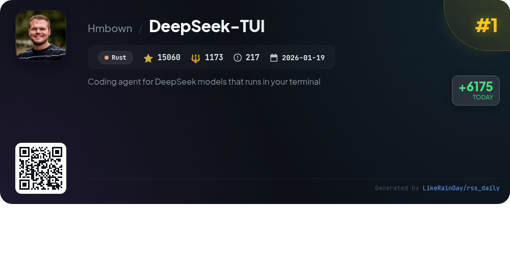
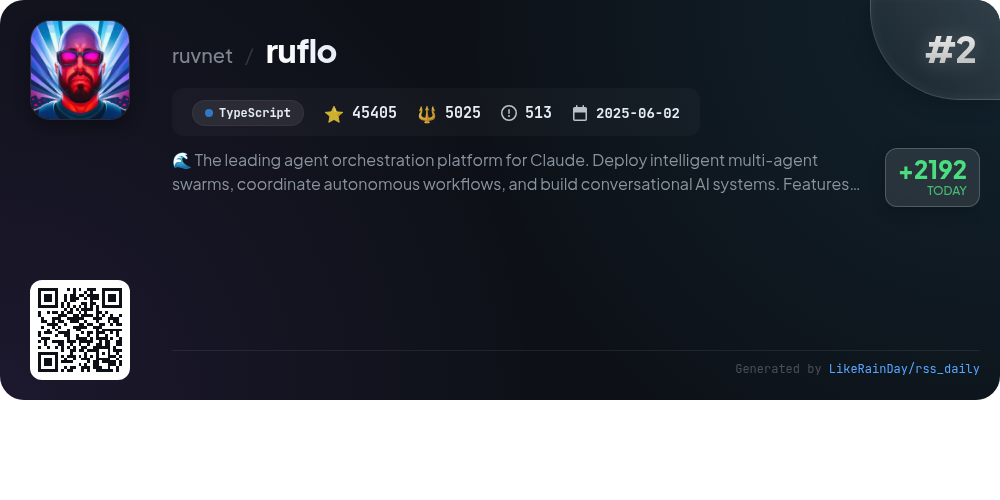
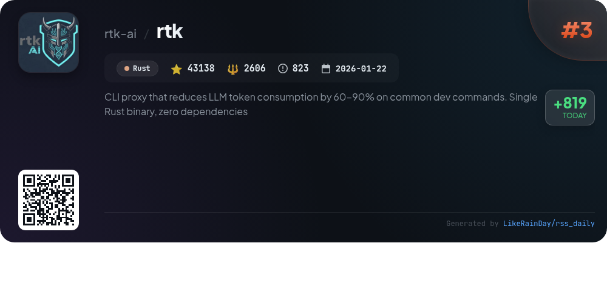
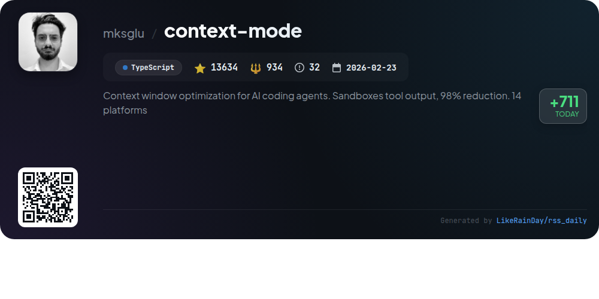
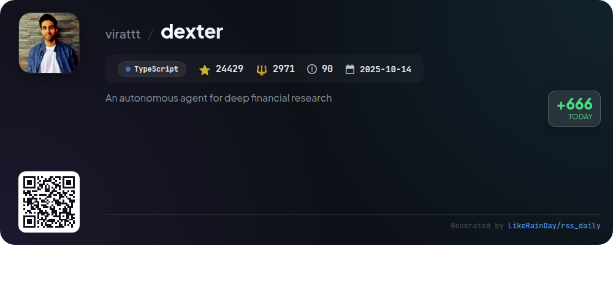
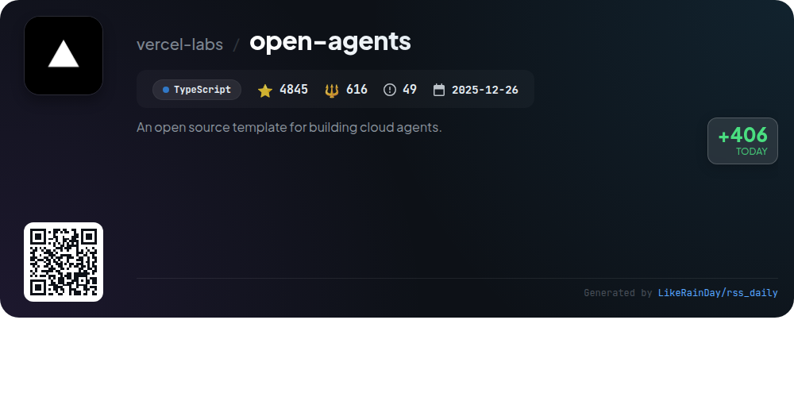
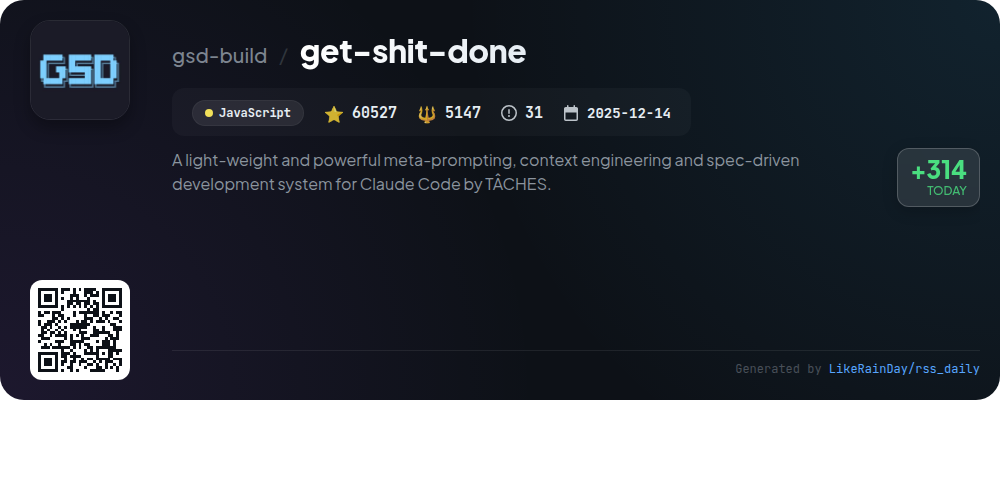
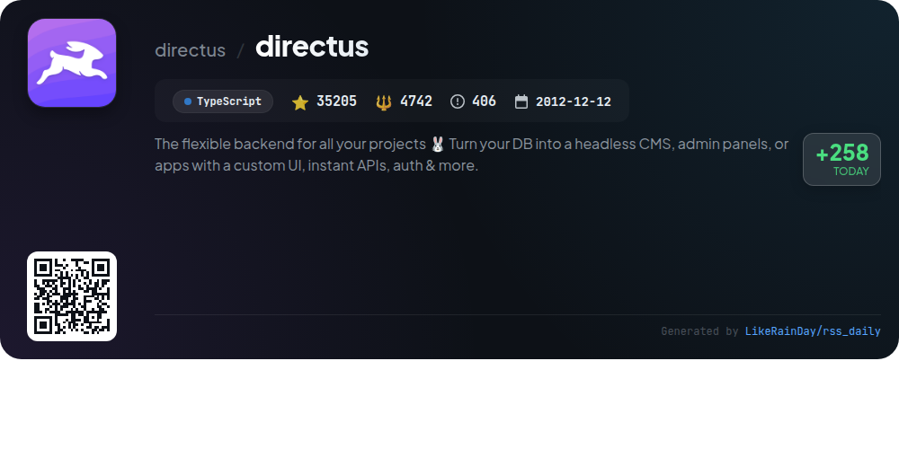
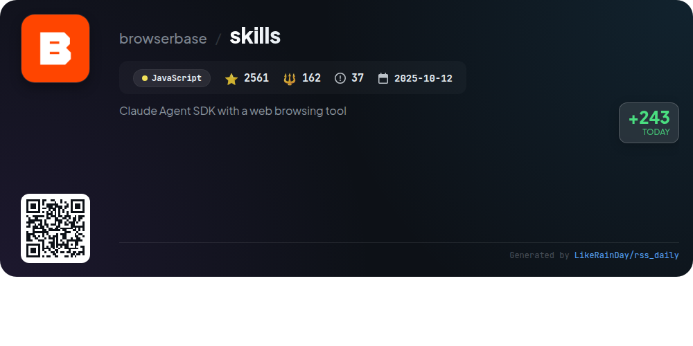
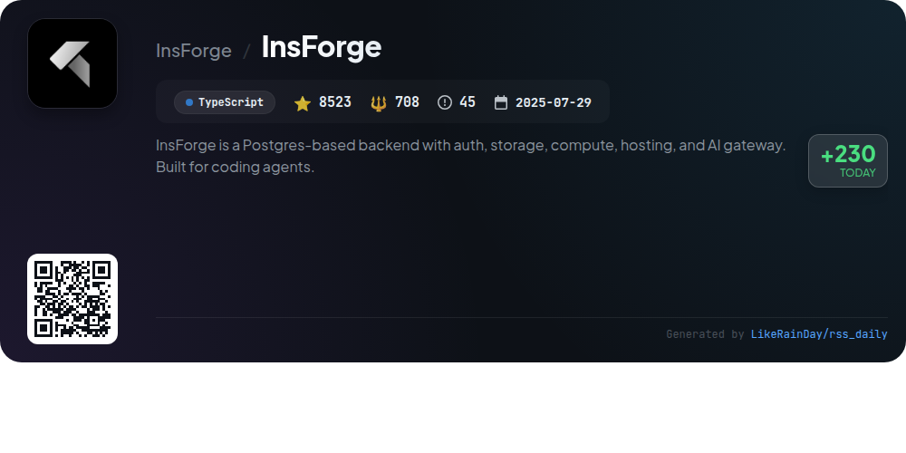

# 📊 🌟 GitHub Trending Daily - 2026-05-07

> > 📅 每日精选 GitHub 热门仓库 | 基于智能算法推荐

## 📋 Overview

**10** 个项目 | **253327** ⭐ | **24084** 🍴

**热门语言:** `TypeScript` (6) · `JavaScript` (2) · `Rust` (2)

**更新时间:** 2026-05-07 03:45 UTC

**分类分布:**

- 🌟 每日 Top 10 精选 (10 项)

---

## 🌟 每日 Top 10 精选

### 1. [DeepSeek-TUI](https://github.com/Hmbown/DeepSeek-TUI)

> 🤖 **推荐理由**  
> *DeepSeek-TUI is a terminal-based coding agent for DeepSeek V4, designed for seamless interaction with coding tasks. Key features include an auto mode for optimized model and reasoning selection, real-time streaming of reasoning blocks, and a comprehensive tool suite for file operations, web browsing, and git management. It supports session save/resume, workspace rollbacks, and user memory for personalized interactions. The project is built in Rust, boasts over 15,000 stars on GitHub, and offers localization in multiple languages, making it a versatile tool for developers.*

- ⭐ 15060 stars
- 💻 Rust
- 📅 Updated: 2026-05-07

### 2. [ruflo](https://github.com/ruvnet/ruflo)

> 🤖 **推荐理由**  
> *Ruflo is an advanced agent orchestration platform for Claude, enabling the deployment of intelligent multi-agent swarms and autonomous workflows. Key features include self-learning swarm intelligence, secure agent federation, and seamless integration with Claude Code and Codex. With over 100 specialized agents, Ruflo facilitates efficient collaboration across teams while ensuring enterprise-grade security. Users can quickly set up and utilize a variety of plugins, including tools for testing, documentation, and goal-oriented action planning, all supported by a robust web UI and CLI.*

- ⭐ 45405 stars
- 💻 TypeScript
- 📅 Updated: 2026-05-07

### 3. [rtk](https://github.com/rtk-ai/rtk)

> 🤖 **推荐理由**  
> *RTK is a high-performance CLI proxy designed to significantly reduce LLM token consumption by 60-90% for over 100 common development commands. Built as a single Rust binary with zero dependencies, RTK filters and compresses command outputs before they reach the LLM, ensuring minimal overhead (<10ms). Key features include smart filtering, grouping, and deduplication of command outputs, along with seamless integration with various AI tools. Its auto-rewrite hook allows for transparent command optimization, enhancing productivity while maintaining context.*

- ⭐ 43138 stars
- 💻 Rust
- 📅 Updated: 2026-05-07

### 4. [context-mode](https://github.com/mksglu/context-mode)

> 🤖 **推荐理由**  
> *Context Mode is a TypeScript-based GitHub project designed to optimize context window usage for AI coding agents, achieving a remarkable 98% reduction in context size across 14 platforms. Key features include context saving through sandboxing, session continuity via SQLite event tracking, and output compression for terse yet accurate responses. The tool leverages functions like `ctx_execute` and `ctx_search` for efficient code execution and information retrieval. It emphasizes a privacy-first architecture, ensuring all operations remain local without cloud dependencies.*

- ⭐ 13634 stars
- 💻 TypeScript
- 📅 Updated: 2026-05-07

### 5. [dexter](https://github.com/virattt/dexter)

> 🤖 **推荐理由**  
> *Dexter is an autonomous financial research agent designed to intelligently analyze complex financial queries. Key features include intelligent task planning, autonomous execution using live market data, and self-validation of results. It systematically breaks down inquiries into structured research plans, checks its work, and refines answers based on real-time data from income statements and balance sheets. Additionally, Dexter supports interaction via WhatsApp, making it user-friendly for financial inquiries. With over 24,000 stars on GitHub, it is a powerful tool for deep financial research.*

- ⭐ 24429 stars
- 💻 TypeScript
- 📅 Updated: 2026-05-07

### 6. [open-agents](https://github.com/vercel-labs/open-agents)

> 🤖 **推荐理由**  
> *Open Agents is an open-source template for creating cloud agents, allowing seamless background coding on Vercel. With a TypeScript-based architecture, it features a three-layer system: a web UI for auth and chat, an agent workflow engine, and an isolated sandbox for execution. Key capabilities include chat-driven coding, durable multi-step execution, and GitHub integration for repo management. Users can deploy their own version easily, leveraging Vercel's OAuth and GitHub App integrations. The project promotes adaptability, enabling developers to customize and extend the agent functionalities.*

- ⭐ 4845 stars
- 💻 TypeScript
- 📅 Updated: 2026-05-07

### 7. [get-shit-done](https://github.com/gsd-build/get-shit-done)

> 🤖 **推荐理由**  
> *get-shit-done is a lightweight, powerful system for meta-prompting and context engineering tailored for AI coding tools like Claude Code and Codex. With over 60,000 stars, it effectively combats context rot, ensuring high-quality outputs. The process involves six commands: initializing projects, discussing phases, planning, executing, verifying work, and shipping milestones. GSD optimizes workflow through fresh contexts and structured artifacts, enhancing project management with a focus on automation and reliability. Trusted by engineers at major tech companies, it streamlines development without unnecessary complexity.*

- ⭐ 60527 stars
- 💻 JavaScript
- 📅 Updated: 2026-05-07

### 8. [directus](https://github.com/directus/directus)

> 🤖 **推荐理由**  
> *Directus is a flexible backend solution that transforms your SQL database into a headless CMS, complete with a real-time REST & GraphQL API and an intuitive no-code Vue.js dashboard. It supports major SQL databases (PostgreSQL, MySQL, SQLite, etc.) and can be deployed on-premises or through Directus Cloud, which offers quick project setup and auto-scaling. The platform is highly customizable and extensible, making it suitable for various applications. With a community-driven approach and a unique licensing model, Directus remains accessible for startups while ensuring sustainability for larger enterprises.*

- ⭐ 35205 stars
- 💻 TypeScript
- 📅 Updated: 2026-05-07

### 9. [skills](https://github.com/browserbase/skills)

> 🤖 **推荐理由**  
> *The Browserbase Skills project is a Claude Agent SDK that integrates web browsing capabilities through automation and the `bb` CLI. Key features include browser automation with anti-bot stealth, serverless deployment of browser automation, site debugging tools, and analytics on Browserbase usage. The plugin allows for seamless interactions like web scraping, UI testing, and cookie synchronization without manual browsing. Installation is straightforward via the CLI, enabling users to leverage Claude's capabilities for various web tasks efficiently.*

- ⭐ 2561 stars
- 💻 JavaScript
- 📅 Updated: 2026-05-07

### 10. [InsForge](https://github.com/InsForge/InsForge)

> 🤖 **推荐理由**  
> *InsForge is a powerful Postgres-based backend platform designed for AI-native developers. It features a semantic layer that enables AI coding agents to interact seamlessly with backend primitives such as authentication, databases, storage, edge functions, and model gateways. Core services include user management, S3-compatible file storage, and long-running container services. InsForge simplifies backend context engineering and provides an easy setup via Docker or cloud hosting at insforge.dev. With over 8,500 stars, it’s a robust choice for modern application development.*

- ⭐ 8523 stars
- 💻 TypeScript
- 📅 Updated: 2026-05-07

---

## 📡 RSS订阅

通过 RSS 订阅，第一时间获取每日精选项目：

- 🔔 [RSS 订阅源] (../../daily-top.xml)
- 🔔 [每日简报] (../../GITHUB_TODAY_CN.md)
- 🔔 [每日 Top 10 精选](../../daily-top.xml)

---

*⚡ Powered by Smart Trending Algorithm | Generated at 2026-05-07 03:45:46 UTC
