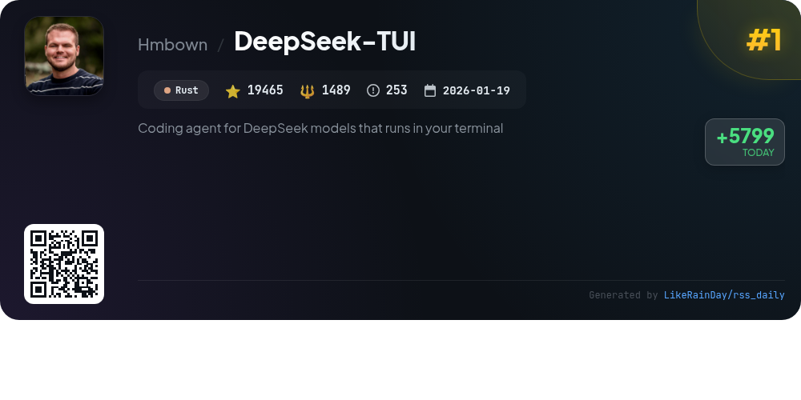
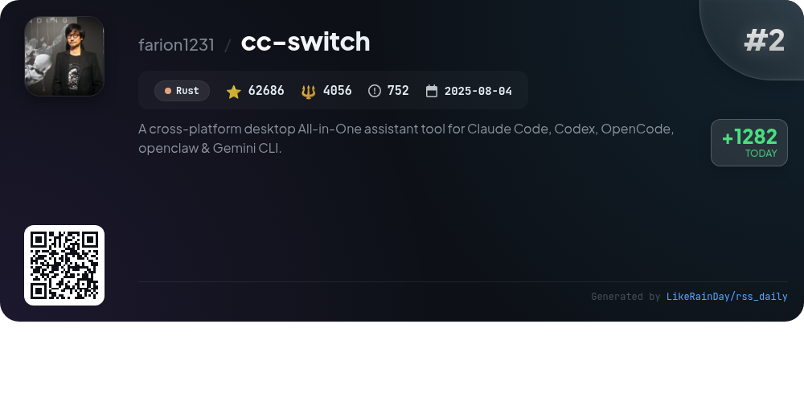
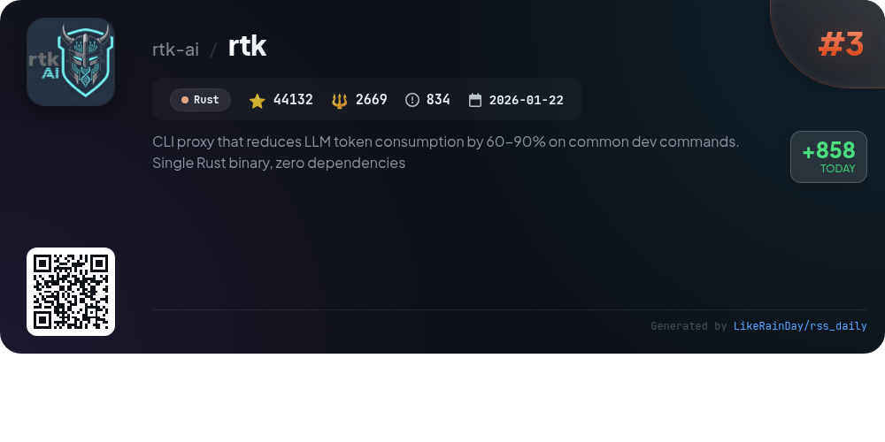
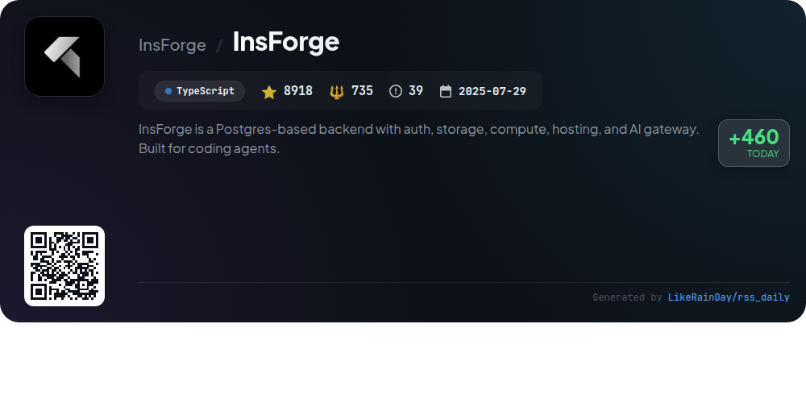
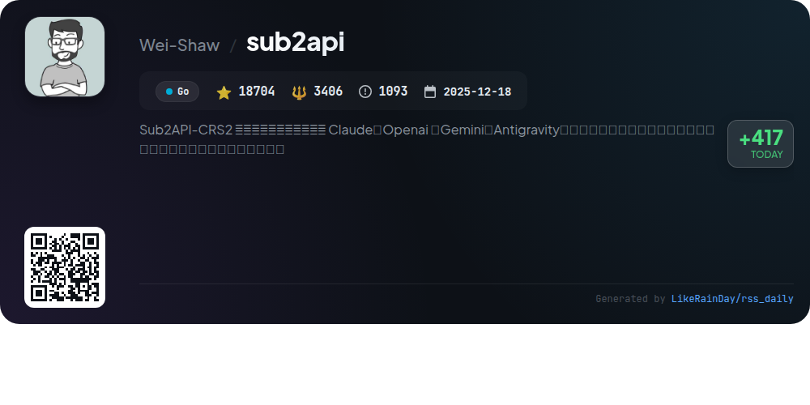
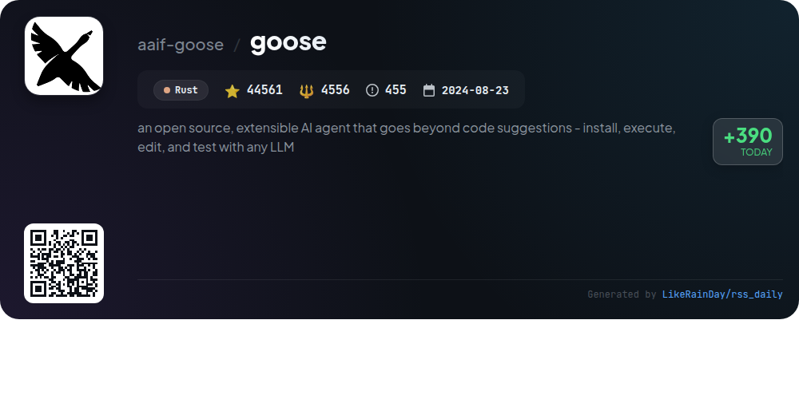
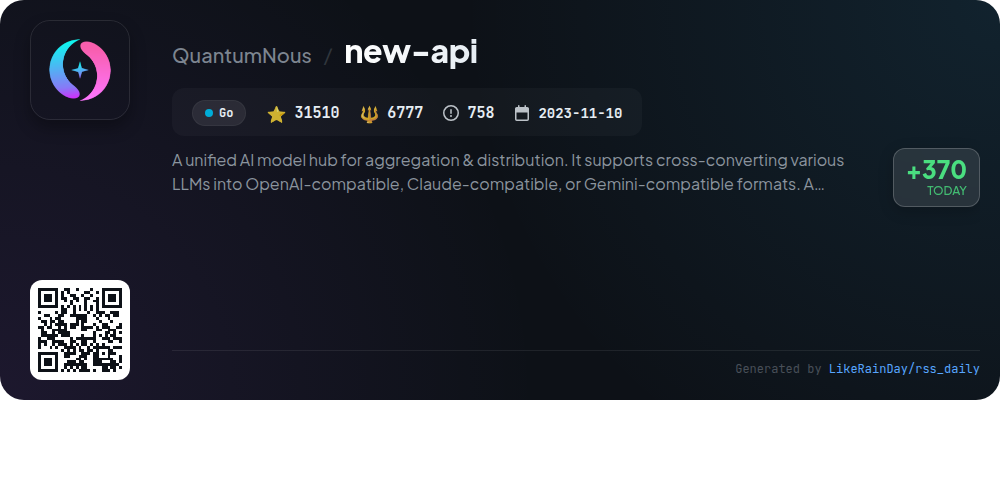
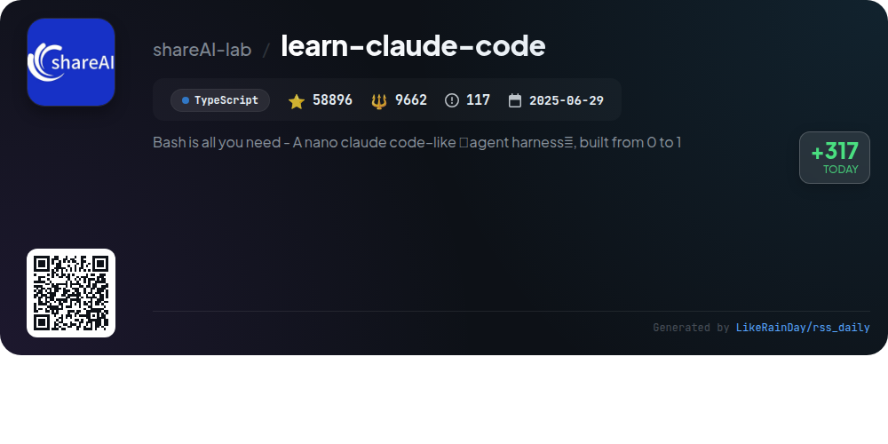
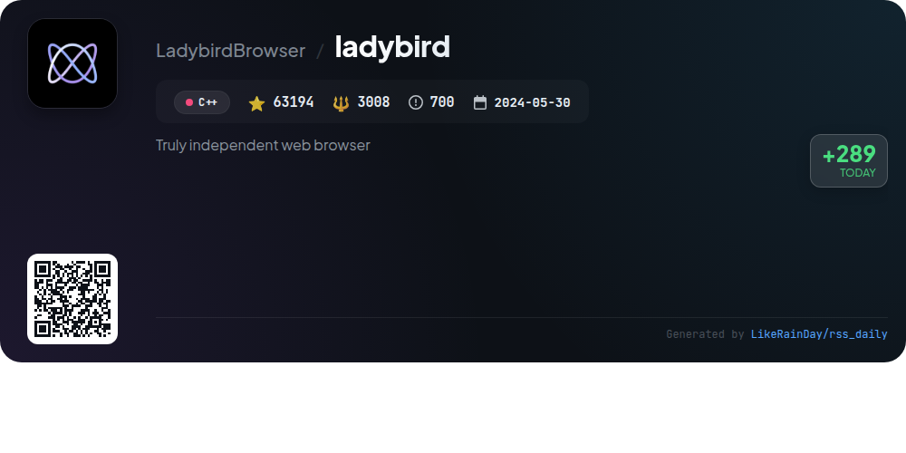
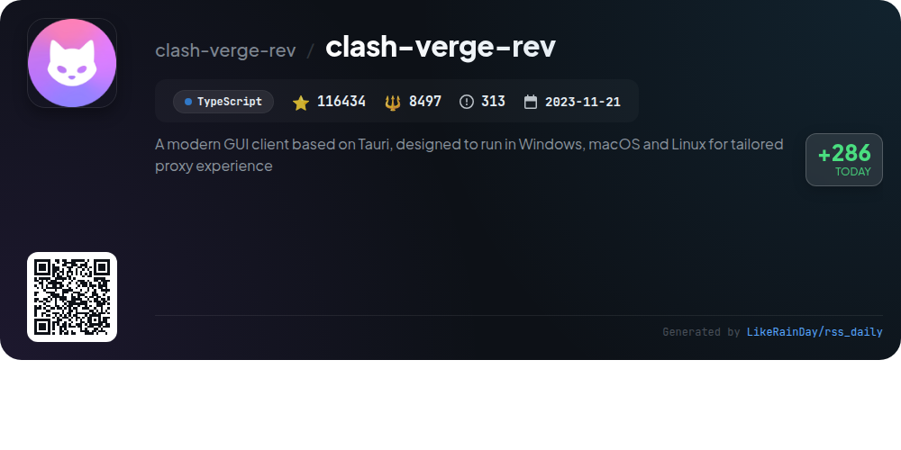

# 📊 🌟 GitHub Trending Daily - 2026-05-08

> > 📅 每日精选 GitHub 热门仓库 | 基于智能算法推荐

## 📋 Overview

**10** 个项目 | **468500** ⭐ | **44855** 🍴

**热门语言:** `Rust` (4) · `TypeScript` (3) · `Go` (2)

**更新时间:** 2026-05-08 03:40 UTC

**分类分布:**

- 🌟 每日 Top 10 精选 (10 项)

---

## 🌟 每日 Top 10 精选

### 1. [DeepSeek-TUI](https://github.com/Hmbown/DeepSeek-TUI)

> 🤖 **推荐理由**  
> *DeepSeek-TUI is a terminal-based coding agent designed for DeepSeek V4, featuring a robust interface for file editing, shell command execution, and git management. Key features include an auto mode for dynamic model selection, thinking-mode streaming for real-time reasoning, and a comprehensive tool suite that supports session management and workspace rollback. It offers a 1M-token context window, user memory, LSP diagnostics, and multi-language localization. Built with Rust, DeepSeek-TUI enables efficient coding workflows directly from the terminal.*

- ⭐ 19465 stars
- 💻 Rust
- 📅 Updated: 2026-05-08

### 2. [cc-switch](https://github.com/farion1231/cc-switch)

> 🤖 **推荐理由**  
> *CC Switch is a cross-platform desktop assistant for managing multiple AI CLI tools, including Claude Code, Codex, Gemini CLI, OpenCode, and OpenClaw. With over 62,000 stars on GitHub, it offers seamless provider management through a unified interface, eliminating manual configuration edits. Core features include 50+ built-in provider presets, a unified management panel for MCP and Skills, instant provider switching via system tray, and cloud sync capabilities. Built with Rust and Tauri, CC Switch ensures reliable performance across Windows, macOS, and Linux platforms.*

- ⭐ 62686 stars
- 💻 Rust
- 📅 Updated: 2026-05-08

### 3. [rtk](https://github.com/rtk-ai/rtk)

> 🤖 **推荐理由**  
> *RTK (Rust Token Killer) is a high-performance CLI proxy that significantly reduces LLM token consumption by 60-90% for common development commands. Built as a single Rust binary with zero dependencies, it supports over 100 commands and incurs less than 10ms overhead. Key features include smart filtering, automatic command rewriting, and comprehensive analytics for token savings. It integrates seamlessly with AI tools like Claude Code and GitHub Copilot, providing optimized command outputs for improved efficiency in development workflows. With 44,132 stars, RTK is an essential tool for developers looking to minimize token usage.*

- ⭐ 44132 stars
- 💻 Rust
- 📅 Updated: 2026-05-08

### 4. [InsForge](https://github.com/InsForge/InsForge)

> 🤖 **推荐理由**  
> *InsForge is a powerful backend platform designed for AI-native developers, leveraging a Postgres database to provide essential services such as authentication, storage, compute, and deployment. It features a semantic layer that allows AI coding agents to interact seamlessly with backend primitives, enabling them to fetch context, configure services, and inspect system states effortlessly. Key offerings include an OpenAI-compatible model gateway, serverless edge functions, and comprehensive documentation. With over 8,900 stars, InsForge fosters a vibrant community dedicated to enhancing AI coding workflows.*

- ⭐ 8918 stars
- 💻 TypeScript
- 📅 Updated: 2026-05-08

### 5. [sub2api](https://github.com/Wei-Shaw/sub2api)

> 🤖 **推荐理由**  
> *Sub2API is an open-source AI API gateway platform for managing and distributing subscription quotas from services like Claude, OpenAI, and Gemini. Key features include multi-account management, API key generation, precise billing with token-level tracking, smart scheduling, concurrency control, and built-in payment integration (EasyPay, Alipay, WeChat Pay, Stripe). An intuitive admin dashboard allows for effective monitoring and management. With strong community support and a rich tech stack (Go, Vue, PostgreSQL, Redis), Sub2API streamlines API access and cost-sharing for users.*

- ⭐ 18704 stars
- 💻 Go
- 📅 Updated: 2026-05-08

### 6. [goose](https://github.com/aaif-goose/goose)

> 🤖 **推荐理由**  
> *goose is an open-source AI agent designed for versatile tasks beyond code suggestions, including research, automation, and data analysis. It features a native desktop app for macOS, Linux, and Windows, a full CLI for terminal workflows, and an API for integration. Built in Rust, goose supports 15+ providers like OpenAI and Google, and connects to 70+ extensions via the Model Context Protocol. Now part of the Agentic AI Foundation at the Linux Foundation, goose offers a robust platform for developers and researchers alike.*

- ⭐ 44561 stars
- 💻 Rust
- 📅 Updated: 2026-05-08

### 7. [new-api](https://github.com/QuantumNous/new-api)

> 🤖 **推荐理由**  
> *New API is a powerful unified AI model hub designed for aggregation and distribution, enabling seamless cross-conversion of various large language models (LLMs) into OpenAI, Claude, and Gemini-compatible formats. Key features include a modern user interface, multi-language support, comprehensive data compatibility, advanced permission management, and flexible billing options. It also provides intelligent routing, format conversion capabilities, and robust authorization mechanisms. With over 31,000 stars on GitHub, it serves as a centralized gateway for personal and enterprise model management.*

- ⭐ 31510 stars
- 💻 Go
- 📅 Updated: 2026-05-08

### 8. [learn-claude-code](https://github.com/shareAI-lab/learn-claude-code)

> 🤖 **推荐理由**  
> *Learn Claude Code is an educational repository focused on harness engineering for AI agents, built using TypeScript. It emphasizes the importance of both the model and harness in creating effective agents. Key features include a progressive learning path through 12 sessions covering agent loops, tool integration, task management, and team coordination. The project teaches developers how to build environments that enable AI models to perceive, reason, and act effectively across various domains. Resources include interactive web visualizations and multilingual documentation.*

- ⭐ 58896 stars
- 💻 TypeScript
- 📅 Updated: 2026-05-08

### 9. [ladybird](https://github.com/LadybirdBrowser/ladybird)

> 🤖 **推荐理由**  
> *Ladybird is an independent web browser built on a novel engine adhering to web standards, currently in pre-alpha and intended for developers. It features a multi-process architecture for enhanced security, with separate renderer processes for each tab and out-of-process image decoding and network connections. Core components are derived from SerenityOS, including rendering, JavaScript, WebAssembly, and cryptography libraries. Ladybird supports Linux, macOS, Windows (WSL2), and other Unix-like systems. Join the development community via Discord for collaboration and contributions.*

- ⭐ 63194 stars
- 💻 C++
- 📅 Updated: 2026-05-08

### 10. [clash-verge-rev](https://github.com/clash-verge-rev/clash-verge-rev)

> 🤖 **推荐理由**  
> *Clash Verge Rev is a modern GUI client based on Tauri, designed for Windows, macOS, and Linux, offering a tailored proxy experience. Key features include a sleek user interface with customizable themes, built-in Clash.Meta kernel support, advanced configuration management, and visual node editing. It supports TUN mode and system proxy settings, along with WebDav for backup and sync. The project is actively developed, has garnered over 116,000 stars, and emphasizes user engagement with features like real-time support and community contributions.*

- ⭐ 116434 stars
- 💻 TypeScript
- 📅 Updated: 2026-05-08

---

## 📡 RSS订阅

通过 RSS 订阅，第一时间获取每日精选项目：

- 🔔 [RSS 订阅源] (../../daily-top.xml)
- 🔔 [每日简报] (../../GITHUB_TODAY_CN.md)
- 🔔 [每日 Top 10 精选](../../daily-top.xml)

---

*⚡ Powered by Smart Trending Algorithm | Generated at 2026-05-08 03:40:01 UTC
