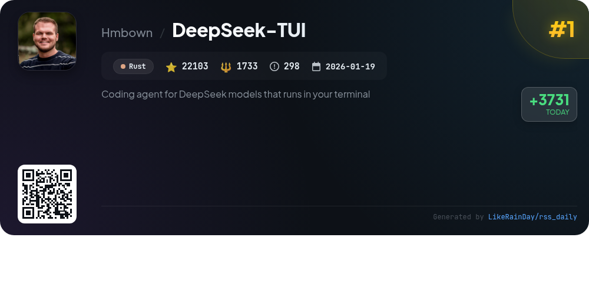
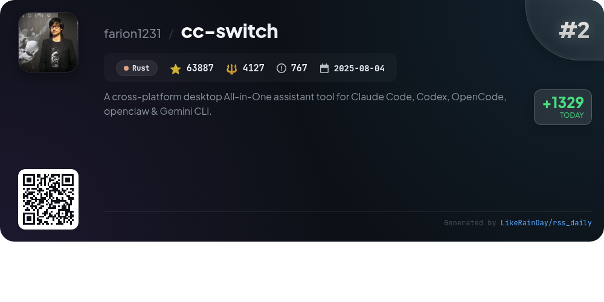
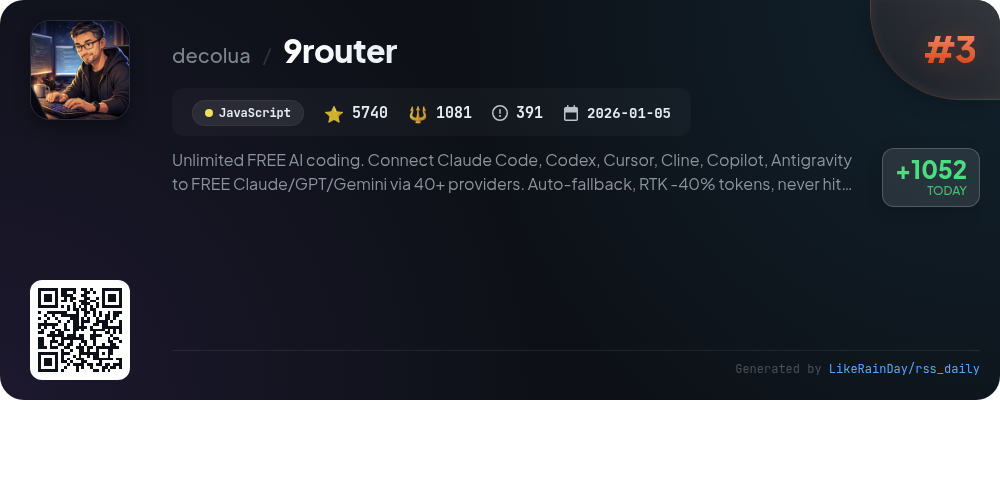
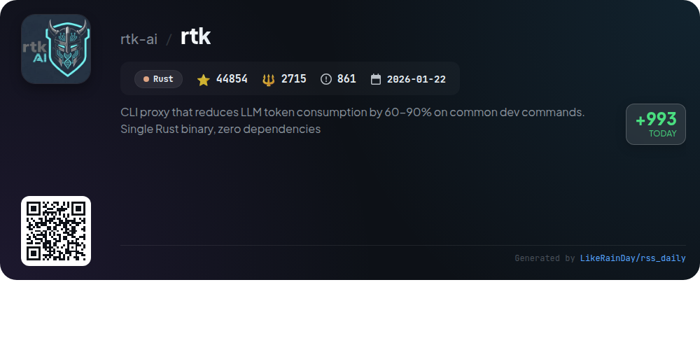
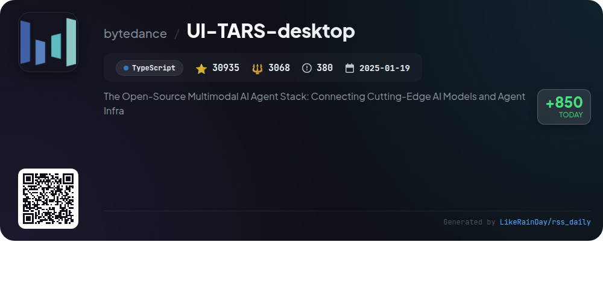
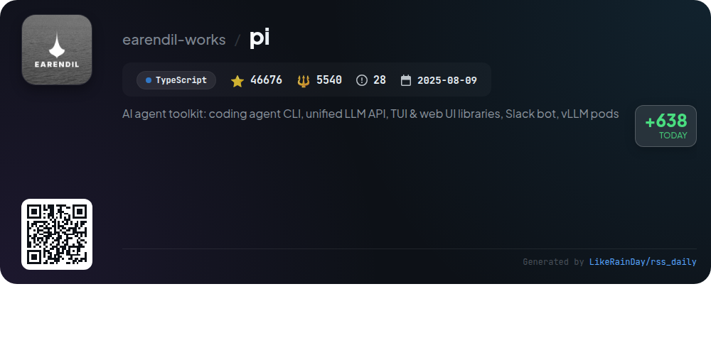
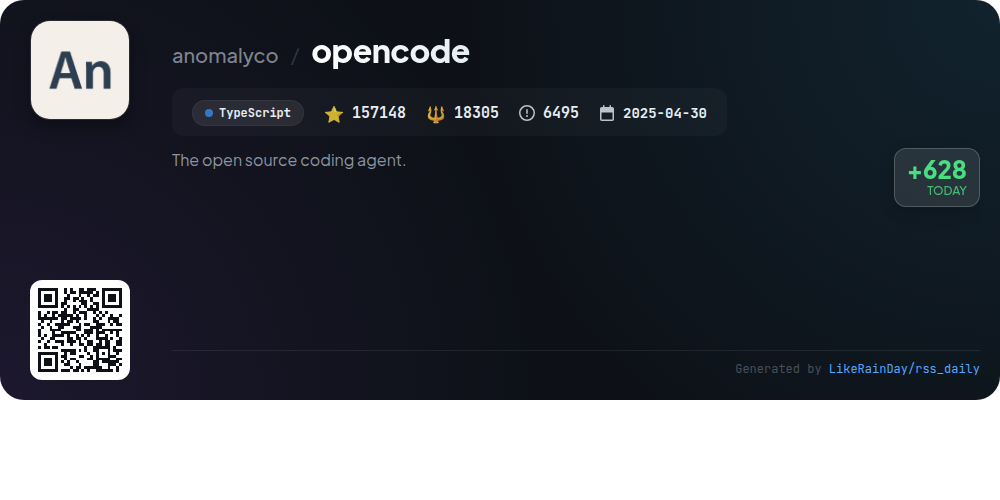
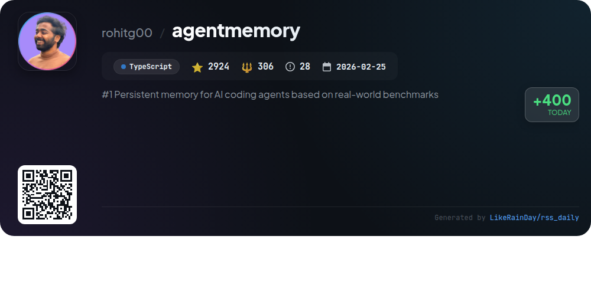
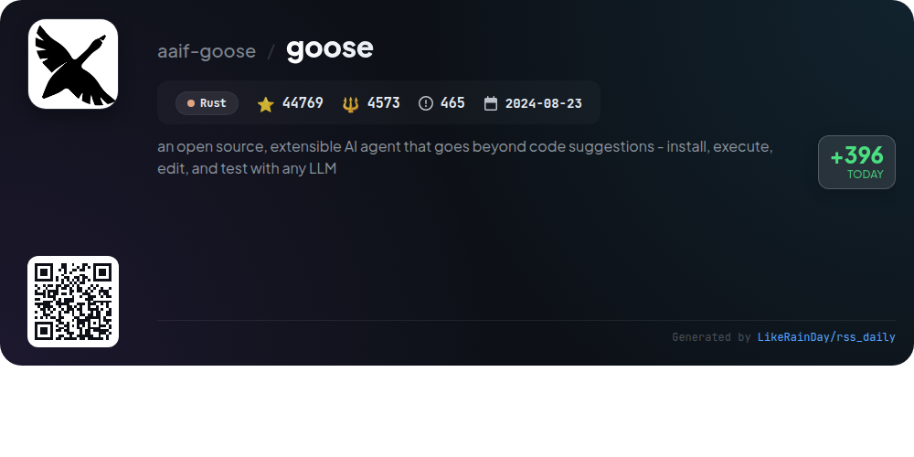
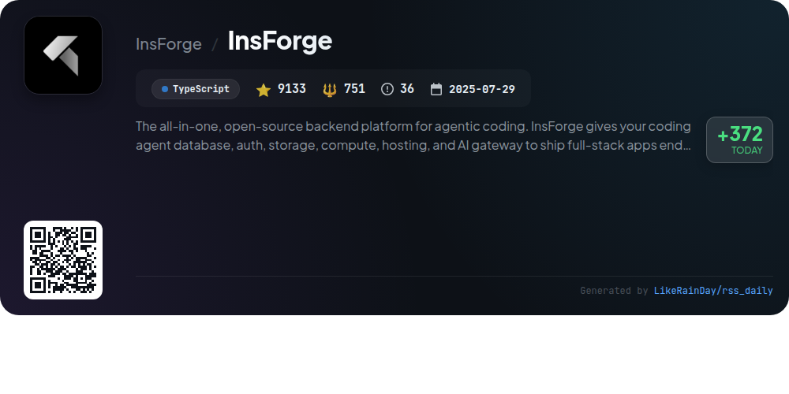

# 📊 🌟 GitHub Trending Daily - 2026-05-09

> > 📅 Daily Picks of GitHub Trending Repositories | Powered by Smart Algorithms

## 📋 Overview

**10** Projects | **428169** ⭐ | **42199** 🍴

**Top Languages:** `TypeScript` (5) · `Rust` (4) · `JavaScript` (1)

**Updated:** 2026-05-09 03:40 UTC

**Categories:**

- 🌟 Daily Top 10 (10 items)

---

## 🌟 Daily Top 10

### 1. [DeepSeek-TUI](https://github.com/Hmbown/DeepSeek-TUI)

> 🤖 **Why Recommend**  
> *DeepSeek-TUI is a terminal-based coding agent designed for DeepSeek V4 models, boasting over 22,000 stars on GitHub. Key features include an auto mode for dynamic model selection, real-time reasoning block streaming, file and shell command management, and Git integration. Users can engage in three operational modes—Plan, Agent, and YOLO—allowing for varying levels of interaction and approval. It supports a 1M-token context, session saving, workspace rollback, and offers an HTTP/SSE API for headless operations. With built-in localization and a durable task queue, DeepSeek-TUI enhances coding workflows efficiently.*

- ⭐ 22103 stars
- 💻 Rust
- 📅 Updated: 2026-05-09

### 2. [cc-switch](https://github.com/farion1231/cc-switch)

> 🤖 **Why Recommend**  
> *CC Switch is a cross-platform desktop tool built with Rust that seamlessly integrates Claude Code, Codex, Gemini CLI, OpenCode, and OpenClaw into a single interface. With over 50 provider presets, users can easily manage API configurations without manual edits. Key features include unified MCP and Skills management, instant provider switching from a system tray, cloud sync capabilities, and built-in utilities for enhanced usability. Its reliable SQLite database ensures data integrity, making it an essential assistant for modern AI-powered coding workflows.*

- ⭐ 63887 stars
- 💻 Rust
- 📅 Updated: 2026-05-09

### 3. [9router](https://github.com/decolua/9router)

> 🤖 **Why Recommend**  
> *9Router is a free AI coding router that connects various coding tools (e.g., Claude Code, Codex, Copilot) to over 40 AI providers, maximizing efficiency and reducing costs. Key features include RTK Token Saver for 20-40% token savings, automatic fallback from subscriptions to cheaper or free models, real-time quota tracking, and multi-account support for load balancing. With seamless integration for CLI tools and flexible deployment options, 9Router ensures uninterrupted coding without the hassle of hitting usage limits or high costs.*

- ⭐ 5740 stars
- 💻 JavaScript
- 📅 Updated: 2026-05-09

### 4. [rtk](https://github.com/rtk-ai/rtk)

> 🤖 **Why Recommend**  
> *RTK is a high-performance CLI proxy built in Rust that significantly reduces LLM token consumption by 60-90% for over 100 common development commands. With zero dependencies and minimal overhead (<10ms), it filters and compresses output before reaching your LLM, enhancing efficiency. Key features include smart filtering, command grouping, and deduplication, along with support for various AI tools like Claude Code and GitHub Copilot. RTK offers a seamless installation process, analytics for token savings, and a user-friendly interface for developers seeking optimized command outputs.*

- ⭐ 44854 stars
- 💻 Rust
- 📅 Updated: 2026-05-09

### 5. [UI-TARS-desktop](https://github.com/bytedance/UI-TARS-desktop)

> 🤖 **Why Recommend**  
> *UI-TARS-desktop is an open-source multimodal AI agent stack that provides a native GUI agent for local and remote operations. It integrates advanced AI models to enable natural language control, real-time feedback, and visual recognition across platforms (Windows, MacOS, and browsers). Key features include precise mouse and keyboard control, one-click CLI execution, and seamless integration with real-world tools via MCP. The project includes both local and remote operators, enhancing user experience in automating tasks efficiently. With over 30,000 stars, it stands out as a powerful solution in AI-driven automation.*

- ⭐ 30935 stars
- 💻 TypeScript
- 📅 Updated: 2026-05-09

### 6. [pi](https://github.com/earendil-works/pi)

> 🤖 **Why Recommend**  
> *The "pi" project is an AI agent toolkit featuring an interactive coding agent CLI, a unified multi-provider LLM API, and both terminal and web UI libraries. Key components include the coding agent CLI, agent runtime for tool management, and various UI components for AI chat interfaces. With a strong emphasis on community-driven improvements, users can share OSS coding sessions to enhance agent performance. The project supports integrations like Slack for automated workflows. Explore more at [pi.dev](https://pi.dev).*

- ⭐ 46676 stars
- 💻 TypeScript
- 📅 Updated: 2026-05-09

### 7. [opencode](https://github.com/anomalyco/opencode)

> 🤖 **Why Recommend**  
> *OpenCode is an open-source AI coding agent built with TypeScript, designed to enhance coding productivity. It features two main agents: the full-access "build" agent for development and a read-only "plan" agent for code exploration. The project supports multiple programming models, offering flexibility and provider-agnostic capabilities. Additionally, OpenCode provides a desktop application across various platforms and a terminal user interface, catering to developers' needs. With robust documentation and an active community, OpenCode is set to innovate coding workflows.*

- ⭐ 157148 stars
- 💻 TypeScript
- 📅 Updated: 2026-05-09

### 8. [agentmemory](https://github.com/rohitg00/agentmemory)

> 🤖 **Why Recommend**  
> *agentmemory is a TypeScript-based memory engine designed for AI coding agents, enabling persistent memory across sessions without re-explaining. It integrates seamlessly with various clients, including Claude Code and Cursor, capturing tool usage automatically for efficient retrieval. Key features include a high retrieval accuracy (95.2% R@5), reduced token usage (92% fewer tokens), and a real-time viewer for memory tracking. With a comprehensive MCP toolkit offering 51 tools and hybrid search capabilities, agentmemory streamlines coding workflows and enhances collaboration.*

- ⭐ 2924 stars
- 💻 TypeScript
- 📅 Updated: 2026-05-09

### 9. [goose](https://github.com/aaif-goose/goose)

> 🤖 **Why Recommend**  
> *Goose is an open-source, extensible AI agent designed for diverse applications beyond code suggestions, including research, writing, and automation. Built in Rust for performance, it offers a native desktop app for macOS, Linux, and Windows, a CLI for terminal workflows, and an API for integration. Goose supports 15+ providers like OpenAI and Anthropic, and connects to over 70 extensions via the Model Context Protocol. Now under the Agentic AI Foundation at the Linux Foundation, Goose is a versatile tool for enhancing workflows and productivity.*

- ⭐ 44769 stars
- 💻 Rust
- 📅 Updated: 2026-05-09

### 10. [InsForge](https://github.com/InsForge/InsForge)

> 🤖 **Why Recommend**  
> *InsForge is an all-in-one, open-source backend platform designed for agentic coding, enabling developers to build full-stack applications seamlessly. Key features include user authentication, a PostgreSQL database, S3-compatible storage, a model gateway for multiple LLM providers, and serverless edge functions. InsForge supports two interfaces: a self-hosted MCP Server and a cloud-based CLI with Skills. With over 9,133 stars, it offers easy deployment options via Docker, Railway, and more. Join the community for support and collaboration.*

- ⭐ 9133 stars
- 💻 TypeScript
- 📅 Updated: 2026-05-09

---

## 📡 RSS Subscription

Subscribe via RSS to get daily trending updates:

- 🔔 [RSS XML] (../../daily-top.xml)
- 🔔 [Daily Report] (../../GITHUB_TODAY.md)
- 🔔 [Daily Top 10](../../daily-top.xml)

---

*⚡ Powered by Smart Trending Algorithm | Generated at 2026-05-09 03:40:04 UTC
