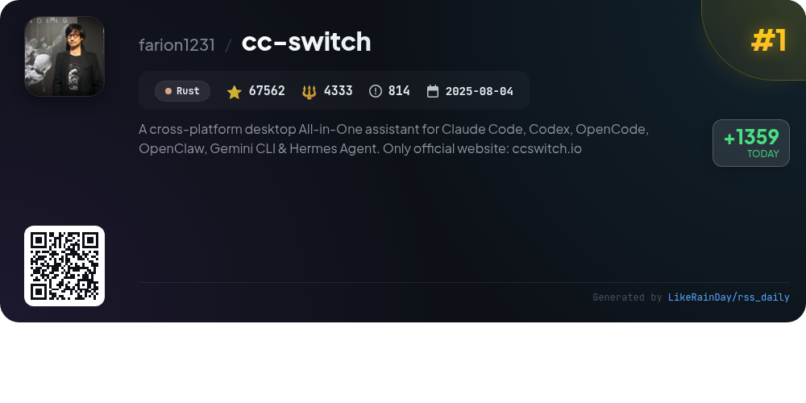
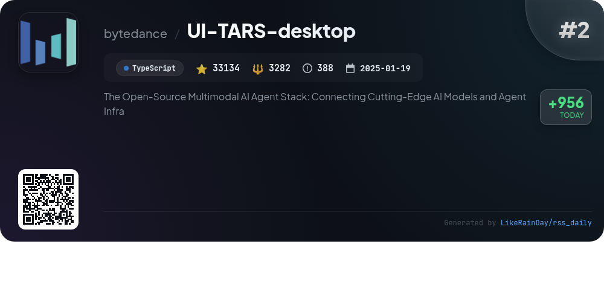
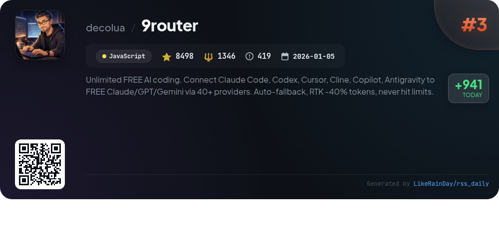
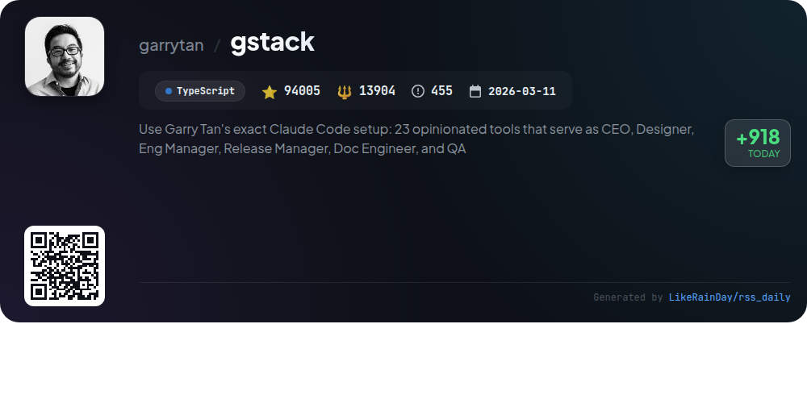
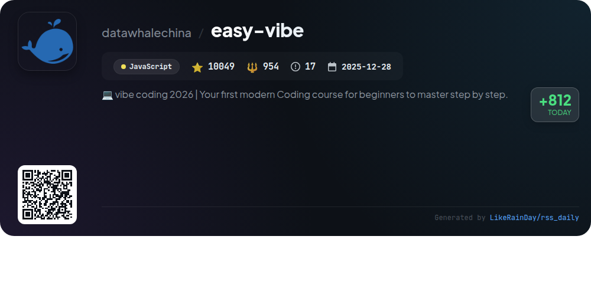
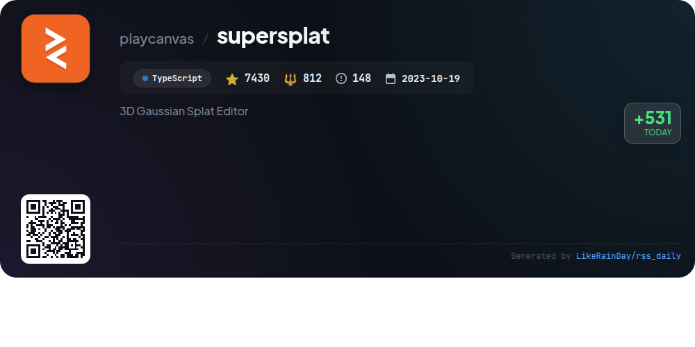
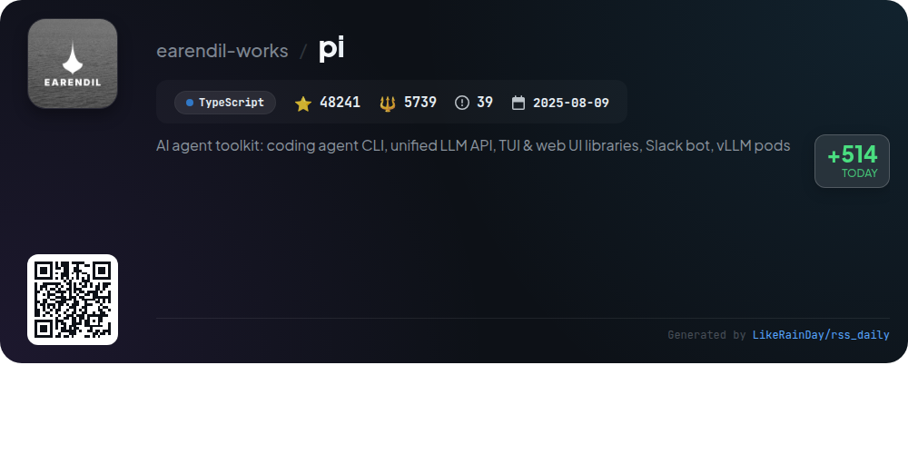
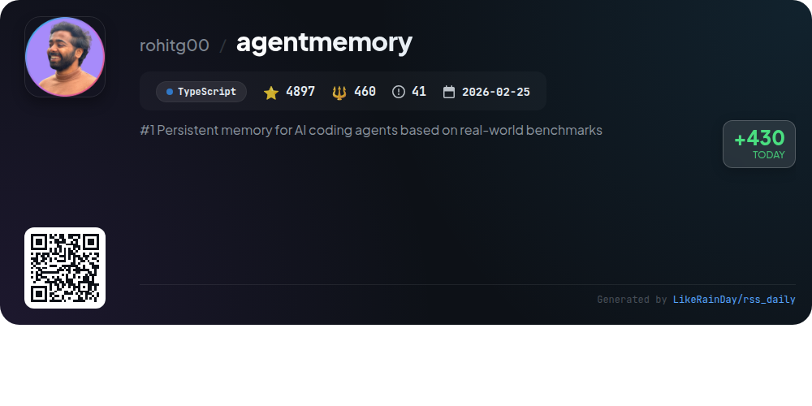
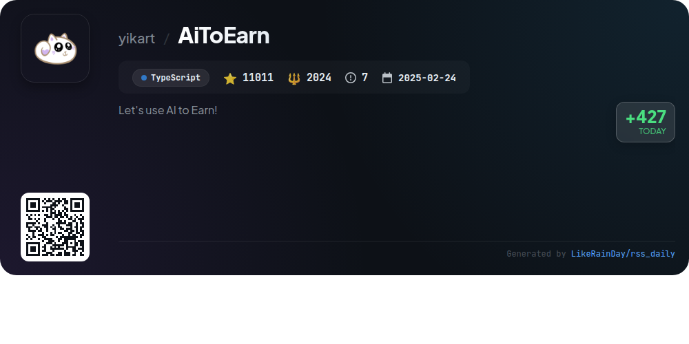
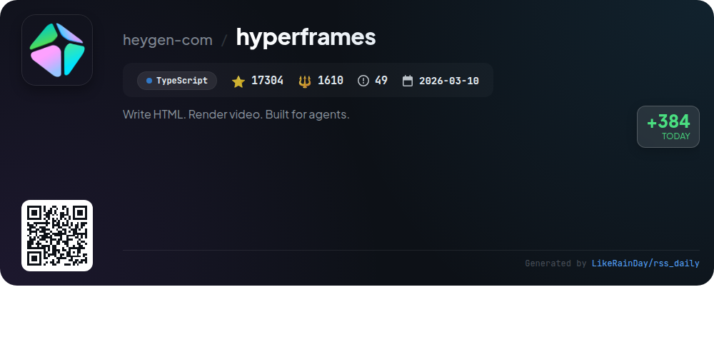

# 📊 🌟 GitHub Trending Daily - 2026-05-12

> > 📅 每日精选 GitHub 热门仓库 | 基于智能算法推荐

## 📋 Overview

**10** 个项目 | **302131** ⭐ | **34464** 🍴

**热门语言:** `TypeScript` (7) · `JavaScript` (2) · `Rust` (1)

**更新时间:** 2026-05-12 03:51 UTC

**分类分布:**

- 🌟 每日 Top 10 精选 (10 项)

---

## 🌟 每日 Top 10 精选

### 1. [cc-switch](https://github.com/farion1231/cc-switch)

> 🤖 **推荐理由**  
> *CC Switch is a cross-platform desktop application designed to streamline the management of multiple AI CLI tools, including Claude Code, Codex, Gemini CLI, OpenCode, and OpenClaw. With over 67,000 stars on GitHub, it offers a unified interface for easy provider switching without manual config edits, featuring 50+ built-in provider presets, centralized MCP and Skills management, and cloud sync options. Key functionalities include session management, cost tracking, and a local proxy for enhanced performance. The app is built with Rust and Tauri, ensuring compatibility across Windows, macOS, and Linux.*

- ⭐ 67562 stars
- 💻 Rust
- 📅 Updated: 2026-05-12

### 2. [UI-TARS-desktop](https://github.com/bytedance/UI-TARS-desktop)

> 🤖 **推荐理由**  
> *UI-TARS-desktop is an open-source multimodal AI agent stack designed to enhance human-like task completion through advanced AI models. With over 33,000 stars on GitHub, it features a native GUI agent that supports local and remote operations, allowing users to control their computers and browsers intuitively. Key features include natural language processing, visual recognition, precise control of mouse and keyboard, and cross-platform compatibility. The project integrates seamlessly with various real-world tools, enhancing productivity and automation in a user-friendly environment.*

- ⭐ 33134 stars
- 💻 TypeScript
- 📅 Updated: 2026-05-12

### 3. [9router](https://github.com/decolua/9router)

> 🤖 **推荐理由**  
> *9Router is an innovative AI coding router that connects various tools like Claude Code, Codex, Copilot, and Cursor to over 40 AI providers, enabling unlimited free AI coding. Key features include the RTK Token Saver, which reduces token usage by 20-40%, and a smart 3-tier fallback system that ensures continuous coding by automatically switching between subscription, cheap, and free models. With real-time quota tracking, multi-account support, and seamless integration with popular CLI tools, 9Router maximizes coding efficiency while minimizing costs.*

- ⭐ 8498 stars
- 💻 JavaScript
- 📅 Updated: 2026-05-12

### 4. [gstack](https://github.com/garrytan/gstack)

> 🤖 **推荐理由**  
> *gstack is an open-source toolkit designed to enhance productivity for builders, combining 23 specialized AI-driven roles like CEO, Designer, and QA. It streamlines software development with commands for planning, reviewing, testing, and shipping code, fostering a structured workflow that mimics a full team. Key features include real-time bug fixing, automated documentation updates, and multi-agent coordination. With a focus on efficiency, gstack empowers technical founders and engineers to ship high-quality products rapidly, leveraging AI to amplify their capabilities.*

- ⭐ 94005 stars
- 💻 TypeScript
- 📅 Updated: 2026-05-12

### 5. [easy-vibe](https://github.com/datawhalechina/easy-vibe)

> 🤖 **推荐理由**  
> *Easy-Vibe is a modern coding course designed for beginners, aimed at helping users master programming through interactive tutorials and practical projects. With over 10,000 stars on GitHub, it offers clear learning paths from basic concepts to full-stack development, including AI integration and product prototyping. Key features include a beginner-friendly learning map, immersive coding simulations, and resources for product and business thinking. The project supports multiple languages and encourages community contributions, making tech learning accessible and engaging.*

- ⭐ 10049 stars
- 💻 JavaScript
- 📅 Updated: 2026-05-12

### 6. [supersplat](https://github.com/playcanvas/supersplat)

> 🤖 **推荐理由**  
> *SuperSplat is a free, open-source 3D Gaussian Splat Editor built with TypeScript, enabling users to inspect, edit, optimize, and publish 3D Gaussian splats directly in the browser—no installation required. Key features include a live web version, comprehensive user guide, and localization support for multiple languages. The project fosters community engagement through Discord and Reddit channels. With over 7,430 stars on GitHub, it invites contributions from a vibrant open-source community, making it a valuable tool for developers and artists alike.*

- ⭐ 7430 stars
- 💻 TypeScript
- 📅 Updated: 2026-05-12

### 7. [pi](https://github.com/earendil-works/pi)

> 🤖 **推荐理由**  
> *The Pi project is an AI agent toolkit featuring an interactive coding agent CLI, a unified LLM API supporting multiple providers (OpenAI, Anthropic, Google), and libraries for TUI and web UI integrations. Key highlights include a self-extensible coding agent, an agent runtime for tool management, and a Slack automation bot. The project encourages sharing OSS coding sessions to enhance agent performance. With a robust community and extensive documentation, Pi is designed for seamless integration into development workflows. Visit pi.dev for demos and resources.*

- ⭐ 48241 stars
- 💻 TypeScript
- 📅 Updated: 2026-05-12

### 8. [agentmemory](https://github.com/rohitg00/agentmemory)

> 🤖 **推荐理由**  
> *agentmemory is a leading persistent memory solution for AI coding agents, enabling seamless session continuity without repetitive explanations. Built on the iii engine, it supports agents like Claude Code, Cursor, and Gemini CLI. Key features include automatic memory capture, hybrid semantic search, and a real-time viewer for memory insights. With impressive benchmarks—95.2% retrieval accuracy and 92% fewer tokens used—agentmemory provides a robust MCP server with 51 tools for enhanced productivity. It supports various agents and can be integrated effortlessly, ensuring efficient workflows.*

- ⭐ 4897 stars
- 💻 TypeScript
- 📅 Updated: 2026-05-12

### 9. [AiToEarn](https://github.com/yikart/AiToEarn)

> 🤖 **推荐理由**  
> *AiToEarn is an AI-driven content marketing platform designed for individual creators and brands to monetize, publish, and engage audiences across major global platforms like TikTok, YouTube, and Instagram. Key features include automated content monetization through CPS, CPE, and CPM models, seamless multi-platform publishing, and interactive engagement tools like automated responses and brand monitoring. Users can easily access the service via a web interface, integrate it with AI assistants, or deploy it on their servers using Docker. The project has garnered over 11,000 stars on GitHub.*

- ⭐ 11011 stars
- 💻 TypeScript
- 📅 Updated: 2026-05-12

### 10. [hyperframes](https://github.com/heygen-com/hyperframes)

> 🤖 **推荐理由**  
> *Hyperframes is an open-source video rendering framework designed for creating and previewing HTML-based video compositions, with strong support for AI agents. Key features include HTML-native authoring, deterministic rendering, and a flexible Frame Adapter pattern for various animation runtimes (e.g., GSAP, Lottie). Users can leverage built-in skills for AI-driven video creation, asset preprocessing, and project management. With over 50 ready-to-use components, Hyperframes streamlines the video production process, making it ideal for automated workflows. Fully compliant with Apache 2.0 licensing.*

- ⭐ 17304 stars
- 💻 TypeScript
- 📅 Updated: 2026-05-12

---

## 📡 RSS订阅

通过 RSS 订阅，第一时间获取每日精选项目：

- 🔔 [RSS 订阅源] (../../daily-top.xml)
- 🔔 [每日简报] (../../GITHUB_TODAY_CN.md)
- 🔔 [每日 Top 10 精选](../../daily-top.xml)

---

*⚡ Powered by Smart Trending Algorithm | Generated at 2026-05-12 03:51:17 UTC
