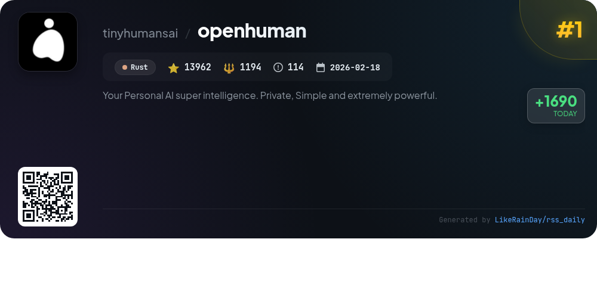
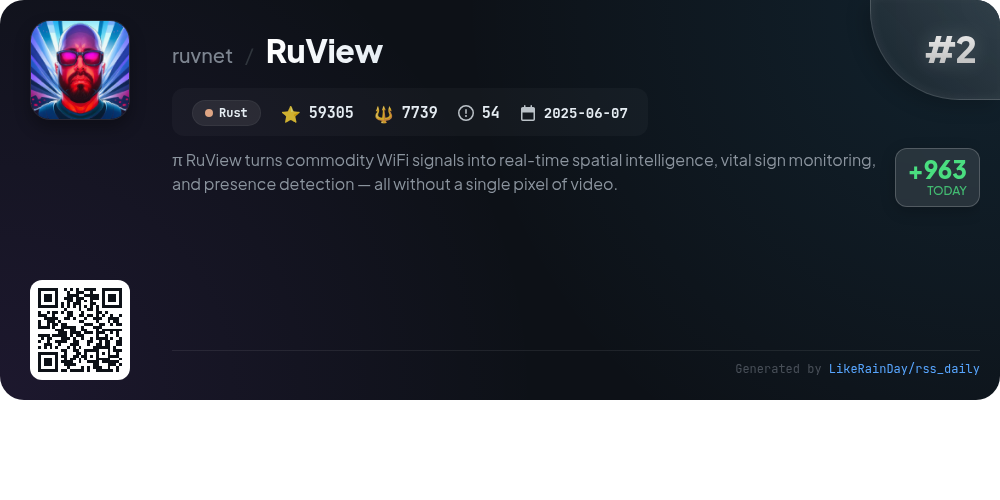
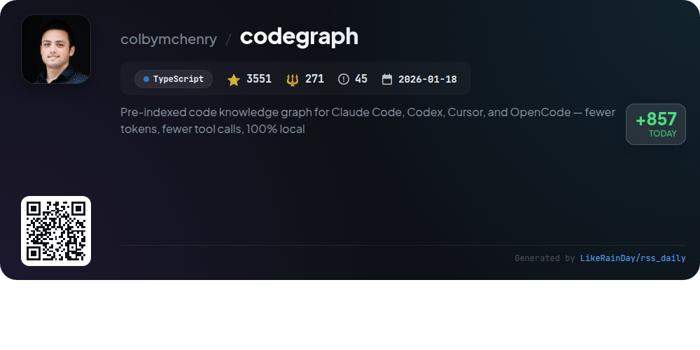
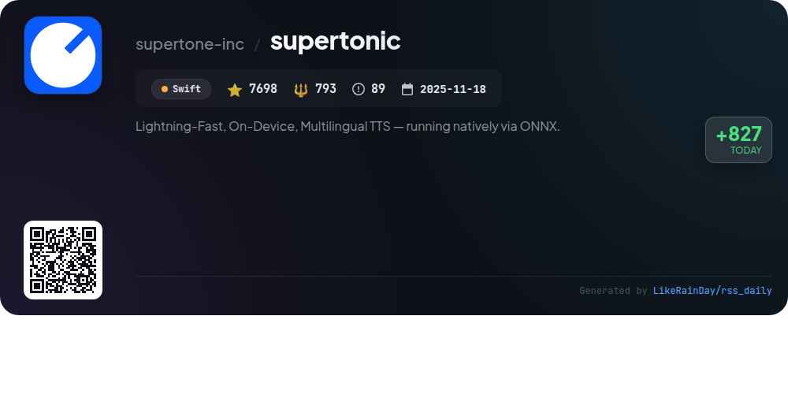
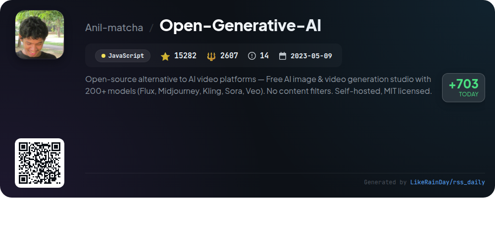
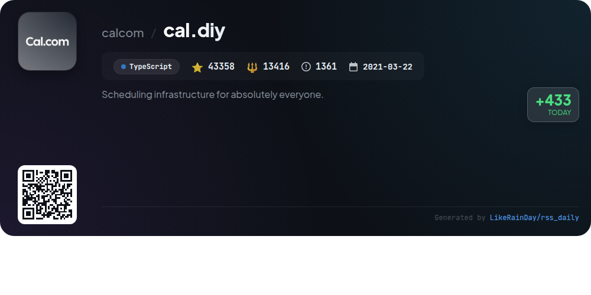
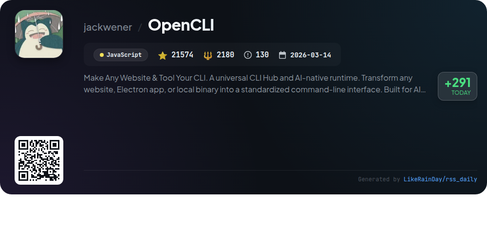
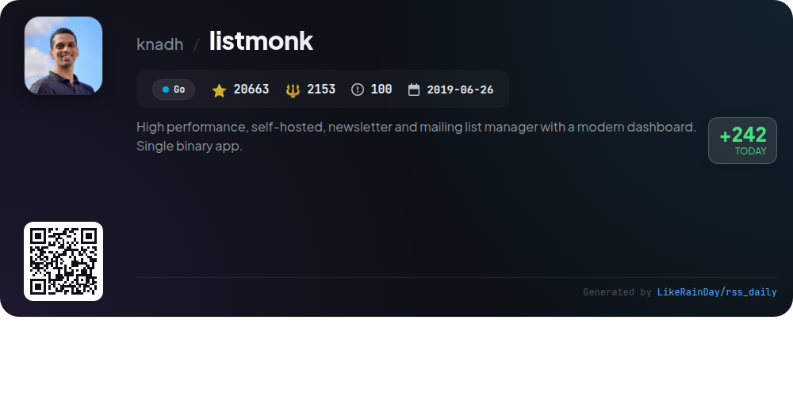

# 📊 🌟 GitHub Trending Daily - 2026-05-18

> > 📅 每日精选 GitHub 热门仓库 | 基于智能算法推荐

## 📋 Overview

**10** 个项目 | **289624** ⭐ | **36100** 🍴

**热门语言:** `JavaScript` (3) · `Rust` (3) · `TypeScript` (2)

**更新时间:** 2026-05-18 04:16 UTC

**分类分布:**

- 🌟 每日 Top 10 精选 (10 项)

---

## 🌟 每日 Top 10 精选

### 1. [openhuman](https://github.com/tinyhumansai/openhuman)

> 🤖 **推荐理由**  
> *OpenHuman is an open-source personal AI assistant designed for seamless integration into daily life. Key features include a user-friendly interface, over 118 third-party integrations with auto-fetch capabilities, and a Memory Tree that organizes your data into a local knowledge base. It offers built-in tools for web scraping, coding, and voice interaction, ensuring a holistic experience without complex setups. With its unique smart token compression, OpenHuman minimizes costs and enhances performance, making it a powerful tool for anyone seeking a personalized AI solution.*

- ⭐ 13962 stars
- 💻 Rust
- 📅 Updated: 2026-05-18

### 2. [RuView](https://github.com/ruvnet/RuView)

> 🤖 **推荐理由**  
> *RuView is a cutting-edge WiFi sensing platform that transforms commodity WiFi signals into real-time spatial intelligence, vital sign monitoring, and presence detection without cameras. Key features include contactless detection of breathing and heart rate, occupancy tracking through walls, and activity recognition using Channel State Information (CSI) from low-cost ESP32 sensors. The system operates entirely on edge hardware, ensuring privacy and low power consumption. RuView supports applications in healthcare, retail, and smart buildings, offering advanced analytics and adaptive learning capabilities.*

- ⭐ 59305 stars
- 💻 Rust
- 📅 Updated: 2026-05-18

### 3. [bun](https://github.com/oven-sh/bun)

> 🤖 **推荐理由**  
> *Bun is a high-performance JavaScript runtime, bundler, test runner, and package manager, designed as a drop-in replacement for Node.js. Built in Rust, it significantly reduces startup times and memory usage. Key features include support for TypeScript and JSX, a built-in test runner, and a streamlined package management system that minimizes dependencies. Bun offers a single executable for running scripts, installing packages, and testing, making it ideal for modern JavaScript and TypeScript applications. With over 91,000 stars on GitHub, Bun is rapidly gaining traction in the developer community.*

- ⭐ 91772 stars
- 💻 Rust
- 📅 Updated: 2026-05-18

### 4. [codegraph](https://github.com/colbymchenry/codegraph)

> 🤖 **推荐理由**  
> *CodeGraph is a pre-indexed code knowledge graph designed to enhance Claude Code, Codex, Cursor, and OpenCode, achieving 94% fewer tool calls and 77% faster exploration—all locally. Key features include smart context building, full-text search, impact analysis, and real-time auto-syncing. It supports 19+ programming languages and automatically recognizes web-framework routes. CodeGraph dramatically reduces the need for file scanning, allowing agents to query a semantic graph for instant results, making code exploration significantly more efficient.*

- ⭐ 3551 stars
- 💻 TypeScript
- 📅 Updated: 2026-05-18

### 5. [supertonic](https://github.com/supertone-inc/supertonic)

> 🤖 **推荐理由**  
> *Supertonic is a lightning-fast, on-device multilingual text-to-speech (TTS) system, utilizing ONNX Runtime for local inference. With support for 31 languages, it ensures low-latency, real-time audio synthesis without requiring cloud connectivity. Key features include a compact 99M-parameter model for quick loading, high-quality 44.1kHz audio output, and expression tags for natural speech nuances. Supertonic runs on various platforms, including desktop and mobile, making it ideal for resource-constrained devices like Raspberry Pi. Explore its capabilities through interactive demos and SDKs available for multiple programming languages.*

- ⭐ 7698 stars
- 💻 Swift
- 📅 Updated: 2026-05-18

### 6. [Open-Generative-AI](https://github.com/Anil-matcha/Open-Generative-AI)

> 🤖 **推荐理由**  
> *Open Generative AI is a free, open-source studio for AI image and video generation, featuring over 200 models including Flux and Midjourney. Key highlights include no content filters, self-hosting capabilities, and support for text-to-image, image-to-video, and lip-sync generation. Users can automate media workflows with coding agents and enjoy a responsive design for both desktop and mobile. The platform offers a seamless hosted version at muapi.ai, extensive model options, and a customizable experience, ensuring full creative control and data privacy.*

- ⭐ 15282 stars
- 💻 JavaScript
- 📅 Updated: 2026-05-18

### 7. [easy-vibe](https://github.com/datawhalechina/easy-vibe)

> 🤖 **推荐理由**  
> *Easy-Vibe is a beginner-friendly coding course designed to help users master modern programming through interactive tutorials and practical projects. With over 12,000 stars, it offers step-by-step guidance from concept to product launch, covering essential topics like AI integration, full-stack development, and version control. Key features include immersive coding simulations, visual explanations of AI principles, and a comprehensive learning map tailored for various skill levels. The platform encourages collaboration and sharing of user stories, making coding accessible and engaging for everyone.*

- ⭐ 12459 stars
- 💻 JavaScript
- 📅 Updated: 2026-05-18

### 8. [cal.diy](https://github.com/calcom/cal.diy)

> 🤖 **推荐理由**  
> *Cal.diy is an open-source scheduling platform designed for self-hosting, offering complete control without commercial dependencies. Built with TypeScript, Next.js, and Prisma, it provides essential scheduling features without enterprise functionalities, ensuring a straightforward setup with no license required. Key highlights include 100% MIT licensing, community-driven maintenance, and support for integrations like Google Calendar and Zoom. Ideal for personal and non-production use, Cal.diy empowers users to manage their scheduling infrastructure independently.*

- ⭐ 43358 stars
- 💻 TypeScript
- 📅 Updated: 2026-05-18

### 9. [OpenCLI](https://github.com/jackwener/OpenCLI)

> 🤖 **推荐理由**  
> *OpenCLI is a versatile command-line interface (CLI) hub that transforms websites, Electron apps, and local binaries into standardized interfaces for both humans and AI agents. Key features include live browser automation, multi-profile support, and over 100 built-in adapters for popular sites like Twitter, Reddit, and HackerNews. It enables AI agents to navigate, extract data, and execute commands seamlessly using your logged-in browser. Additionally, OpenCLI acts as a CLI hub for tools like Docker and GitHub, providing a unified platform for automation and command execution.*

- ⭐ 21574 stars
- 💻 JavaScript
- 📅 Updated: 2026-05-18

### 10. [listmonk](https://github.com/knadh/listmonk)

> 🤖 **推荐理由**  
> *listmonk is a high-performance, self-hosted newsletter and mailing list manager designed for ease of use and efficiency. It features a modern dashboard and is encapsulated in a single binary, utilizing PostgreSQL for data storage. Key highlights include quick installation via Docker or as a binary, a rich set of features, and a user-friendly interface built with Vue and Buefy. With over 20,000 stars on GitHub, listmonk is open-source under the AGPLv3 license, making it an excellent choice for developers and organizations looking to manage their mailing lists effectively.*

- ⭐ 20663 stars
- 💻 Go
- 📅 Updated: 2026-05-18

---

## 📡 RSS订阅

通过 RSS 订阅，第一时间获取每日精选项目：

- 🔔 [RSS 订阅源] (../../daily-top.xml)
- 🔔 [每日简报] (../../GITHUB_TODAY_CN.md)
- 🔔 [每日 Top 10 精选](../../daily-top.xml)

---

*⚡ Powered by Smart Trending Algorithm | Generated at 2026-05-18 04:16:00 UTC
