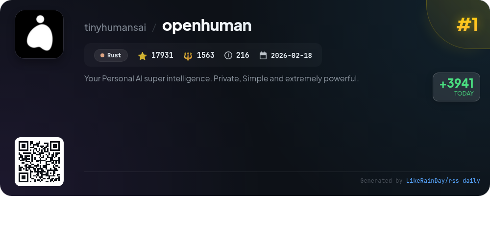
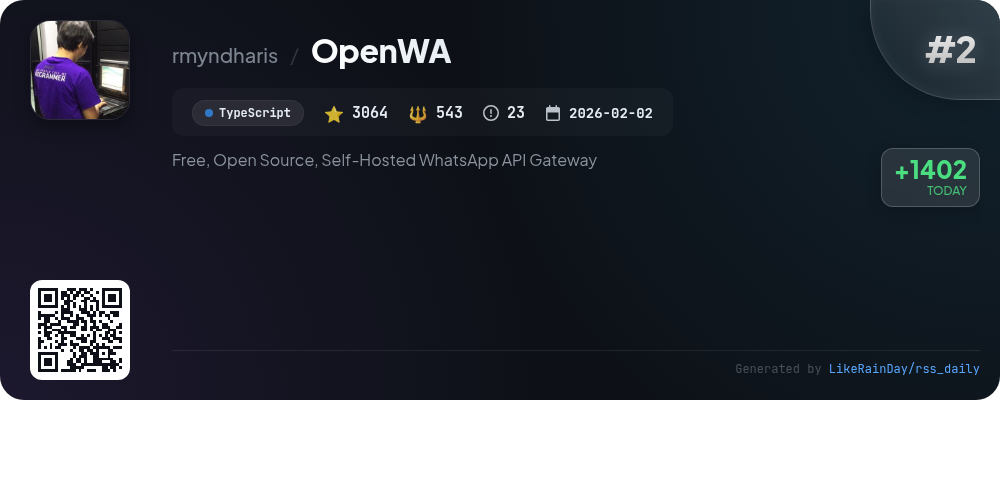
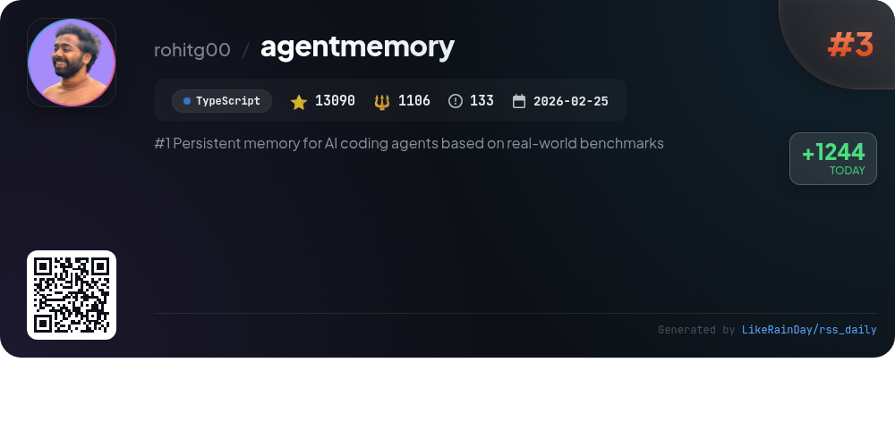
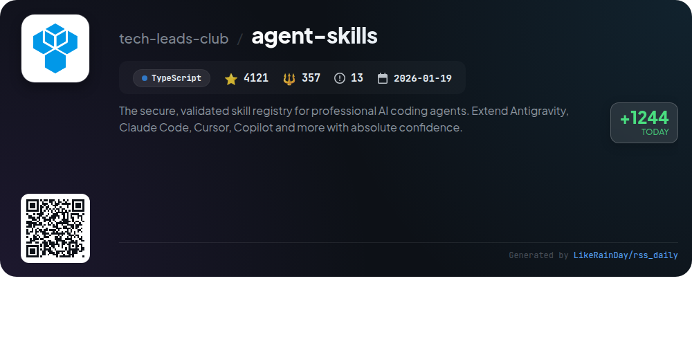
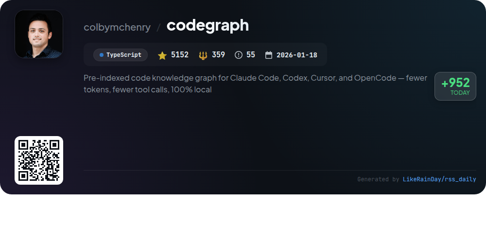
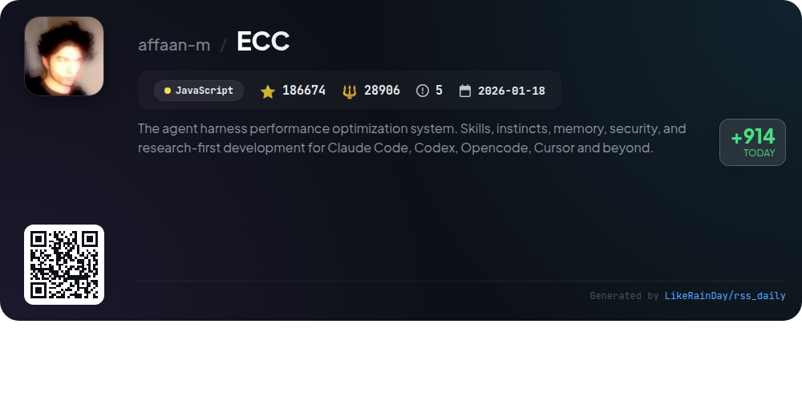
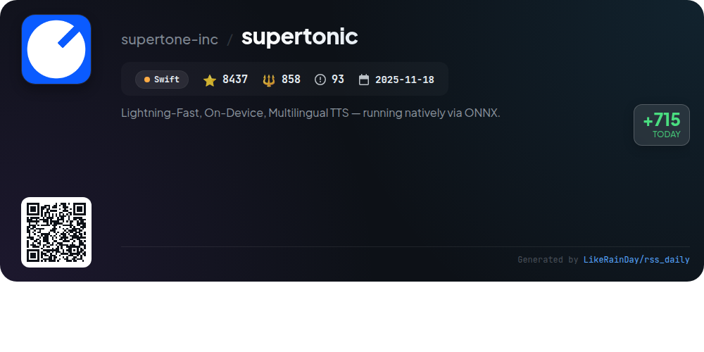
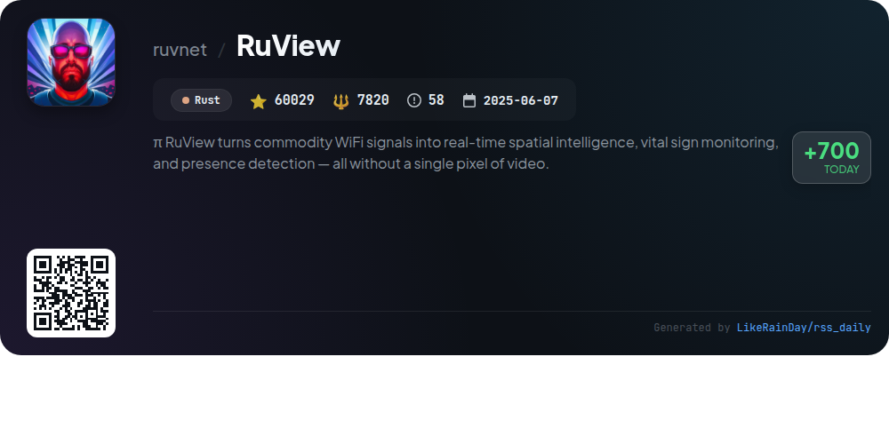
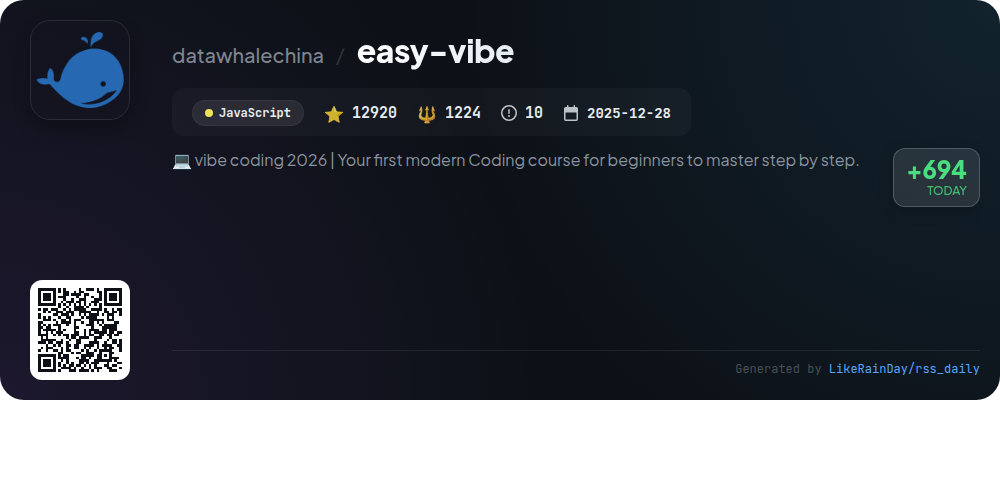

# 📊 🌟 GitHub Trending Daily - 2026-05-19

> > 📅 Daily Picks of GitHub Trending Repositories | Powered by Smart Algorithms

## 📋 Overview

**10** Projects | **327251** ⭐ | **45409** 🍴

**Top Languages:** `TypeScript` (4) · `JavaScript` (3) · `Rust` (2)

**Updated:** 2026-05-19 04:10 UTC

**Categories:**

- 🌟 Daily Top 10 (10 items)

---

## 🌟 Daily Top 10

### 1. [openhuman](https://github.com/tinyhumansai/openhuman)

> 🤖 **Why Recommend**  
> *OpenHuman is an open-source personal AI superintelligence, designed for easy integration into daily life. Built with Rust, it features a user-friendly UI, supports 118+ third-party integrations, and employs a Memory Tree for local data storage and retrieval. Key highlights include auto-fetching data every 20 minutes, a built-in knowledge base compatible with Obsidian, and advanced token compression to optimize performance. With native tools for coding, web search, and voice interaction, OpenHuman prioritizes privacy and offers a seamless experience without vendor sprawl.*

- ⭐ 17931 stars
- 💻 Rust
- 📅 Updated: 2026-05-19

### 2. [OpenWA](https://github.com/rmyndharis/OpenWA)

> 🤖 **Why Recommend**  
> *OpenWA is a free, open-source, self-hosted WhatsApp API Gateway designed for developers seeking full control over their messaging infrastructure. Key features include a pluggable architecture for easy integration with various databases and storage solutions, multi-session support, a modern web dashboard for management, and a comprehensive REST API. It supports text and media messaging, webhooks, and group management. Built with TypeScript and NestJS, OpenWA is Docker-ready, ensuring seamless deployment. With over 3,000 stars on GitHub, it fosters community contributions and offers extensive documentation.*

- ⭐ 3064 stars
- 💻 TypeScript
- 📅 Updated: 2026-05-19

### 3. [agentmemory](https://github.com/rohitg00/agentmemory)

> 🤖 **Why Recommend**  
> *agentmemory is a TypeScript-based persistent memory solution for AI coding agents, boasting over 13,000 stars on GitHub. It eliminates repetitive explanations by capturing interactions and compressing them into searchable memory, enhancing the efficiency of agents like Claude Code and Codex CLI. Key features include automatic observation capture, a hybrid semantic search system, and a real-time viewer for memory management. With 51 tools and extensive API endpoints, agentmemory offers a comprehensive memory toolkit, ensuring continuity across sessions while maintaining privacy.*

- ⭐ 13090 stars
- 💻 TypeScript
- 📅 Updated: 2026-05-19

### 4. [agent-skills](https://github.com/tech-leads-club/agent-skills)

> 🤖 **Why Recommend**  
> *Agent Skills is a secure, validated registry for AI coding agents, designed to enhance tools like Antigravity, Claude Code, and GitHub Copilot. It offers a library of verified and tested skills, ensuring safety in an ecosystem where many marketplace skills have vulnerabilities. Key features include an interactive CLI for skill installation, comprehensive caching, and a managed library with human-curated prompts. Skills cover various categories such as development, cloud, and automation, allowing users to extend agent capabilities confidently and efficiently.*

- ⭐ 4121 stars
- 💻 TypeScript
- 📅 Updated: 2026-05-19

### 5. [codegraph](https://github.com/colbymchenry/codegraph)

> 🤖 **Why Recommend**  
> *CodeGraph is a pre-indexed code knowledge graph designed for Claude Code, Codex, Cursor, and OpenCode, achieving 94% fewer tool calls and 77% faster code exploration, all while operating entirely locally. It enables smart context building, full-text search, and impact analysis across 19+ programming languages. Features include framework-aware routing, real-time synchronization, and a seamless setup process. CodeGraph enhances productivity by allowing agents to instantly query a semantic graph of code relationships, optimizing resource usage and response times.*

- ⭐ 5152 stars
- 💻 TypeScript
- 📅 Updated: 2026-05-19

### 6. [ECC](https://github.com/affaan-m/ECC)

> 🤖 **Why Recommend**  
> *ECC is an advanced performance optimization system for AI agents, enhancing workflows across Claude Code, Codex, Cursor, OpenCode, and more. With over 186,000 stars, it offers a comprehensive suite of features including skills and instincts for continuous learning, memory optimization, security scanning via AgentShield, and production-ready configurations. ECC supports multiple programming languages, features a user-friendly dashboard, and integrates seamlessly with GitHub for collaborative development. Its modular architecture allows for tailored installations, making it ideal for diverse development environments.*

- ⭐ 186674 stars
- 💻 JavaScript
- 📅 Updated: 2026-05-19

### 7. [Open-Generative-AI](https://github.com/Anil-matcha/Open-Generative-AI)

> 🤖 **Why Recommend**  
> *Open-Generative-AI is a free, open-source platform for AI image and video generation, featuring over 200 models including Flux, Midjourney, and Veo. It offers no content filters, enabling unrestricted creative freedom. Users can generate images, videos, and lip-sync animations with a user-friendly interface, locally or via a hosted version. Key features include multi-image input, a workflow studio for automated media pipelines, and support for local and remote inference engines. Self-hosted and MIT licensed, it prioritizes data privacy and customization.*

- ⭐ 15833 stars
- 💻 JavaScript
- 📅 Updated: 2026-05-19

### 8. [supertonic](https://github.com/supertone-inc/supertonic)

> 🤖 **Why Recommend**  
> *Supertonic is a lightning-fast, on-device multilingual text-to-speech (TTS) system utilizing ONNX Runtime for efficient local inference. It supports 31 languages, providing low-latency synthesis without cloud dependency, ensuring privacy. Key features include a compact 99M-parameter model, 44.1kHz high-quality audio output, and expression tags for natural speech nuances. Supertonic is compatible across various platforms, including desktop and mobile, and offers multi-runtime SDKs in languages like Python, Swift, and Java. Voice Builder allows users to create custom voice profiles.*

- ⭐ 8437 stars
- 💻 Swift
- 📅 Updated: 2026-05-19

### 9. [RuView](https://github.com/ruvnet/RuView)

> 🤖 **Why Recommend**  
> *RuView is a cutting-edge WiFi sensing platform that transforms commodity WiFi signals into real-time spatial intelligence, presence detection, and vital sign monitoring without the need for cameras. Utilizing low-cost ESP32 sensors, it detects occupancy, breathing and heart rates, and activity recognition through walls and in darkness. Key features include camera-free pose estimation, environment mapping, and adaptive learning via on-device AI. RuView operates entirely on edge hardware for privacy and efficiency, making it ideal for healthcare, retail, and smart building applications.*

- ⭐ 60029 stars
- 💻 Rust
- 📅 Updated: 2026-05-19

### 10. [easy-vibe](https://github.com/datawhalechina/easy-vibe)

> 🤖 **Why Recommend**  
> *Easy-Vibe is a modern coding course designed for beginners, enabling users to learn how to build applications through engaging, step-by-step tutorials. Key features include a beginner-friendly learning map, immersive simulated coding environments, and interactive components that simplify complex concepts like AI integration and RAG workflows. With support for multiple languages and a focus on real-world applications, Easy-Vibe empowers users to transform ideas into tangible products while mastering modern development practices. Join 12,920 stars on GitHub and start your coding journey today!*

- ⭐ 12920 stars
- 💻 JavaScript
- 📅 Updated: 2026-05-19

---

## 📡 RSS Subscription

Subscribe via RSS to get daily trending updates:

- 🔔 [RSS XML] (../../daily-top.xml)
- 🔔 [Daily Report] (../../GITHUB_TODAY.md)
- 🔔 [Daily Top 10](../../daily-top.xml)

---

*⚡ Powered by Smart Trending Algorithm | Generated at 2026-05-19 04:10:31 UTC
