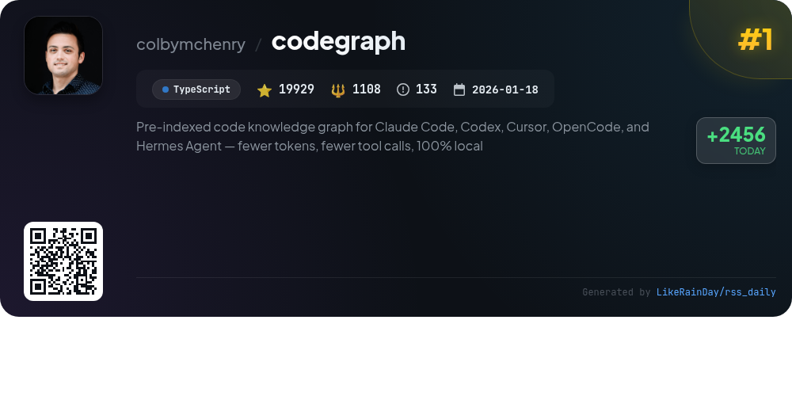
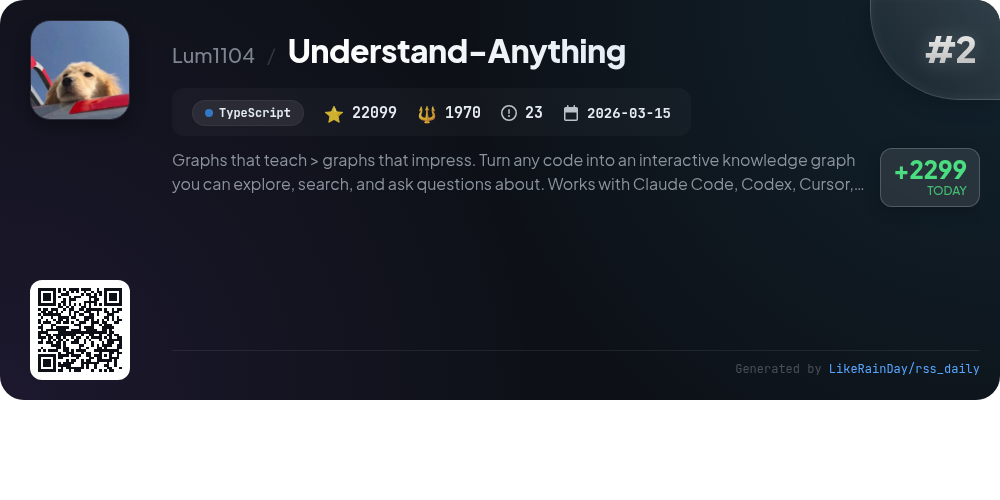
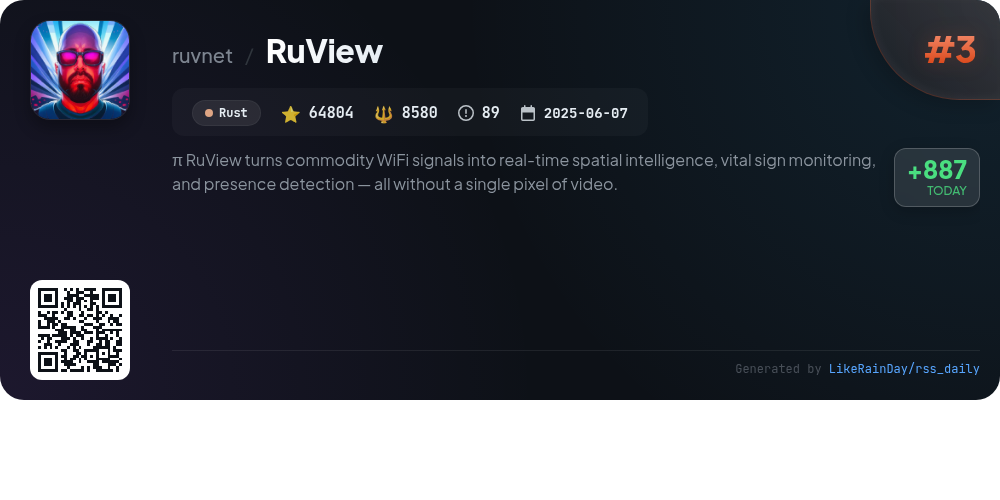
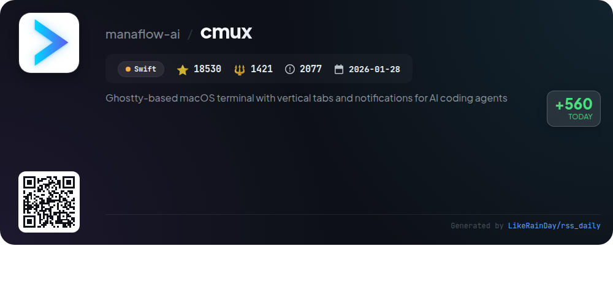
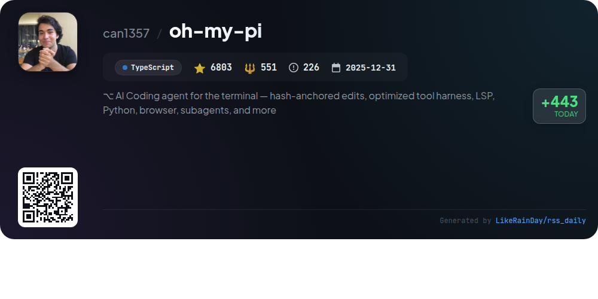
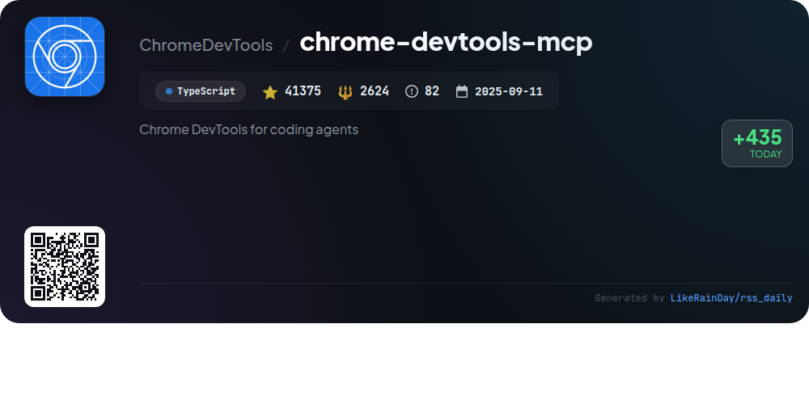
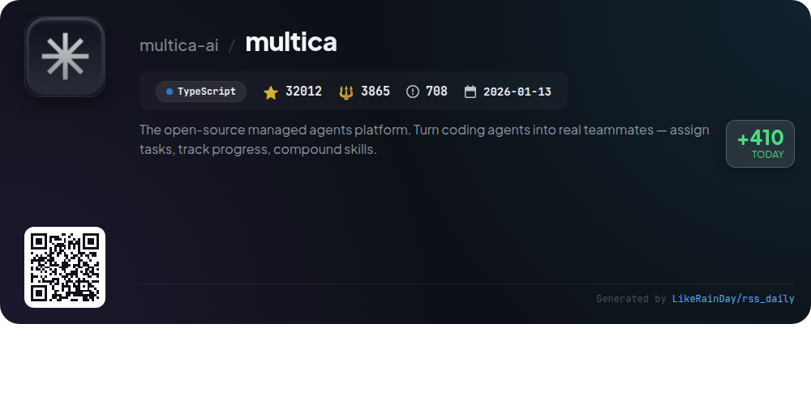
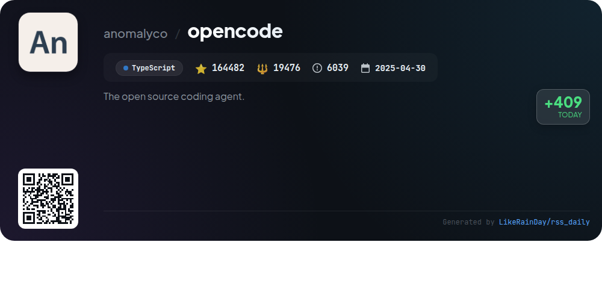
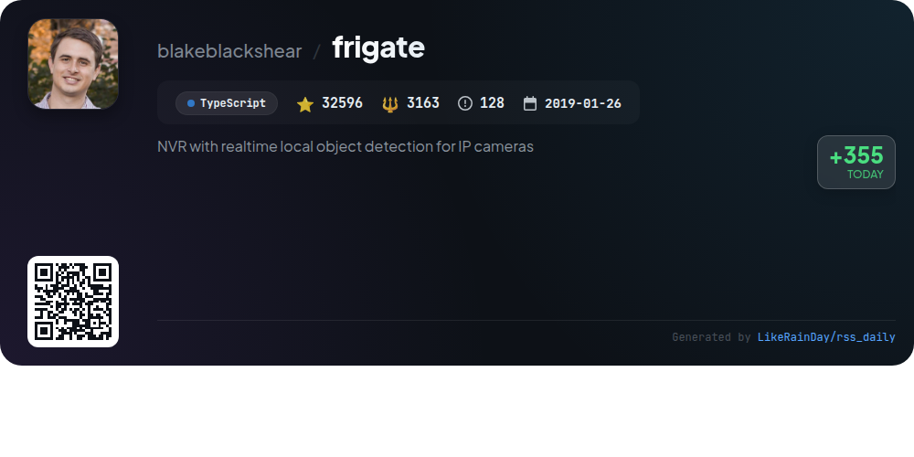
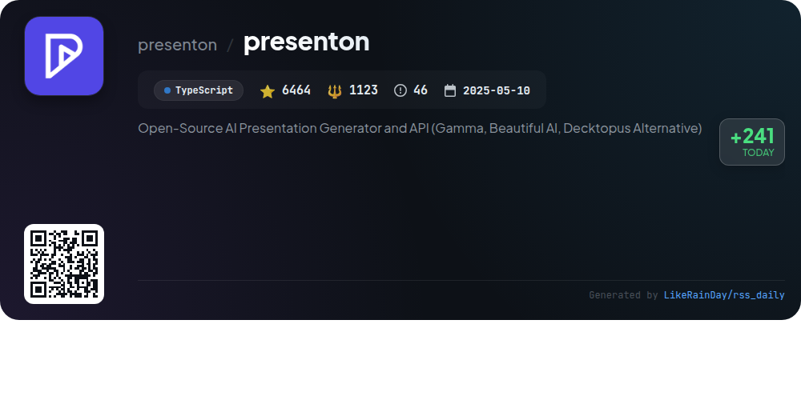

# 📊 🌟 GitHub Trending Daily - 2026-05-24

> > 📅 Daily Picks of GitHub Trending Repositories | Powered by Smart Algorithms

## 📋 Overview

**10** Projects | **409094** ⭐ | **43881** 🍴

**Top Languages:** `TypeScript` (8) · `Swift` (1) · `Rust` (1)

**Updated:** 2026-05-24 04:13 UTC

**Categories:**

- 🌟 Daily Top 10 (10 items)

---

## 🌟 Daily Top 10

### 1. [codegraph](https://github.com/colbymchenry/codegraph)

> 🤖 **Why Recommend**  
> *CodeGraph is a pre-indexed code knowledge graph designed to enhance AI coding agents like Claude Code, Codex, Cursor, OpenCode, and Hermes Agent. It reduces costs by approximately 35%, decreases token usage by 70%, and minimizes tool calls by 59%, all while operating 100% locally. Key features include smart context building, full-text search, impact analysis, and support for over 19 programming languages. CodeGraph ensures real-time updates via native file system events and offers seamless integration with existing development environments, requiring no additional configuration.*

- ⭐ 19929 stars
- 💻 TypeScript
- 📅 Updated: 2026-05-24

### 2. [Understand-Anything](https://github.com/Lum1104/Understand-Anything)

> 🤖 **Why Recommend**  
> *Understand-Anything is a powerful tool that transforms any codebase into an interactive knowledge graph, allowing users to explore, search, and ask questions. Compatible with platforms like Claude Code, Codex, Copilot, and Gemini CLI, it offers features such as guided tours, fuzzy search, impact analysis, and domain visualization. Users can analyze their codebase, view architectural layers, and adapt the UI to different personas. The multi-agent pipeline ensures efficient analysis, making it ideal for onboarding and understanding complex systems.*

- ⭐ 22099 stars
- 💻 TypeScript
- 📅 Updated: 2026-05-24

### 3. [RuView](https://github.com/ruvnet/RuView)

> 🤖 **Why Recommend**  
> *RuView transforms commodity WiFi signals into real-time spatial intelligence, enabling vital sign monitoring and presence detection without cameras or wearables. Key features include contactless detection of breathing, heart rate, and movement, as well as occupancy and environmental mapping. It operates on low-cost ESP32 sensors, utilizes multi-frequency mesh networking, and integrates seamlessly with platforms like Home Assistant and Matter. RuView's edge modules support a variety of applications across healthcare, retail, and smart homes, ensuring privacy while delivering actionable insights.*

- ⭐ 64804 stars
- 💻 Rust
- 📅 Updated: 2026-05-24

### 4. [cmux](https://github.com/manaflow-ai/cmux)

> 🤖 **Why Recommend**  
> *cmux is a Ghostty-based macOS terminal designed for AI coding agents, featuring vertical tabs and customizable notifications. Key highlights include notification rings for urgent tasks, an in-app browser for seamless integration with coding environments, and SSH support for remote workspaces. Users can define custom commands, utilize a scriptable API, and benefit from GPU-accelerated performance. Built natively with Swift, cmux offers fast startup and low memory usage. It provides a flexible workspace, enabling developers to create tailored workflows for efficient coding.*

- ⭐ 18530 stars
- 💻 Swift
- 📅 Updated: 2026-05-24

### 5. [oh-my-pi](https://github.com/can1357/oh-my-pi)

> 🤖 **Why Recommend**  
> *oh-my-pi is an advanced AI coding agent for terminal environments, seamlessly integrating coding tools and language server protocols (LSP) to enhance developer productivity. Key features include real-time code execution, debugging support, and subagent task distribution. The system supports over 40 providers and 32 built-in tools, allowing efficient file handling, web searches, and code reviews. Its unique hashline editing ensures precise modifications, while a memory feature retains context across sessions. Built on TypeScript, oh-my-pi is designed for versatile use across macOS, Linux, and Windows platforms.*

- ⭐ 6803 stars
- 💻 TypeScript
- 📅 Updated: 2026-05-24

### 6. [chrome-devtools-mcp](https://github.com/ChromeDevTools/chrome-devtools-mcp)

> 🤖 **Why Recommend**  
> *chrome-devtools-mcp is a powerful TypeScript-based tool that enables coding agents like Antigravity and Copilot to control and inspect a live Chrome browser using Chrome DevTools. With 41,375 stars on GitHub, it offers advanced features such as performance insights, network request analysis, and reliable automation through Puppeteer. Users can analyze network requests, capture screenshots, and access debugging tools. The project also supports CLI usage, customization, and integration with various MCP clients, ensuring versatile automation and debugging capabilities for web developers.*

- ⭐ 41375 stars
- 💻 TypeScript
- 📅 Updated: 2026-05-24

### 7. [multica](https://github.com/multica-ai/multica)

> 🤖 **Why Recommend**  
> *The open-source managed agents platform. Turn coding agents into real teammates — assign tasks, track progress, compound skills.. popular project, actively maintained, recently updated*

- ⭐ 32012 stars
- 🍴 3865 forks
- 💻 TypeScript
- 📅 Updated: 2026-05-24

### 8. [opencode](https://github.com/anomalyco/opencode)

> 🤖 **Why Recommend**  
> *OpenCode is an open-source AI coding agent designed to streamline development processes. With over 164,000 stars on GitHub, it features two built-in agents: the full-access "build" agent for development and the read-only "plan" agent for code exploration. OpenCode supports multiple platforms, offering a desktop application and installation via various package managers. Comprehensive documentation and a vibrant community on Discord enhance user experience. Key functionalities include code analysis, exploration, and custom installation options, making it a versatile tool for developers.*

- ⭐ 164482 stars
- 💻 TypeScript
- 📅 Updated: 2026-05-24

### 9. [frigate](https://github.com/blakeblackshear/frigate)

> 🤖 **Why Recommend**  
> *Frigate is a powerful NVR solution designed for real-time local object detection from IP cameras, integrating seamlessly with Home Assistant. Leveraging OpenCV and TensorFlow, it offers efficient object detection with minimal resource use by focusing on specific areas and times. Key features include multiprocessing for high FPS, MQTT communication for easy integration, 24/7 video recording based on detected objects, and low-latency streaming via WebRTC. Frigate also supports a built-in mask and zone editor, ensuring optimal performance and usability for security monitoring.*

- ⭐ 32596 stars
- 💻 TypeScript
- 📅 Updated: 2026-05-24

### 10. [presenton](https://github.com/presenton/presenton)

> 🤖 **Why Recommend**  
> *Presenton is an open-source AI presentation generator and API, offering a self-hosted alternative to platforms like Gamma and Beautiful AI. Key features include full control over models and data, customizable templates, and support for multiple AI providers such as OpenAI and Google. Users can generate presentations from prompts, export them as PPTX or PDF, and leverage a built-in API for seamless integration. With desktop and Docker deployment options, Presenton ensures data privacy and flexibility, making it ideal for diverse presentation needs.*

- ⭐ 6464 stars
- 💻 TypeScript
- 📅 Updated: 2026-05-24

---

## 📡 RSS Subscription

Subscribe via RSS to get daily trending updates:

- 🔔 [RSS XML] (../../daily-top.xml)
- 🔔 [Daily Report] (../../GITHUB_TODAY.md)
- 🔔 [Daily Top 10](../../daily-top.xml)

---

*⚡ Powered by Smart Trending Algorithm | Generated at 2026-05-24 04:13:39 UTC
