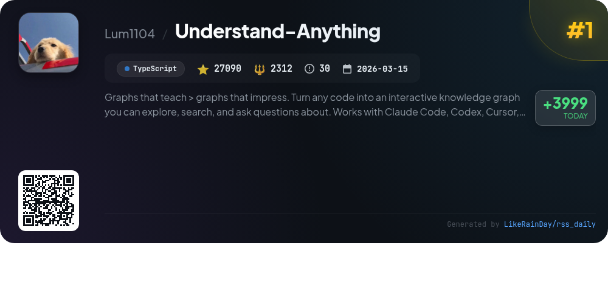
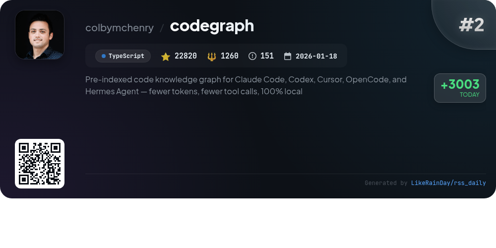
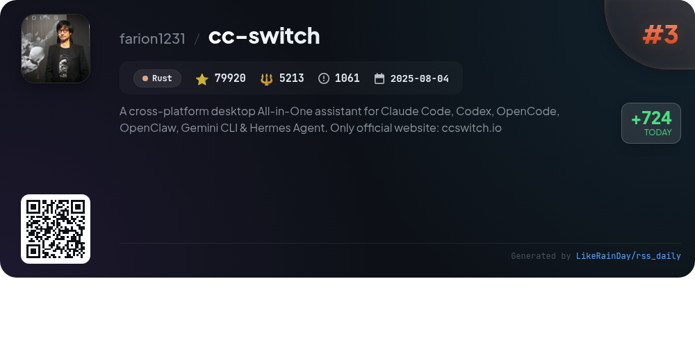
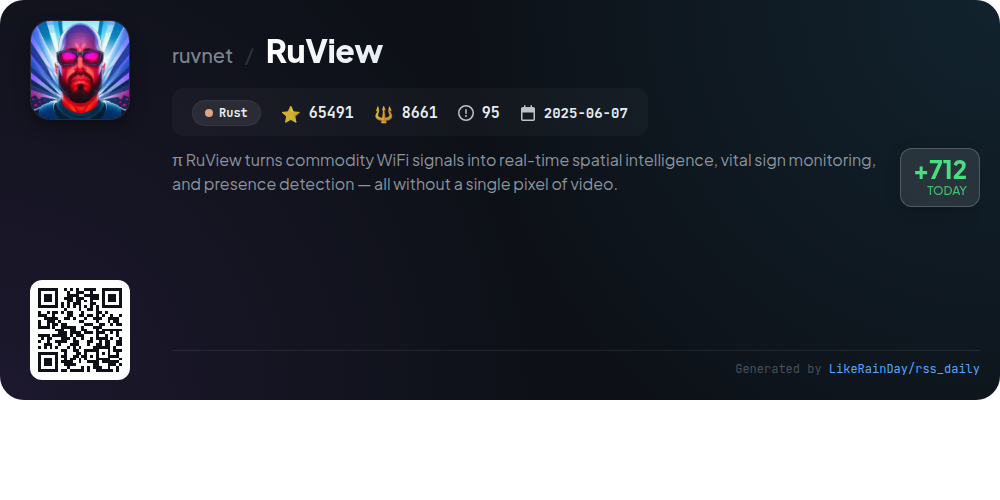
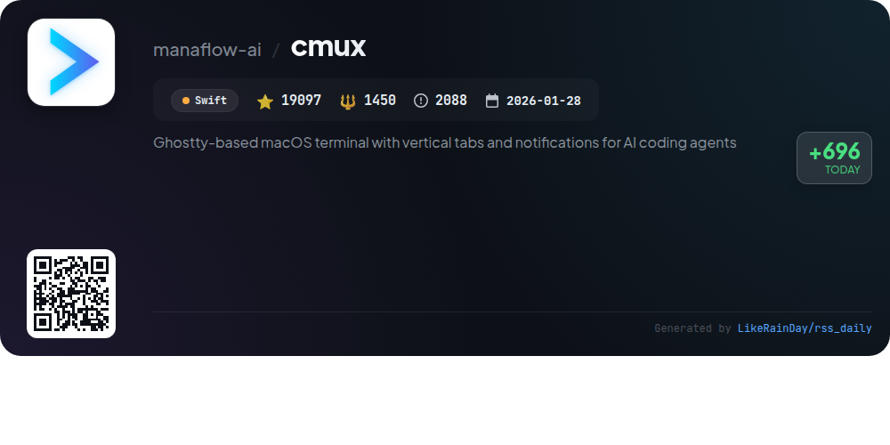
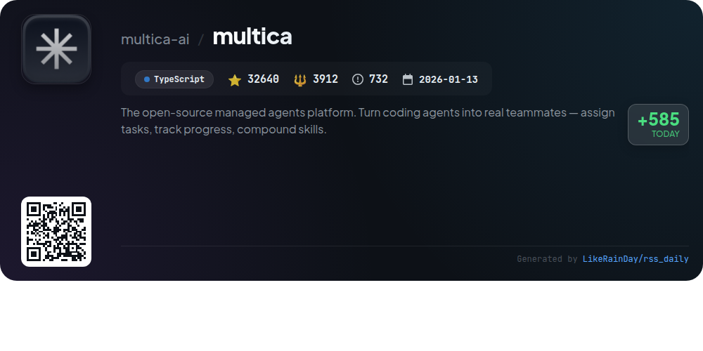
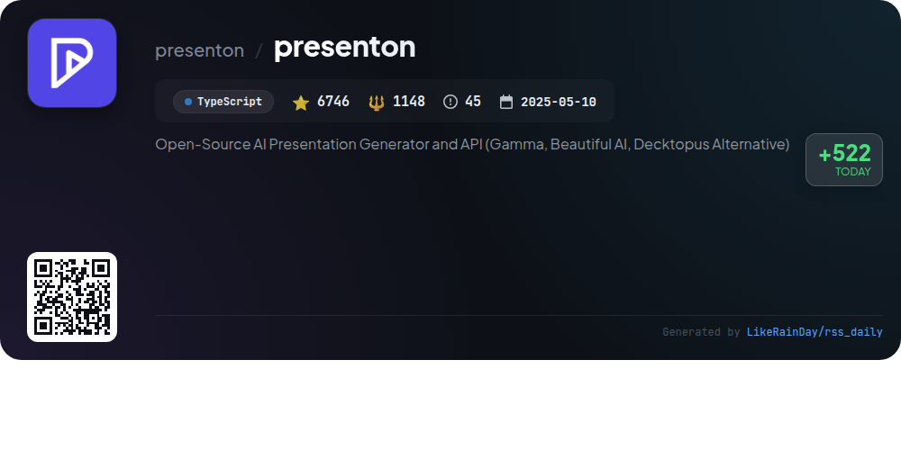
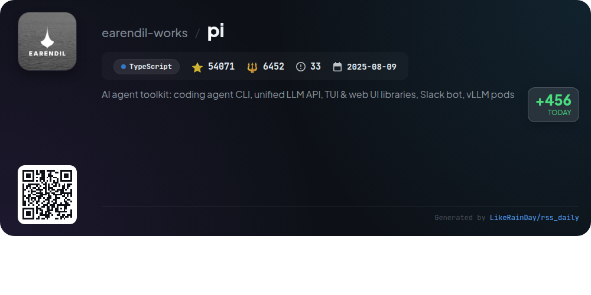
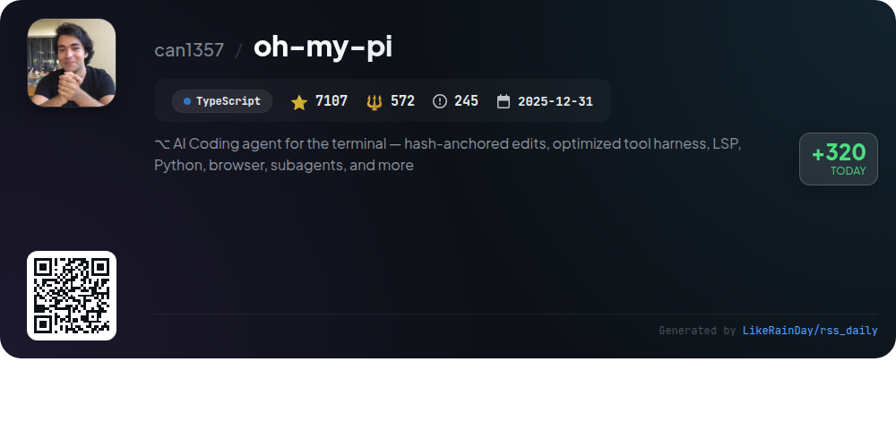
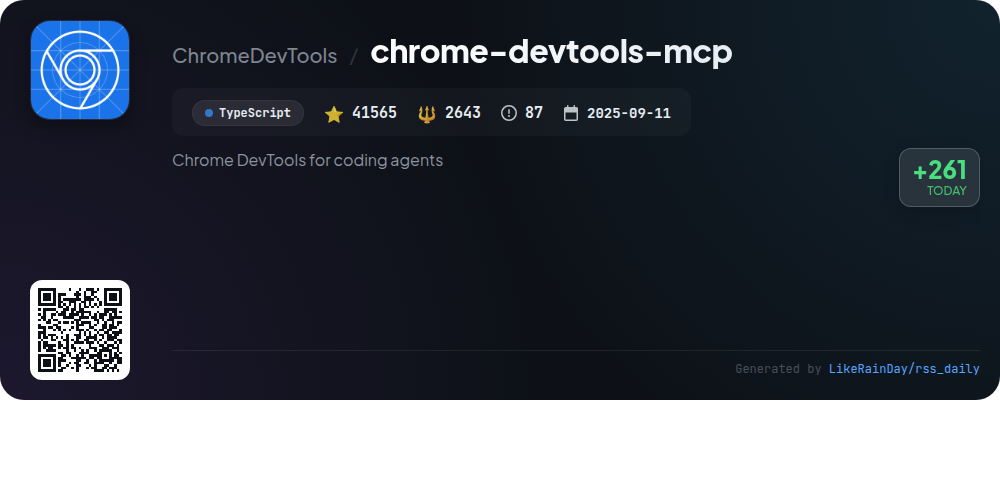

# 📊 🌟 GitHub Trending Daily - 2026-05-25

> > 📅 每日精选 GitHub 热门仓库 | 基于智能算法推荐

## 📋 Overview

**10** 个项目 | **356547** ⭐ | **33623** 🍴

**热门语言:** `TypeScript` (7) · `Rust` (2) · `Swift` (1)

**更新时间:** 2026-05-25 04:25 UTC

**分类分布:**

- 🌟 每日 Top 10 精选 (10 项)

---

## 🌟 每日 Top 10 精选

### 1. [Understand-Anything](https://github.com/Lum1104/Understand-Anything)

> 🤖 **推荐理由**  
> *Understand-Anything transforms codebases into interactive knowledge graphs, allowing users to explore, search, and ask questions about their projects. It supports multiple AI platforms, including Claude Code, Codex, and Copilot. Key features include guided tours for understanding architecture, fuzzy and semantic search, impact analysis for code changes, and adaptive UI based on user roles. The platform enables easy onboarding and collaboration by sharing graphs as JSON. With 27,090 stars, it emphasizes clarity in understanding code structure and business logic.*

- ⭐ 27090 stars
- 💻 TypeScript
- 📅 Updated: 2026-05-25

### 2. [codegraph](https://github.com/colbymchenry/codegraph)

> 🤖 **推荐理由**  
> *CodeGraph is a pre-indexed code knowledge graph designed to enhance AI coding agents like Claude Code, Codex, Cursor, OpenCode, and Hermes Agent. It offers significant efficiency gains, achieving approximately 35% cost reduction, 70% fewer tool calls, and 46% faster responses. Key features include smart context building, full-text search, impact analysis, and support for over 19 programming languages. CodeGraph operates entirely locally, ensuring data privacy, while its auto-sync capability keeps code indexed in real-time. Installation is straightforward and requires no Node.js setup.*

- ⭐ 22820 stars
- 💻 TypeScript
- 📅 Updated: 2026-05-25

### 3. [cc-switch](https://github.com/farion1231/cc-switch)

> 🤖 **推荐理由**  
> *CC Switch is a cross-platform desktop assistant designed for seamless management of AI coding tools such as Claude Code, Codex, Gemini CLI, OpenCode, and OpenClaw. With over 79,920 stars on GitHub, it features a unified interface that eliminates the need for manual configuration edits, offering 50+ built-in provider presets and instant switching capabilities. Key functionalities include unified MCP and Skills management, cloud sync across devices, and a robust usage dashboard. Built with Rust and Tauri, CC Switch is available on Windows, macOS, and Linux.*

- ⭐ 79920 stars
- 💻 Rust
- 📅 Updated: 2026-05-25

### 4. [RuView](https://github.com/ruvnet/RuView)

> 🤖 **推荐理由**  
> *RuView is a groundbreaking WiFi sensing platform that transforms standard WiFi signals into real-time spatial intelligence, enabling vital sign monitoring, presence detection, and activity recognition—without cameras or wearables. Key features include contactless tracking of breathing and heart rates, occupancy counting, and environment mapping using low-cost ESP32 nodes. The system integrates seamlessly with smart home platforms like Home Assistant and Matter. RuView offers over 105 edge modules for diverse applications in healthcare, retail, and security, ensuring privacy and cost-effectiveness while providing accurate, actionable data.*

- ⭐ 65491 stars
- 💻 Rust
- 📅 Updated: 2026-05-25

### 5. [cmux](https://github.com/manaflow-ai/cmux)

> 🤖 **推荐理由**  
> *cmux is a Ghostty-based macOS terminal designed for AI coding agents, featuring vertical tabs, notifications, and an integrated browser. Key highlights include notification rings for urgent tasks, a customizable notification panel, and a scriptable in-app browser. Users can manage SSH workspaces and run Claude Code's teammate mode effortlessly. Built with Swift for performance, cmux offers a native macOS experience, GPU-accelerated rendering, and compatibility with existing Ghostty configurations. It's open source and supports extensive customization through CLI and JSON commands.*

- ⭐ 19097 stars
- 💻 Swift
- 📅 Updated: 2026-05-25

### 6. [multica](https://github.com/multica-ai/multica)

> 🤖 **推荐理由**  
> *The open-source managed agents platform. Turn coding agents into real teammates — assign tasks, track progress, compound skills.. popular project, actively maintained, recently updated*

- ⭐ 32640 stars
- 🍴 3912 forks
- 💻 TypeScript
- 📅 Updated: 2026-05-25

### 7. [presenton](https://github.com/presenton/presenton)

> 🤖 **推荐理由**  
> *Presenton is a powerful open-source AI presentation generator and API, offering a self-hosted alternative to platforms like Gamma and Beautiful AI. Key features include support for multiple AI models (OpenAI, Google, Azure, and more), customizable templates, and the ability to export fully editable PPTX files. Users can create presentations via a user-friendly desktop app or run it through Docker for complete control over their data. The platform ensures no SaaS lock-in, allowing for flexible API integration and rich media support, making it ideal for professionals seeking a customizable presentation solution.*

- ⭐ 6746 stars
- 💻 TypeScript
- 📅 Updated: 2026-05-25

### 8. [pi](https://github.com/earendil-works/pi)

> 🤖 **推荐理由**  
> *Pi is an AI agent toolkit featuring a coding agent CLI, a unified multi-provider LLM API, terminal and web UI libraries, and integration with Slack. Key components include the interactive CLI for coding assistance, a robust agent runtime for tool management, and support for various LLM providers like OpenAI and Google. The project encourages sharing OSS coding sessions to improve agent performance. With over 54,000 stars on GitHub, Pi offers a comprehensive solution for developing and deploying AI-driven coding tools. Visit pi.dev for demos and documentation.*

- ⭐ 54071 stars
- 💻 TypeScript
- 📅 Updated: 2026-05-25

### 9. [oh-my-pi](https://github.com/can1357/oh-my-pi)

> 🤖 **推荐理由**  
> *Oh-My-Pi is an advanced AI coding agent designed for terminal use, featuring over 40 providers and 32 built-in tools for seamless coding. It provides capabilities like LSP integration, real-time debugging, and hash-anchored edits for precise code modifications. Key highlights include persistent Python execution, first-class subagents for parallel tasks, and a powerful web search tool. Its interactive TUI enables intuitive user interactions, while cross-platform support ensures compatibility across macOS, Linux, and Windows. Visit [omp.sh](https://omp.sh) for more information.*

- ⭐ 7107 stars
- 💻 TypeScript
- 📅 Updated: 2026-05-25

### 10. [chrome-devtools-mcp](https://github.com/ChromeDevTools/chrome-devtools-mcp)

> 🤖 **推荐理由**  
> *chrome-devtools-mcp is a TypeScript-based project enabling coding agents like Antigravity and Copilot to control and inspect live Chrome browsers through a Model-Context-Protocol (MCP) server. It offers advanced features for performance insights, browser debugging, and reliable automation using Puppeteer. Key functionalities include network request analysis, screenshot capabilities, and customizable CLI options. Compatible with Google Chrome and Chrome for Testing, it emphasizes security by exposing browser content to clients while providing tools for automation and performance analysis.*

- ⭐ 41565 stars
- 💻 TypeScript
- 📅 Updated: 2026-05-25

---

## 📡 RSS订阅

通过 RSS 订阅，第一时间获取每日精选项目：

- 🔔 [RSS 订阅源] (../../daily-top.xml)
- 🔔 [每日简报] (../../GITHUB_TODAY_CN.md)
- 🔔 [每日 Top 10 精选](../../daily-top.xml)

---

*⚡ Powered by Smart Trending Algorithm | Generated at 2026-05-25 04:25:03 UTC
