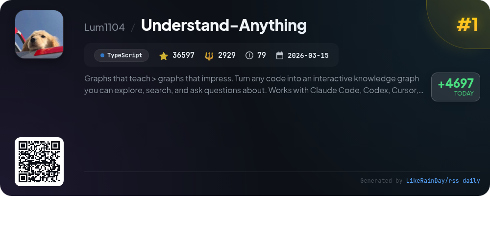
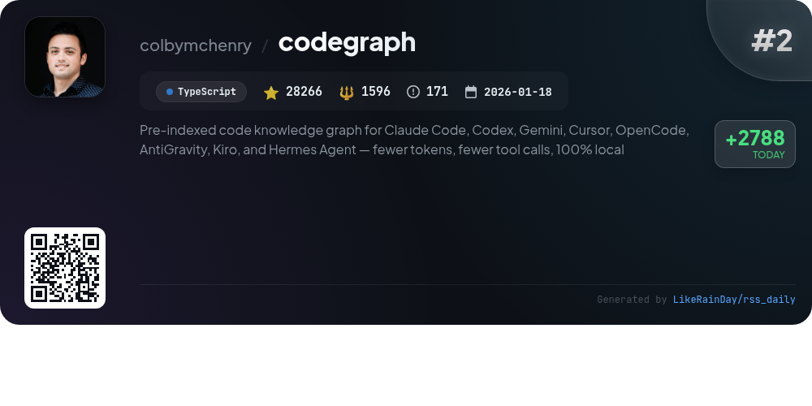
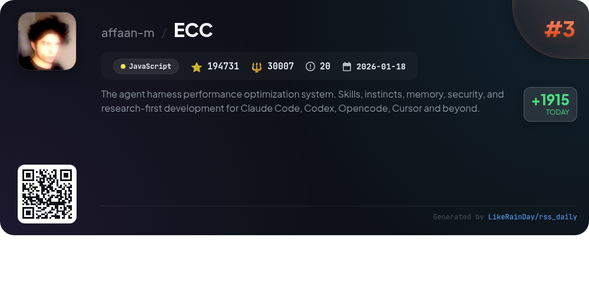
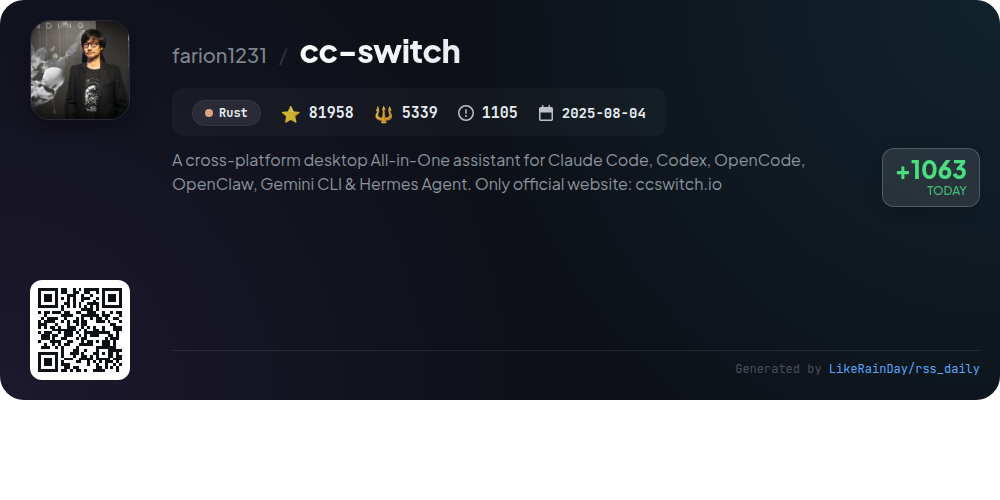
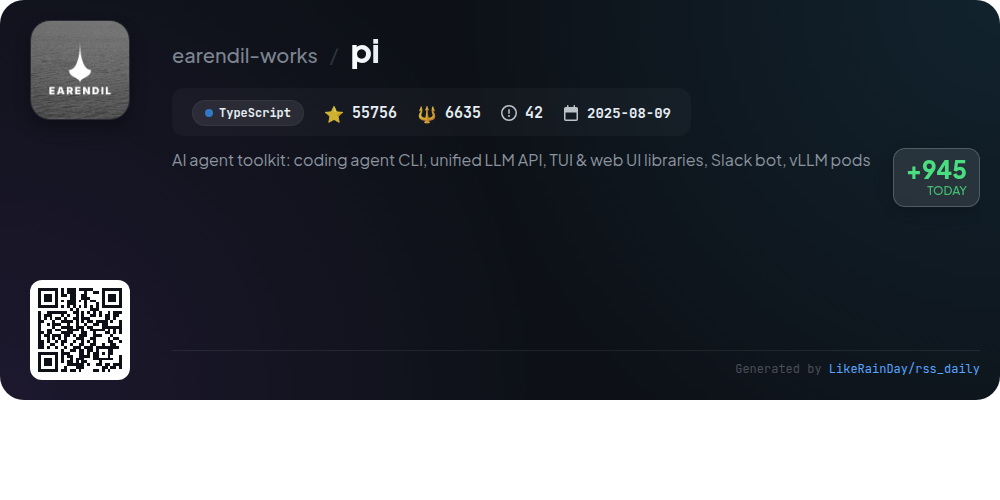
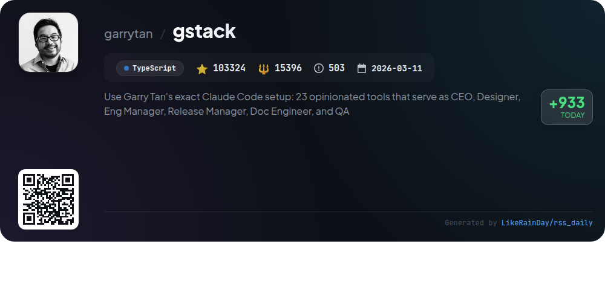
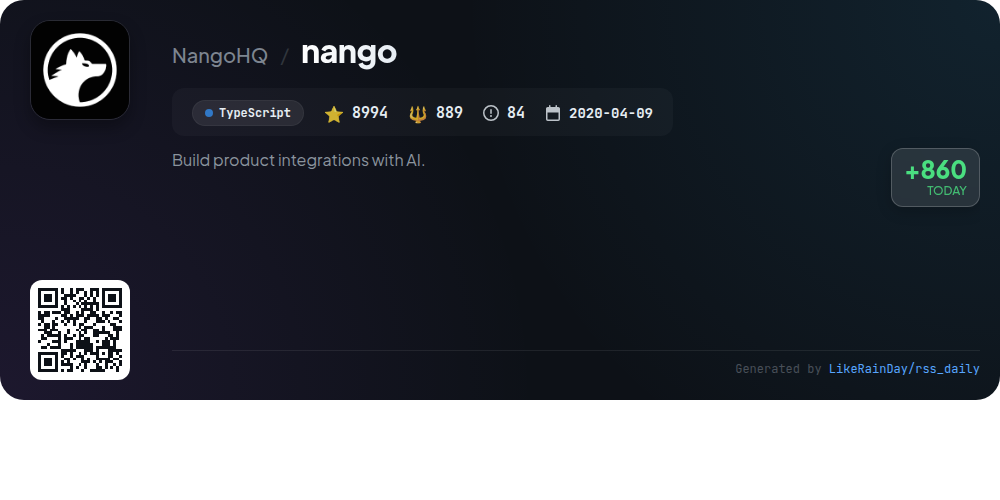
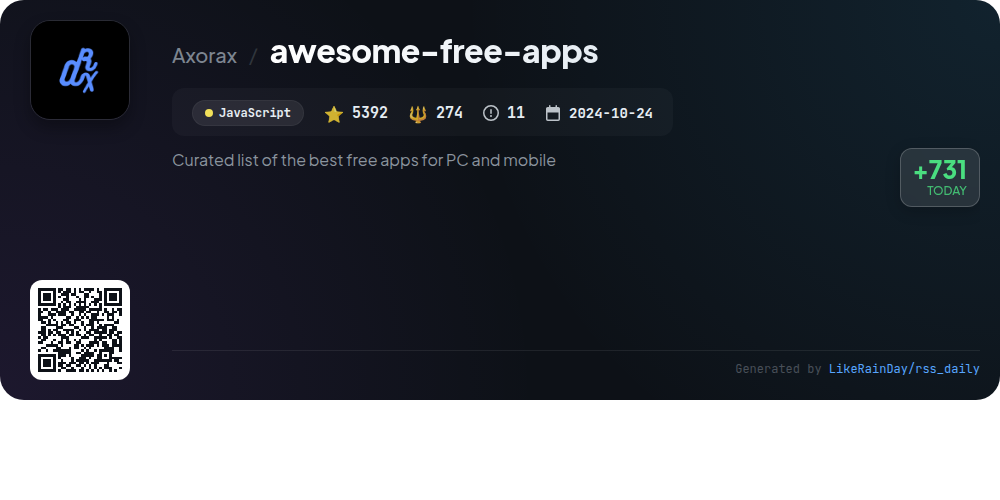
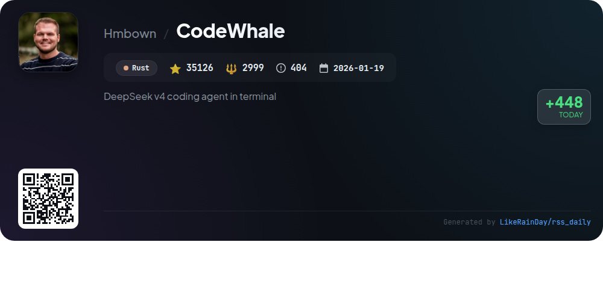
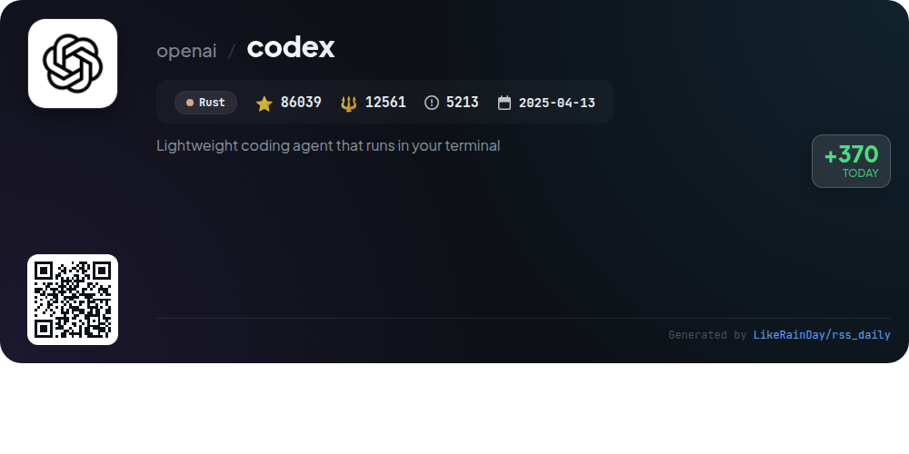

# 📊 🌟 GitHub Trending Daily - 2026-05-27

> > 📅 Daily Picks of GitHub Trending Repositories | Powered by Smart Algorithms

## 📋 Overview

**10** Projects | **636183** ⭐ | **78625** 🍴

**Top Languages:** `TypeScript` (5) · `Rust` (3) · `JavaScript` (2)

**Updated:** 2026-05-27 04:24 UTC

**Categories:**

- 🌟 Daily Top 10 (10 items)

---

## 🌟 Daily Top 10

### 1. [Understand-Anything](https://github.com/Lum1104/Understand-Anything)

> 🤖 **Why Recommend**  
> *Understand-Anything transforms codebases into interactive knowledge graphs, enabling users to explore, search, and ask questions about their projects. It integrates with platforms like Claude Code, Codex, Copilot, and Gemini CLI. Key features include guided tours, fuzzy search, impact analysis, and domain visualization. The tool supports multi-agent analysis to create detailed graphs of files, functions, and dependencies, enhancing understanding of complex systems. With over 36,500 stars, it aims to improve code comprehension and streamline onboarding processes.*

- ⭐ 36597 stars
- 💻 TypeScript
- 📅 Updated: 2026-05-27

### 2. [codegraph](https://github.com/colbymchenry/codegraph)

> 🤖 **Why Recommend**  
> *CodeGraph is a pre-indexed code knowledge graph designed to enhance AI coding agents like Claude Code, Codex, and Cursor. It enables approximately 35% cost savings, 70% fewer tool calls, and 100% local operation without the need for external services. Key features include smart context building, full-text search, impact analysis, and support for over 20 programming languages. Its auto-syncing capability ensures the knowledge graph remains up-to-date as code changes. CodeGraph simplifies code exploration, making it faster and more efficient for developers.*

- ⭐ 28266 stars
- 💻 TypeScript
- 📅 Updated: 2026-05-27

### 3. [ECC](https://github.com/affaan-m/ECC)

> 🤖 **Why Recommend**  
> *ECC is a performance optimization system for AI agents, integrating skills, memory optimization, security scanning, and continuous learning. It supports multiple platforms including Claude Code, Codex, Cursor, and OpenCode. Key features include 61 agents for task delegation, 246 reusable skills, and advanced security auditing via AgentShield. The system is designed for production readiness, facilitating efficient development workflows. With a user-friendly dashboard and extensive documentation, ECC empowers developers to optimize AI interactions effectively.*

- ⭐ 194731 stars
- 💻 JavaScript
- 📅 Updated: 2026-05-27

### 4. [cc-switch](https://github.com/farion1231/cc-switch)

> 🤖 **Why Recommend**  
> *CC Switch is a cross-platform desktop assistant for managing multiple AI CLI tools, including Claude Code, Codex, Gemini CLI, OpenCode, and OpenClaw. Key features include unified management with over 50 built-in provider presets, one-click switching, and a visual interface for easy configuration. Users benefit from cloud sync, session management, and detailed usage tracking. Built with Rust and Tauri, it ensures performance and reliability across Windows, macOS, and Linux. The project has garnered significant attention with over 81,000 stars on GitHub. Visit ccswitch.io for more details.*

- ⭐ 81958 stars
- 💻 Rust
- 📅 Updated: 2026-05-27

### 5. [pi](https://github.com/earendil-works/pi)

> 🤖 **Why Recommend**  
> *Pi is an AI agent toolkit featuring an interactive coding agent CLI, a unified multi-provider LLM API, and tools for both terminal and web UI development. With packages like `pi-coding-agent`, `pi-agent-core`, and `pi-ai`, it offers robust runtime capabilities, tool management, and integration with leading AI providers like OpenAI and Google. Key highlights include Slack bot integration, community sharing of coding sessions for real-world learning, and a strong focus on supply-chain security. Visit pi.dev for demos and documentation.*

- ⭐ 55756 stars
- 💻 TypeScript
- 📅 Updated: 2026-05-27

### 6. [gstack](https://github.com/garrytan/gstack)

> 🤖 **Why Recommend**  
> *gstack is an open-source software factory that empowers founders and technical leaders to ship products efficiently using AI-driven tools. With 23 specialized skills, it functions like a virtual team, covering roles such as CEO, Designer, and QA. Key features include structured planning, automated code reviews, real-time QA, and seamless deployment processes. gstack leverages Claude Code to enhance productivity, allowing users to manage multiple sprints simultaneously. Its integration with AI agents simplifies complex workflows, making it an invaluable resource for startups and developers.*

- ⭐ 103324 stars
- 💻 TypeScript
- 📅 Updated: 2026-05-27

### 7. [nango](https://github.com/NangoHQ/nango)

> 🤖 **Why Recommend**  
> *Build product integrations with AI.. popular project, actively maintained, recently updated*

- ⭐ 8994 stars
- 🍴 889 forks
- 💻 TypeScript
- 📅 Updated: 2026-05-27

### 8. [awesome-free-apps](https://github.com/Axorax/awesome-free-apps)

> 🤖 **Why Recommend**  
> *awesome-free-apps is a curated collection of the best free applications for PC and mobile, boasting over 5,392 stars on GitHub. The project categorizes software into various sections, including audio, communication, developer tools, graphics, and more, allowing users to filter by platform (Windows, macOS, Linux, Android, iOS) and features (open-source, recommended). Key highlights include robust tools for productivity, media management, and security, alongside a strong focus on user contributions and community support.*

- ⭐ 5392 stars
- 💻 JavaScript
- 📅 Updated: 2026-05-27

### 9. [CodeWhale](https://github.com/Hmbown/CodeWhale)

> 🤖 **Why Recommend**  
> *CodeWhale is a powerful terminal coding agent for DeepSeek V4, designed to enhance coding workflows. It features a dual binary setup with `codewhale` for command dispatch and `codewhale-tui` for interactive sessions. Key highlights include auto mode for dynamic model selection, a structured authority system to manage conflicting information, and support for concurrent sub-agents for multitasking. With real-time diagnostics, version control snapshots, and customizable configurations, CodeWhale streamlines coding and debugging, making it an essential tool for developers.*

- ⭐ 35126 stars
- 💻 Rust
- 📅 Updated: 2026-05-27

### 10. [codex](https://github.com/openai/codex)

> 🤖 **Why Recommend**  
> *Codex is a lightweight coding agent from OpenAI that operates directly in your terminal. With over 86,000 stars on GitHub, it offers a seamless coding experience for developers. Users can install Codex CLI easily on Mac, Linux, or Windows via scripts or package managers. Codex supports integration with popular IDEs like VS Code and provides a desktop app experience. Signing in with a ChatGPT account enhances functionality, while API key access is available for additional setup. Comprehensive documentation and open-source contributions are encouraged.*

- ⭐ 86039 stars
- 💻 Rust
- 📅 Updated: 2026-05-27

---

## 📡 RSS Subscription

Subscribe via RSS to get daily trending updates:

- 🔔 [RSS XML] (../../daily-top.xml)
- 🔔 [Daily Report] (../../GITHUB_TODAY.md)
- 🔔 [Daily Top 10](../../daily-top.xml)

---

*⚡ Powered by Smart Trending Algorithm | Generated at 2026-05-27 04:24:05 UTC
