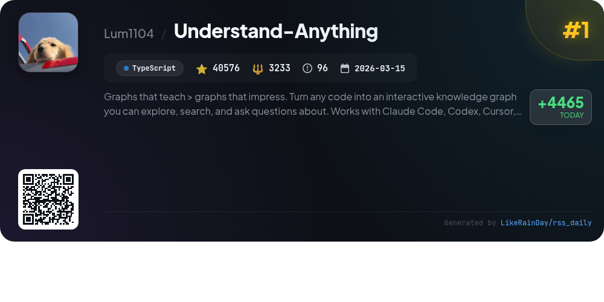
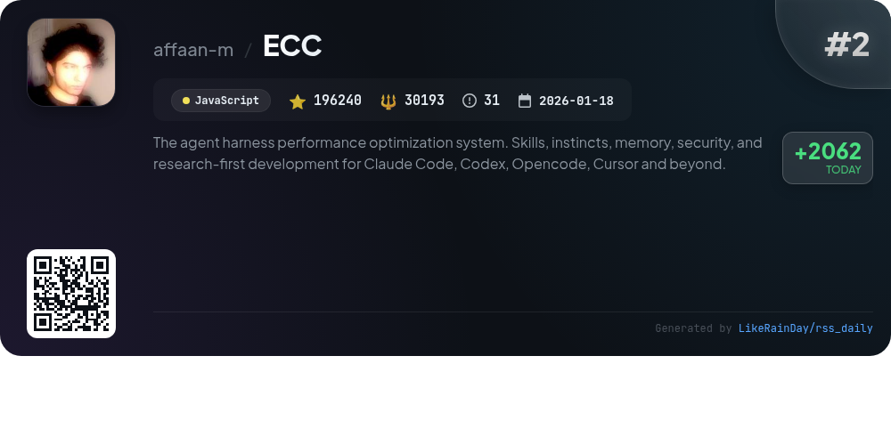
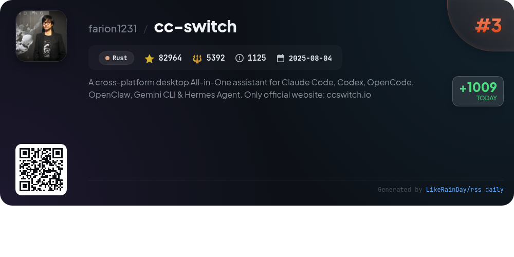
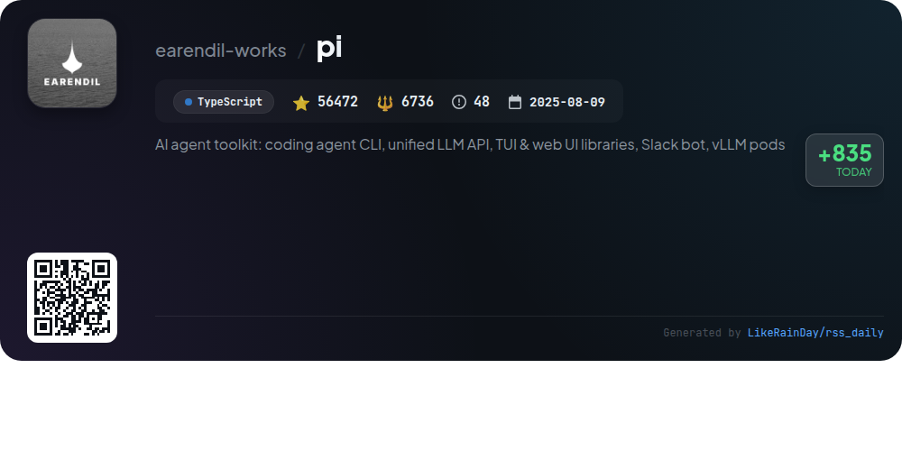
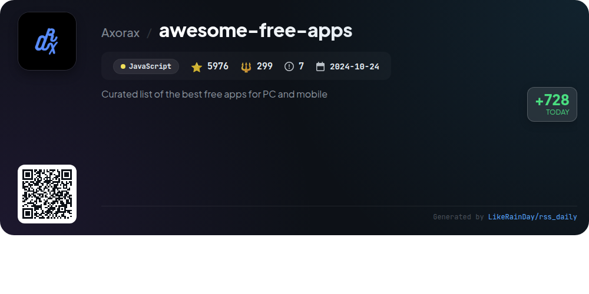
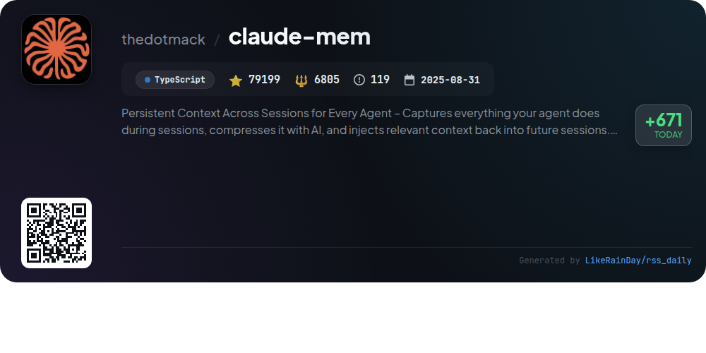
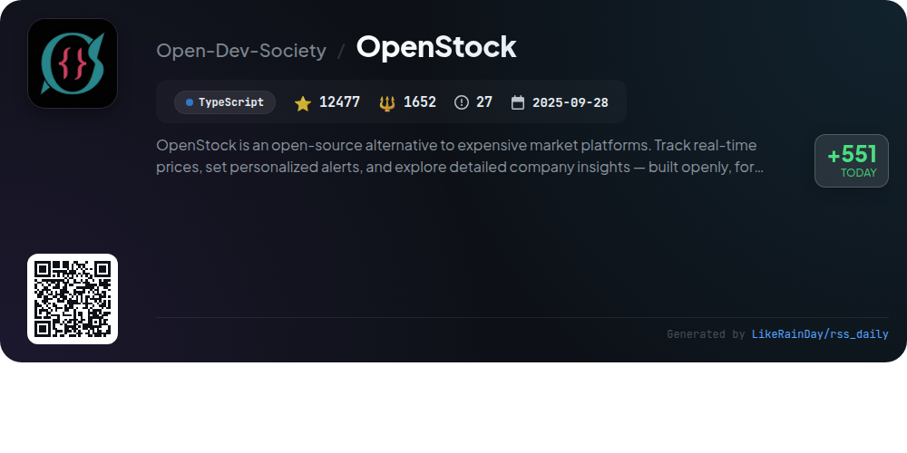
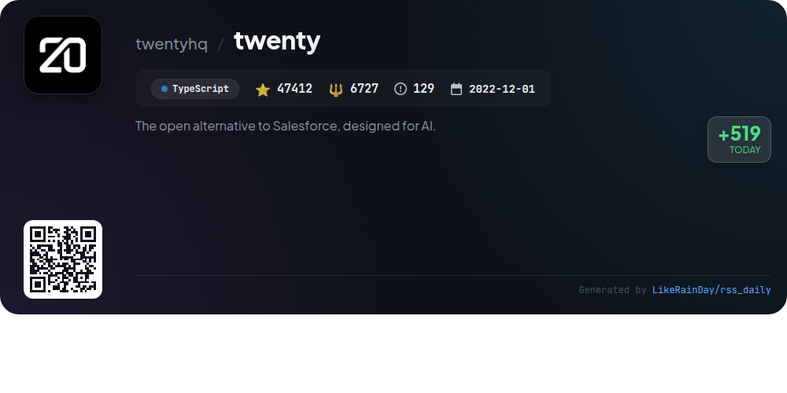
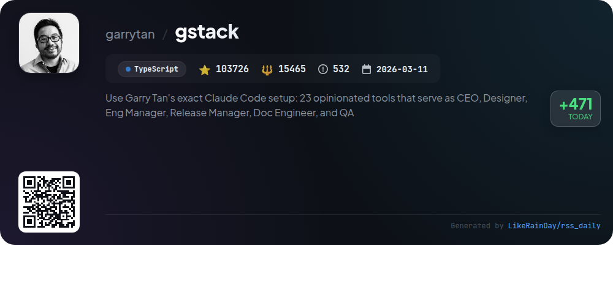

# 📊 🌟 GitHub Trending Daily - 2026-05-28

> > 📅 每日精选 GitHub 热门仓库 | 基于智能算法推荐

## 📋 Overview

**10** 个项目 | **634308** ⭐ | **77423** 🍴

**热门语言:** `TypeScript` (7) · `JavaScript` (2) · `Rust` (1)

**更新时间:** 2026-05-28 04:14 UTC

**分类分布:**

- 🌟 每日 Top 10 精选 (10 项)

---

## 🌟 每日 Top 10 精选

### 1. [Understand-Anything](https://github.com/Lum1104/Understand-Anything)

> 🤖 **推荐理由**  
> *Understand-Anything transforms codebases into interactive knowledge graphs, enabling users to explore, search, and ask questions about their code. Key features include guided tours, fuzzy and semantic search, impact analysis, and adaptive UI for various user roles. The project supports multiple AI coding platforms, such as Claude Code, Codex, and Copilot, and offers a live demo for hands-on experience. With over 40,000 stars, it emphasizes understanding through visual representation, fostering better onboarding and collaboration.*

- ⭐ 40576 stars
- 💻 TypeScript
- 📅 Updated: 2026-05-28

### 2. [ECC](https://github.com/affaan-m/ECC)

> 🤖 **推荐理由**  
> *ECC is a powerful performance optimization system designed for AI agents like Claude Code, Codex, and Cursor, featuring over 61 agents and 246 skills. It emphasizes skills, instincts, memory optimization, continuous learning, and security scanning. Key highlights include a comprehensive dashboard, multi-agent orchestration, and support for various programming languages. ECC is backed by a robust community, offers extensive documentation, and integrates seamlessly with GitHub and other tools. With a focus on research-first development, it streamlines workflows and enhances productivity in AI-driven tasks.*

- ⭐ 196240 stars
- 💻 JavaScript
- 📅 Updated: 2026-05-28

### 3. [cc-switch](https://github.com/farion1231/cc-switch)

> 🤖 **推荐理由**  
> *CC Switch is a cross-platform desktop assistant designed to manage multiple AI CLI tools, including Claude Code, Codex, Gemini CLI, OpenCode, and OpenClaw, from a single interface. Key features include over 50 provider presets for easy configuration, unified management of MCP and Skills across apps, and a quick-switch system tray access. It supports cloud sync, local proxy for failover, and usage tracking. Built with Rust and Tauri, CC Switch is available for Windows, macOS, and Linux, streamlining AI-powered coding workflows. Visit ccswitch.io for more details.*

- ⭐ 82964 stars
- 💻 Rust
- 📅 Updated: 2026-05-28

### 4. [pi](https://github.com/earendil-works/pi)

> 🤖 **推荐理由**  
> *Pi is an AI agent toolkit featuring an interactive coding agent CLI, a unified multi-provider LLM API, and robust TUI and web UI libraries. With over 56,000 stars, it serves as a comprehensive platform for building and managing AI agents. Key components include the coding agent for CLI interactions, an agent runtime for state management, and Slack automation capabilities. The project encourages sharing open-source coding sessions to enhance AI performance. Visit pi.dev for demos and documentation to explore its full potential.*

- ⭐ 56472 stars
- 💻 TypeScript
- 📅 Updated: 2026-05-28

### 5. [awesome-free-apps](https://github.com/Axorax/awesome-free-apps)

> 🤖 **推荐理由**  
> *"awesome-free-apps" is a curated repository featuring an extensive collection of the best free applications for PC and mobile platforms. With over 5,900 stars, it categorizes apps into various sections including audio, communication, graphics, and security tools, among others. Users can filter apps by operating system (Windows, macOS, Linux) and criteria like open-source or recommended options. The project emphasizes community contributions and offers a mobile version, making it a valuable resource for discovering high-quality software across diverse needs.*

- ⭐ 5976 stars
- 💻 JavaScript
- 📅 Updated: 2026-05-28

### 6. [claude-mem](https://github.com/thedotmack/claude-mem)

> 🤖 **推荐理由**  
> *Claude-Mem is a persistent memory system designed for AI agents like Claude Code, enabling seamless context retention across sessions. Key features include automatic observation capture, semantic summary generation, and skill-based search capabilities. It offers a web viewer for real-time memory access and supports various integrations, including OpenClaw and Gemini CLI. With privacy controls and a user-friendly setup, Claude-Mem enhances project continuity, allowing agents to leverage past interactions effectively. This TypeScript-based project has gained significant popularity with over 79,000 stars on GitHub.*

- ⭐ 79199 stars
- 💻 TypeScript
- 📅 Updated: 2026-05-28

### 7. [OpenStock](https://github.com/Open-Dev-Society/OpenStock)

> 🤖 **推荐理由**  
> *OpenStock is an open-source stock market platform designed as a free alternative to costly services. Key features include real-time price tracking, personalized alerts, and detailed company insights. Built using Next.js, TypeScript, and MongoDB, it offers user authentication, a customizable watchlist, and integrated market data via Finnhub and TradingView. OpenStock emphasizes accessibility and community engagement, ensuring that knowledge and tools are available to everyone. It is forever free and licensed under AGPL-3.0, promoting transparency and collaboration.*

- ⭐ 12477 stars
- 💻 TypeScript
- 📅 Updated: 2026-05-28

### 8. [twenty](https://github.com/twentyhq/twenty)

> 🤖 **推荐理由**  
> *Twenty is an open-source CRM designed for AI, offering a customizable solution that adapts to complex business needs. Key features include the ability to define objects, fields, and views as code, facilitating rapid app development. Users can quickly set up a workspace via the cloud or self-host using Docker. With a robust stack including TypeScript, NestJS, and PostgreSQL, Twenty provides essential CRM tools and AI-driven agents. Join the community for ongoing development and support through resources like documentation, Discord, and a comprehensive user guide.*

- ⭐ 47412 stars
- 💻 TypeScript
- 📅 Updated: 2026-05-28

### 9. [gstack](https://github.com/garrytan/gstack)

> 🤖 **推荐理由**  
> *gstack is an open-source software factory designed to enhance productivity for founders, CEOs, and engineers by utilizing AI-driven tools. It offers 23 specialized roles, including CEO, Designer, and QA Lead, enabling users to seamlessly manage the entire product development lifecycle: from planning to shipping. Key features include automated reviews, real-time QA testing, and a visual design process. With quick setup and integration with multiple AI agents, gstack empowers users to ship products at unprecedented speeds, transforming individual efforts into a coordinated team-like workflow.*

- ⭐ 103726 stars
- 💻 TypeScript
- 📅 Updated: 2026-05-28

### 10. [nango](https://github.com/NangoHQ/nango)

> 🤖 **推荐理由**  
> *Build product integrations with AI.. popular project, actively maintained, recently updated*

- ⭐ 9266 stars
- 🍴 921 forks
- 💻 TypeScript
- 📅 Updated: 2026-05-28

---

## 📡 RSS订阅

通过 RSS 订阅，第一时间获取每日精选项目：

- 🔔 [RSS 订阅源] (../../daily-top.xml)
- 🔔 [每日简报] (../../GITHUB_TODAY_CN.md)
- 🔔 [每日 Top 10 精选](../../daily-top.xml)

---

*⚡ Powered by Smart Trending Algorithm | Generated at 2026-05-28 04:14:24 UTC
