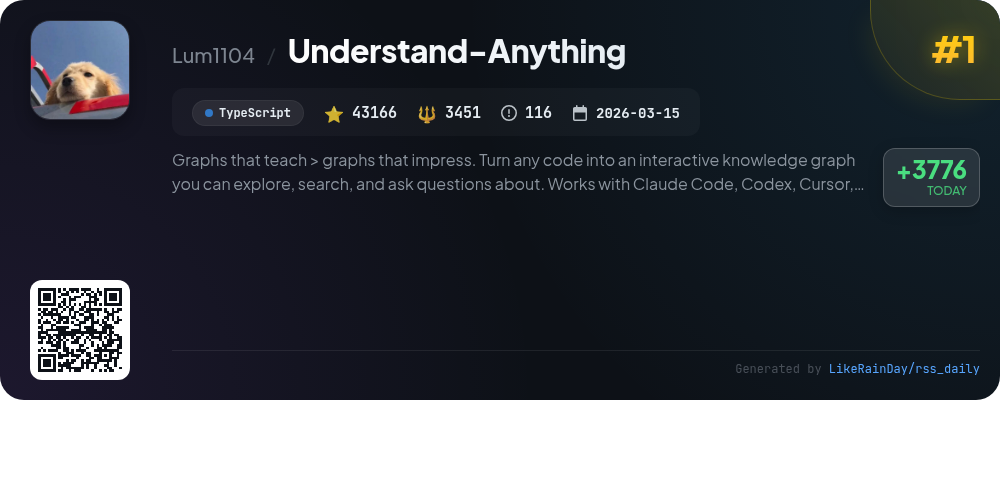
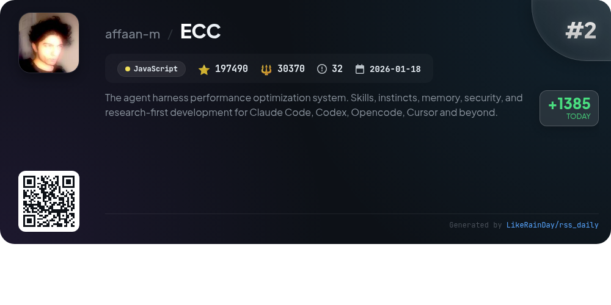
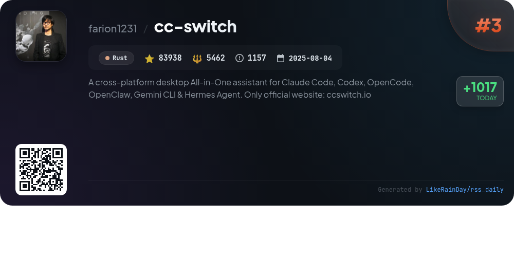
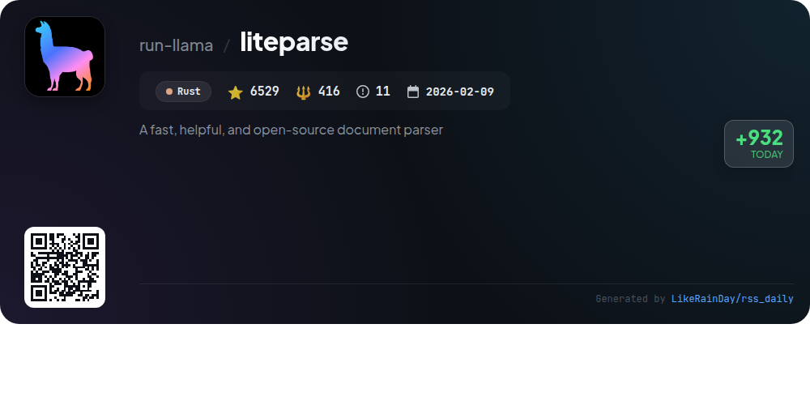
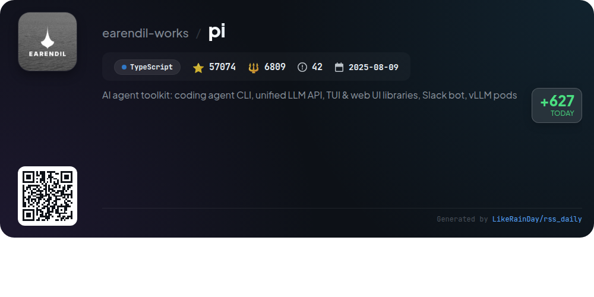
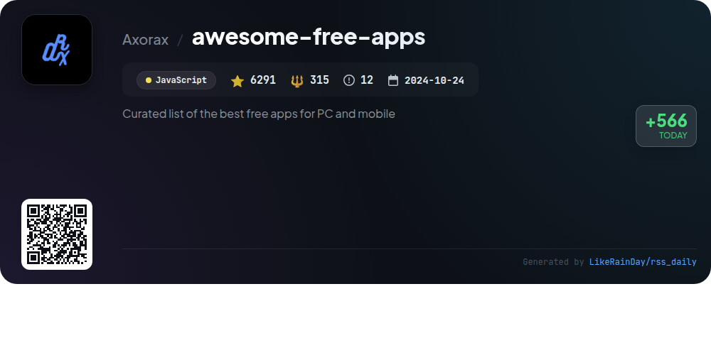
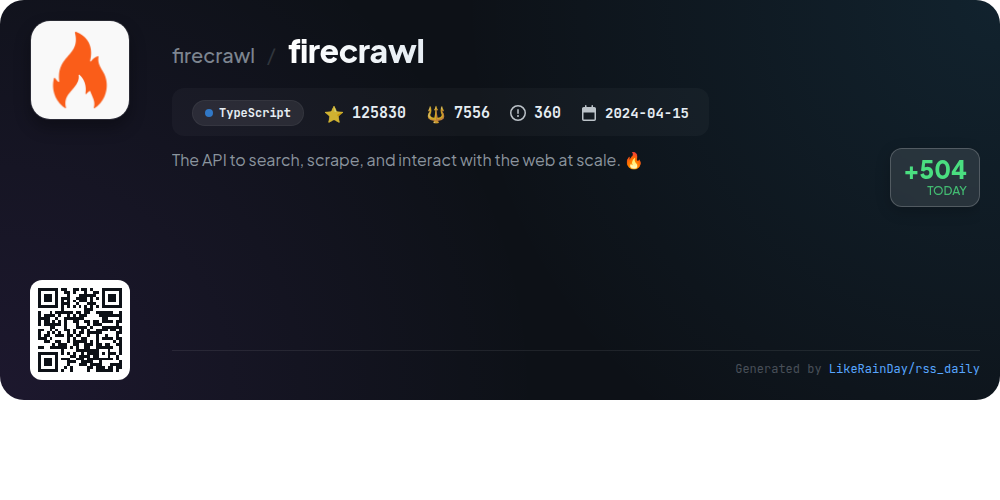
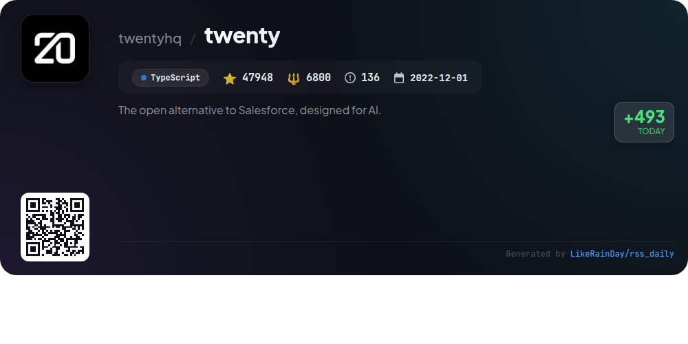
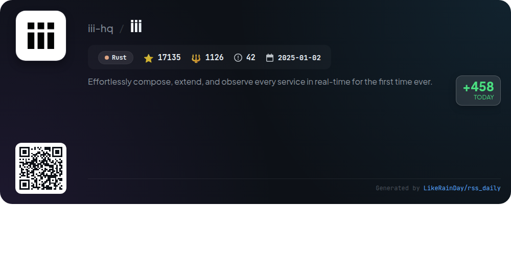
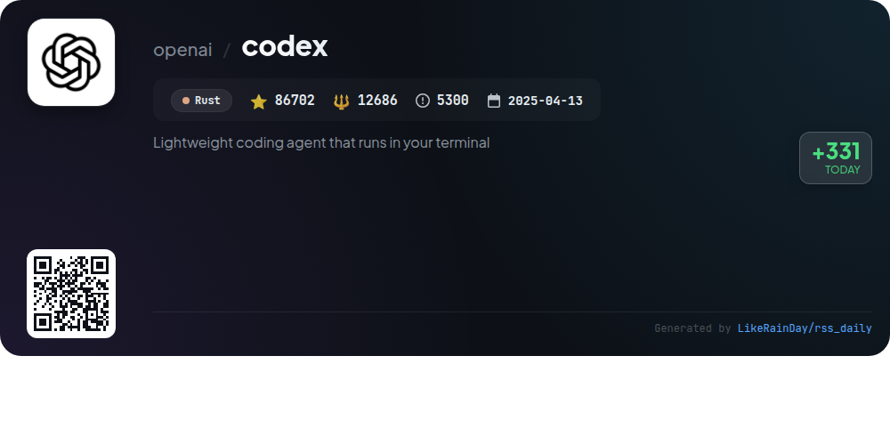

# 📊 🌟 GitHub Trending Daily - 2026-05-29

> > 📅 Daily Picks of GitHub Trending Repositories | Powered by Smart Algorithms

## 📋 Overview

**10** Projects | **672103** ⭐ | **74991** 🍴

**Top Languages:** `TypeScript` (4) · `Rust` (4) · `JavaScript` (2)

**Updated:** 2026-05-29 04:15 UTC

**Categories:**

- 🌟 Daily Top 10 (10 items)

---

## 🌟 Daily Top 10

### 1. [Understand-Anything](https://github.com/Lum1104/Understand-Anything)

> 🤖 **Why Recommend**  
> *Understand-Anything transforms any codebase into an interactive knowledge graph, enabling users to explore, search, and ask questions about their projects. Key features include guided tours, fuzzy search, impact analysis, and persona-adaptive UI. It supports multiple platforms like Claude Code, Codex, and Copilot, making it versatile for developers. The tool emphasizes understanding business logic through domain views and offers seamless onboarding for new team members. With over 43,000 stars, it’s a valuable resource for comprehending complex codebases efficiently.*

- ⭐ 43166 stars
- 💻 TypeScript
- 📅 Updated: 2026-05-29

### 2. [ECC](https://github.com/affaan-m/ECC)

> 🤖 **Why Recommend**  
> *ECC is a robust performance optimization system for AI agents, integrating skills, instincts, memory, and security into workflows across platforms like Claude Code and Codex. Key features include 63 specialized agents, 249 reusable skills, and a comprehensive hook system for automation. Users benefit from continuous learning, security scanning via AgentShield, and a powerful dashboard GUI. The project supports 12 language ecosystems and fosters community contributions, making it a versatile tool for developers seeking to enhance AI-driven development efficiency.*

- ⭐ 197490 stars
- 💻 JavaScript
- 📅 Updated: 2026-05-29

### 3. [cc-switch](https://github.com/farion1231/cc-switch)

> 🤖 **Why Recommend**  
> *CC Switch is a cross-platform desktop application designed to manage multiple AI CLI tools, including Claude Code, Codex, Gemini CLI, OpenCode, and OpenClaw. Key features include a unified interface for seamless switching between over 50 provider presets, automated MCP and Skills management, and quick access from the system tray. Additional functionalities like cloud sync, usage tracking, and built-in utilities enhance user experience. Built with Rust and Tauri, CC Switch ensures robust performance while simplifying API management for developers. Visit ccswitch.io for more information.*

- ⭐ 83938 stars
- 💻 Rust
- 📅 Updated: 2026-05-29

### 4. [liteparse](https://github.com/run-llama/liteparse)

> 🤖 **Why Recommend**  
> *LiteParse is a fast, open-source document parser built in Rust, designed for efficient local PDF parsing without cloud dependencies. It offers high-quality spatial text extraction, bounding box details, and multi-format support (PDF, DOCX, images, etc.). Key features include a flexible OCR system (with built-in Tesseract), screenshot generation, and outputs in JSON and text formats. LiteParse supports multiple languages (Rust, Node.js, Python, WASM) and platforms (Linux, macOS, Windows). For complex documents, users can leverage LlamaParse, a cloud-based solution for enhanced parsing capabilities.*

- ⭐ 6529 stars
- 💻 Rust
- 📅 Updated: 2026-05-29

### 5. [pi](https://github.com/earendil-works/pi)

> 🤖 **Why Recommend**  
> *Pi is an AI agent toolkit featuring an interactive coding agent CLI, a unified multi-provider LLM API, and a range of web and terminal UI libraries. Key components include the coding agent for hands-on coding tasks, a robust agent runtime for tool management, and a Slack bot for automation workflows. With over 57,000 stars on GitHub, Pi emphasizes community contributions and real-world data sharing to enhance coding agents. Explore its capabilities at pi.dev, or dive into the documentation for in-depth insights on integrating and utilizing the toolkit.*

- ⭐ 57074 stars
- 💻 TypeScript
- 📅 Updated: 2026-05-29

### 6. [awesome-free-apps](https://github.com/Axorax/awesome-free-apps)

> 🤖 **Why Recommend**  
> *awesome-free-apps is a curated collection of the best free applications for Windows, macOS, and Linux, boasting over 6,291 stars on GitHub. The project includes various categories such as audio, video, communication, developer tools, and security, with filtering options for OS-specific and open-source apps. Key features include an extensive list of recommended applications, a mobile version, and a focus on usability and contributions. This resource is ideal for users seeking quality software solutions across multiple platforms.*

- ⭐ 6291 stars
- 💻 JavaScript
- 📅 Updated: 2026-05-29

### 7. [firecrawl](https://github.com/firecrawl/firecrawl)

> 🤖 **Why Recommend**  
> *Firecrawl is a powerful API designed for scalable web search, scraping, and interaction. Key features include reliable access to 96% of the web, fast response times (P95 latency of 3.4s), and support for JavaScript-heavy pages. It generates clean markdown, structured JSON, and screenshots, facilitating seamless integration with AI agents. Users can effortlessly search, scrape, and interact with web content, automate data gathering, and crawl entire websites. Open source and available as a hosted service, Firecrawl simplifies complex web data extraction while ensuring compliance with site policies.*

- ⭐ 125830 stars
- 💻 TypeScript
- 📅 Updated: 2026-05-29

### 8. [twenty](https://github.com/twentyhq/twenty)

> 🤖 **Why Recommend**  
> *Twenty is an open-source CRM designed for technical teams, offering a customizable platform to meet complex business needs. Key features include the ability to define objects, fields, and views as code, facilitating rapid app development with the Twenty CLI. Users can opt for a cloud-based solution for quick setup or self-host using Docker. The platform supports AI integration, enabling smart agents and workflows. With a robust stack including TypeScript and React, Twenty provides essential CRM tools, version control, and comprehensive documentation to enhance user experience.*

- ⭐ 47948 stars
- 💻 TypeScript
- 📅 Updated: 2026-05-29

### 9. [iii](https://github.com/iii-hq/iii)

> 🤖 **Why Recommend**  
> *iii is a real-time service composition and observability platform built in Rust. It simplifies the integration of various backend components, enabling users to effortlessly add capabilities with commands like `iii worker add`. The core model revolves around three primitives: Workers, Functions, and Triggers, allowing for seamless extensions and traceable workflows. Key features include a developer console for monitoring, SDKs for Node.js, Python, and Rust, and a shared catalog for agents and applications. With over 17,000 stars, iii transforms service development into a cohesive, observable experience.*

- ⭐ 17135 stars
- 💻 Rust
- 📅 Updated: 2026-05-29

### 10. [codex](https://github.com/openai/codex)

> 🤖 **Why Recommend**  
> *Codex is a lightweight coding agent by OpenAI that operates locally in your terminal, built with Rust. With over 86,000 stars on GitHub, it facilitates seamless coding experiences in various environments, including VS Code and as a desktop app. Users can easily install Codex CLI via curl, npm, or Homebrew. It integrates with ChatGPT accounts for enhanced functionality, supporting various subscription plans. The project includes comprehensive documentation and encourages contributions, making it a valuable tool for developers seeking efficient coding assistance.*

- ⭐ 86702 stars
- 💻 Rust
- 📅 Updated: 2026-05-29

---

## 📡 RSS Subscription

Subscribe via RSS to get daily trending updates:

- 🔔 [RSS XML] (../../daily-top.xml)
- 🔔 [Daily Report] (../../GITHUB_TODAY.md)
- 🔔 [Daily Top 10](../../daily-top.xml)

---

*⚡ Powered by Smart Trending Algorithm | Generated at 2026-05-29 04:15:48 UTC
