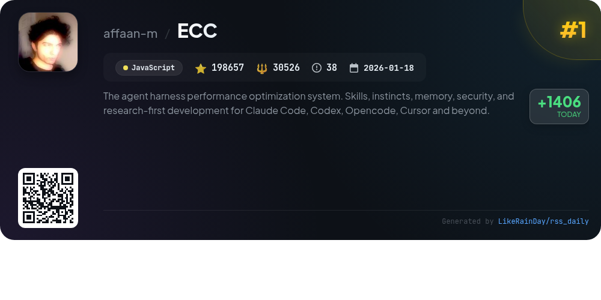
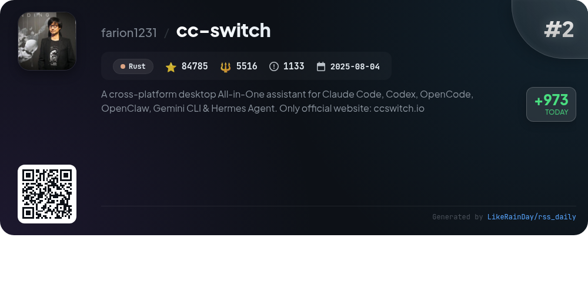
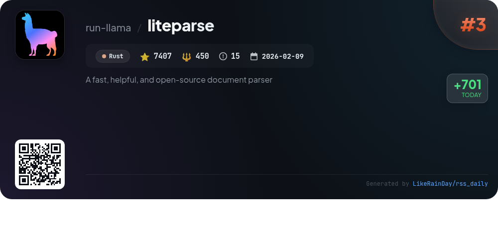
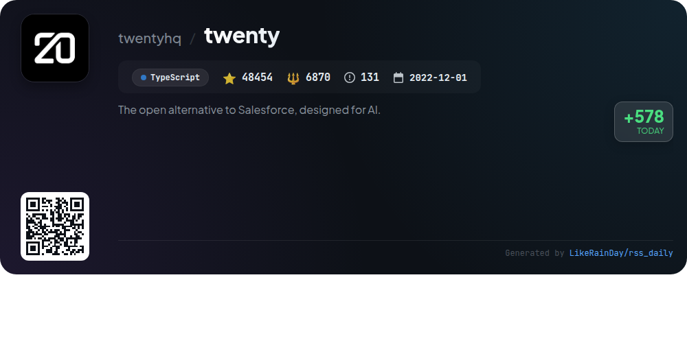
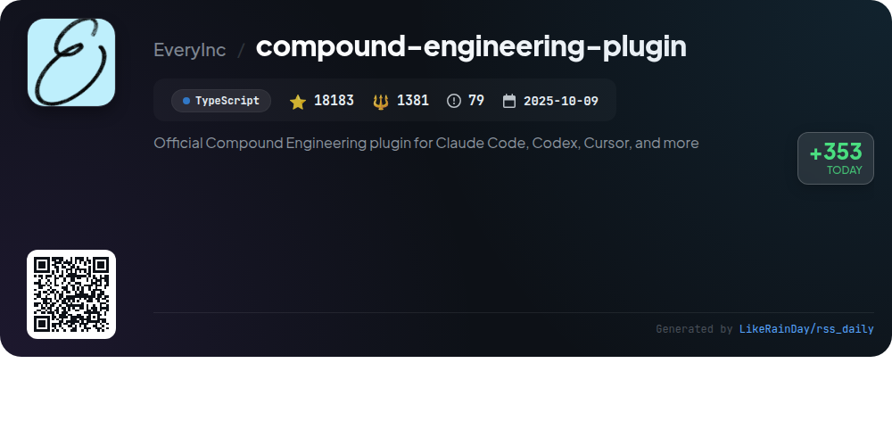
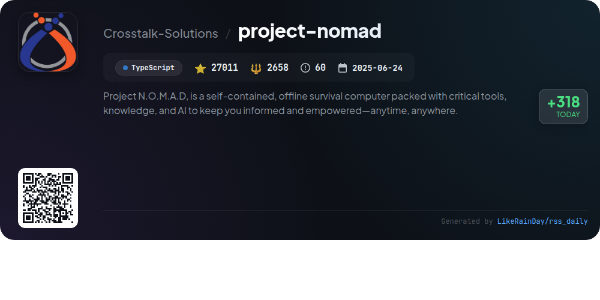
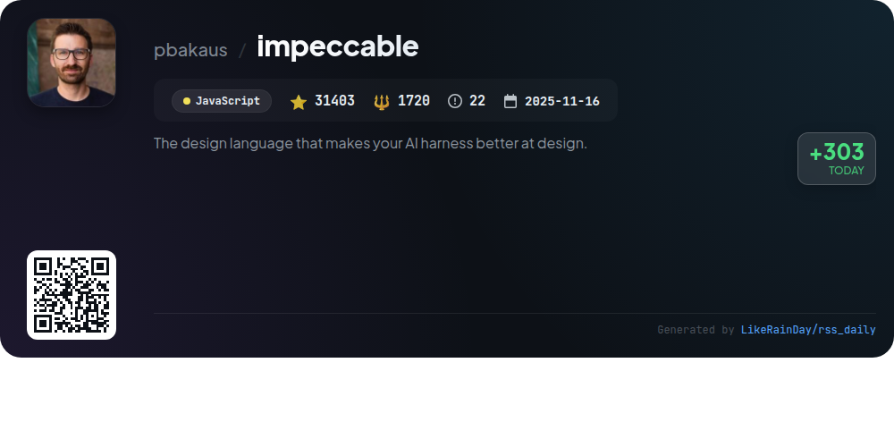
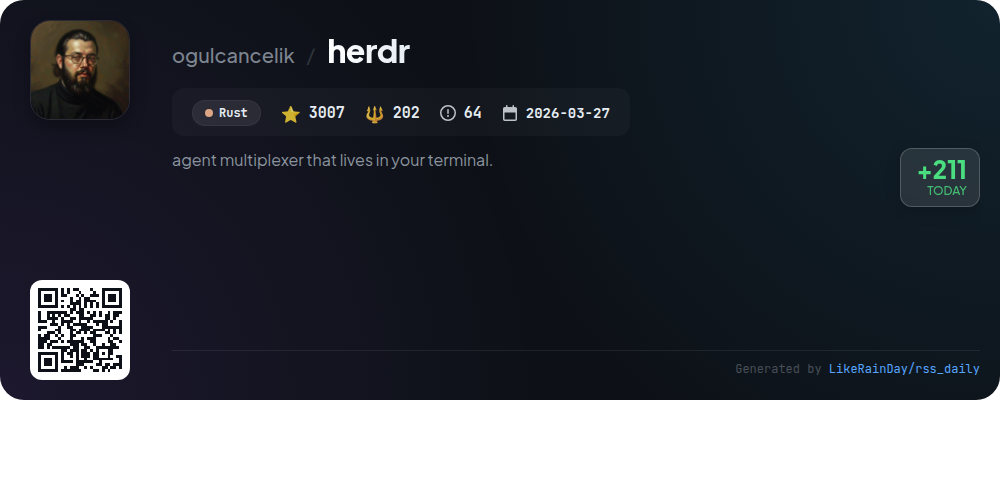
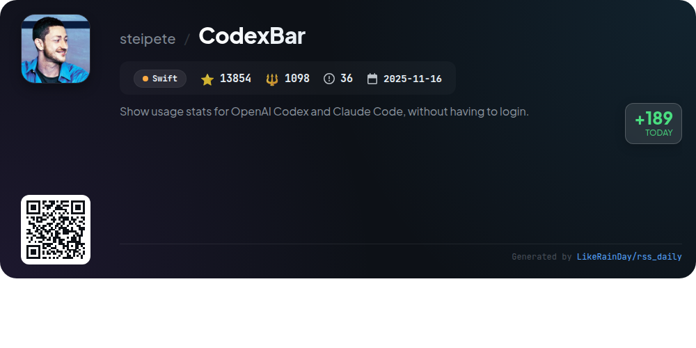
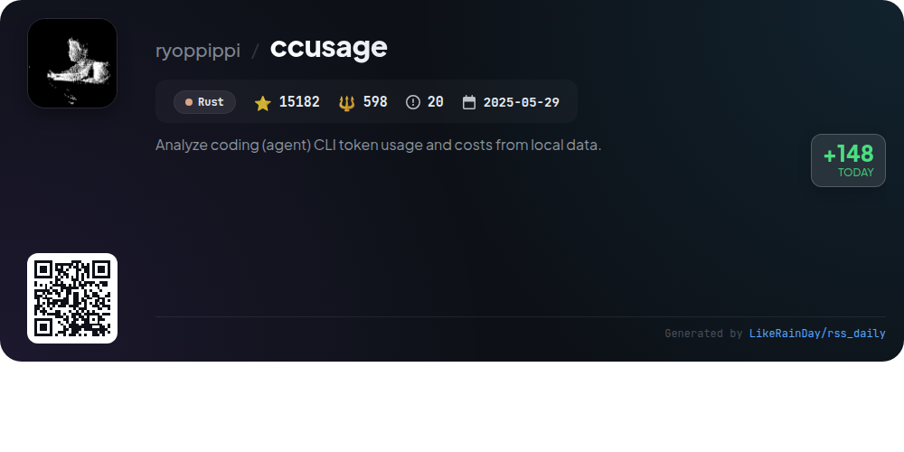

# 📊 🌟 GitHub Trending Daily - 2026-05-30

> > 📅 Daily Picks of GitHub Trending Repositories | Powered by Smart Algorithms

## 📋 Overview

**10** Projects | **447943** ⭐ | **51019** 🍴

**Top Languages:** `Rust` (4) · `TypeScript` (3) · `JavaScript` (2)

**Updated:** 2026-05-30 04:01 UTC

**Categories:**

- 🌟 Daily Top 10 (10 items)

---

## 🌟 Daily Top 10

### 1. [ECC](https://github.com/affaan-m/ECC)

> 🤖 **Why Recommend**  
> *ECC is a comprehensive performance optimization system designed for AI coding agents such as Claude Code, Codex, and Cursor. With over 198K stars, it integrates skills, instincts, and memory optimization to enhance workflows across 12 programming languages. Key features include production-ready agents, security scanning via AgentShield, and continuous learning capabilities. Users can install as a GitHub app for private repositories or utilize extensive community support. ECC's focus on research-first development ensures robust agent performance across diverse applications.*

- ⭐ 198657 stars
- 💻 JavaScript
- 📅 Updated: 2026-05-30

### 2. [cc-switch](https://github.com/farion1231/cc-switch)

> 🤖 **Why Recommend**  
> *CC Switch is a cross-platform desktop assistant designed for managing multiple AI CLI tools, including Claude Code, Codex, Gemini CLI, OpenCode, and OpenClaw. With over 84,000 stars on GitHub, it simplifies provider management through a unified interface, allowing users to switch between 50+ built-in presets without manual editing. Key features include system tray quick access, cloud sync, and comprehensive MCP and skills management. Built with Rust and Tauri, CC Switch supports Windows, macOS, and Linux, enhancing productivity for developers utilizing AI coding services.*

- ⭐ 84785 stars
- 💻 Rust
- 📅 Updated: 2026-05-30

### 3. [liteparse](https://github.com/run-llama/liteparse)

> 🤖 **Why Recommend**  
> *LiteParse is a fast, open-source document parser built in Rust, designed for efficient PDF parsing with high-quality spatial text extraction. Key features include flexible OCR support (Tesseract and HTTP servers), bounding box information, and multiple output formats (JSON and text). It supports various input formats, including PDFs, DOCX, and images, while running locally without cloud dependencies. LiteParse is available across platforms (Linux, macOS, Windows) and languages (Rust, Node.js, Python, and WASM). For complex documents, users can opt for the cloud-based LlamaParse service for enhanced performance.*

- ⭐ 7407 stars
- 💻 Rust
- 📅 Updated: 2026-05-30

### 4. [twenty](https://github.com/twentyhq/twenty)

> 🤖 **Why Recommend**  
> *Twenty is an open-source CRM designed as a customizable alternative to Salesforce, built with TypeScript. It empowers technical teams to create tailored solutions, adapting quickly to evolving business needs. Key features include a robust app development framework, version control for deployments, and AI integration for enhanced functionality. Users can choose between cloud hosting or self-hosting via Docker. With extensive documentation, a supportive community on Discord, and a focus on flexibility, Twenty provides all the essential tools for modern CRM needs.*

- ⭐ 48454 stars
- 💻 TypeScript
- 📅 Updated: 2026-05-30

### 5. [compound-engineering-plugin](https://github.com/EveryInc/compound-engineering-plugin)

> 🤖 **Why Recommend**  
> *The Compound Engineering plugin enhances coding efficiency for Claude Code, Codex, and other platforms, boasting 18,183 stars on GitHub. It promotes a philosophy where each engineering task simplifies future work. Key features include comprehensive planning with `/ce-brainstorm` and `/ce-plan`, multi-agent code reviews via `/ce-code-review`, and knowledge codification with `/ce-compound`. The plugin facilitates a cyclical workflow of ideation, execution, and learning, ensuring high-quality outputs and minimal technical debt. It ships with 37 skills and 51 agents to streamline the development process.*

- ⭐ 18183 stars
- 💻 TypeScript
- 📅 Updated: 2026-05-30

### 6. [project-nomad](https://github.com/Crosstalk-Solutions/project-nomad)

> 🤖 **Why Recommend**  
> *Project N.O.M.A.D. is an offline-first knowledge and education server designed for survival scenarios, featuring a suite of critical tools and resources. Key capabilities include an AI chat assistant, an offline information library with Wikipedia and medical references, Khan Academy courses, downloadable maps, and data analysis tools. The system is easily installed on Debian-based OS, primarily via terminal commands, and operates through a browser interface. With robust community support and no built-in telemetry, it empowers users with essential information anytime, anywhere.*

- ⭐ 27011 stars
- 💻 TypeScript
- 📅 Updated: 2026-05-30

### 7. [impeccable](https://github.com/pbakaus/impeccable)

> 🤖 **Why Recommend**  
> *Impeccable is a robust JavaScript design language tool that enhances AI-assisted frontend design, boasting over 31,000 stars on GitHub. It offers 23 commands for design tasks—from critiquing to polishing—alongside 7 domain-specific references covering typography, color, motion, and more. Users benefit from 27 anti-pattern rules and a standalone CLI for detecting common design issues. Impeccable integrates seamlessly with tools like Claude Code and Cursor, making it an essential resource for creating aesthetically pleasing and functional designs. Visit impeccable.style for quick start guides and examples.*

- ⭐ 31403 stars
- 💻 JavaScript
- 📅 Updated: 2026-05-30

### 8. [herdr](https://github.com/ogulcancelik/herdr)

> 🤖 **Why Recommend**  
> *Herdr is a terminal-based agent multiplexer designed for efficient multitasking. With over 3000 stars, it supports workspaces, tabs, and panes, allowing users to manage multiple agents seamlessly. Key features include persistent sessions, real terminal views, and mouse-native interactions. Herdr enables easy detachment and reattachment, preserving agent processes, and features robust agent awareness, displaying their statuses directly. It integrates with various agents for enhanced functionality and provides customizable keybindings and themes. Herdr operates on Linux and macOS, prioritizing a lightweight, dependency-free experience.*

- ⭐ 3007 stars
- 💻 Rust
- 📅 Updated: 2026-05-30

### 9. [CodexBar](https://github.com/steipete/CodexBar)

> 🤖 **Why Recommend**  
> *CodexBar is a macOS 14+ menu bar app that provides real-time usage statistics for various AI coding providers like OpenAI Codex, Claude, and more. Key features include per-provider usage meters, reset countdowns, credit balances, and billing summaries, allowing users to manage their coding limits effectively. It supports multiple providers with a privacy-first approach, reusing existing sessions without storing passwords. Users can access a bundled CLI for scripting and integration, making it a versatile tool for developers wanting to track AI usage efficiently.*

- ⭐ 13854 stars
- 💻 Swift
- 📅 Updated: 2026-05-30

### 10. [ccusage](https://github.com/ryoppippi/ccusage)

> 🤖 **Why Recommend**  
> *ccusage is a Rust-based CLI tool designed for analyzing coding agent token usage and associated costs from local data. It supports various agents, including Claude Code, Codex, and GitHub Copilot, providing detailed daily, weekly, monthly, and session reports. Key features include unified reporting across multiple agents, customizable date filtering, compact output for sharing, and JSON export capabilities. Users can track costs in USD, monitor usage within billing blocks, and integrate with status lines for Claude Code. Full documentation is available at ccusage.com.*

- ⭐ 15182 stars
- 💻 Rust
- 📅 Updated: 2026-05-30

---

## 📡 RSS Subscription

Subscribe via RSS to get daily trending updates:

- 🔔 [RSS XML] (../../daily-top.xml)
- 🔔 [Daily Report] (../../GITHUB_TODAY.md)
- 🔔 [Daily Top 10](../../daily-top.xml)

---

*⚡ Powered by Smart Trending Algorithm | Generated at 2026-05-30 04:01:33 UTC
