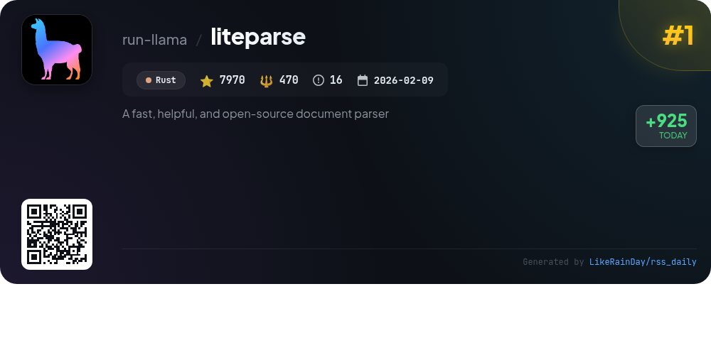
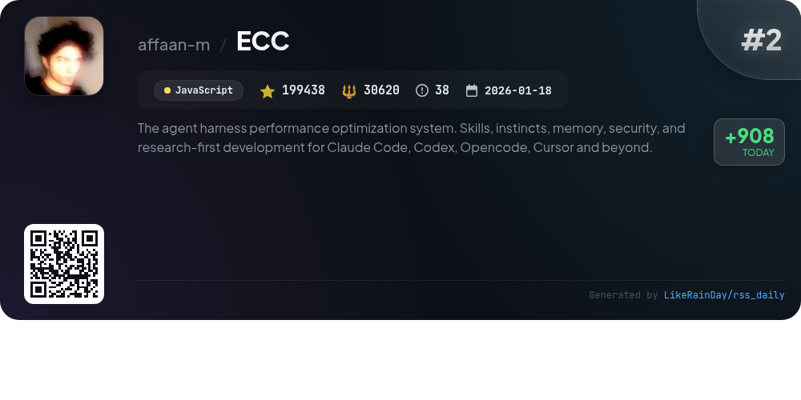
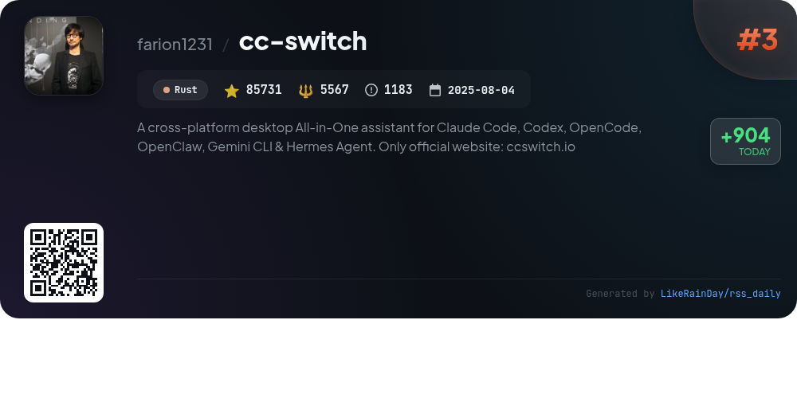
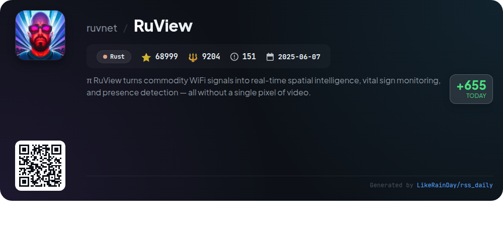
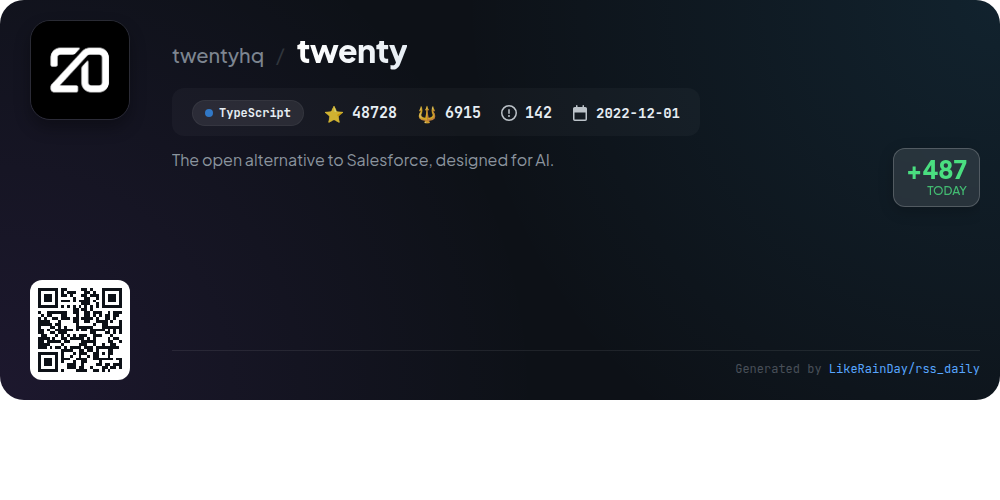
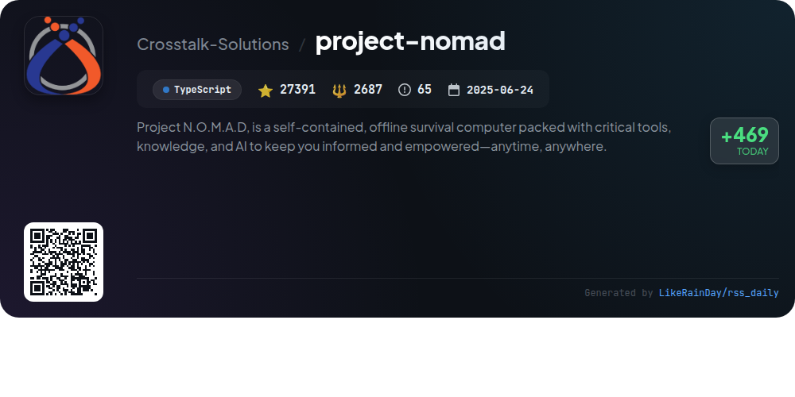
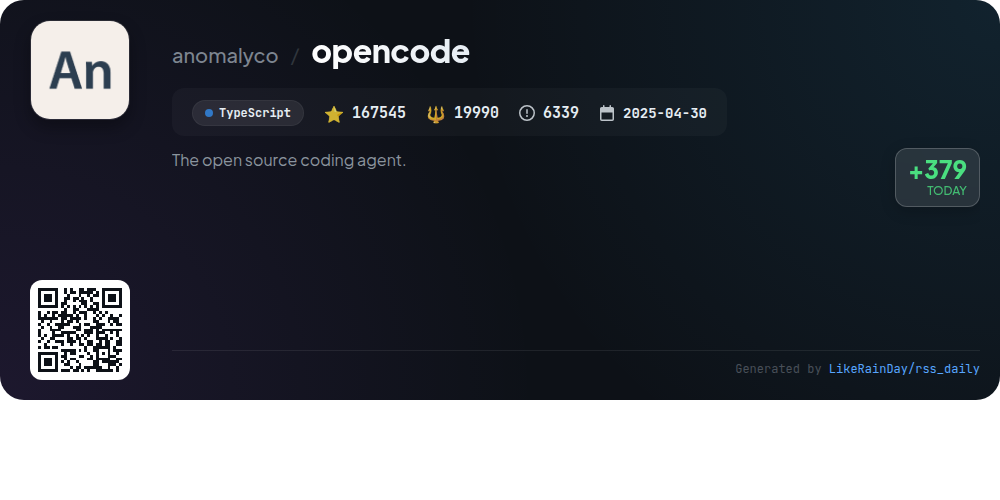
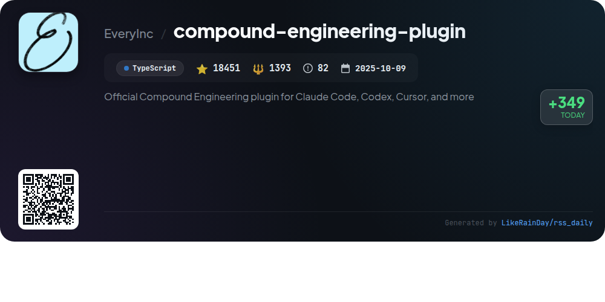
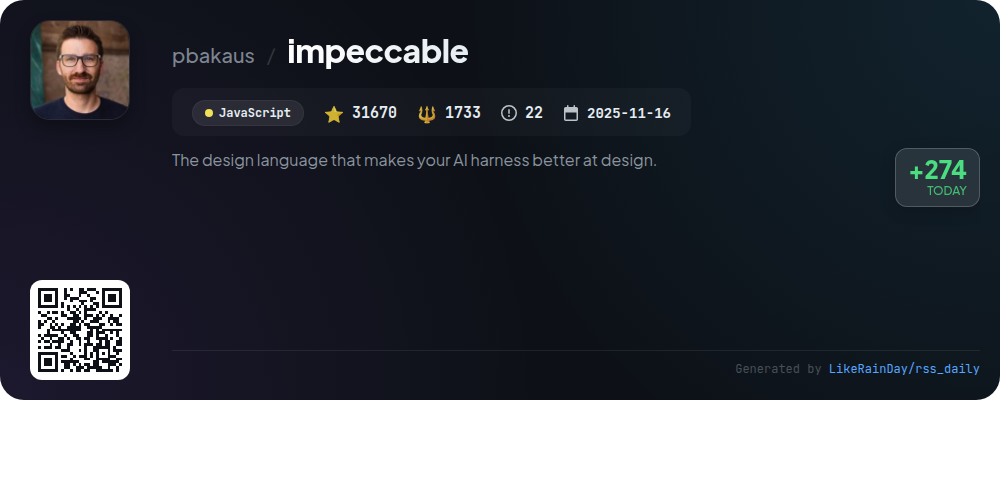
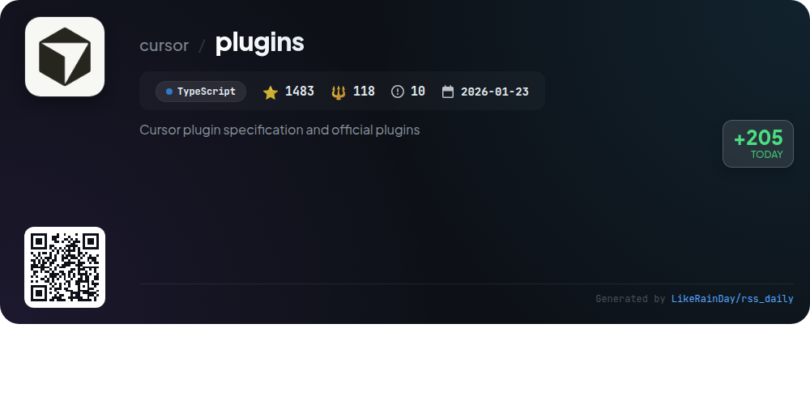

# 📊 🌟 GitHub Trending Daily - 2026-05-31

> > 📅 每日精选 GitHub 热门仓库 | 基于智能算法推荐

## 📋 Overview

**10** 个项目 | **657406** ⭐ | **78697** 🍴

**热门语言:** `TypeScript` (5) · `Rust` (3) · `JavaScript` (2)

**更新时间:** 2026-05-31 04:26 UTC

**分类分布:**

- 🌟 每日 Top 10 精选 (10 项)

---

## 🌟 每日 Top 10 精选

### 1. [liteparse](https://github.com/run-llama/liteparse)

> 🤖 **推荐理由**  
> *LiteParse is a fast, open-source document parser written in Rust, designed for efficient PDF parsing with high-quality spatial text extraction. Key features include built-in Tesseract OCR, support for multiple input formats (PDF, DOCX, XLSX, images), and output in JSON or plain text with precise bounding box information. It offers multi-language bindings for Rust, Node.js, Python, and WASM, ensuring cross-platform compatibility. For complex documents, users can leverage LlamaParse, a cloud-based solution for enhanced parsing capabilities. LiteParse operates entirely locally, ensuring no cloud dependencies.*

- ⭐ 7970 stars
- 💻 Rust
- 📅 Updated: 2026-05-31

### 2. [ECC](https://github.com/affaan-m/ECC)

> 🤖 **推荐理由**  
> *ECC is a powerful performance optimization system for AI agents, including Claude Code, Codex, and Cursor, boasting over 199K stars on GitHub. It features a comprehensive suite of agents (63), skills (249), and commands (79) that facilitate multi-harness workflows. Key highlights include continuous learning, memory optimization, security scanning via AgentShield, and an intuitive dashboard GUI. ECC supports cross-platform integration and provides customizable installation profiles. Designed for both developers and teams, it enhances productivity through streamlined automation and collaborative capabilities.*

- ⭐ 199438 stars
- 💻 JavaScript
- 📅 Updated: 2026-05-31

### 3. [cc-switch](https://github.com/farion1231/cc-switch)

> 🤖 **推荐理由**  
> *CC Switch is a cross-platform desktop application designed to manage multiple AI coding tools including Claude Code, Codex, Gemini CLI, OpenCode, and OpenClaw. Key features include a unified interface for seamless switching between over 50 provider presets, automatic configuration management, and integrated MCP and Skills management. The app supports system tray quick access and cloud sync across devices. Built with Rust and Tauri, CC Switch ensures reliable performance and offers extensive usage tracking. Ideal for developers seeking efficiency in API management.*

- ⭐ 85731 stars
- 💻 Rust
- 📅 Updated: 2026-05-31

### 4. [RuView](https://github.com/ruvnet/RuView)

> 🤖 **推荐理由**  
> *RuView transforms commodity WiFi signals into real-time spatial intelligence, enabling vital sign monitoring and presence detection without cameras or wearables. Key features include contactless detection of breathing and heart rates, activity recognition, and environment mapping, all supported by low-cost ESP32 sensors. It integrates seamlessly with major smart-home ecosystems like Home Assistant, Apple Home, Google Home, and Alexa. RuView operates entirely on edge hardware, ensuring privacy and low power consumption. Its self-learning AI adapts to environments quickly, making it ideal for applications in healthcare, security, and smart homes.*

- ⭐ 68999 stars
- 💻 Rust
- 📅 Updated: 2026-05-31

### 5. [twenty](https://github.com/twentyhq/twenty)

> 🤖 **推荐理由**  
> *Twenty is an open-source CRM designed as an alternative to Salesforce, built for flexibility and customization. With over 48,000 stars on GitHub, it allows technical teams to create tailored CRM solutions that adapt to evolving business needs. Key features include object definition, version control, AI integration, and the ability to build and publish apps with a simple CLI command. Users can choose between cloud deployment or self-hosting via Docker. Comprehensive documentation and community support enhance the development experience, making it a robust choice for modern businesses.*

- ⭐ 48728 stars
- 💻 TypeScript
- 📅 Updated: 2026-05-31

### 6. [project-nomad](https://github.com/Crosstalk-Solutions/project-nomad)

> 🤖 **推荐理由**  
> *Project N.O.M.A.D. is an offline-first survival computer that provides essential knowledge and tools, including an AI chat assistant, offline Wikipedia, educational resources, and data management capabilities. It features a Command Center UI for easy access and management of containerized applications via Docker. Key offerings include Khan Academy courses, regional offline maps, and data tools for encryption and analysis. Designed for Debian-based systems, it prioritizes privacy and security with zero telemetry, making it ideal for users seeking autonomy and resilience in information access.*

- ⭐ 27391 stars
- 💻 TypeScript
- 📅 Updated: 2026-05-31

### 7. [opencode](https://github.com/anomalyco/opencode)

> 🤖 **推荐理由**  
> *OpenCode is an open-source AI coding agent designed to assist developers in their programming tasks. Built with TypeScript, it has garnered over 167,000 stars on GitHub. Key features include two built-in agents: a full-access "build" agent for development and a read-only "plan" agent for code exploration. OpenCode also offers a desktop application, installation via various package managers, and robust documentation for configuration. Join the community on Discord for support and collaboration. Visit [opencode.ai](https://opencode.ai) for more information.*

- ⭐ 167545 stars
- 💻 TypeScript
- 📅 Updated: 2026-05-31

### 8. [compound-engineering-plugin](https://github.com/EveryInc/compound-engineering-plugin)

> 🤖 **推荐理由**  
> *The Compound Engineering plugin enhances AI-assisted software development with a focus on reducing technical debt. Key features include tools for brainstorming (`/ce-brainstorm`), planning (`/ce-plan`), executing (`/ce-work`), code review (`/ce-code-review`), and documenting learnings (`/ce-compound`). The workflow emphasizes thorough planning and iterative improvement, aiming to streamline future engineering tasks. With 37 skills and 51 agents, it supports integration with platforms like Claude Code, Codex, and GitHub Copilot, promoting efficient collaboration and high-quality code.*

- ⭐ 18451 stars
- 💻 TypeScript
- 📅 Updated: 2026-05-31

### 9. [impeccable](https://github.com/pbakaus/impeccable)

> 🤖 **推荐理由**  
> *Impeccable is a powerful design language for AI, enhancing frontend design with a shared vocabulary of 23 commands and 7 domain-specific reference files, covering typography, color, spatial design, and more. It helps users avoid common anti-patterns through 27 deterministic rules and a critique pass. Key commands include `/impeccable polish`, `/impeccable audit`, and `/impeccable critique`, enabling seamless design iterations. It supports various tools like Cursor, Claude Code, and Codex CLI, making it versatile for developers. Visit [impeccable.style](https://impeccable.style) for quick start bundles and case studies.*

- ⭐ 31670 stars
- 💻 JavaScript
- 📅 Updated: 2026-05-31

### 10. [plugins](https://github.com/cursor/plugins)

> 🤖 **推荐理由**  
> *The "plugins" project provides official Cursor plugins for various developer tools, frameworks, and SaaS products. It features a multi-plugin marketplace structure with standalone directories for each plugin, including manifests for easy integration. Key plugins include "Continual Learning" for transcript-driven memory updates, "Cursor Team Kit" for internal workflows, and "PR Review Canvas" for enhanced code reviews. The repository supports the creation and validation of new plugins, alongside tools for orchestrating tasks and ensuring agent compatibility, all built in TypeScript.*

- ⭐ 1483 stars
- 💻 TypeScript
- 📅 Updated: 2026-05-31

---

## 📡 RSS订阅

通过 RSS 订阅，第一时间获取每日精选项目：

- 🔔 [RSS 订阅源] (../../daily-top.xml)
- 🔔 [每日简报] (../../GITHUB_TODAY_CN.md)
- 🔔 [每日 Top 10 精选](../../daily-top.xml)

---

*⚡ Powered by Smart Trending Algorithm | Generated at 2026-05-31 04:26:25 UTC
