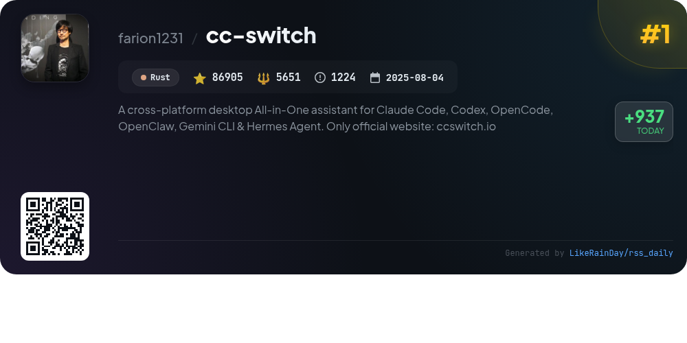
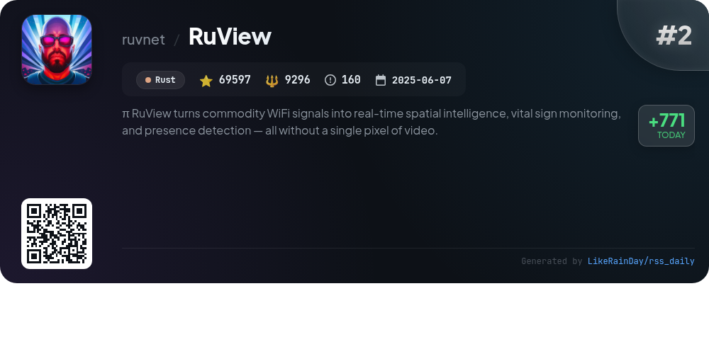
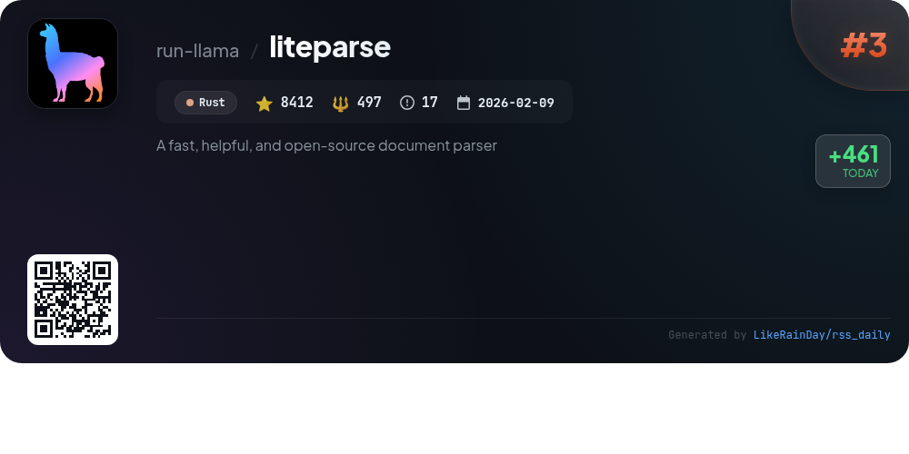
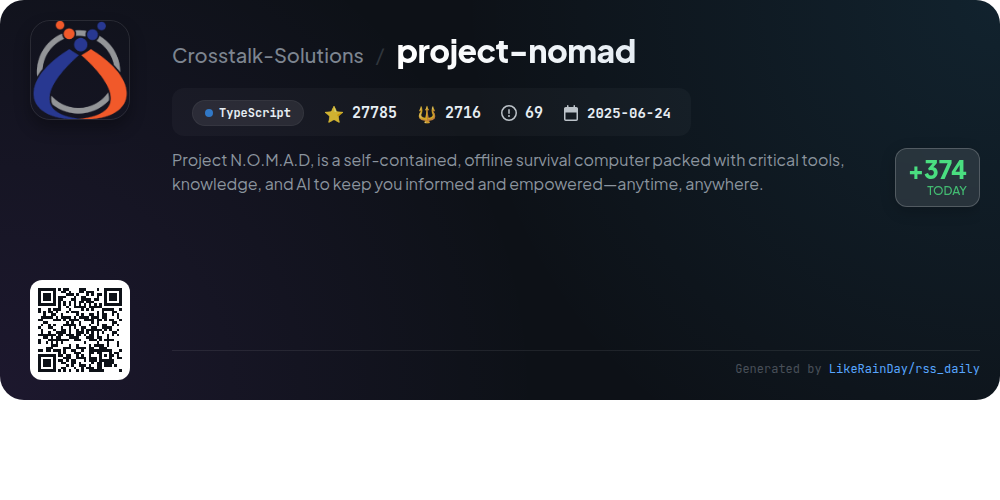
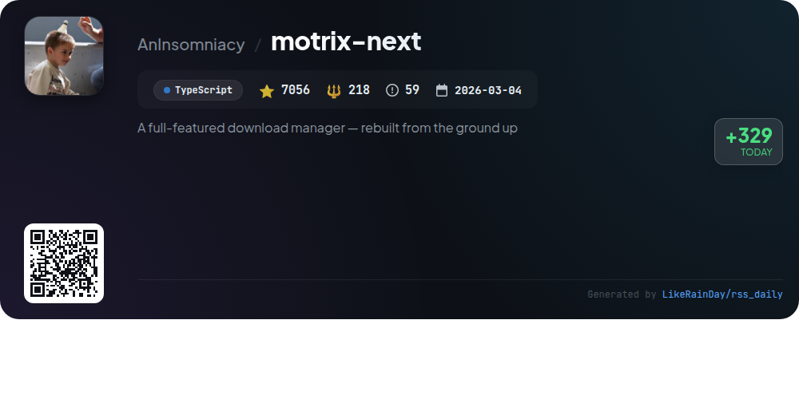
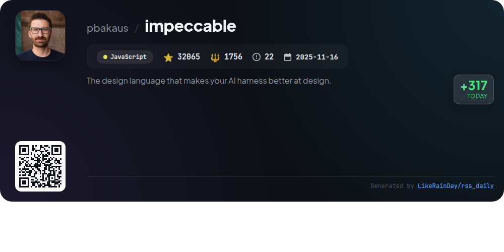
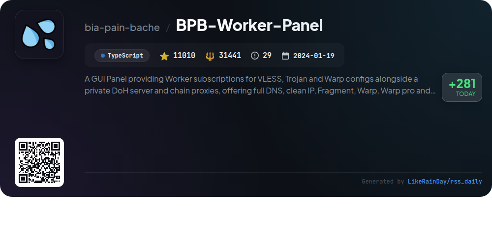
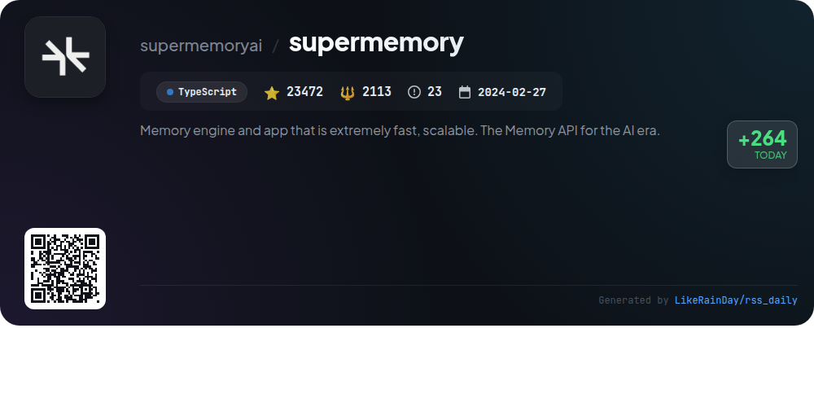
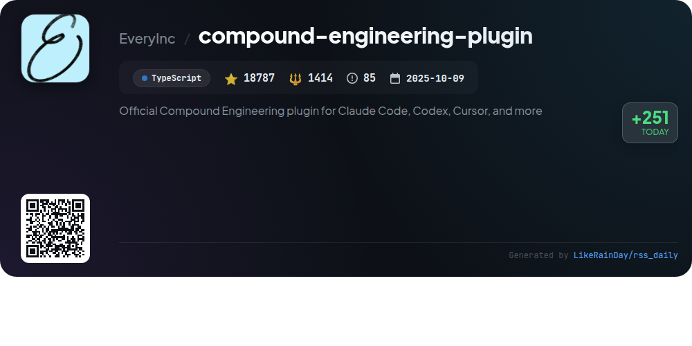
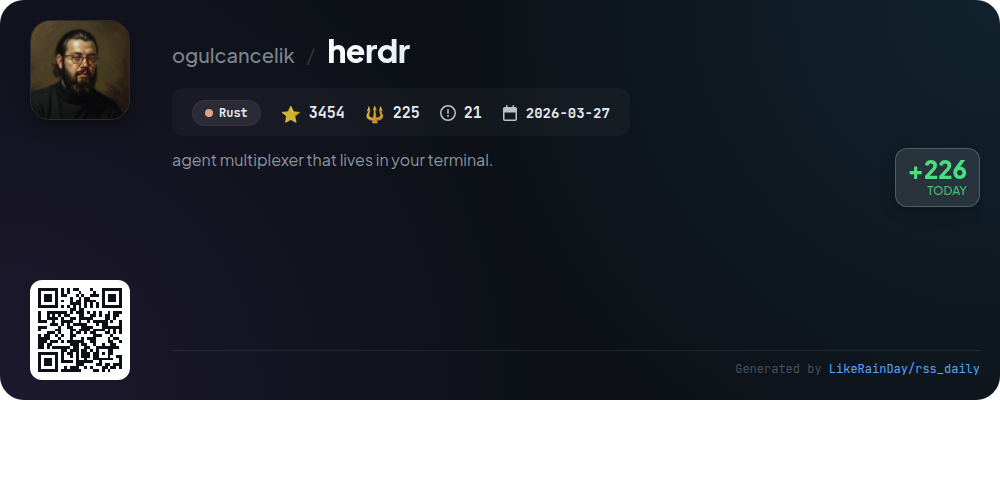

# 📊 🌟 GitHub Trending Daily - 2026-06-01

> > 📅 Daily Picks of GitHub Trending Repositories | Powered by Smart Algorithms

## 📋 Overview

**10** Projects | **288543** ⭐ | **55327** 🍴

**Top Languages:** `TypeScript` (5) · `Rust` (4) · `JavaScript` (1)

**Updated:** 2026-06-01 04:58 UTC

**Categories:**

- 🌟 Daily Top 10 (10 items)

---

## 🌟 Daily Top 10

### 1. [cc-switch](https://github.com/farion1231/cc-switch)

> 🤖 **Why Recommend**  
> *CC Switch is a powerful cross-platform desktop assistant designed to manage multiple CLI tools including Claude Code, Codex, Gemini CLI, OpenCode, and OpenClaw from a single interface. Key features include over 50 built-in provider presets for easy switching, unified management of MCP and Skills, cloud sync capabilities, and a system tray for quick access. Built with Rust and Tauri, it ensures a smooth user experience with utilities for configuration management and cost tracking. The app supports Windows, macOS, and Linux, making AI coding more efficient and accessible. Visit ccswitch.io for more information.*

- ⭐ 86905 stars
- 💻 Rust
- 📅 Updated: 2026-06-01

### 2. [RuView](https://github.com/ruvnet/RuView)

> 🤖 **Why Recommend**  
> *RuView is a cutting-edge WiFi sensing platform that transforms commodity WiFi signals into real-time spatial intelligence, enabling presence detection, vital sign monitoring, and activity recognition without cameras or wearables. It seamlessly integrates with major smart home ecosystems like Home Assistant, Apple Home, Google Home, and Alexa. Key features include through-wall sensing, sleep quality monitoring, and fall detection, all powered by low-cost ESP32 sensors. RuView runs entirely on edge hardware, ensuring data privacy and low latency, making it ideal for healthcare, retail, and smart home applications.*

- ⭐ 69597 stars
- 💻 Rust
- 📅 Updated: 2026-06-01

### 3. [liteparse](https://github.com/run-llama/liteparse)

> 🤖 **Why Recommend**  
> *LiteParse is a fast, open-source document parser written in Rust, designed for efficient PDF parsing with high-quality spatial text extraction and bounding boxes. Key features include a flexible OCR system (integrating Tesseract or custom HTTP servers), multi-format input support (PDF, DOCX, XLSX, images), and multiple output formats (JSON, text). It runs locally with no cloud dependencies. LiteParse is suitable for various platforms (Linux, macOS, Windows) and programming languages (Rust, Node.js, Python, WASM). For complex documents, users can leverage LlamaParse, a cloud-based solution.*

- ⭐ 8412 stars
- 💻 Rust
- 📅 Updated: 2026-06-01

### 4. [project-nomad](https://github.com/Crosstalk-Solutions/project-nomad)

> 🤖 **Why Recommend**  
> *Project N.O.M.A.D. is an innovative offline survival computer designed to empower users with essential tools and knowledge anytime, anywhere. Key features include a local AI chat powered by Ollama, an offline information library (Wikipedia, medical references), an education platform with Khan Academy courses, offline maps, and data analysis tools. The platform is easily installed on Debian-based systems and is equipped with a user-friendly management UI. With zero built-in telemetry, it prioritizes privacy and offline functionality, making it ideal for diverse environments.*

- ⭐ 27785 stars
- 💻 TypeScript
- 📅 Updated: 2026-06-01

### 5. [motrix-next](https://github.com/AnInsomniacy/motrix-next)

> 🤖 **Why Recommend**  
> *Motrix Next is a robust, open-source download manager rebuilt from the ground up using TypeScript and Tauri 2. Key features include support for multiple protocols (HTTP, FTP, BitTorrent), a browser extension for seamless integration, and advanced download organization with SQLite backing. It offers concurrent downloads, speed control, and system integration with native notifications and tray operation. The lightweight application (~20 MB) maintains a familiar UI while enhancing performance and user experience, making it a powerful tool for efficient downloading across macOS, Windows, and Linux.*

- ⭐ 7056 stars
- 💻 TypeScript
- 📅 Updated: 2026-06-01

### 6. [impeccable](https://github.com/pbakaus/impeccable)

> 🤖 **Why Recommend**  
> *Impeccable is a design language toolkit for enhancing AI-driven frontend design, featuring 23 commands and 7 domain-specific references including typography, color, and UX writing. It helps avoid common design anti-patterns with 27 deterministic rules and a critique pass. Users can execute commands like `/impeccable audit` for technical checks or `/impeccable polish` for final touches. It supports various tools like Cursor and Claude Code, and offers a CLI for detecting design issues. Visit [impeccable.style](https://impeccable.style) for quick start and usage examples.*

- ⭐ 32065 stars
- 💻 JavaScript
- 📅 Updated: 2026-06-01

### 7. [BPB-Worker-Panel](https://github.com/bia-pain-bache/BPB-Worker-Panel)

> 🤖 **Why Recommend**  
> *BPB-Worker-Panel is a GUI panel that facilitates free, secure, and private subscriptions for VLESS, Trojan, and Warp configurations. Key features include a private DoH server, fragment support, comprehensive routing rules to bypass restrictions, and chain proxy capabilities. It supports multiple clients like Amnezia, Wireguard, and Clash, ensuring broad compatibility. The intuitive interface allows easy customization of DNS, ports, and protocols. With over 11,000 stars, this project is designed for seamless user experience and enhanced online privacy.*

- ⭐ 11010 stars
- 💻 TypeScript
- 📅 Updated: 2026-06-01

### 8. [supermemory](https://github.com/supermemoryai/supermemory)

> 🤖 **Why Recommend**  
> *Supermemory is a cutting-edge memory engine and app designed for AI, enabling persistent memory and context management. It excels across major benchmarks, providing features such as automatic memory extraction, user profile maintenance, hybrid search (RAG + memory), and real-time connectors to platforms like Google Drive and Notion. Supermemory allows both individual users and developers to build AI tools that remember preferences and context across conversations. Its API simplifies integration, requiring no complex setups, making it a powerful solution for personalized AI experiences.*

- ⭐ 23472 stars
- 💻 TypeScript
- 📅 Updated: 2026-06-01

### 9. [compound-engineering-plugin](https://github.com/EveryInc/compound-engineering-plugin)

> 🤖 **Why Recommend**  
> *The Compound Engineering Plugin enhances engineering workflows by integrating AI skills and agents into code development. It emphasizes leveraging planning and review stages to reduce complexity and technical debt. Key features include `/ce-strategy` for defining product goals, `/ce-brainstorm` for generating requirements, and `/ce-code-review` for multi-agent code assessments. With 37 skills and 51 agents, it streamlines the development process, promoting continuous learning. Installable across multiple platforms, this TypeScript-based plugin has garnered 18,787 stars on GitHub.*

- ⭐ 18787 stars
- 💻 TypeScript
- 📅 Updated: 2026-06-01

### 10. [herdr](https://github.com/ogulcancelik/herdr)

> 🤖 **Why Recommend**  
> *Herdr is a terminal-based agent multiplexer built in Rust, boasting over 3,454 stars on GitHub. It offers persistent sessions with workspaces, tabs, and panes, allowing users to manage multiple agents seamlessly without a GUI. Key features include real terminal views, mouse support, agent state awareness, and built-in themes. Herdr supports automatic agent detection and integrates with various tools like Pi and Codex. It enables easy detachment and reattachment of sessions, ensuring processes continue running in the background. Ideal for developers seeking an efficient terminal experience.*

- ⭐ 3454 stars
- 💻 Rust
- 📅 Updated: 2026-06-01

---

## 📡 RSS Subscription

Subscribe via RSS to get daily trending updates:

- 🔔 [RSS XML] (../../daily-top.xml)
- 🔔 [Daily Report] (../../GITHUB_TODAY.md)
- 🔔 [Daily Top 10](../../daily-top.xml)

---

*⚡ Powered by Smart Trending Algorithm | Generated at 2026-06-01 04:58:39 UTC
