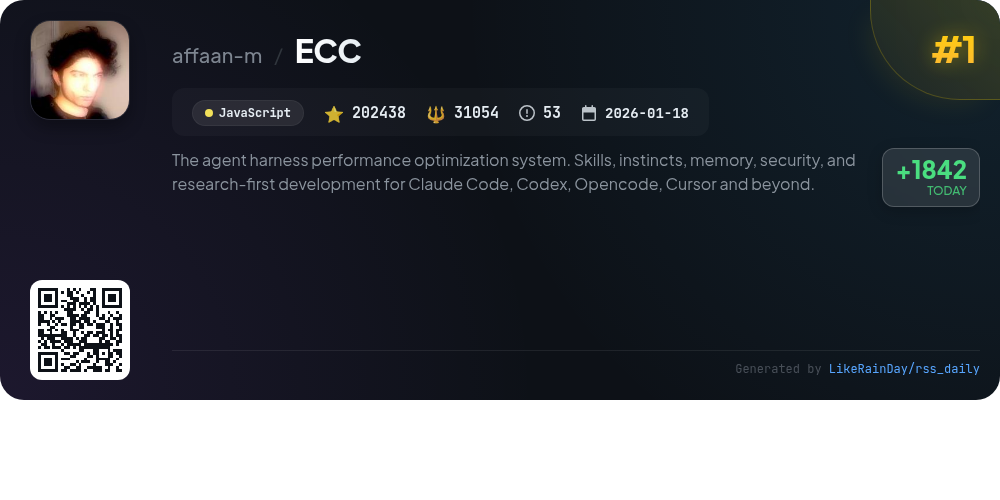
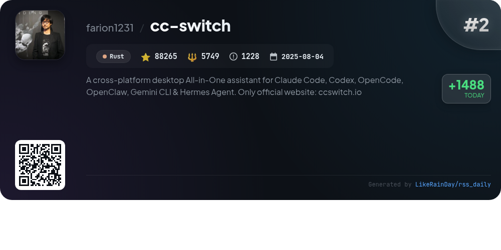
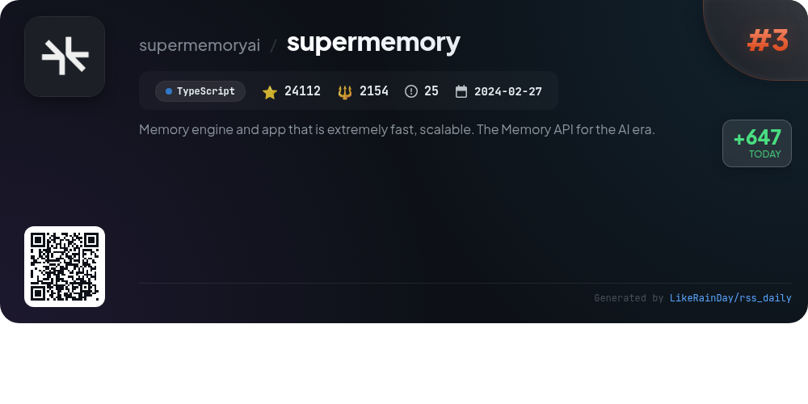
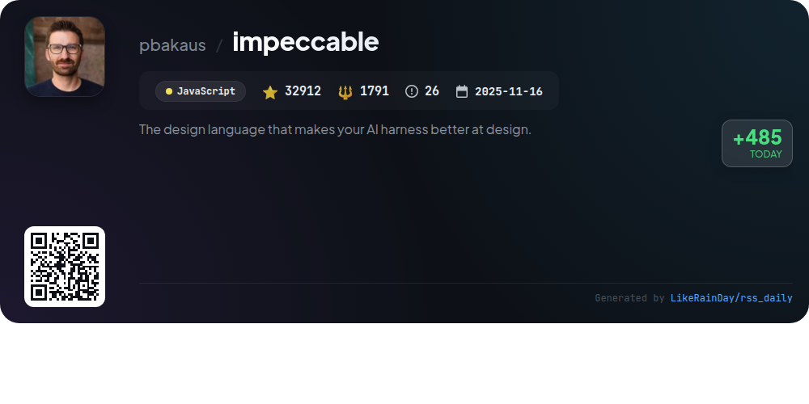
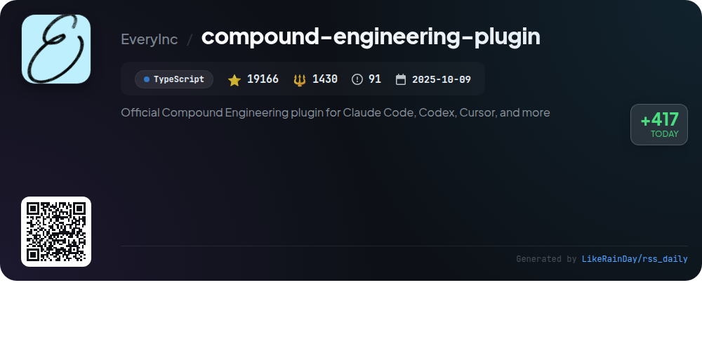
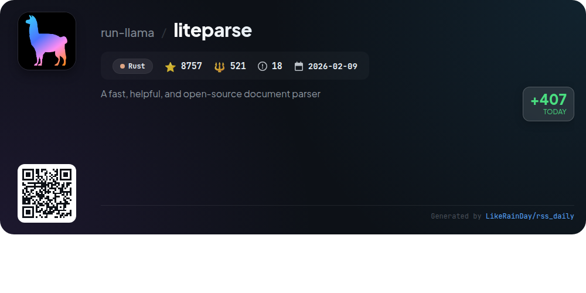
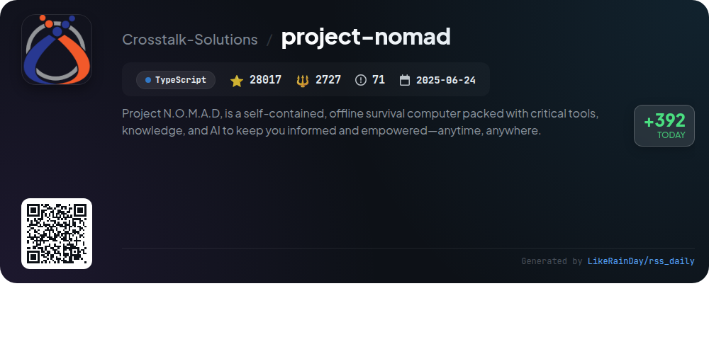
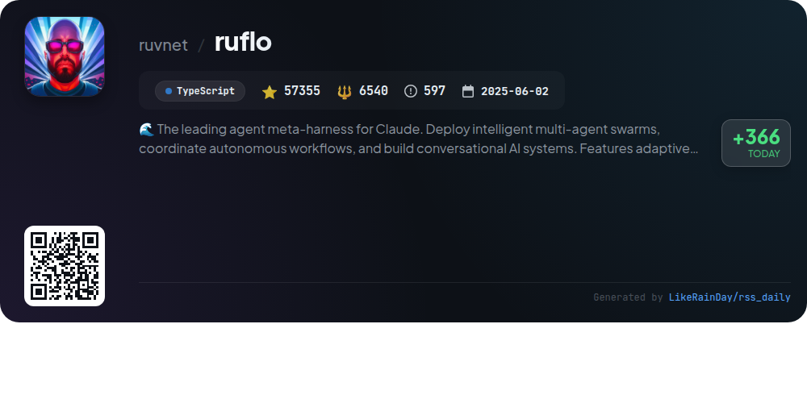
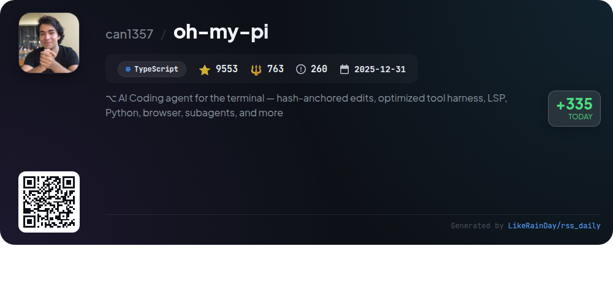

# 📊 🌟 GitHub Trending Daily - 2026-06-02

> > 📅 每日精选 GitHub 热门仓库 | 基于智能算法推荐

## 📋 Overview

**10** 个项目 | **540519** ⭐ | **62074** 🍴

**热门语言:** `TypeScript` (5) · `Rust` (3) · `JavaScript` (2)

**更新时间:** 2026-06-02 04:44 UTC

**分类分布:**

- 🌟 每日 Top 10 精选 (10 项)

---

## 🌟 每日 Top 10 精选

### 1. [ECC](https://github.com/affaan-m/ECC)

> 🤖 **推荐理由**  
> *ECC is a powerful performance optimization system designed for AI agents like Claude Code, Codex, and Cursor. It includes features such as skills, instincts, memory optimization, and security scanning, enabling continuous learning and research-first development. The system supports 63 agents and 249 skills, facilitating cross-harness workflows across multiple programming languages. Key services include a dashboard GUI for visualization, AgentShield for security audits, and a skill creator for generating new workflows. With over 200K stars, ECC is community-driven and open-source, fostering collaboration and contributions.*

- ⭐ 202438 stars
- 💻 JavaScript
- 📅 Updated: 2026-06-02

### 2. [cc-switch](https://github.com/farion1231/cc-switch)

> 🤖 **推荐理由**  
> *CC Switch is a cross-platform desktop assistant for managing five AI CLI tools: Claude Code, Codex, Gemini CLI, OpenCode, and OpenClaw. It offers a unified interface, eliminating the need for manual configuration edits with over 50 built-in provider presets. Key features include one-click switching, cloud sync, unified MCP and skills management, and a system tray quick access menu. Additionally, it provides robust usage tracking, session management, and built-in utilities. Built with Rust and Tauri, CC Switch supports Windows, macOS, and Linux, streamlining AI development workflows.*

- ⭐ 88265 stars
- 💻 Rust
- 📅 Updated: 2026-06-02

### 3. [supermemory](https://github.com/supermemoryai/supermemory)

> 🤖 **推荐理由**  
> *Supermemory is a cutting-edge memory engine for AI, designed for speed and scalability. It enables AI to retain knowledge across conversations, automatically extracting facts, managing user profiles, and facilitating knowledge updates. Key features include hybrid search combining retrieval-augmented generation (RAG) and memory, real-time connectors to platforms like Google Drive and Notion, and multi-modal extractors for diverse content types. With top rankings in major AI memory benchmarks, Supermemory offers a comprehensive API for seamless integration into AI products and personal use.*

- ⭐ 24112 stars
- 💻 TypeScript
- 📅 Updated: 2026-06-02

### 4. [RuView](https://github.com/ruvnet/RuView)

> 🤖 **推荐理由**  
> *RuView is a cutting-edge WiFi sensing platform that transforms commodity WiFi signals into real-time spatial intelligence, enabling presence detection, vital sign monitoring, and activity recognition without cameras or wearables. It supports major smart home ecosystems, including Home Assistant, Apple Home, Google Home, and Amazon Alexa. Key features include through-wall sensing, contactless vital signs tracking, and environmental mapping. Built on low-cost ESP32 hardware, RuView operates entirely on edge devices, ensuring privacy and efficiency. Its self-learning AI adapts to unique environments, making it versatile for various applications in healthcare, retail, and security.*

- ⭐ 69944 stars
- 💻 Rust
- 📅 Updated: 2026-06-02

### 5. [impeccable](https://github.com/pbakaus/impeccable)

> 🤖 **推荐理由**  
> *Impeccable is a cutting-edge design language for enhancing AI-driven frontend design, featuring 23 commands and 7 domain-specific references covering typography, color, motion, and more. It offers tools for auditing, critiquing, and polishing designs while adhering to 27 anti-pattern rules to avoid common pitfalls. The CLI allows for quick installation and integration with various AI tools like Cursor and Claude Code. With a strong community and extensive documentation, Impeccable is essential for developers seeking to elevate their design processes. Visit impeccable.style for a quick start.*

- ⭐ 32912 stars
- 💻 JavaScript
- 📅 Updated: 2026-06-02

### 6. [compound-engineering-plugin](https://github.com/EveryInc/compound-engineering-plugin)

> 🤖 **推荐理由**  
> *The Compound Engineering plugin enhances coding efficiency for Claude Code, Codex, Cursor, and more, boasting 19,166 stars on GitHub. It promotes a philosophy where each engineering task aids future work through effective planning and review. Key features include `/ce-brainstorm` for requirement gathering, `/ce-plan` for detailed planning, `/ce-work` for executing tasks, and `/ce-code-review` for collaborative code assessments. The plugin supports 37 skills and 51 agents, emphasizing knowledge codification and high-quality output to streamline future development cycles.*

- ⭐ 19166 stars
- 💻 TypeScript
- 📅 Updated: 2026-06-02

### 7. [liteparse](https://github.com/run-llama/liteparse)

> 🤖 **推荐理由**  
> *LiteParse is a fast, open-source document parser built in Rust, boasting over 8,700 stars on GitHub. It focuses on efficient PDF parsing, providing high-quality spatial text extraction with bounding boxes. Key features include a flexible OCR system (with built-in Tesseract and support for various OCR servers), multi-format input support (PDF, DOCX, XLSX, images), and multiple output formats (JSON and text). It runs locally, ensuring no cloud dependencies. LiteParse supports various programming languages, including Rust, Node.js, Python, and WASM, making it versatile for different environments.*

- ⭐ 8757 stars
- 💻 Rust
- 📅 Updated: 2026-06-02

### 8. [project-nomad](https://github.com/Crosstalk-Solutions/project-nomad)

> 🤖 **推荐理由**  
> *Project N.O.M.A.D. is an offline survival computer that provides essential tools and knowledge for users anytime, anywhere. Key features include an AI chat powered by Ollama, an offline information library with Wikipedia and medical references, Khan Academy courses, regional offline maps, and data analysis tools. The management UI orchestrates containerized resources via Docker, allowing easy installation on Debian-based systems. With a focus on privacy, N.O.M.A.D. requires no internet after setup and has zero built-in telemetry, making it a secure choice for offline education and survival needs.*

- ⭐ 28017 stars
- 💻 TypeScript
- 📅 Updated: 2026-06-02

### 9. [ruflo](https://github.com/ruvnet/ruflo)

> 🤖 **推荐理由**  
> *Ruflo is an advanced multi-agent AI harness for Claude, enabling the deployment of intelligent swarms and autonomous workflows. Key features include self-learning memory, adaptive swarm coordination, and integration with Claude Code and Codex. It supports over 100 specialized agents, zero-trust federation for secure communications, and a plugin marketplace with 32 native tools. Users can orchestrate complex tasks through a command-line interface or a web UI, facilitating seamless collaboration across machines and organizations. Ruflo's architecture enhances productivity by automating coordination and learning from past interactions.*

- ⭐ 57355 stars
- 💻 TypeScript
- 📅 Updated: 2026-06-02

### 10. [oh-my-pi](https://github.com/can1357/oh-my-pi)

> 🤖 **推荐理由**  
> *oh-my-pi is an AI coding agent designed for terminal environments, offering a seamless integration of coding tools and language services. With over 40 providers, 32 built-in tools, and robust support for LSP and debugging, it enhances coding workflows through features like hash-anchored edits, real-time search, and subagent task distribution. Users can execute code in persistent environments, navigate and refactor code with IDE-level intelligence, and manage projects effectively with memory capabilities. Built in TypeScript, it is open-source and designed for cross-platform use.*

- ⭐ 9553 stars
- 💻 TypeScript
- 📅 Updated: 2026-06-02

---

## 📡 RSS订阅

通过 RSS 订阅，第一时间获取每日精选项目：

- 🔔 [RSS 订阅源] (../../daily-top.xml)
- 🔔 [每日简报] (../../GITHUB_TODAY_CN.md)
- 🔔 [每日 Top 10 精选](../../daily-top.xml)

---

*⚡ Powered by Smart Trending Algorithm | Generated at 2026-06-02 04:44:25 UTC
