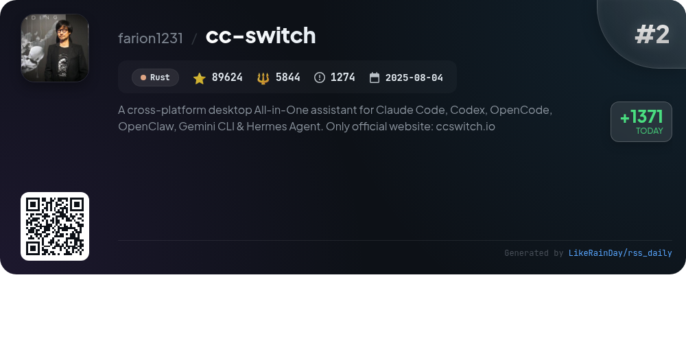
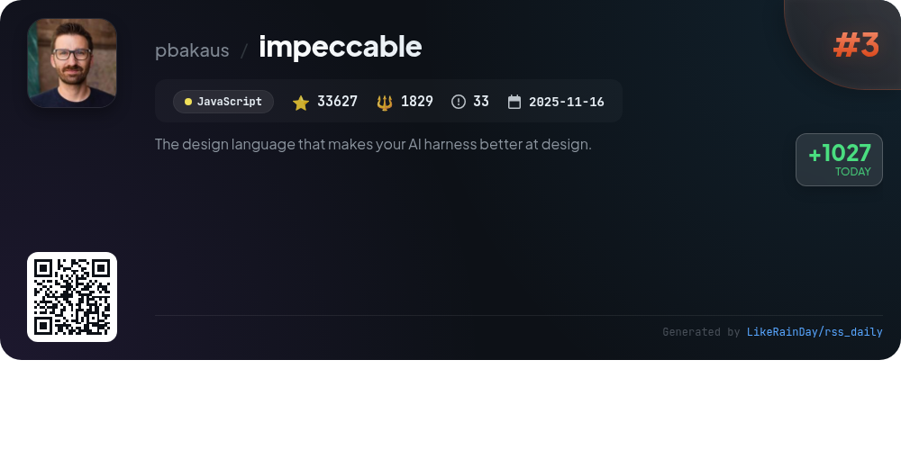
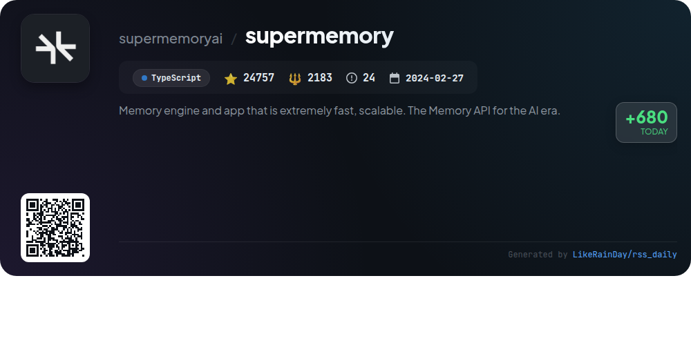
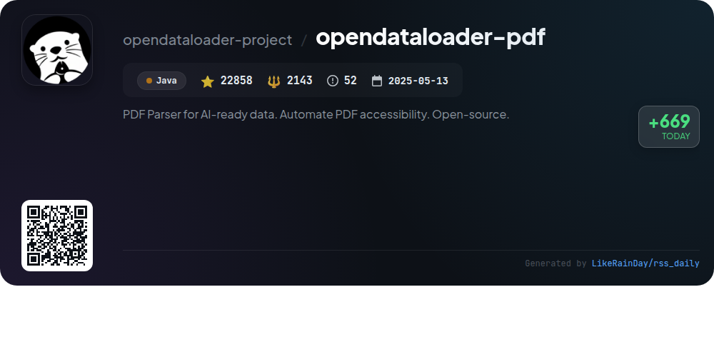
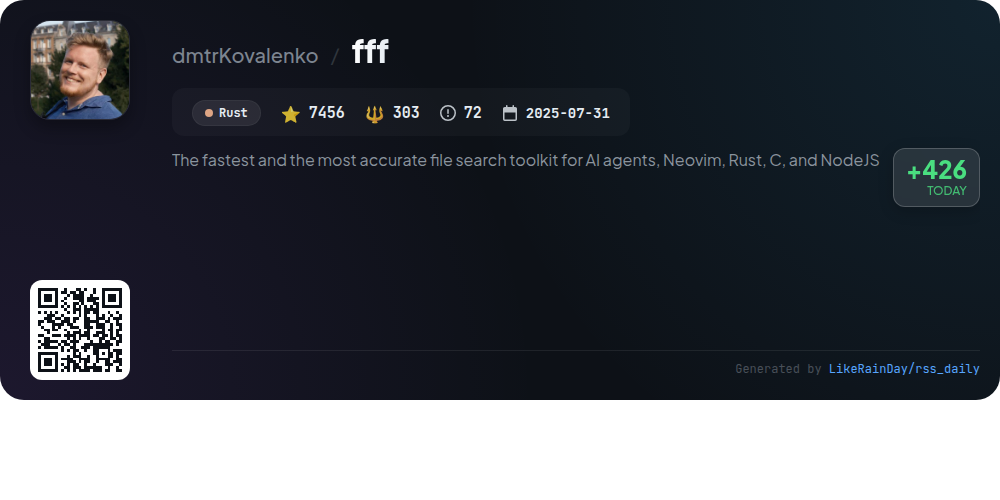
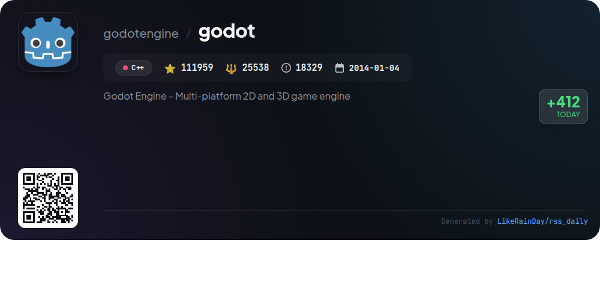
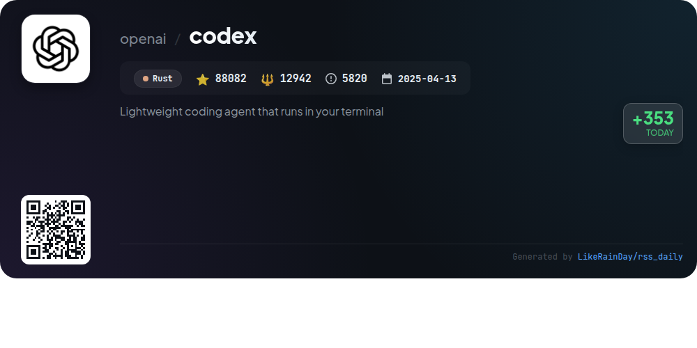
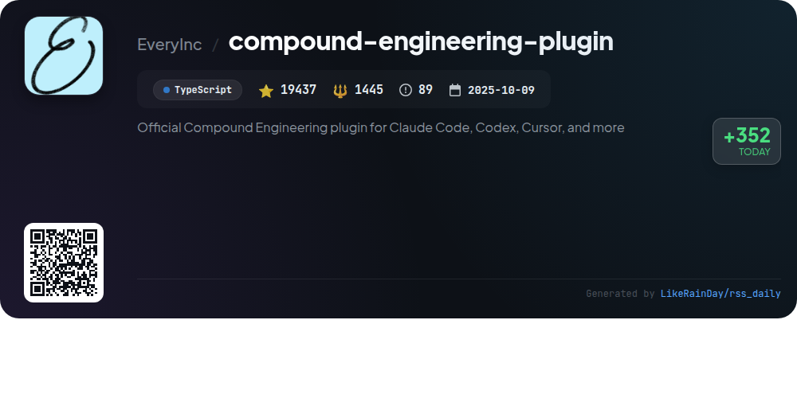
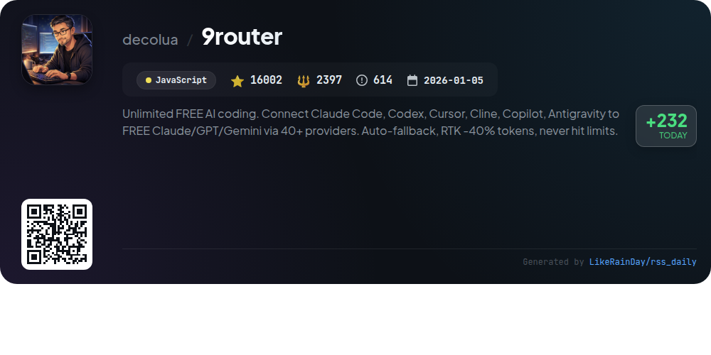

# 📊 🌟 GitHub Trending Daily - 2026-06-03

> > 📅 每日精选 GitHub 热门仓库 | 基于智能算法推荐

## 📋 Overview

**10** 个项目 | **618108** ⭐ | **85966** 🍴

**热门语言:** `Rust` (3) · `JavaScript` (3) · `TypeScript` (2)

**更新时间:** 2026-06-03 04:53 UTC

**分类分布:**

- 🌟 每日 Top 10 精选 (10 项)

---

## 🌟 每日 Top 10 精选

### 1. [ECC](https://github.com/affaan-m/ECC)

> 🤖 **推荐理由**  
> *ECC is a powerful performance optimization system for AI agents, offering skills, instincts, memory management, and security features tailored for Claude Code, Codex, OpenCode, and Cursor. With over 204,000 stars, it supports real-world workflows through 63 agents, 249 skills, and extensive command shims. Key highlights include continuous learning, a comprehensive security scanner (AgentShield), and a user-friendly dashboard GUI. ECC promotes collaborative development and efficient code management, ensuring production-ready solutions across multiple programming languages and frameworks.*

- ⭐ 204306 stars
- 💻 JavaScript
- 📅 Updated: 2026-06-03

### 2. [cc-switch](https://github.com/farion1231/cc-switch)

> 🤖 **推荐理由**  
> *CC Switch is a cross-platform desktop assistant that consolidates multiple AI coding tools, including Claude Code, Codex, and Gemini CLI, into one interface. Key features include one-click provider switching, unified management of MCP and Skills, and over 50 built-in provider presets. It supports cloud sync and offers a system tray for quick access. Built using Rust and Tauri, CC Switch ensures reliable data storage and user-friendly navigation. The app streamlines API management, enhancing productivity for developers across Windows, macOS, and Linux. Visit ccswitch.io for more information.*

- ⭐ 89624 stars
- 💻 Rust
- 📅 Updated: 2026-06-03

### 3. [impeccable](https://github.com/pbakaus/impeccable)

> 🤖 **推荐理由**  
> *Impeccable is a powerful design language tool that enhances AI-driven frontend design with a curated vocabulary of 23 commands and 27 anti-pattern rules. It includes 7 domain reference files covering typography, color, motion, and more, allowing for comprehensive design guidance. Users can execute commands like `/impeccable audit`, `/impeccable polish`, and `/impeccable critique` for design reviews, technical checks, and final touches. Designed for seamless integration with various tools, it empowers developers to create visually compelling and accessible interfaces while avoiding common design pitfalls.*

- ⭐ 33627 stars
- 💻 JavaScript
- 📅 Updated: 2026-06-03

### 4. [supermemory](https://github.com/supermemoryai/supermemory)

> 🤖 **推荐理由**  
> *Supermemory is a high-performance memory engine and app designed for AI, enabling persistent memory across conversations. Key features include automatic fact extraction, user profile maintenance, hybrid search combining retrieval-augmented generation (RAG) and memory, and real-time connectors for various platforms like Google Drive and GitHub. With support for multi-modal data processing and a single API for developers, Supermemory excels in AI memory benchmarks, ensuring your AI retains relevant context and adapts over time. Explore more at supermemory.ai.*

- ⭐ 24757 stars
- 💻 TypeScript
- 📅 Updated: 2026-06-03

### 5. [opendataloader-pdf](https://github.com/opendataloader-project/opendataloader-pdf)

> 🤖 **推荐理由**  
> *OpenDataLoader PDF is an open-source PDF parser designed for AI-ready data extraction and PDF accessibility automation. It offers high extraction accuracy (0.907 overall) and supports various output formats, including Markdown, JSON, and Tagged PDFs. Key features include hybrid processing for complex documents, built-in OCR for scanned PDFs, and auto-tagging capabilities to create accessible Tagged PDFs. Collaborating with the PDF Association, it adheres to accessibility standards, making it a powerful tool for compliance with regulations like EAA and ADA. Available in Java, Python, and Node.js SDKs.*

- ⭐ 22858 stars
- 💻 Java
- 📅 Updated: 2026-06-03

### 6. [fff](https://github.com/dmtrKovalenko/fff)

> 🤖 **推荐理由**  
> *FFF is a high-performance file search toolkit designed for AI agents, Neovim, Rust, C, and NodeJS, achieving superior speed and accuracy over traditional CLIs like ripgrep and fzf. It features typo-resistant path and content search, frecency-ranked file access, and a background file watcher. FFF provides a lightweight in-memory content index, offering tools like `ffgrep` and `fffind` for efficient searching. It supports multiple programming languages through SDKs and libraries, including a Rust crate and a C library, making it ideal for IDEs and long-running processes.*

- ⭐ 7456 stars
- 💻 Rust
- 📅 Updated: 2026-06-03

### 7. [godot](https://github.com/godotengine/godot)

> 🤖 **推荐理由**  
> *Godot Engine is a powerful, open-source game engine for creating 2D and 3D games across multiple platforms, including desktop, mobile, and web. With a unified interface and comprehensive tools, developers can focus on game creation without unnecessary hurdles. Godot is community-driven, fully free under the MIT license, and offers one-click export options. It boasts extensive documentation, active community support, and various learning resources. The engine's development is independent, ensuring users retain full ownership of their games and creations.*

- ⭐ 111959 stars
- 💻 C++
- 📅 Updated: 2026-06-03

### 8. [codex](https://github.com/openai/codex)

> 🤖 **推荐理由**  
> *Codex is a lightweight coding agent developed by OpenAI, designed to run locally in your terminal. With over 88,000 stars, it offers seamless integration with code editors like VS Code and can be launched as a standalone desktop app. Installation is straightforward via scripts or package managers like npm and Homebrew. Users can connect to their ChatGPT accounts for enhanced functionality or utilize an API key for access. The project supports multiple platforms and provides comprehensive documentation for installation and usage.*

- ⭐ 88082 stars
- 💻 Rust
- 📅 Updated: 2026-06-03

### 9. [compound-engineering-plugin](https://github.com/EveryInc/compound-engineering-plugin)

> 🤖 **推荐理由**  
> *The Compound Engineering plugin enhances coding efficiency with AI skills tailored for Claude Code, Codex, and Cursor. Key features include thorough planning via `/ce-brainstorm` and `/ce-plan`, systematic code reviews with `/ce-code-review`, and knowledge documentation through `/ce-compound`. The workflow emphasizes iterative cycles of brainstorming, planning, execution, and review, fostering a compounding effect on knowledge and quality. With 37 skills and 51 agents, it aims to minimize technical debt and streamline engineering tasks, making future work easier.*

- ⭐ 19437 stars
- 💻 TypeScript
- 📅 Updated: 2026-06-03

### 10. [9router](https://github.com/decolua/9router)

> 🤖 **推荐理由**  
> *9Router is an open-source AI coding router that connects multiple AI coding tools (e.g., Claude Code, Codex, Copilot) to over 40 providers, maximizing efficiency and cost savings. Key features include an RTK Token Saver that reduces token usage by 20-40%, automatic fallback between subscription, cheap, and free AI models, and real-time quota tracking. It supports multi-account setups and offers seamless integration with various CLI tools. With 9Router, developers can ensure uninterrupted coding experiences while optimizing costs and resources.*

- ⭐ 16002 stars
- 💻 JavaScript
- 📅 Updated: 2026-06-03

---

## 📡 RSS订阅

通过 RSS 订阅，第一时间获取每日精选项目：

- 🔔 [RSS 订阅源] (../../daily-top.xml)
- 🔔 [每日简报] (../../GITHUB_TODAY_CN.md)
- 🔔 [每日 Top 10 精选](../../daily-top.xml)

---

*⚡ Powered by Smart Trending Algorithm | Generated at 2026-06-03 04:53:45 UTC
