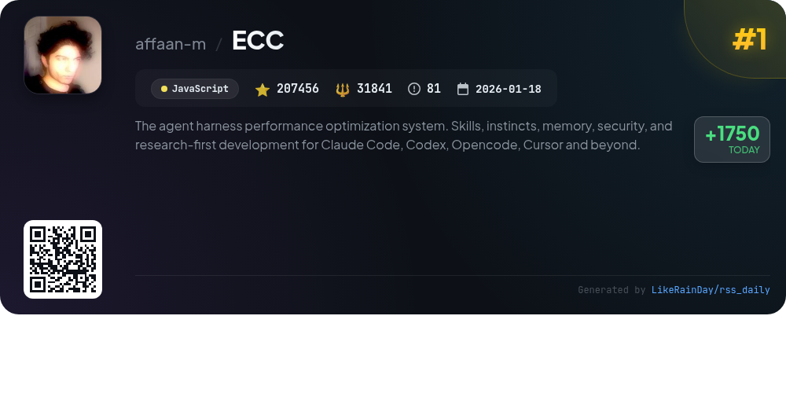
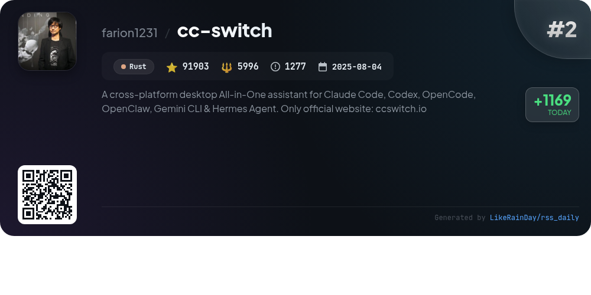
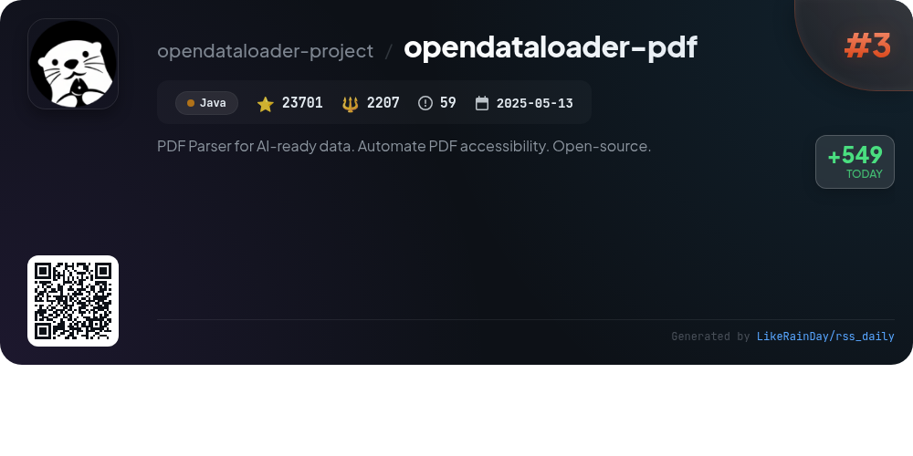
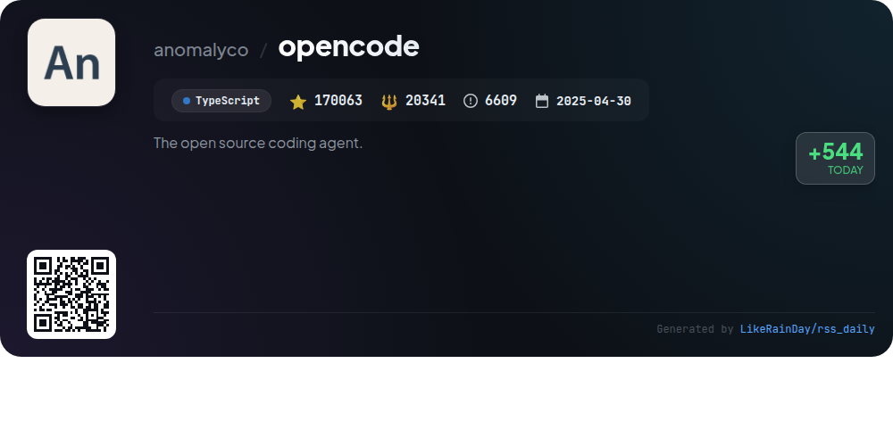
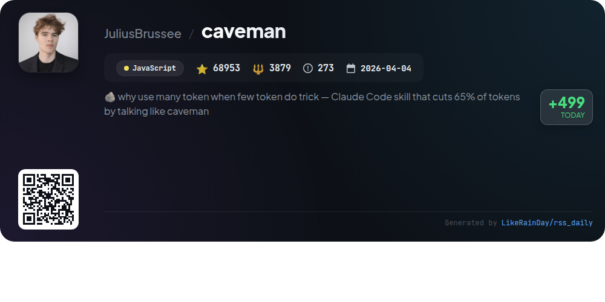
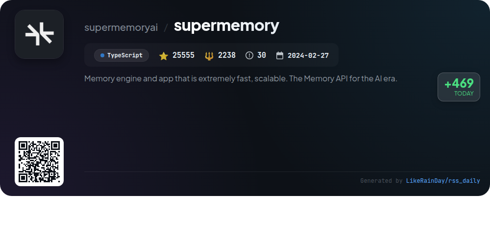
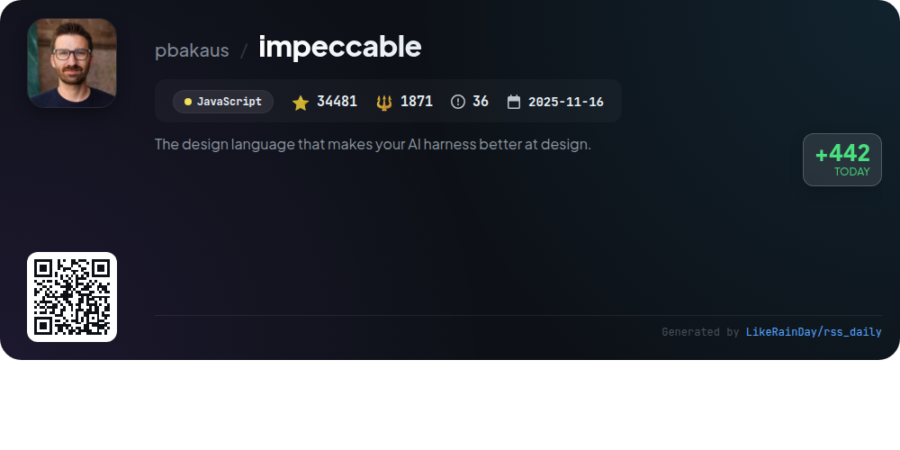
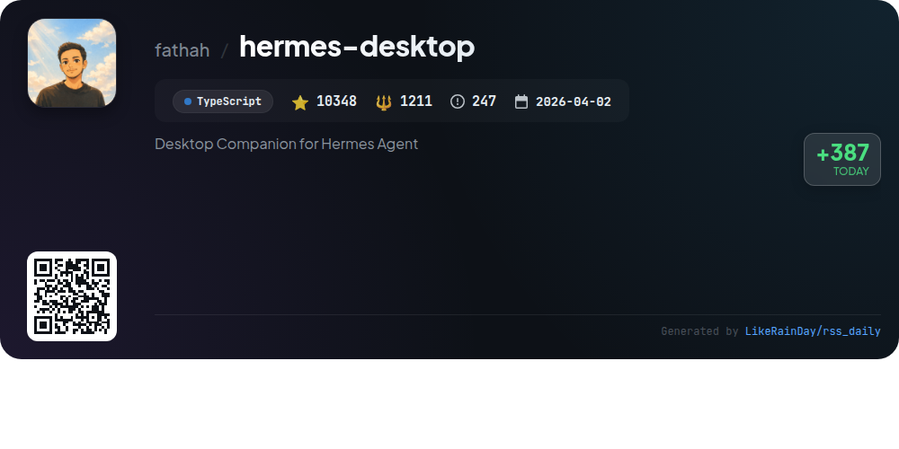
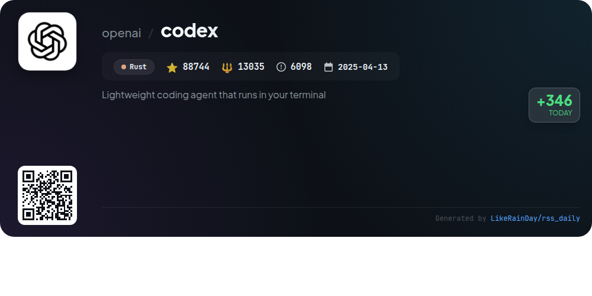
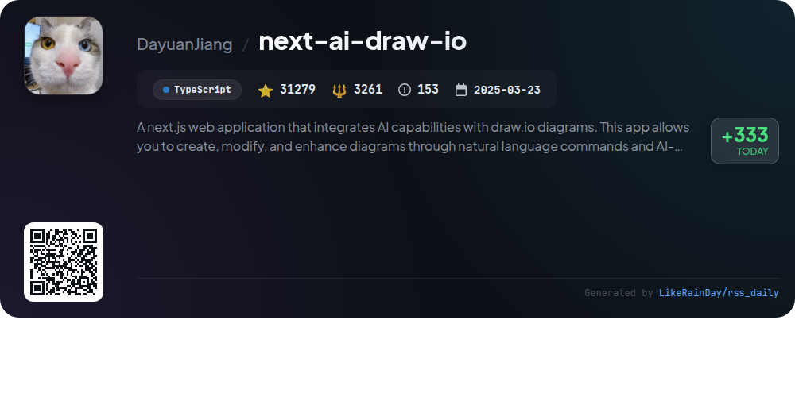

# 📊 🌟 GitHub Trending Daily - 2026-06-05

> > 📅 Daily Picks of GitHub Trending Repositories | Powered by Smart Algorithms

## 📋 Overview

**10** Projects | **752483** ⭐ | **85880** 🍴

**Top Languages:** `TypeScript` (4) · `JavaScript` (3) · `Rust` (2)

**Updated:** 2026-06-05 04:23 UTC

**Categories:**

- 🌟 Daily Top 10 (10 items)

---

## 🌟 Daily Top 10

### 1. [ECC](https://github.com/affaan-m/ECC)

> 🤖 **Why Recommend**  
> *ECC is a high-performance optimization system designed for AI agents, supporting platforms like Claude Code, Codex, and OpenCode. It offers over 250 skills, 63 agents, and a robust plugin for seamless integrations. Key features include skills for continuous learning, security scanning through AgentShield, and customizable workflows. The latest version introduces a user-friendly dashboard, enhanced multi-agent orchestration, and extensive documentation. With a focus on memory optimization, security, and cross-platform support, ECC is ideal for developers seeking advanced agent management and performance tuning.*

- ⭐ 207456 stars
- 💻 JavaScript
- 📅 Updated: 2026-06-05

### 2. [cc-switch](https://github.com/farion1231/cc-switch)

> 🤖 **Why Recommend**  
> *CC Switch is a cross-platform desktop assistant for managing multiple AI coding tools, including Claude Code, Codex, and Gemini CLI. With over 91,000 stars on GitHub, it offers a unified interface to switch providers seamlessly without manual configuration. Key features include 50+ provider presets, unified MCP and skills management, instant provider switching via system tray, and cloud sync capabilities. Built with Rust and Tauri, CC Switch ensures reliable performance across Windows, macOS, and Linux, streamlining AI-assisted programming in one application. Visit ccswitch.io for more.*

- ⭐ 91903 stars
- 💻 Rust
- 📅 Updated: 2026-06-05

### 3. [opendataloader-pdf](https://github.com/opendataloader-project/opendataloader-pdf)

> 🤖 **Why Recommend**  
> *OpenDataLoader PDF is an open-source PDF parser designed for AI-ready data extraction and PDF accessibility automation, receiving 23,701 stars on GitHub. It excels in converting PDFs to structured formats like Markdown, JSON, and Tagged PDF, boasting the highest extraction accuracy (0.907 overall) in benchmark tests. Key features include built-in OCR, hybrid AI mode for complex documents, and automated tagging for accessibility compliance (PDF/UA). It supports Java, Python, and Node.js SDKs, making it versatile for various applications while ensuring data privacy with local processing.*

- ⭐ 23701 stars
- 💻 Java
- 📅 Updated: 2026-06-05

### 4. [opencode](https://github.com/anomalyco/opencode)

> 🤖 **Why Recommend**  
> *OpenCode is an open-source AI coding agent, developed in TypeScript, that streamlines coding tasks with two main agents: the full-access "build" agent for development and the read-only "plan" agent for analysis and exploration. With over 170,000 stars, it supports multiple platforms and offers a desktop application. Installation is easy via various package managers. Key features include advanced search capabilities and a user-friendly interface. OpenCode emphasizes community engagement and provides extensive documentation for users and contributors. Visit [opencode.ai](https://opencode.ai) for more details.*

- ⭐ 170063 stars
- 💻 TypeScript
- 📅 Updated: 2026-06-05

### 5. [caveman](https://github.com/JuliusBrussee/caveman)

> 🤖 **Why Recommend**  
> *Caveman is a JavaScript plugin for Claude Code that significantly reduces token usage by simplifying responses, achieving approximately 75% fewer tokens while maintaining technical accuracy. Key features include adjustable output compression levels (lite, full, ultra, wenyan), conventional commit message generation, and one-line PR comments. The plugin also offers session statistics for token savings and can compress memory files for future use. With over 68,900 stars, Caveman is designed to enhance efficiency and readability in coding interactions, making it a valuable addition to various coding agents.*

- ⭐ 68953 stars
- 💻 JavaScript
- 📅 Updated: 2026-06-05

### 6. [supermemory](https://github.com/supermemoryai/supermemory)

> 🤖 **Why Recommend**  
> *Supermemory is a cutting-edge memory engine and application designed for AI, enabling persistent memory across conversations. It automatically learns from interactions, maintaining user profiles and extracting facts while handling updates and contradictions. Core features include hybrid search (RAG + memory), real-time connectors to services like Google Drive and Notion, and multi-modal extractors for various file types. With over 25,000 stars on GitHub, Supermemory supports seamless integration through a single API, making it ideal for both personal use and AI product development.*

- ⭐ 25555 stars
- 💻 TypeScript
- 📅 Updated: 2026-06-05

### 7. [impeccable](https://github.com/pbakaus/impeccable)

> 🤖 **Why Recommend**  
> *Impeccable is a powerful design skill for AI, enhancing frontend design through a shared vocabulary and curated anti-patterns. With 23 commands, it covers typography, color, motion, interaction, and responsive design, ensuring quality and consistency. Key features include domain reference files, a CLI for detecting design flaws, and a browser extension for real-time design critiques. Designed to work with multiple AI tools like Cursor and Claude Code, Impeccable streamlines the design process, making it easier for developers to create visually appealing and functional interfaces. Visit impeccable.style for more details.*

- ⭐ 34481 stars
- 💻 JavaScript
- 📅 Updated: 2026-06-05

### 8. [hermes-desktop](https://github.com/fathah/hermes-desktop)

> 🤖 **Why Recommend**  
> *Hermes Desktop is a powerful native app designed for managing the Hermes Agent, a self-improving AI assistant. It streamlines installation, configuration, and daily use with a user-friendly GUI. Key features include multi-provider support (OpenAI, Google, Anthropic, and more), an intuitive chat interface with real-time streaming, session management, profile switching, and a comprehensive memory system. It supports 16 messaging gateways and offers scheduled tasks, tool integration, and a persona editor, making it a versatile companion for AI interactions. With over 10,348 stars, it is actively developed and community-driven.*

- ⭐ 10348 stars
- 💻 TypeScript
- 📅 Updated: 2026-06-05

### 9. [codex](https://github.com/openai/codex)

> 🤖 **Why Recommend**  
> *Codex is a lightweight coding agent from OpenAI that operates locally in your terminal, enhancing coding efficiency. With over 88,000 stars, it supports installation via curl, npm, or Homebrew, making setup straightforward on various platforms. Users can also access Codex in popular IDEs or through a desktop app. For enhanced functionality, it integrates with ChatGPT plans, allowing seamless use of advanced coding features. Comprehensive documentation and contribution guidelines are available, ensuring a robust user experience.*

- ⭐ 88744 stars
- 💻 Rust
- 📅 Updated: 2026-06-05

### 10. [next-ai-draw-io](https://github.com/DayuanJiang/next-ai-draw-io)

> 🤖 **Why Recommend**  
> *Next AI Draw.io is a Next.js web application that leverages AI to enhance draw.io diagrams through natural language commands. It allows users to create, modify, and visualize diagrams easily, featuring LLM-powered diagram creation, image-based replication, and support for PDF and text file uploads. The app includes version control, an interactive chat interface, and specialized support for cloud architecture diagrams. Users can deploy on platforms like Vercel and Cloudflare Workers, and it supports multiple AI providers, offering flexibility in diagram generation.*

- ⭐ 31279 stars
- 💻 TypeScript
- 📅 Updated: 2026-06-05

---

## 📡 RSS Subscription

Subscribe via RSS to get daily trending updates:

- 🔔 [RSS XML] (../../daily-top.xml)
- 🔔 [Daily Report] (../../GITHUB_TODAY.md)
- 🔔 [Daily Top 10](../../daily-top.xml)

---

*⚡ Powered by Smart Trending Algorithm | Generated at 2026-06-05 04:23:05 UTC
