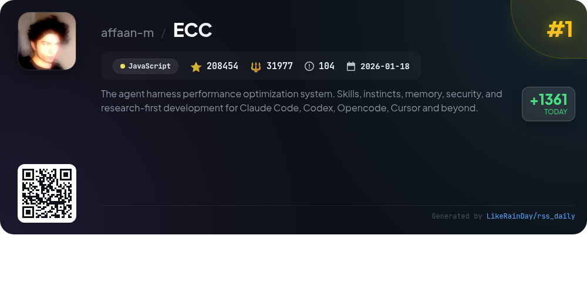
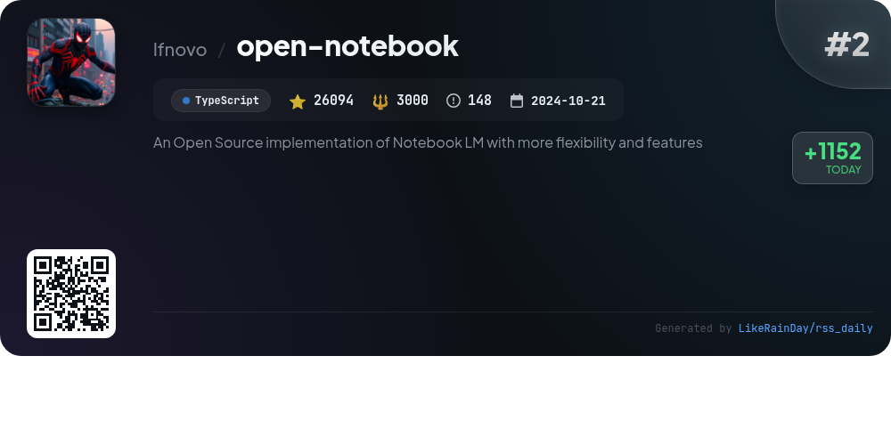
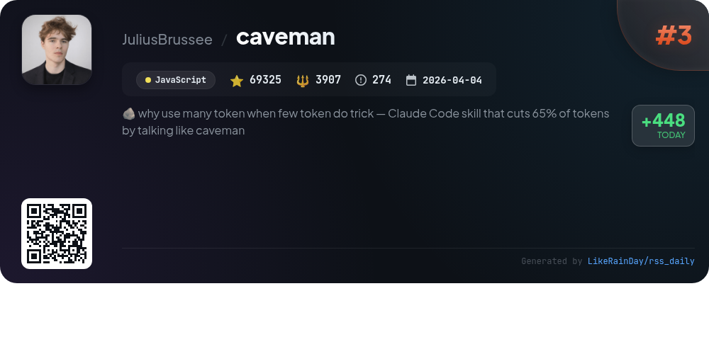
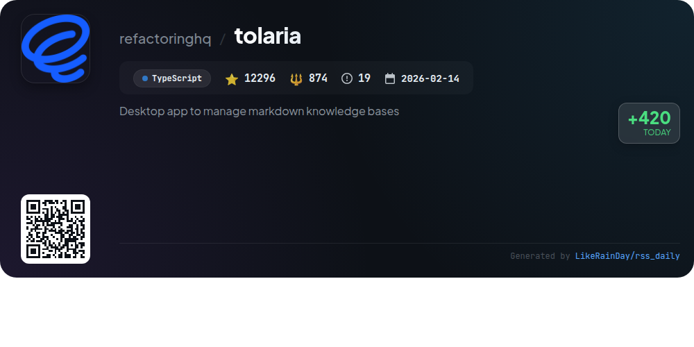
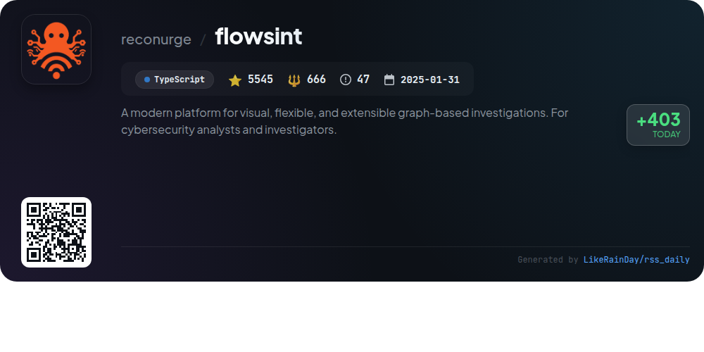
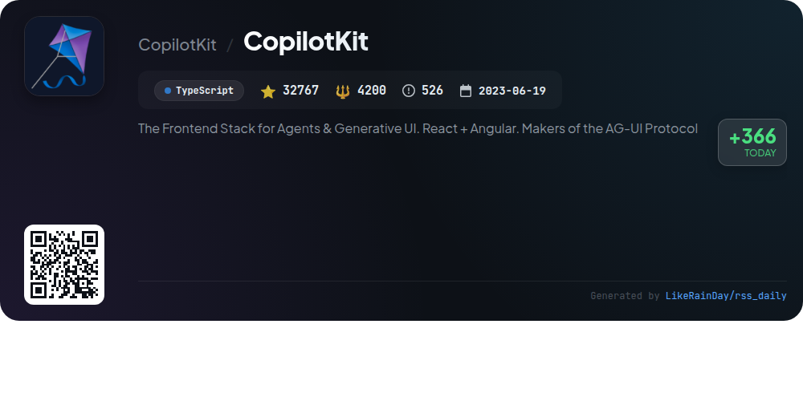
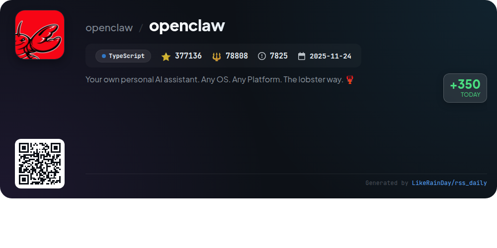
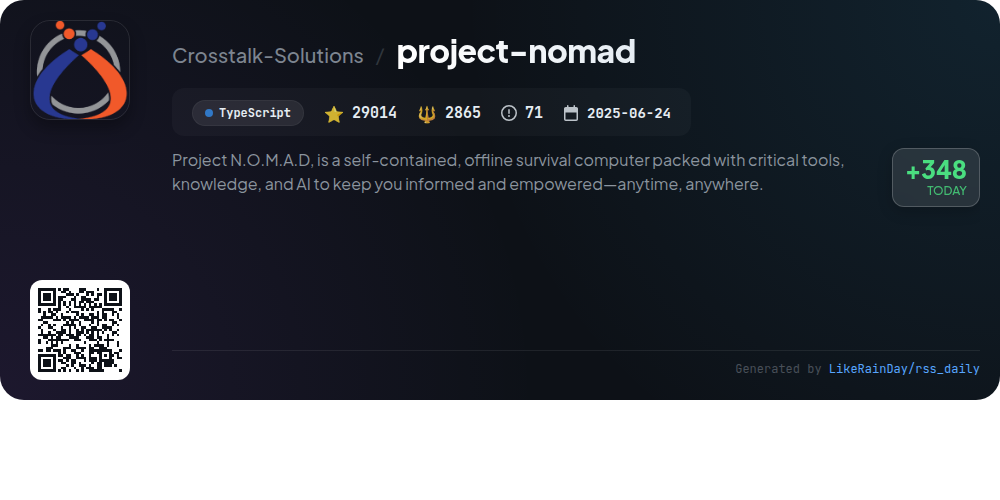
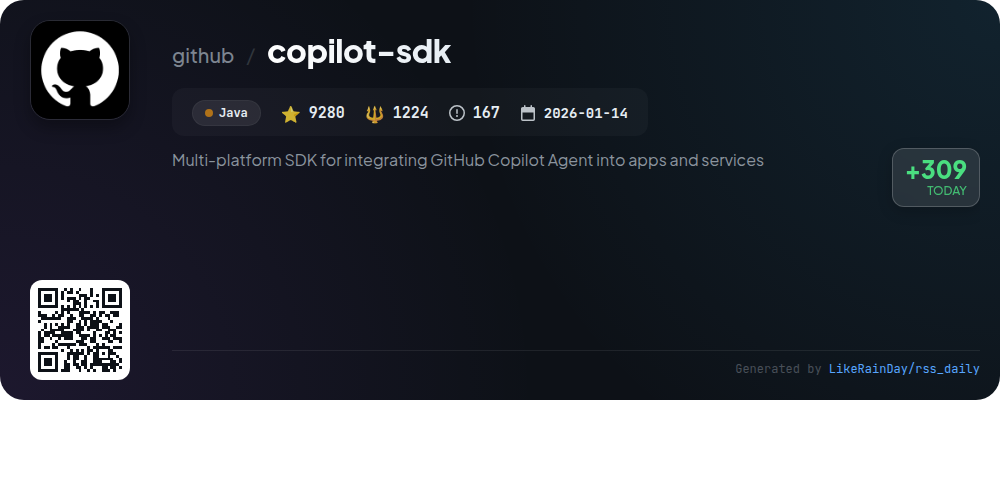
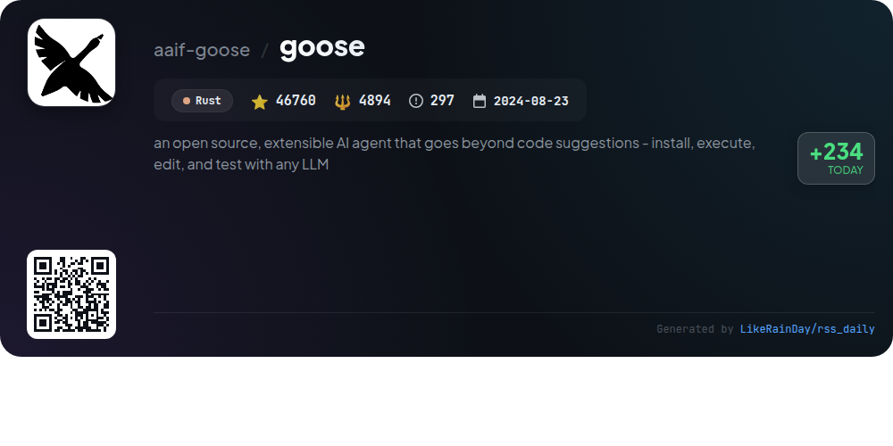

# 📊 🌟 GitHub Trending Daily - 2026-06-06

> > 📅 Daily Picks of GitHub Trending Repositories | Powered by Smart Algorithms

## 📋 Overview

**10** Projects | **816671** ⭐ | **132415** 🍴

**Top Languages:** `TypeScript` (6) · `JavaScript` (2) · `Java` (1)

**Updated:** 2026-06-06 04:05 UTC

**Categories:**

- 🌟 Daily Top 10 (10 items)

---

## 🌟 Daily Top 10

### 1. [ECC](https://github.com/affaan-m/ECC)

> 🤖 **Why Recommend**  
> *ECC is a comprehensive performance optimization system for AI agents like Claude Code and Codex. It offers skills, instincts, memory optimization, continuous learning, and security scanning, enabling streamlined workflows across multiple platforms. With over 63 agents and 251 skills, ECC supports tasks from planning and coding to testing and security reviews. Its features include a desktop GUI for easy exploration, a security auditing tool (AgentShield), and customizable installation options. ECC is open-source and actively maintained, with a strong community and extensive documentation.*

- ⭐ 208454 stars
- 💻 JavaScript
- 📅 Updated: 2026-06-06

### 2. [open-notebook](https://github.com/lfnovo/open-notebook)

> 🤖 **Why Recommend**  
> *Open Notebook is an open-source, privacy-focused alternative to Google's Notebook LM, boasting over 26,000 stars on GitHub. Key features include support for 18+ AI models (OpenAI, Anthropic, etc.), multi-modal content organization (PDFs, videos, etc.), advanced podcast generation with custom profiles, and intelligent full-text search. Users can maintain complete data control with self-hosting options and a comprehensive REST API. The platform offers a multi-language UI, customizable deployments, and enhanced citation management, making it a versatile tool for research and content creation.*

- ⭐ 26094 stars
- 💻 TypeScript
- 📅 Updated: 2026-06-06

### 3. [caveman](https://github.com/JuliusBrussee/caveman)

> 🤖 **Why Recommend**  
> *Caveman is a JavaScript plugin that enhances Claude Code and other agents by reducing output tokens by up to 75% while maintaining technical accuracy. Key features include adjustable output levels (lite, full, ultra, wenyan), commands for generating concise commit messages and PR comments, and real-time token usage statistics. It integrates seamlessly with various agents, offering a lightweight installation process. Caveman promotes efficiency in communication, making it ideal for developers seeking to streamline their interactions with AI while saving costs and improving readability.*

- ⭐ 69325 stars
- 💻 JavaScript
- 📅 Updated: 2026-06-06

### 4. [tolaria](https://github.com/refactoringhq/tolaria)

> 🤖 **Why Recommend**  
> *Tolaria is a versatile desktop app for managing markdown knowledge bases on macOS, Windows, and Linux, boasting over 12,000 stars on GitHub. It enables users to operate second brains, organize company documents, and store assistant memories without cloud dependency. Key features include a "files-first" approach with plain markdown files, Git integration for version control, and an offline-first design. Tolaria is open source, keyboard-centric, and supports AI tools while ensuring user data remains portable and secure. Ideal for power users, it enhances productivity through customizable workflows.*

- ⭐ 12296 stars
- 💻 TypeScript
- 📅 Updated: 2026-06-06

### 5. [flowsint](https://github.com/reconurge/flowsint)

> 🤖 **Why Recommend**  
> *A modern platform for visual, flexible, and extensible graph-based investigations. For cybersecurity analysts and investigators.. popular project, actively maintained, recently updated*

- ⭐ 5545 stars
- 🍴 666 forks
- 💻 TypeScript
- 📅 Updated: 2026-06-06

### 6. [CopilotKit](https://github.com/CopilotKit/CopilotKit)

> 🤖 **Why Recommend**  
> *CopilotKit is a versatile SDK for building agent-native applications across various platforms, including React, Angular, and mobile environments. With its core features such as customizable chat UI, generative UI for dynamic component rendering, and a shared state layer, it supports real-time interactions. The framework enables human-in-the-loop workflows and self-learning agents that adapt based on user feedback. Positioned as the backbone for the AG-UI Protocol, adopted by major companies, CopilotKit facilitates seamless integration into existing workflows, including Slack and Microsoft Teams.*

- ⭐ 32767 stars
- 💻 TypeScript
- 📅 Updated: 2026-06-06

### 7. [openclaw](https://github.com/openclaw/openclaw)

> 🤖 **Why Recommend**  
> *OpenClaw is a versatile personal AI assistant designed for any platform (macOS, Windows, Linux, iOS, Android) that operates locally on your devices. It supports multiple messaging channels including WhatsApp, Telegram, Discord, and more, allowing seamless interaction. Key features include a local-first gateway, multi-channel inbox, voice commands, and a live canvas for visual tasks. The onboarding process is user-friendly, guiding users through setup while ensuring robust security protocols. With over 377,000 stars on GitHub, OpenClaw aims to provide a fast, efficient, and personalized AI experience.*

- ⭐ 377136 stars
- 💻 TypeScript
- 📅 Updated: 2026-06-06

### 8. [project-nomad](https://github.com/Crosstalk-Solutions/project-nomad)

> 🤖 **Why Recommend**  
> *Project N.O.M.A.D. is a self-contained offline survival computer, offering essential tools and AI to empower users anytime, anywhere. Key features include an AI chat with a knowledge base, an offline information library (Wikipedia, medical references), an education platform with Khan Academy courses, and offline maps. The system supports data tools for encoding and encryption, local note-taking, and a performance benchmark leaderboard. Designed for Debian-based systems, it emphasizes easy installation and robust functionality, making it ideal for offline knowledge management.*

- ⭐ 29014 stars
- 💻 TypeScript
- 📅 Updated: 2026-06-06

### 9. [copilot-sdk](https://github.com/github/copilot-sdk)

> 🤖 **Why Recommend**  
> *The GitHub Copilot SDK is a multi-platform SDK designed for integrating the GitHub Copilot Agent into applications across various languages, including Java, Python, TypeScript, Go, .NET, and Rust. It provides a production-tested agent runtime that simplifies embedding AI workflows, handling planning, tool invocation, and file edits. The SDK supports multiple authentication methods, including GitHub OAuth and BYOK (Bring Your Own Key). With detailed documentation, quick-start guides, and a robust architecture using JSON-RPC, developers can easily create custom agents and tools for enhanced functionality.*

- ⭐ 9280 stars
- 💻 Java
- 📅 Updated: 2026-06-06

### 10. [goose](https://github.com/aaif-goose/goose)

> 🤖 **Why Recommend**  
> *goose is an open-source, extensible AI agent that operates as a desktop app, CLI, and API, designed for a variety of tasks including coding, research, automation, and data analysis. Built in Rust for performance, it supports over 15 AI providers such as OpenAI, Google, and Anthropic, allowing users to leverage existing subscriptions. With compatibility across macOS, Linux, and Windows, goose connects to 70+ extensions via the Model Context Protocol. Now part of the Agentic AI Foundation at the Linux Foundation, it offers a robust framework for enhancing workflows.*

- ⭐ 46760 stars
- 💻 Rust
- 📅 Updated: 2026-06-06

---

## 📡 RSS Subscription

Subscribe via RSS to get daily trending updates:

- 🔔 [RSS XML] (../../daily-top.xml)
- 🔔 [Daily Report] (../../GITHUB_TODAY.md)
- 🔔 [Daily Top 10](../../daily-top.xml)

---

*⚡ Powered by Smart Trending Algorithm | Generated at 2026-06-06 04:05:21 UTC
