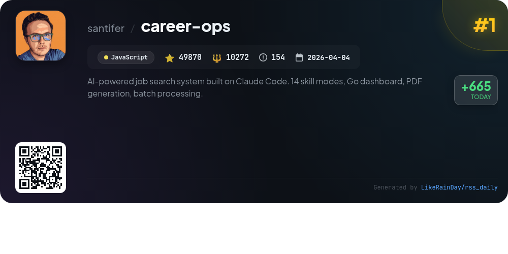
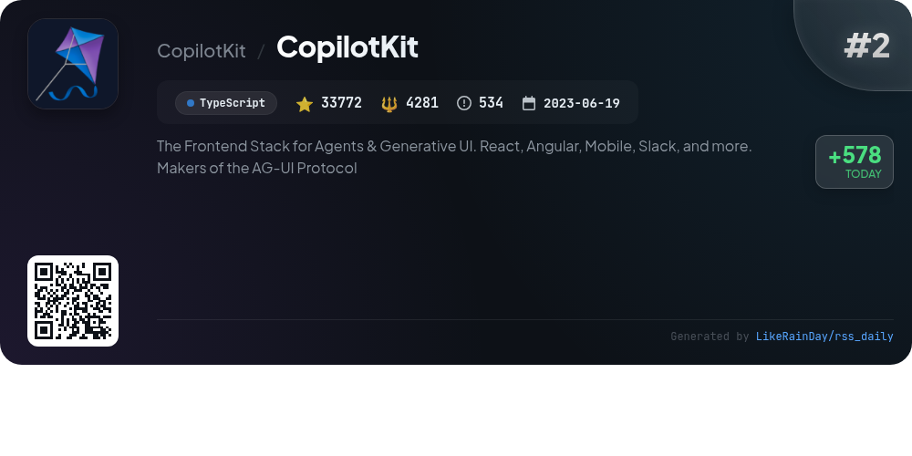
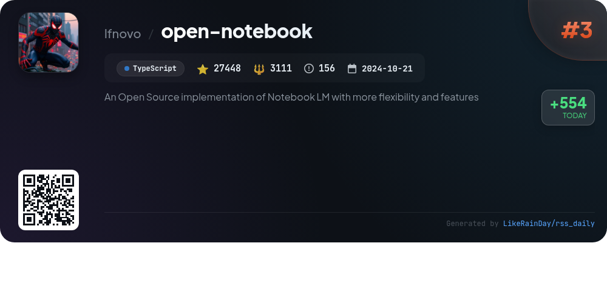
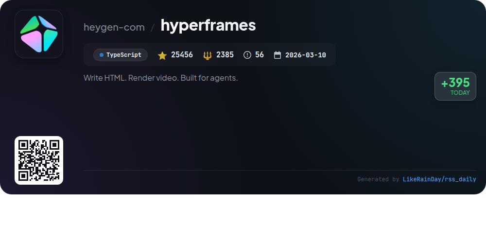
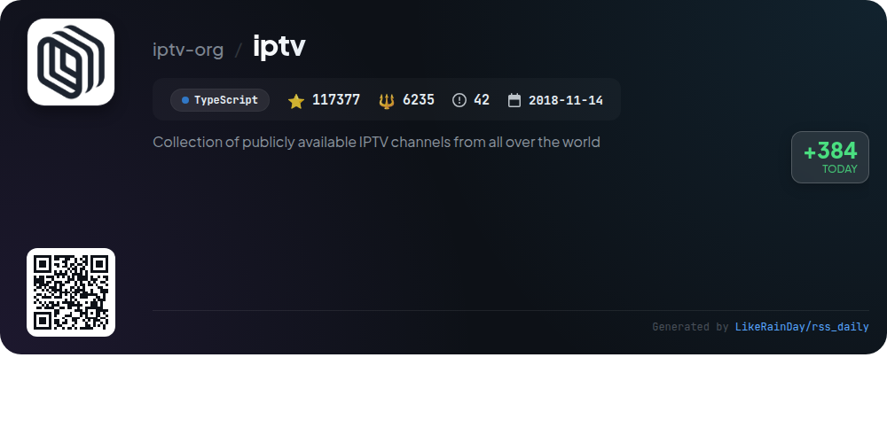
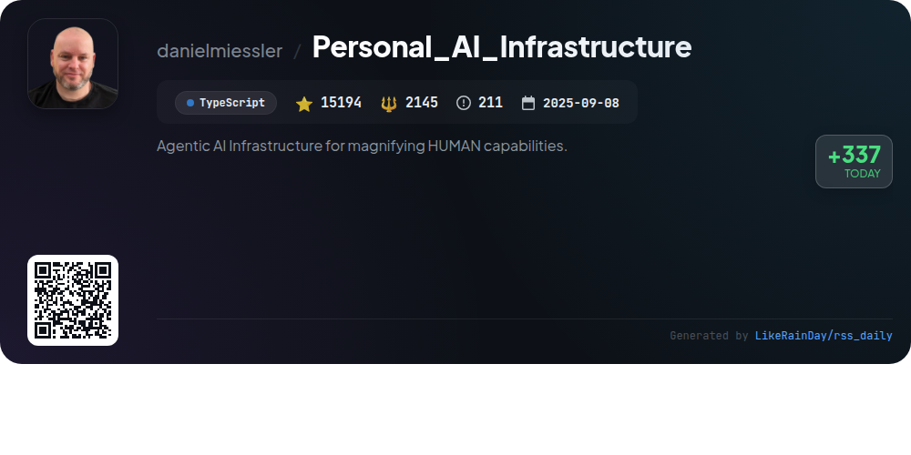
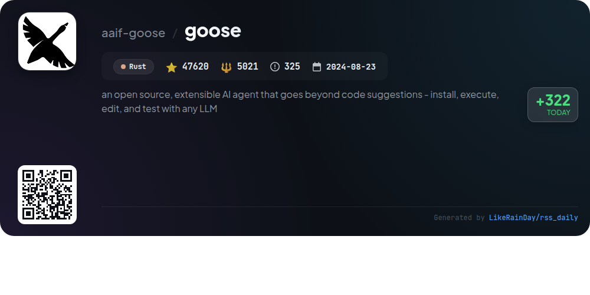
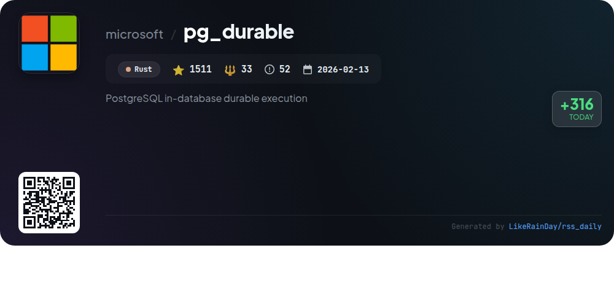
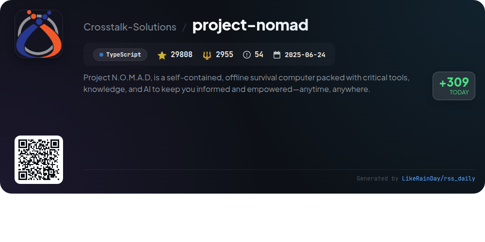
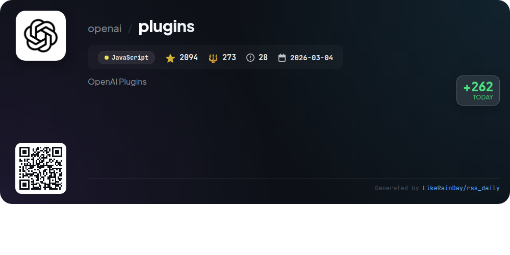

# 📊 🌟 GitHub Trending Daily - 2026-06-08

> > 📅 每日精选 GitHub 热门仓库 | 基于智能算法推荐

## 📋 Overview

**10** 个项目 | **350150** ⭐ | **36711** 🍴

**热门语言:** `TypeScript` (6) · `JavaScript` (2) · `Rust` (2)

**更新时间:** 2026-06-08 04:46 UTC

**分类分布:**

- 🌟 每日 Top 10 精选 (10 项)

---

## 🌟 每日 Top 10 精选

### 1. [career-ops](https://github.com/santifer/career-ops)

> 🤖 **推荐理由**  
> *Career-Ops is an AI-powered job search system designed to optimize the job application process. Key features include a structured A-F evaluation system for job offers, personalized ATS-optimized CV generation, automated scanning of over 45 job portals, and batch processing to handle multiple job applications simultaneously. The system provides a dashboard for tracking applications and integrates with Claude Code for intelligent resume adaptation. Its open-source nature empowers users to customize workflows, making it a valuable tool for job seekers to efficiently navigate their career paths.*

- ⭐ 49870 stars
- 💻 JavaScript
- 📅 Updated: 2026-06-08

### 2. [CopilotKit](https://github.com/CopilotKit/CopilotKit)

> 🤖 **推荐理由**  
> *CopilotKit is a powerful SDK for building full-stack agentic applications across multiple platforms, including React, Angular, and mobile. Key features include a customizable chat UI, dynamic Generative UI, real-time shared state, and human-in-the-loop workflows. The framework enables seamless integration with Slack and Microsoft Teams, allowing agents to operate in existing workflows. With self-learning capabilities and the AG-UI Protocol adopted by major companies, CopilotKit delivers an innovative solution for developing intelligent applications. Explore the documentation and examples to get started.*

- ⭐ 33772 stars
- 💻 TypeScript
- 📅 Updated: 2026-06-08

### 3. [open-notebook](https://github.com/lfnovo/open-notebook)

> 🤖 **推荐理由**  
> *Open Notebook is an open-source, privacy-focused alternative to Google's Notebook LM, offering enhanced flexibility and features. Key highlights include support for 18+ AI providers, allowing users to select models from OpenAI, Anthropic, and more. It enables multi-modal content organization, professional podcast generation, and intelligent search across all materials. Users can maintain complete data control with self-hosting options. The platform supports various languages and features a comprehensive REST API for customization, making it a robust tool for research and content management.*

- ⭐ 27448 stars
- 💻 TypeScript
- 📅 Updated: 2026-06-08

### 4. [hyperframes](https://github.com/heygen-com/hyperframes)

> 🤖 **推荐理由**  
> *HyperFrames is an open-source framework that transforms HTML, CSS, and media into deterministic MP4 videos, designed for both developers and AI agents. Key features include a CLI for local project management, agent skills for automated video creation, and a catalog of reusable components. It supports various animation libraries (GSAP, Lottie, etc.) and offers a straightforward authoring model without a build step. HyperFrames can be run locally or via AWS Lambda, making it ideal for CI and automated rendering. Explore more at hyperframes.dev.*

- ⭐ 25456 stars
- 💻 TypeScript
- 📅 Updated: 2026-06-08

### 5. [iptv](https://github.com/iptv-org/iptv)

> 🤖 **推荐理由**  
> *IPTV is a comprehensive collection of publicly available IPTV channels from around the globe, built with TypeScript and boasting over 117,000 stars on GitHub. Users can easily access channels by pasting playlist links into compatible video players. The project includes an extensive main playlist, an Electronic Program Guide (EPG) for channel scheduling, and a database of channel data. Additionally, it offers an API, resources for further exploration, and a community for discussions and contributions. Legal disclaimers clarify that no video files are stored, only links to publicly available streams.*

- ⭐ 117377 stars
- 💻 TypeScript
- 📅 Updated: 2026-06-08

### 6. [Personal_AI_Infrastructure](https://github.com/danielmiessler/Personal_AI_Infrastructure)

> 🤖 **推荐理由**  
> *Personal_AI_Infrastructure (PAI) is a transformative Life Operating System designed to enhance human capabilities through AI. Key features include a unified Pulse daemon for life management, a Digital Assistant (DA) for personalized interactions, and an advanced Algorithm that guides users from their current state to their ideal state through a structured process. PAI supports a text-based memory system, custom skills, and seamless integration of personal context. With over 45 skills and 171 workflows, it empowers users to articulate goals, manage tasks, and optimize their lives effectively.*

- ⭐ 15194 stars
- 💻 TypeScript
- 📅 Updated: 2026-06-08

### 7. [goose](https://github.com/aaif-goose/goose)

> 🤖 **推荐理由**  
> *goose is an open-source, extensible AI agent designed for various tasks, including coding, research, automation, and data analysis. Built in Rust for performance, it offers a native desktop app for macOS, Linux, and Windows, along with a full CLI and API for seamless integration. It supports over 15 AI providers, such as OpenAI and Google, and connects to 70+ extensions via the Model Context Protocol. Now part of the Agentic AI Foundation at the Linux Foundation, goose prioritizes user collaboration and customization, making it a versatile tool for diverse workflows.*

- ⭐ 47620 stars
- 💻 Rust
- 📅 Updated: 2026-06-08

### 8. [pg_durable](https://github.com/microsoft/pg_durable)

> 🤖 **推荐理由**  
> *PostgreSQL in-database durable execution. popular project, recently updated*

- ⭐ 1511 stars
- 🍴 33 forks
- 💻 Rust
- 📅 Updated: 2026-06-08

### 9. [project-nomad](https://github.com/Crosstalk-Solutions/project-nomad)

> 🤖 **推荐理由**  
> *Project N.O.M.A.D. is an offline-first survival computer designed to provide essential tools, knowledge, and AI capabilities anytime, anywhere. Key features include a local AI chat assistant, offline Wikipedia, medical references, Khan Academy courses, and regional maps. It also offers data analysis tools, local note-taking, and system benchmarking. The project is built on Docker for easy management and installation on Debian-based systems. With no built-in telemetry and minimal internet reliance, N.O.M.A.D. prioritizes user privacy and security.*

- ⭐ 29808 stars
- 💻 TypeScript
- 📅 Updated: 2026-06-08

### 10. [plugins](https://github.com/openai/plugins)

> 🤖 **推荐理由**  
> *The "plugins" GitHub repository offers a curated collection of OpenAI Codex plugin examples, featuring a variety of core functionalities. Each plugin, organized under `plugins/<name>/`, includes a `.codex-plugin/plugin.json` manifest and optional components like `skills/`, `commands/`, and `assets/`. Notable plugins include `figma` for design integration, `notion` for research and planning, and `build-ios-apps` for SwiftUI development. Additional plugins support web, macOS, and React Native applications, enhancing deployment, performance, and debugging workflows. With 2094 stars, this repository serves as a valuable resource for developers leveraging Codex plugins.*

- ⭐ 2094 stars
- 💻 JavaScript
- 📅 Updated: 2026-06-08

---

## 📡 RSS订阅

通过 RSS 订阅，第一时间获取每日精选项目：

- 🔔 [RSS 订阅源] (../../daily-top.xml)
- 🔔 [每日简报] (../../GITHUB_TODAY_CN.md)
- 🔔 [每日 Top 10 精选](../../daily-top.xml)

---

*⚡ Powered by Smart Trending Algorithm | Generated at 2026-06-08 04:46:46 UTC
