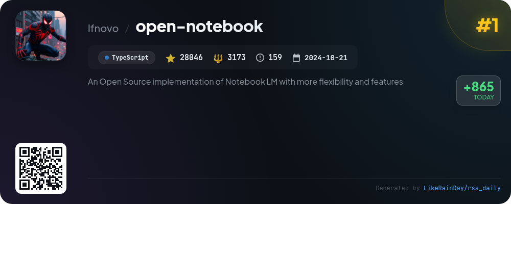
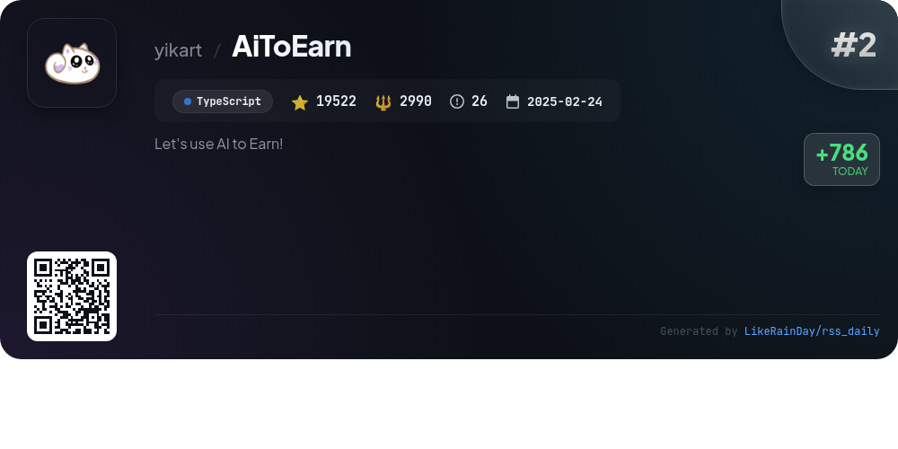
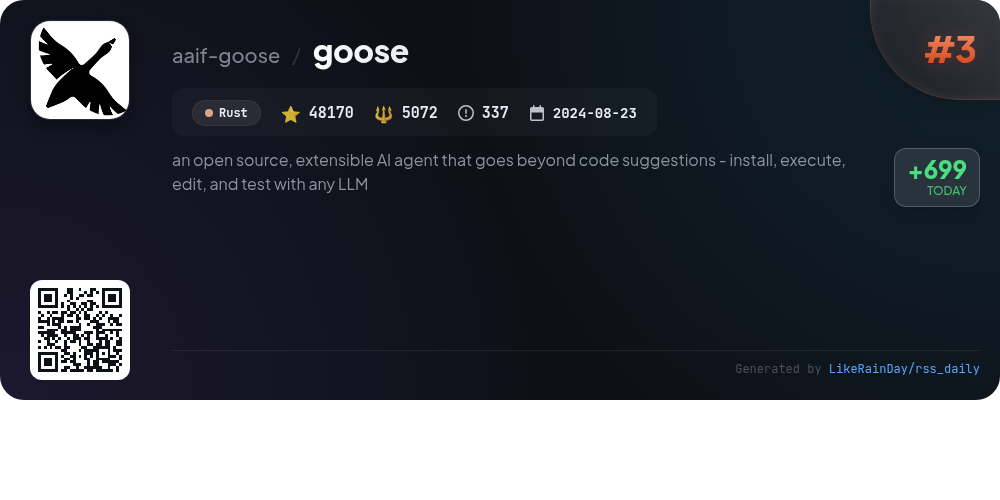
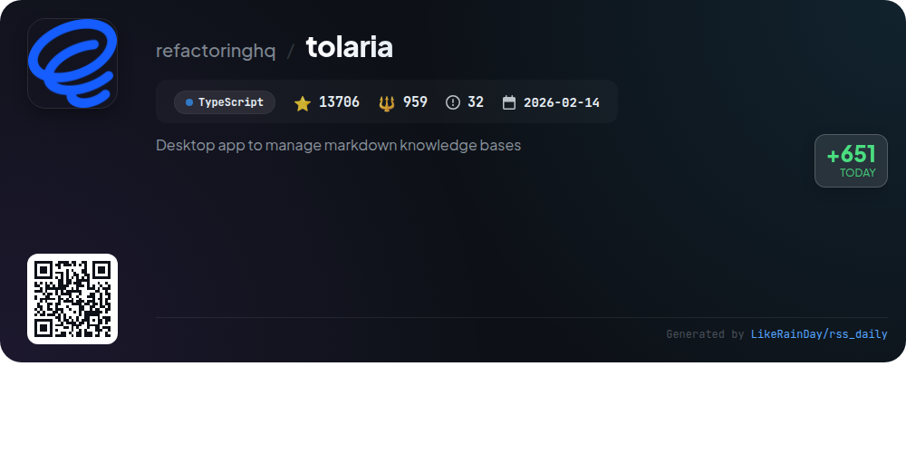
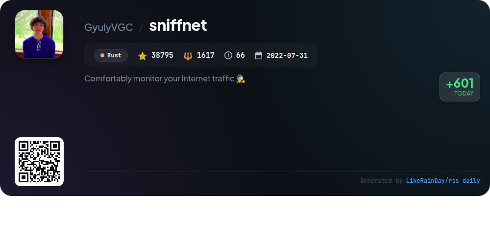
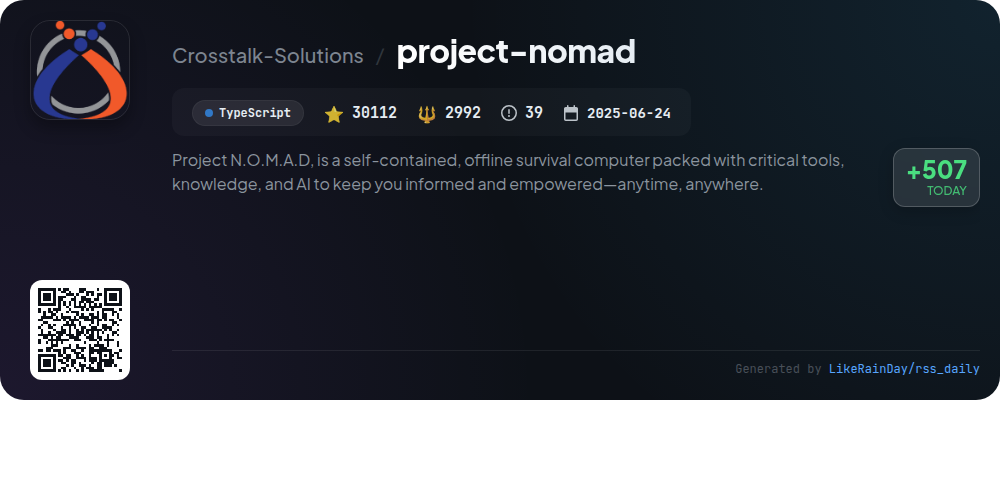
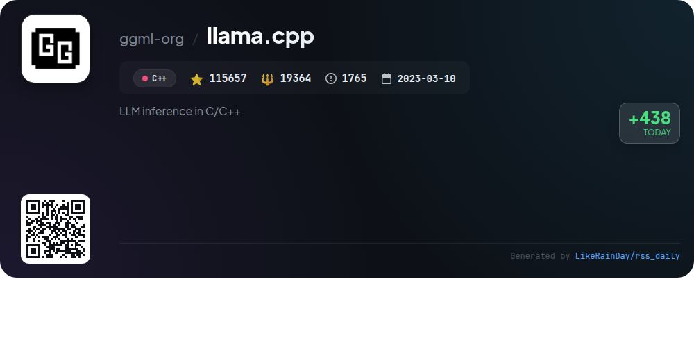
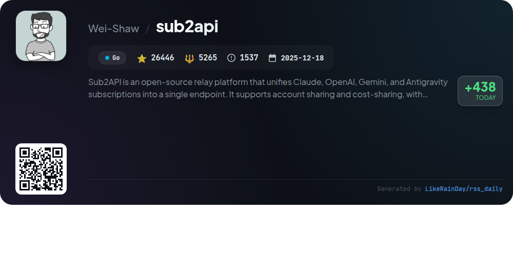
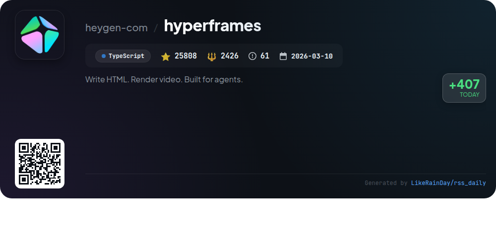
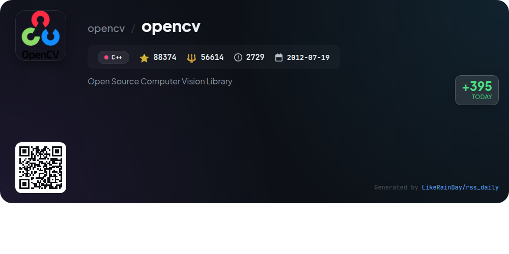

# 📊 🌟 GitHub Trending Daily - 2026-06-09

> > 📅 Daily Picks of GitHub Trending Repositories | Powered by Smart Algorithms

## 📋 Overview

**10** Projects | **434636** ⭐ | **100472** 🍴

**Top Languages:** `TypeScript` (5) · `Rust` (2) · `C++` (2)

**Updated:** 2026-06-09 04:08 UTC

**Categories:**

- 🌟 Daily Top 10 (10 items)

---

## 🌟 Daily Top 10

### 1. [open-notebook](https://github.com/lfnovo/open-notebook)

> 🤖 **Why Recommend**  
> *Open Notebook is an open-source, privacy-focused alternative to Google's Notebook LM, featuring a self-hosted environment for data control. It supports 18+ AI models, including OpenAI and Anthropic, enabling users to generate multi-speaker podcasts and organize diverse content types like PDFs and videos. Key features include intelligent search capabilities, context-aware AI conversations, and a comprehensive REST API for integrations. With multi-language support and customizable options, Open Notebook empowers users to manage research securely and efficiently.*

- ⭐ 28046 stars
- 💻 TypeScript
- 📅 Updated: 2026-06-09

### 2. [AiToEarn](https://github.com/yikart/AiToEarn)

> 🤖 **Why Recommend**  
> *AiToEarn is a powerful AI-driven content marketing platform designed for creators, brands, and businesses to monetize and distribute content across major platforms like TikTok, YouTube, Facebook, and Instagram. Key features include automated content creation, multi-platform publishing, and engagement tools that enhance interaction and brand monitoring. Users can monetize through various models such as CPS and CPM. With easy access via web or Docker deployment, AiToEarn simplifies the content lifecycle, making it accessible for both casual users and enterprises.*

- ⭐ 19522 stars
- 💻 TypeScript
- 📅 Updated: 2026-06-09

### 3. [goose](https://github.com/aaif-goose/goose)

> 🤖 **Why Recommend**  
> *goose is an open-source, extensible AI agent designed for various tasks beyond code suggestions, including research, writing, and automation. It features a native desktop app for macOS, Linux, and Windows, a CLI for terminal workflows, and an API for integration. Built in Rust, it supports 15+ AI providers like OpenAI and Google, and connects to 70+ extensions via the Model Context Protocol. Now under the Agentic AI Foundation at the Linux Foundation, goose aims to enhance productivity through a versatile, high-performance platform.*

- ⭐ 48170 stars
- 💻 Rust
- 📅 Updated: 2026-06-09

### 4. [tolaria](https://github.com/refactoringhq/tolaria)

> 🤖 **Why Recommend**  
> *Tolaria is an open-source desktop app for macOS, Windows, and Linux, designed to manage markdown knowledge bases. With over 13,700 stars on GitHub, it enables users to operate second brains, organize company documentation, and store AI assistant memories. Key features include a files-first approach with portable markdown notes, Git integration for version control, offline functionality, and keyboard-centric navigation. Tolaria supports AI interactions while ensuring user data remains private and accessible. It’s built with Tauri, React, and TypeScript, making it a powerful tool for personal and professional knowledge management.*

- ⭐ 13706 stars
- 💻 TypeScript
- 📅 Updated: 2026-06-09

### 5. [sniffnet](https://github.com/GyulyVGC/sniffnet)

> 🤖 **Why Recommend**  
> *Comfortably monitor your Internet traffic 🕵️‍♂️. popular project, actively maintained, recently updated*

- ⭐ 38795 stars
- 🍴 1617 forks
- 💻 Rust
- 📅 Updated: 2026-06-09

### 6. [project-nomad](https://github.com/Crosstalk-Solutions/project-nomad)

> 🤖 **Why Recommend**  
> *Project N.O.M.A.D. is an offline-first survival computer designed to provide critical tools and knowledge anytime, anywhere. Key features include an AI-powered chat assistant, an offline information library (Wikipedia and more), an education platform with Khan Academy courses, downloadable offline maps, and data analysis tools. The system is easily installed on Debian-based OS through a terminal and supports containerized applications via Docker. Emphasizing privacy, it requires no internet post-installation and has zero built-in telemetry. With over 30,000 stars on GitHub, it fosters a vibrant community for support and enhancement.*

- ⭐ 30112 stars
- 💻 TypeScript
- 📅 Updated: 2026-06-09

### 7. [llama.cpp](https://github.com/ggml-org/llama.cpp)

> 🤖 **Why Recommend**  
> *llama.cpp is a high-performance library for large language model (LLM) inference implemented in C++. It supports diverse hardware architectures, including Apple Silicon and x86, with optimizations for AVX and ARM. Key features include support for multiple quantization formats, custom CUDA kernels for NVIDIA GPUs, and multimodal capabilities via the llama-server. It offers a user-friendly CLI, REST API support, and integration with tools like Hugging Face for model management. With over 115k stars, it provides extensive documentation and a vibrant ecosystem for developers.*

- ⭐ 115657 stars
- 💻 C++
- 📅 Updated: 2026-06-09

### 8. [sub2api](https://github.com/Wei-Shaw/sub2api)

> 🤖 **Why Recommend**  
> *Sub2API is an open-source relay platform that consolidates Claude, OpenAI, Gemini, and Antigravity subscriptions into a single API endpoint. Key features include multi-account management, API key generation, precise billing, smart scheduling, concurrency control, and built-in payment support for various methods. An admin dashboard allows monitoring and management, while external system integration is possible via iframes. With over 26,000 stars, it offers a robust solution for distributing API quotas, making it ideal for developers seeking seamless access and cost-sharing among AI services.*

- ⭐ 26446 stars
- 💻 Go
- 📅 Updated: 2026-06-09

### 9. [hyperframes](https://github.com/heygen-com/hyperframes)

> 🤖 **Why Recommend**  
> *HyperFrames is an open-source TypeScript framework designed to transform HTML and CSS into deterministic MP4 videos, making video creation accessible for both developers and AI coding agents. Key features include a CLI for local project management, real-time previews, and integration with animation libraries like GSAP and Lottie. HyperFrames supports various use cases, from product videos to data visualizations, and offers a catalog of reusable components. With its HTML-native approach and no build step, it streamlines video production while ensuring consistent output.*

- ⭐ 25808 stars
- 💻 TypeScript
- 📅 Updated: 2026-06-09

### 10. [opencv](https://github.com/opencv/opencv)

> 🤖 **Why Recommend**  
> *OpenCV is an open-source computer vision library written in C++, boasting 88,374 stars on GitHub. It provides extensive resources including comprehensive documentation, online courses, and a Q&A forum. Key features include image processing, machine learning, and real-time computer vision functionalities. The project encourages community contributions, with clear guidelines and support for users. Additional services like OpenCV.ai offer specialized development in computer vision and AI. Stay connected through various social platforms for updates and community engagement.*

- ⭐ 88374 stars
- 💻 C++
- 📅 Updated: 2026-06-09

---

## 📡 RSS Subscription

Subscribe via RSS to get daily trending updates:

- 🔔 [RSS XML] (../../daily-top.xml)
- 🔔 [Daily Report] (../../GITHUB_TODAY.md)
- 🔔 [Daily Top 10](../../daily-top.xml)

---

*⚡ Powered by Smart Trending Algorithm | Generated at 2026-06-09 04:08:18 UTC
