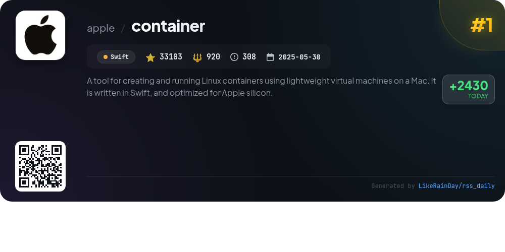
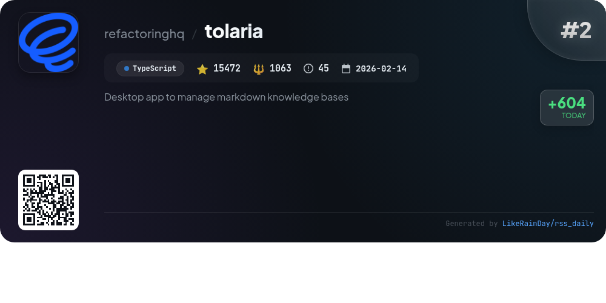
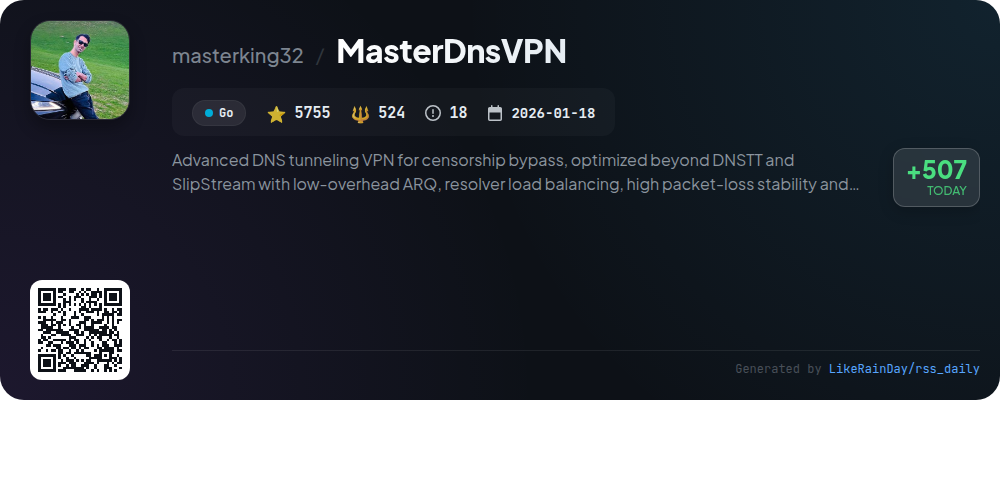
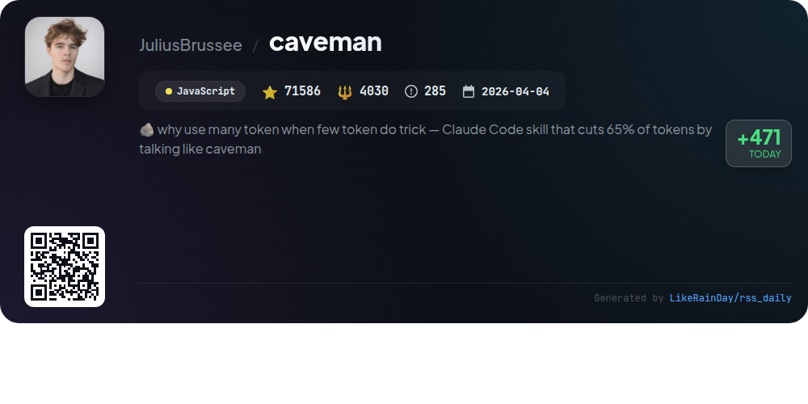
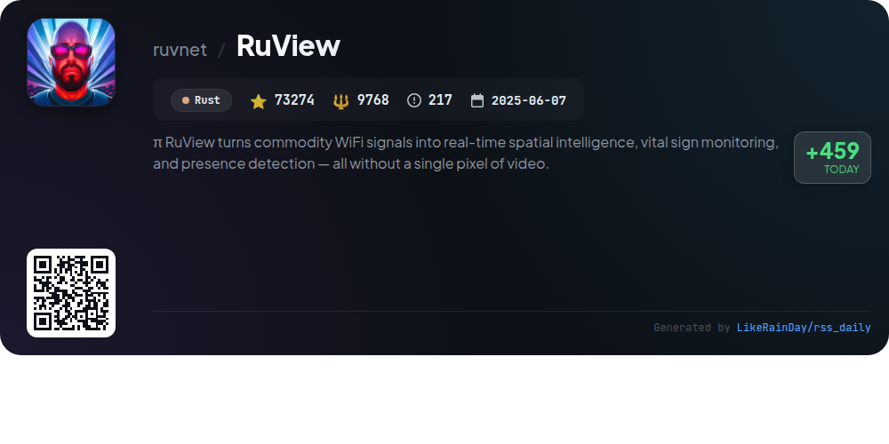
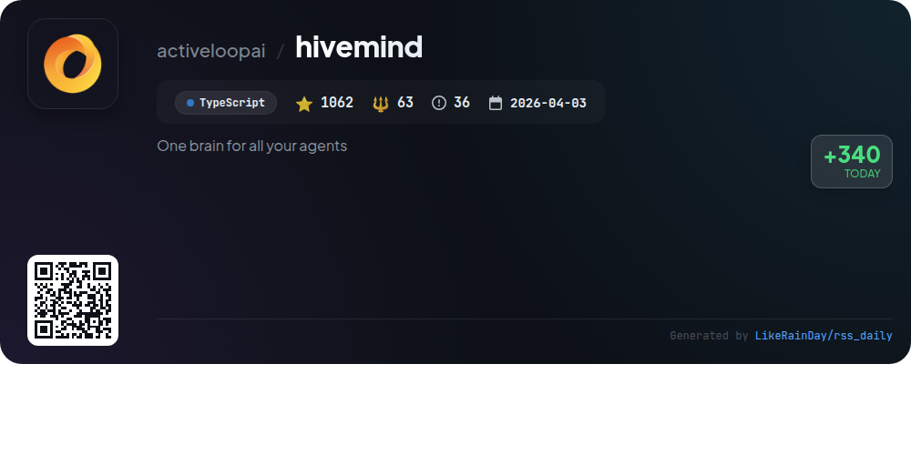
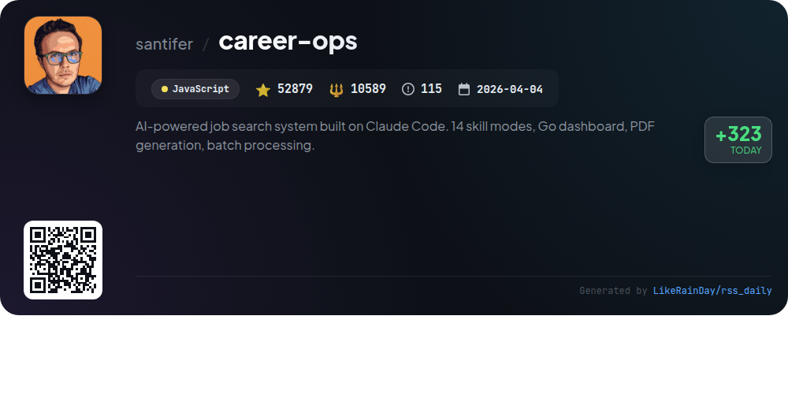
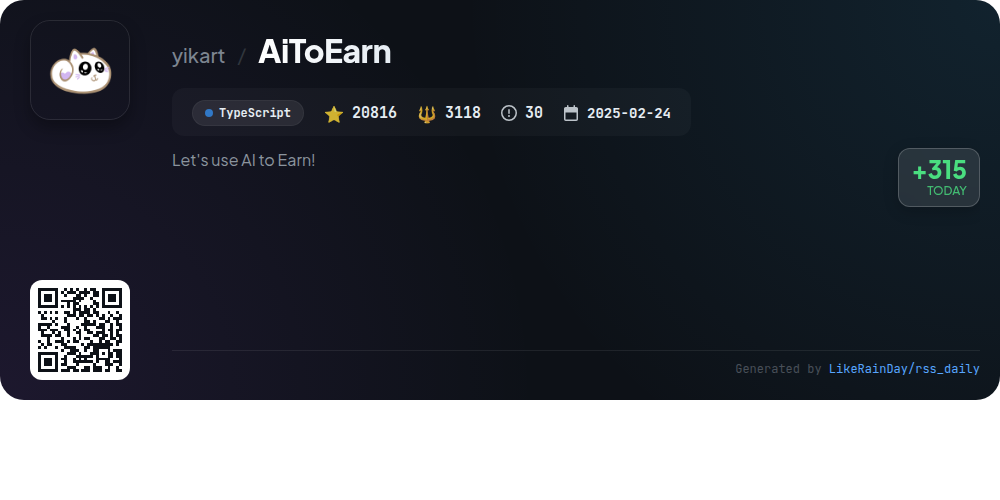
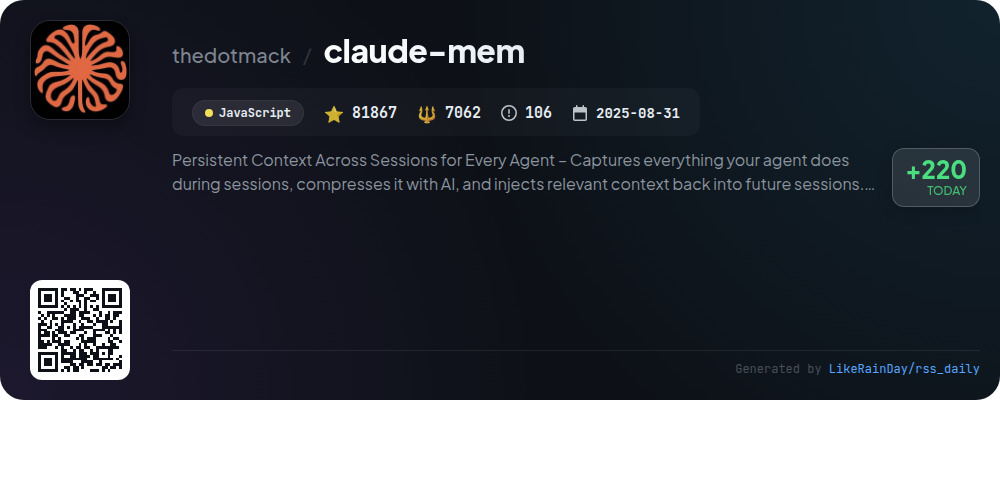

# 📊 🌟 GitHub Trending Daily - 2026-06-12

> > 📅 Daily Picks of GitHub Trending Repositories | Powered by Smart Algorithms

## 📋 Overview

**10** Projects | **529171** ⭐ | **57990** 🍴

**Top Languages:** `TypeScript` (4) · `JavaScript` (3) · `Swift` (1)

**Updated:** 2026-06-12 04:45 UTC

**Categories:**

- 🌟 Daily Top 10 (10 items)

---

## 🌟 Daily Top 10

### 1. [container](https://github.com/apple/container)

> 🤖 **Why Recommend**  
> *`container` is a Swift-based tool for creating and running Linux containers as lightweight virtual machines on Macs, optimized for Apple silicon. It supports OCI-compatible container images, allowing users to pull, run, and push images from standard registries. Key features include easy installation, system service management, and upgrade/downgrade capabilities. Users can explore tutorials and documentation for a guided experience. The project is actively developed, focusing on stability and contributing to a growing community.*

- ⭐ 33103 stars
- 💻 Swift
- 📅 Updated: 2026-06-12

### 2. [tolaria](https://github.com/refactoringhq/tolaria)

> 🤖 **Why Recommend**  
> *Tolaria is a cross-platform desktop app designed for managing markdown knowledge bases, catering to both personal and professional use cases. It features a files-first approach, storing notes as portable markdown files in a Git repository for version control and offline access. Key highlights include AI integration, a keyboard-first interface for power users, and open-source availability. Tolaria supports customization and local setup, making it a versatile tool for organizing information, enhancing productivity, and maintaining personal knowledge systems.*

- ⭐ 15472 stars
- 💻 TypeScript
- 📅 Updated: 2026-06-12

### 3. [opencode](https://github.com/anomalyco/opencode)

> 🤖 **Why Recommend**  
> *OpenCode is an open-source AI coding agent designed for seamless development. With over 173,000 stars on GitHub, it supports multiple platforms and offers a desktop application in beta. Key features include two built-in agents: a full-access "build" agent for development and a read-only "plan" agent for code exploration. It facilitates complex searches via a general subagent. Installation is straightforward using various package managers. Comprehensive documentation and a vibrant community on Discord support users and contributors alike. Explore more at opencode.ai.*

- ⭐ 173357 stars
- 💻 TypeScript
- 📅 Updated: 2026-06-12

### 4. [MasterDnsVPN](https://github.com/masterking32/MasterDnsVPN)

> 🤖 **Why Recommend**  
> *MasterDnsVPN is an advanced DNS tunneling VPN designed for bypassing censorship with optimized features such as low-overhead ARQ, resolver load balancing, and impressive packet-loss stability. Engineered in Go, it outperforms existing solutions like DNSTT and SlipStream by significantly reducing overhead and enhancing speed, achieving up to 9x faster performance. Key capabilities include strong resilience in harsh network conditions, multipath traffic routing, smart resolver selection, and integrated SOCKS5 support. MasterDnsVPN has been battle-tested in extreme scenarios, ensuring robust connectivity even during internet blackouts.*

- ⭐ 5755 stars
- 💻 Go
- 📅 Updated: 2026-06-12

### 5. [caveman](https://github.com/JuliusBrussee/caveman)

> 🤖 **Why Recommend**  
> *Caveman is a JavaScript plugin that enhances Claude Code by significantly reducing output tokens, achieving approximately 65% reduction while maintaining technical accuracy. Users can select from various grunt levels—lite, full, ultra, or wenyan—tailored for different verbosity needs. Key features include `/caveman` commands for compressed replies, conventional commit messages, and one-line PR comments. The tool integrates seamlessly with multiple coding agents, offering an efficient way to communicate while saving costs. Caveman also supports the `caveman-code` project, which compresses entire coding interactions.*

- ⭐ 71586 stars
- 💻 JavaScript
- 📅 Updated: 2026-06-12

### 6. [RuView](https://github.com/ruvnet/RuView)

> 🤖 **Why Recommend**  
> *RuView is a Rust-based project that transforms commodity WiFi signals into real-time spatial intelligence, enabling vital sign monitoring and presence detection without cameras or wearables. Key features include through-wall occupancy detection, breathing and heart rate monitoring, and activity recognition using low-cost ESP32 sensors. It seamlessly integrates with major smart-home ecosystems like Home Assistant, Apple Home, Google Home, and Alexa via MQTT and Matter. RuView operates entirely on edge hardware, ensuring privacy and low latency, making it ideal for healthcare, retail, and smart home applications.*

- ⭐ 73274 stars
- 💻 Rust
- 📅 Updated: 2026-06-12

### 7. [hivemind](https://github.com/activeloopai/hivemind)

> 🤖 **Why Recommend**  
> *Hivemind is a TypeScript-based tool designed to enhance collaboration among coding agents such as Claude Code, OpenClaw, Codex, Cursor, Hermes, and pi. With over 1,000 stars on GitHub, it provides a cloud-backed shared memory system that captures agent interactions, codifies reusable skills, and propagates knowledge in real-time. Key features include natural language search, AI-generated session summaries, and the ability to store data in your own cloud. Hivemind improves efficiency by reducing costs and resource usage compared to traditional methods, making it a powerful asset for teams.*

- ⭐ 1062 stars
- 💻 TypeScript
- 📅 Updated: 2026-06-12

### 8. [career-ops](https://github.com/santifer/career-ops)

> 🤖 **Why Recommend**  
> *Career-Ops is an AI-powered job search system designed to streamline the application process. It features 14 skill modes, a Go dashboard, and capabilities for PDF generation and batch processing. Users can evaluate job offers with a structured scoring system and generate tailored CVs optimized for ATS. The system automates job portal scanning and offers a unique interview story bank and negotiation scripts. With a focus on efficiency, Career-Ops helps users filter through job listings, ensuring only the most relevant opportunities are pursued.*

- ⭐ 52879 stars
- 💻 JavaScript
- 📅 Updated: 2026-06-12

### 9. [AiToEarn](https://github.com/yikart/AiToEarn)

> 🤖 **Why Recommend**  
> *AiToEarn is an innovative AI-driven content marketing platform designed for individuals, creators, brands, and businesses to monetize, publish, and engage across major social media channels like TikTok, YouTube, and Instagram. With over 20,000 stars on GitHub, its core features include automated content creation, distribution to 10+ platforms, and interactive engagement tools like automated replies and brand monitoring. AiToEarn supports multiple usage modes, including direct web access, integration with AI assistants, and Docker deployment for private servers, making it versatile for all users.*

- ⭐ 20816 stars
- 💻 TypeScript
- 📅 Updated: 2026-06-12

### 10. [claude-mem](https://github.com/thedotmack/claude-mem)

> 🤖 **Why Recommend**  
> *Claude-Mem is an advanced memory management tool for AI agents, enabling persistent context across sessions. It captures user interactions, compresses data using AI, and seamlessly injects relevant context into future sessions. Core features include persistent memory, skill-based search, a web viewer UI, and privacy controls. Compatible with tools like Claude Code and OpenClaw, it supports multiple languages and offers a beta channel for experimental features. Claude-Mem enhances continuity and efficiency in project management, making it essential for developers and AI users alike.*

- ⭐ 81867 stars
- 💻 JavaScript
- 📅 Updated: 2026-06-12

---

## 📡 RSS Subscription

Subscribe via RSS to get daily trending updates:

- 🔔 [RSS XML] (../../daily-top.xml)
- 🔔 [Daily Report] (../../GITHUB_TODAY.md)
- 🔔 [Daily Top 10](../../daily-top.xml)

---

*⚡ Powered by Smart Trending Algorithm | Generated at 2026-06-12 04:45:00 UTC
