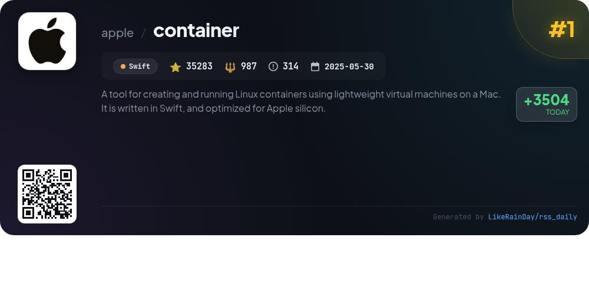
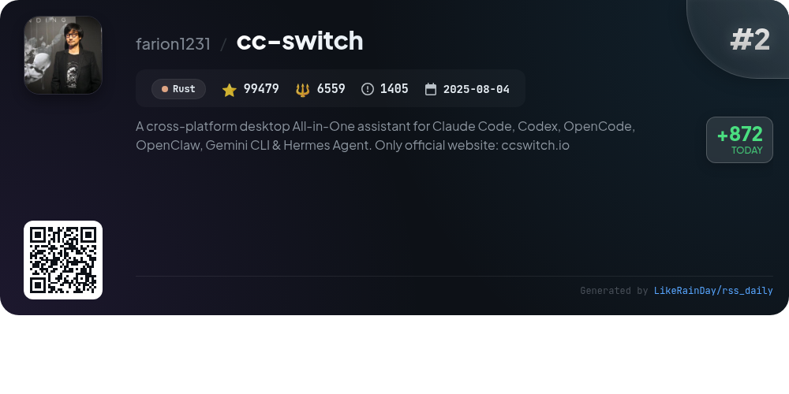
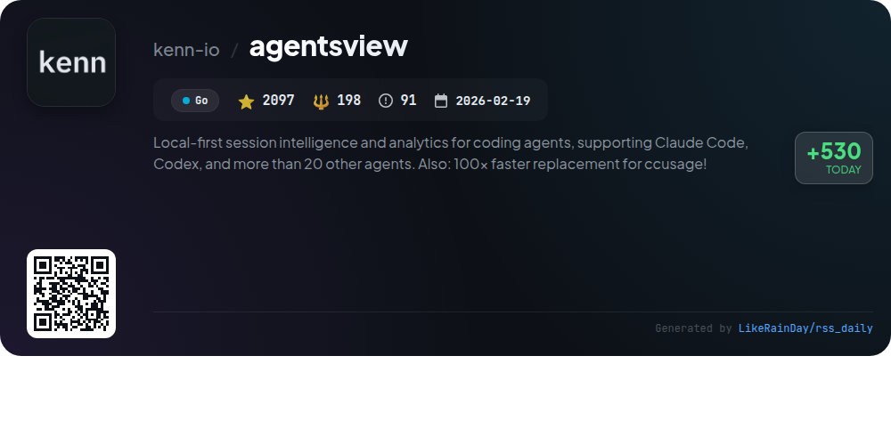
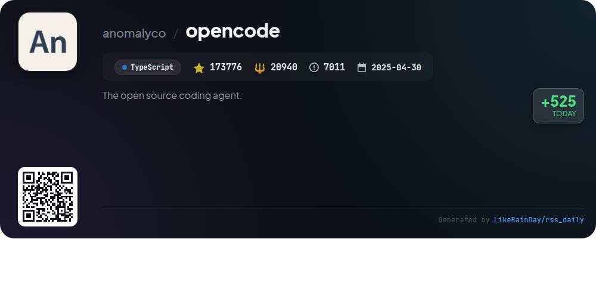
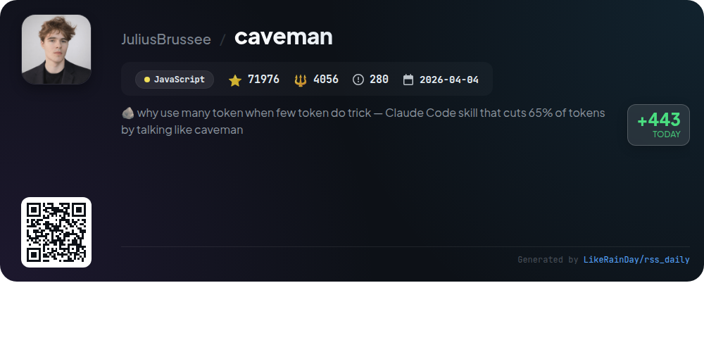
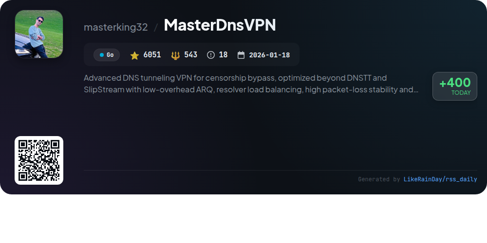
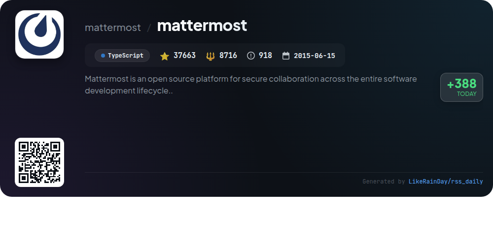
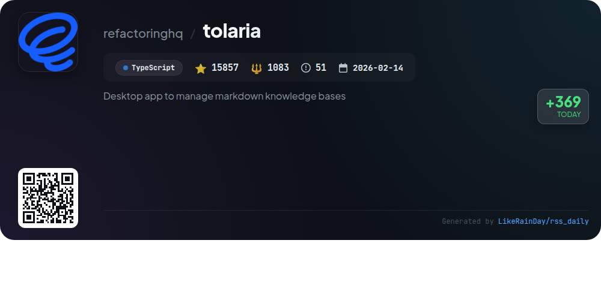
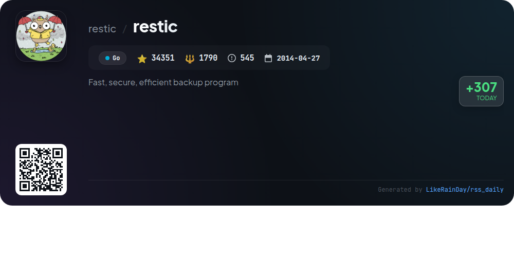

# 📊 🌟 GitHub Trending Daily - 2026-06-13

> > 📅 Daily Picks of GitHub Trending Repositories | Powered by Smart Algorithms

## 📋 Overview

**10** Projects | **523842** ⭐ | **52938** 🍴

**Top Languages:** `TypeScript` (3) · `Go` (3) · `Swift` (1)

**Updated:** 2026-06-13 04:23 UTC

**Categories:**

- 🌟 Daily Top 10 (10 items)

---

## 🌟 Daily Top 10

### 1. [container](https://github.com/apple/container)

> 🤖 **Why Recommend**  
> *`container` is a Swift-based tool for creating and running Linux containers as lightweight virtual machines on Mac, optimized for Apple silicon. It supports OCI-compatible container images, allowing users to pull from and push to any standard container registry. Key features include easy installation, upgrade/downgrade capabilities, and a guided tour for users to familiarize themselves with its functionalities. Active development ensures ongoing improvements, and contributions are encouraged. Detailed documentation is available for users and developers alike.*

- ⭐ 35283 stars
- 💻 Swift
- 📅 Updated: 2026-06-13

### 2. [cc-switch](https://github.com/farion1231/cc-switch)

> 🤖 **Why Recommend**  
> *CC Switch is a cross-platform desktop application that serves as an All-in-One manager for AI coding tools, including Claude Code, Codex, Gemini CLI, OpenCode, OpenClaw, and Hermes Agent. Key features include a unified interface for managing API providers, 50+ built-in presets, one-click switching, and a unified management panel for MCP and Skills. It supports cloud sync across devices, offers quick switching from the system tray, and utilizes a reliable SQLite database for data protection. Built with Rust and Tauri, it runs on Windows, macOS, and Linux. For more, visit ccswitch.io.*

- ⭐ 99479 stars
- 💻 Rust
- 📅 Updated: 2026-06-13

### 3. [fanqiang](https://github.com/bannedbook/fanqiang)

> 🤖 **Why Recommend**  
> *The "fanqiang" project offers a comprehensive suite of tools and tutorials for circumventing internet censorship, primarily targeting users in China. It features an Android app (FQNews), tutorials for various platforms including Windows, macOS, iOS, and Linux, and one-click solutions for browsers like Chrome, Firefox, and Edge. Key highlights include self-hosting guides for V2ray and Shadowsocks servers, access to free accounts, and support for gaming consoles. With over 47,000 stars on GitHub, it is a highly regarded resource for secure and unrestricted internet access.*

- ⭐ 47309 stars
- 💻 Kotlin
- 📅 Updated: 2026-06-13

### 4. [agentsview](https://github.com/kenn-io/agentsview)

> 🤖 **Why Recommend**  
> *agentsview is a local-first session intelligence and analytics tool for AI coding agents, including Claude Code and Codex, designed for efficient cost tracking and session management. It auto-discovers sessions, stores data in a local SQLite database, and features a web UI for browsing, searching, and analyzing costs across over 20 agents. Key highlights include 100x faster token usage tracking, support for PostgreSQL and DuckDB, and a comprehensive analytics dashboard. It requires no accounts and ensures data privacy by keeping all information local.*

- ⭐ 2097 stars
- 💻 Go
- 📅 Updated: 2026-06-13

### 5. [opencode](https://github.com/anomalyco/opencode)

> 🤖 **Why Recommend**  
> *OpenCode is an open-source AI coding agent built with TypeScript, designed to assist developers in coding tasks. It features two main agents: a full-access "build" agent for development and a "plan" agent for code exploration and analysis. OpenCode can be easily installed via multiple package managers and is available as a desktop app for macOS, Windows, and Linux. The project boasts a vibrant community on Discord and offers extensive documentation for configuration and usage. With over 173,000 stars on GitHub, it prioritizes user contributions and collaboration.*

- ⭐ 173776 stars
- 💻 TypeScript
- 📅 Updated: 2026-06-13

### 6. [caveman](https://github.com/JuliusBrussee/caveman)

> 🤖 **Why Recommend**  
> *Caveman is a JavaScript project designed as a Claude Code skill that significantly reduces output token usage by up to 75% while maintaining technical accuracy. It compresses responses across various agents, offering different levels of brevity (lite, full, ultra, wenyan) for optimal communication. Key features include token savings tracking, conventional commit messages, one-line PR comments, and memory file compression. With over 71,000 stars, Caveman enhances readability and efficiency for developers by producing concise, contextually accurate responses in multiple languages.*

- ⭐ 71976 stars
- 💻 JavaScript
- 📅 Updated: 2026-06-13

### 7. [MasterDnsVPN](https://github.com/masterking32/MasterDnsVPN)

> 🤖 **Why Recommend**  
> *MasterDnsVPN is an advanced DNS tunneling VPN designed for bypassing censorship and ensuring high stability and speed even in harsh network conditions. Built using Go, it features low-overhead ARQ, resolver load balancing, and strong packet-loss resilience. Key highlights include support for SOCKS5/4, real multipath traffic routing, and adaptive routing based on latency and loss. It has been battle-tested during severe internet blackouts, proving its effectiveness in extreme scenarios. With over 6051 stars on GitHub, it stands out for its innovative design and efficiency.*

- ⭐ 6051 stars
- 💻 Go
- 📅 Updated: 2026-06-13

### 8. [mattermost](https://github.com/mattermost/mattermost)

> 🤖 **Why Recommend**  
> *Mattermost is an open-source, self-hosted collaboration platform designed for secure communication throughout the software development lifecycle. With over 37,000 stars on GitHub, it offers features like chat, workflow automation, voice calling, screen sharing, and AI integration. Built on Go and React, it supports PostgreSQL and can be deployed on-premises or in the cloud. Mattermost provides native apps for mobile and desktop, extensive documentation, and a wide range of integrations. Regular updates ensure security and feature enhancements.*

- ⭐ 37663 stars
- 💻 TypeScript
- 📅 Updated: 2026-06-13

### 9. [tolaria](https://github.com/refactoringhq/tolaria)

> 🤖 **Why Recommend**  
> *Tolaria is an open-source desktop app for managing markdown knowledge bases on macOS, Windows, and Linux, with over 15,800 stars on GitHub. Key features include a file-first approach using plain markdown, full version control via Git, and offline functionality with no cloud dependencies. Designed for power users, it emphasizes keyboard navigation and supports AI integration without being AI-restricted. Tolaria is built from real-world use, catering to personal knowledge management and documentation needs. Installation is simple via Homebrew or direct download.*

- ⭐ 15857 stars
- 💻 TypeScript
- 📅 Updated: 2026-06-13

### 10. [restic](https://github.com/restic/restic)

> 🤖 **Why Recommend**  
> *restic is a fast, secure, and efficient backup program written in Go, with over 34,000 stars on GitHub. It supports major operating systems, including Linux, macOS, and Windows. Key features include easy installation, fast backups, data verification, and strong encryption for data integrity. Users can back up data to various backends such as local directories, SFTP, and cloud services like Amazon S3, Google Cloud Storage, and Microsoft Azure. Restic emphasizes efficiency with deduplication and incremental snapshots, making it an ideal solution for reliable data protection.*

- ⭐ 34351 stars
- 💻 Go
- 📅 Updated: 2026-06-13

---

## 📡 RSS Subscription

Subscribe via RSS to get daily trending updates:

- 🔔 [RSS XML] (../../daily-top.xml)
- 🔔 [Daily Report] (../../GITHUB_TODAY.md)
- 🔔 [Daily Top 10](../../daily-top.xml)

---

*⚡ Powered by Smart Trending Algorithm | Generated at 2026-06-13 04:23:54 UTC
