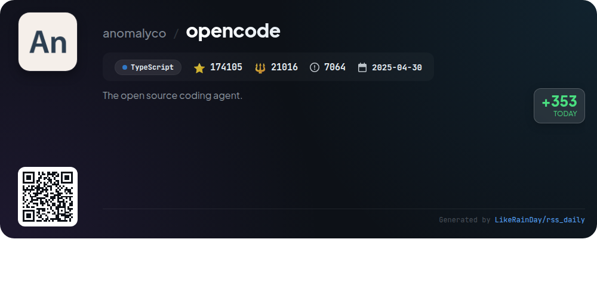
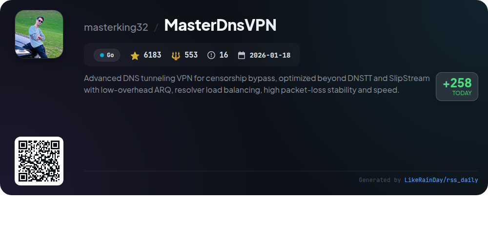
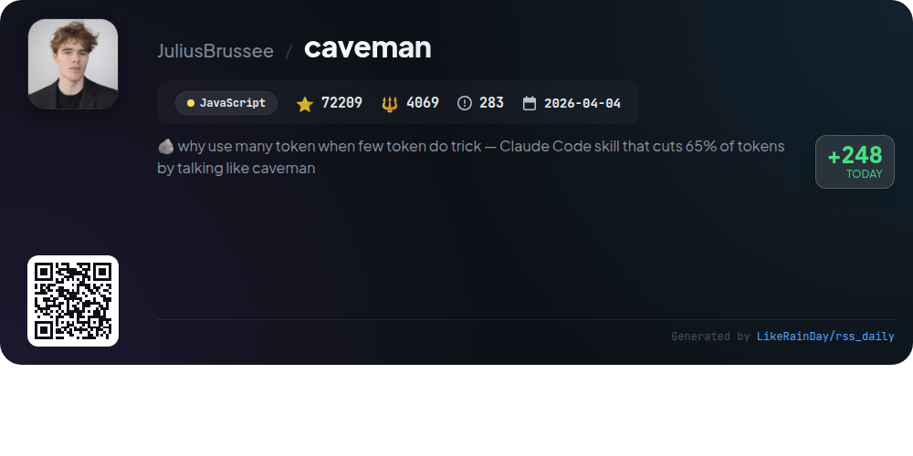
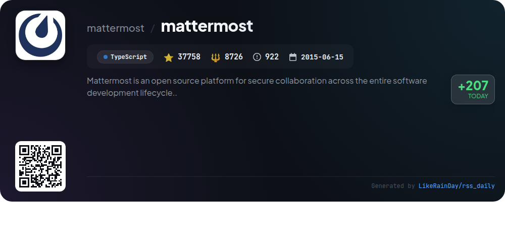
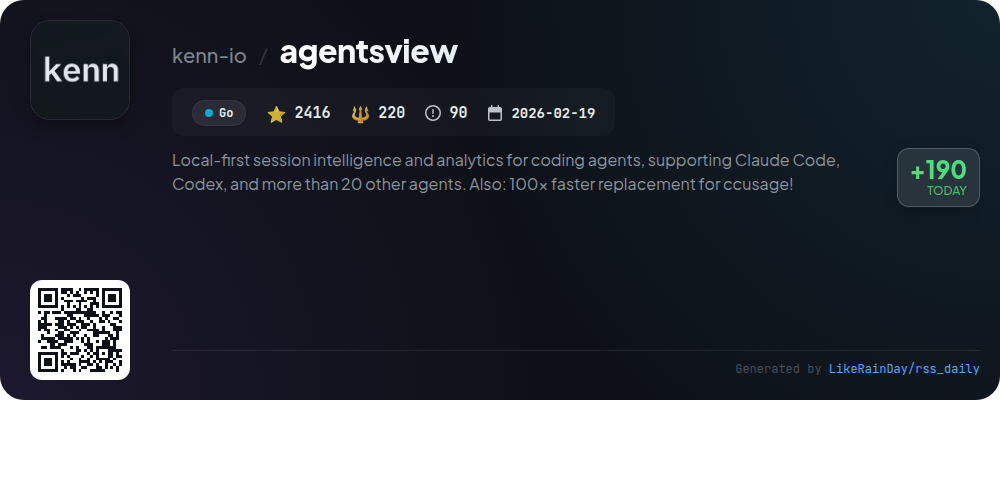
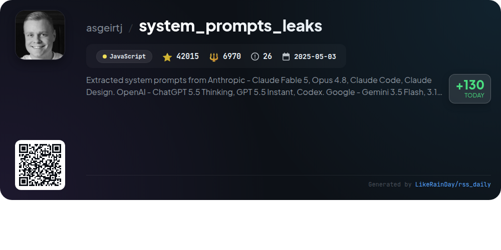
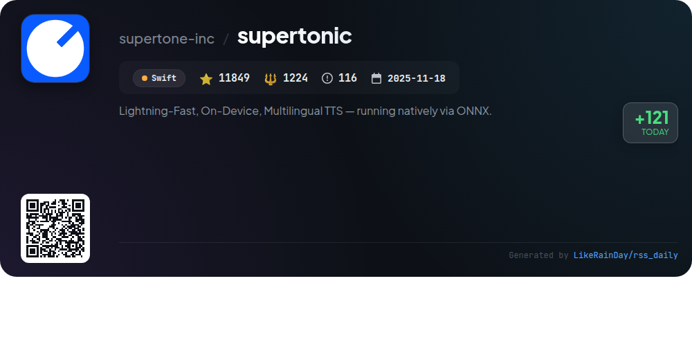

# 📊 🌟 GitHub Trending Daily - 2026-06-14

> > 📅 Daily Picks of GitHub Trending Repositories | Powered by Smart Algorithms

## 📋 Overview

**10** Projects | **637026** ⭐ | **58278** 🍴

**Top Languages:** `TypeScript` (3) · `JavaScript` (2) · `Go` (2)

**Updated:** 2026-06-14 04:52 UTC

**Categories:**

- 🌟 Daily Top 10 (10 items)

---

## 🌟 Daily Top 10

### 1. [container](https://github.com/apple/container)

> 🤖 **Why Recommend**  
> *`container` is a Swift-based tool for creating and running Linux containers as lightweight virtual machines on macOS, optimized for Apple silicon. It supports OCI-compatible container images, enabling seamless integration with standard container registries for image pulling and pushing. Key features include easy installation, upgrade/downgrade scripts, and comprehensive command documentation. The project actively encourages contributions and offers detailed tutorials and technical overviews, making it user-friendly for developers. With over 36,000 stars, it's a robust choice for container management on Mac.*

- ⭐ 36433 stars
- 💻 Swift
- 📅 Updated: 2026-06-14

### 2. [iptv](https://github.com/iptv-org/iptv)

> 🤖 **Why Recommend**  
> *The IPTV project is a comprehensive collection of publicly available IPTV channels from around the globe, featuring over 119,000 stars on GitHub. Users can easily access playlists by pasting links into compatible video players. Key features include a main playlist, Electronic Program Guide (EPG) support, and an API for integration. The repository also provides resources and a discussion platform for users. It emphasizes legal compliance, ensuring all links are user-submitted and publicly accessible. Contributions are welcomed to enhance the repository further.*

- ⭐ 119337 stars
- 💻 TypeScript
- 📅 Updated: 2026-06-14

### 3. [PowerToys](https://github.com/microsoft/PowerToys)

> 🤖 **Why Recommend**  
> *Microsoft PowerToys is a powerful suite of over 30 utilities designed to enhance productivity and customization on Windows. Key features include Advanced Paste, FancyZones for window management, PowerRename for batch renaming files, and Color Picker for design tasks. With a vibrant community and ongoing development, PowerToys continues to evolve, offering tools that streamline workflows and optimize the Windows experience. Installation options include GitHub releases, Microsoft Store, and WinGet, making it accessible to all users.*

- ⭐ 134721 stars
- 💻 C
- 📅 Updated: 2026-06-14

### 4. [opencode](https://github.com/anomalyco/opencode)

> 🤖 **Why Recommend**  
> *OpenCode is an open-source AI coding agent designed to enhance software development. Written in TypeScript and boasting over 174,000 stars, it features two primary agents: a full-access "build" agent for development and a read-only "plan" agent for code exploration. Users can easily install OpenCode via various package managers or download a desktop app for macOS, Windows, and Linux. The project emphasizes community engagement through Discord and offers comprehensive documentation for configuration and usage. Explore more at opencode.ai.*

- ⭐ 174105 stars
- 💻 TypeScript
- 📅 Updated: 2026-06-14

### 5. [MasterDnsVPN](https://github.com/masterking32/MasterDnsVPN)

> 🤖 **Why Recommend**  
> *MasterDnsVPN is an advanced DNS tunneling VPN designed for bypassing censorship, optimized for speed and stability under harsh network conditions. Key features include low-overhead ARQ, resolver load balancing, and multi-resolver support, ensuring high packet-loss resilience and efficient data delivery. It employs a custom protocol for superior performance compared to similar tools like DNSTT and SlipStream. Additionally, it supports SOCKS5 and offers built-in health checks for resolvers, making it a robust solution for secure and reliable internet access in restricted environments.*

- ⭐ 6183 stars
- 💻 Go
- 📅 Updated: 2026-06-14

### 6. [caveman](https://github.com/JuliusBrussee/caveman)

> 🤖 **Why Recommend**  
> *Caveman is a JavaScript-based plugin that enhances Claude Code by drastically reducing token usage in responses, achieving up to 75% savings while maintaining technical accuracy. Key features include multiple compression levels (lite, full, ultra, wenyan), conventional commit messages, one-line PR reviews, and session token statistics. It seamlessly integrates with various agents, ensuring concise communication without losing context. The project boasts over 72,000 stars, reflecting its popularity and effectiveness in optimizing output for developers. The ecosystem includes related tools like caveman-code and cavemem for broader functionality.*

- ⭐ 72209 stars
- 💻 JavaScript
- 📅 Updated: 2026-06-14

### 7. [mattermost](https://github.com/mattermost/mattermost)

> 🤖 **Why Recommend**  
> *Mattermost is an open-source, self-hosted collaboration platform designed for secure communication throughout the software development lifecycle. With over 37,000 stars, it supports chat, workflow automation, voice calls, screen sharing, and AI integration. Written in TypeScript and Go, it runs as a single binary and uses PostgreSQL. Users can deploy Mattermost on-premises or try it in the cloud. Key features include native mobile and desktop apps, extensive API support, and integration options. Monthly updates are released under the MIT license, ensuring continuous improvement and security.*

- ⭐ 37758 stars
- 💻 TypeScript
- 📅 Updated: 2026-06-14

### 8. [agentsview](https://github.com/kenn-io/agentsview)

> 🤖 **Why Recommend**  
> *agentsview is a local-first analytics tool for managing AI coding agents like Claude Code and Codex, boasting 2,416 stars on GitHub. Key features include automatic session discovery, token usage tracking, and cost estimation, all presented in a user-friendly web interface. It offers 100x faster performance than ccusage, supports multiple agents, and provides detailed session statistics. Users can install it easily on various platforms, utilize PostgreSQL for team dashboards, and leverage DuckDB for analytics mirroring. Privacy is prioritized, with all data stored locally.*

- ⭐ 2416 stars
- 💻 Go
- 📅 Updated: 2026-06-14

### 9. [system_prompts_leaks](https://github.com/asgeirtj/system_prompts_leaks)

> 🤖 **Why Recommend**  
> *The "system_prompts_leaks" GitHub project documents and regularly updates the system prompts from various AI models, including Anthropic's Claude, OpenAI's ChatGPT, Google's Gemini, and xAI's Grok. With over 42,000 stars, it provides insights into the hidden instructions behind these AI chatbots, enabling users to understand and utilize their functionalities better. Key highlights include detailed prompt documentation, version comparisons, and integration details for tools like GitHub Copilot and VS Code. The repository serves as a valuable resource for developers and researchers in AI.*

- ⭐ 42015 stars
- 💻 JavaScript
- 📅 Updated: 2026-06-14

### 10. [supertonic](https://github.com/supertone-inc/supertonic)

> 🤖 **Why Recommend**  
> *Supertonic is a lightning-fast, on-device multilingual text-to-speech (TTS) system utilizing ONNX for efficient local inference. It supports 31 languages, delivering high-quality 44.1kHz audio with low latency, making it capable of synthesizing entire web pages in under a second. Key features include a compact 99M-parameter model, expression tags for natural speech nuances, and compatibility across multiple programming environments (Python, Node.js, Swift, etc.). Supertonic ensures privacy and operates without network dependencies, making it ideal for edge devices.*

- ⭐ 11849 stars
- 💻 Swift
- 📅 Updated: 2026-06-14

---

## 📡 RSS Subscription

Subscribe via RSS to get daily trending updates:

- 🔔 [RSS XML] (../../daily-top.xml)
- 🔔 [Daily Report] (../../GITHUB_TODAY.md)
- 🔔 [Daily Top 10](../../daily-top.xml)

---

*⚡ Powered by Smart Trending Algorithm | Generated at 2026-06-14 04:52:06 UTC
