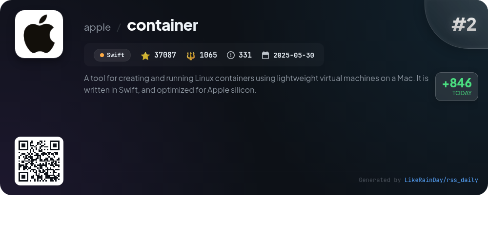
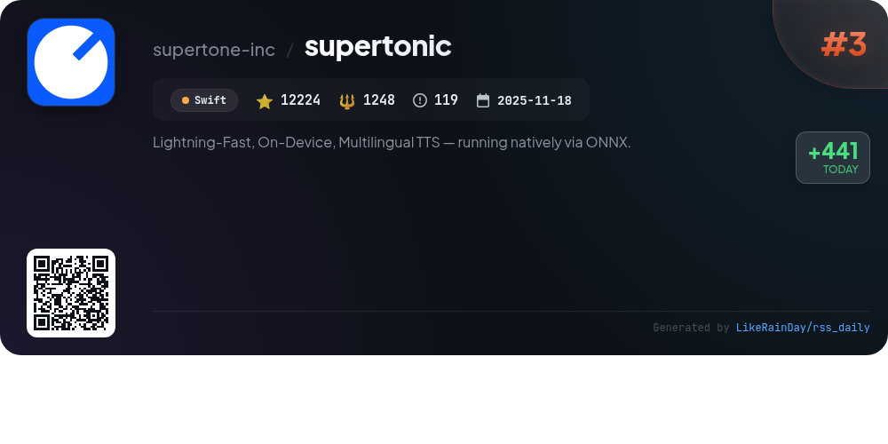
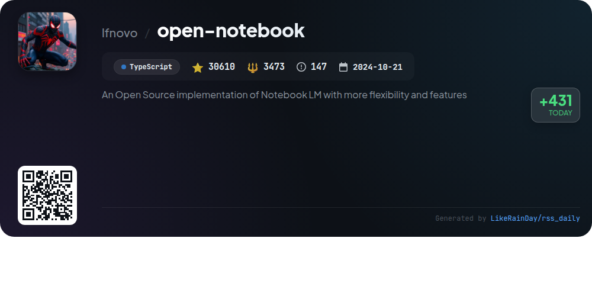
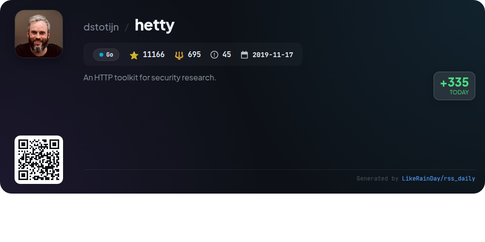
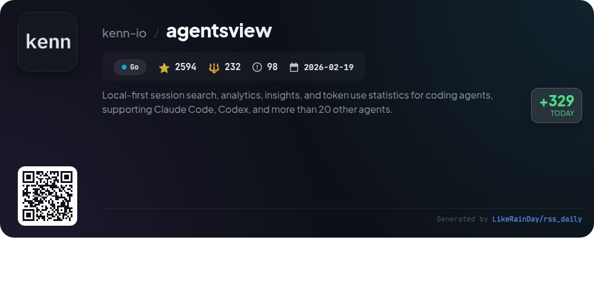
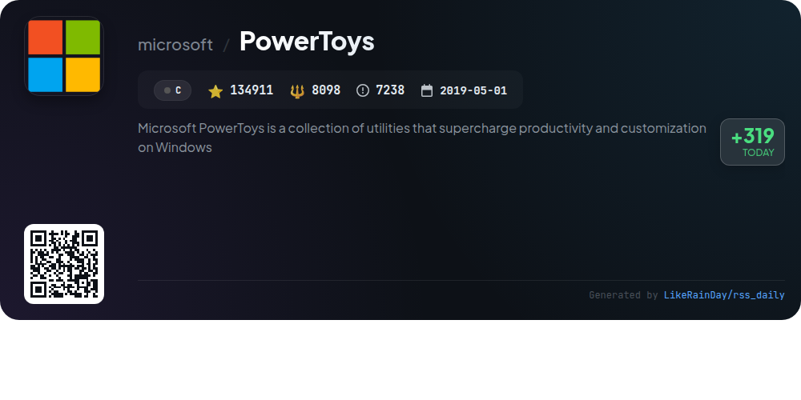
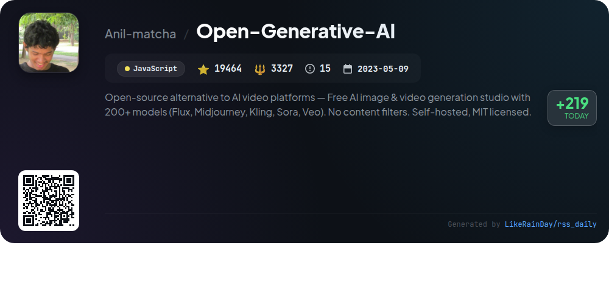
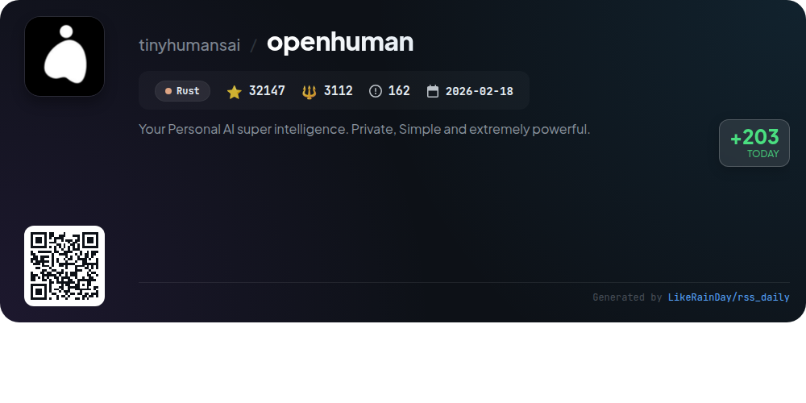
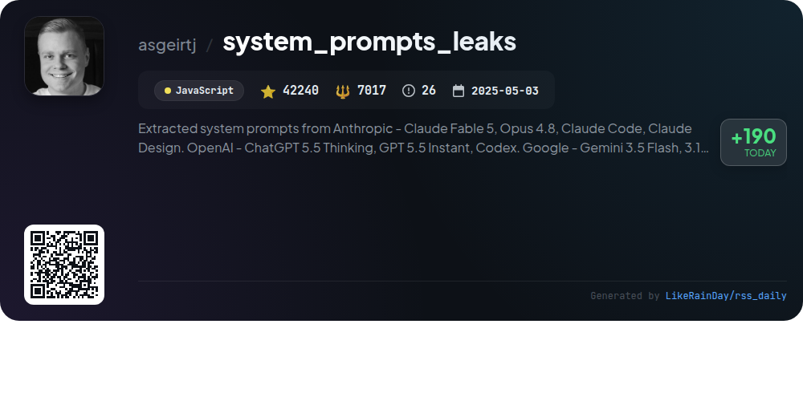

# 📊 🌟 GitHub Trending Daily - 2026-06-15

> > 📅 Daily Picks of GitHub Trending Repositories | Powered by Smart Algorithms

## 📋 Overview

**10** Projects | **443896** ⭐ | **34775** 🍴

**Top Languages:** `JavaScript` (2) · `TypeScript` (2) · `Go` (2)

**Updated:** 2026-06-15 05:07 UTC

**Categories:**

- 🌟 Daily Top 10 (10 items)

---

## 🌟 Daily Top 10

### 1. [iptv](https://github.com/iptv-org/iptv)

> 🤖 **Why Recommend**  
> *The IPTV project is a comprehensive collection of publicly available IPTV channels from around the globe, built in TypeScript and boasting over 121,000 stars. Key features include easy access to playlists, an Electronic Program Guide (EPG), and an API for integration. Users can stream content by simply pasting playlist links into compatible video players. The project also emphasizes community contributions and provides resources for discussions, FAQs, and legal guidance regarding copyright. It serves as a valuable hub for IPTV enthusiasts, curating and maintaining a diverse range of channels.*

- ⭐ 121453 stars
- 💻 TypeScript
- 📅 Updated: 2026-06-15

### 2. [container](https://github.com/apple/container)

> 🤖 **Why Recommend**  
> *`container` is a Swift-based tool for creating and running Linux containers as lightweight virtual machines on Macs with Apple silicon. It supports OCI-compatible images, enabling users to pull from and push to standard container registries. Key features include easy installation, upgrade/downgrade scripts, and a system service for management. The project leverages the Containerization Swift package for low-level operations and is actively developed, aiming for stability in patch versions. Comprehensive documentation and a guided tour are available for new users.*

- ⭐ 37087 stars
- 💻 Swift
- 📅 Updated: 2026-06-15

### 3. [supertonic](https://github.com/supertone-inc/supertonic)

> 🤖 **Why Recommend**  
> *Supertonic is a lightning-fast, on-device multilingual text-to-speech (TTS) system that runs natively via ONNX, supporting 31 languages. Key features include low-latency synthesis, a compact 99M-parameter model, and high-quality 44.1kHz audio output. It operates without cloud dependency, ensuring privacy and efficiency on various devices, including mobile and Raspberry Pi. Supertonic also includes expression tags for natural speech, multi-runtime SDK support, and a Voice Builder for custom voice profiles. Experience it via interactive demos or integrate through the Python SDK.*

- ⭐ 12224 stars
- 💻 Swift
- 📅 Updated: 2026-06-15

### 4. [open-notebook](https://github.com/lfnovo/open-notebook)

> 🤖 **Why Recommend**  
> *Open Notebook is an open-source, privacy-focused alternative to Google's Notebook LM, offering users enhanced flexibility and features. Key highlights include support for 18+ AI models (like OpenAI and Anthropic), complete data control, and the ability to organize multi-modal content (PDFs, videos, etc.). Users can generate professional podcasts, conduct intelligent searches, and engage in context-aware AI conversations. It supports a multi-language UI and offers a comprehensive REST API for custom integrations. Ideal for researchers seeking privacy, customization, and cost control.*

- ⭐ 30610 stars
- 💻 TypeScript
- 📅 Updated: 2026-06-15

### 5. [hetty](https://github.com/dstotijn/hetty)

> 🤖 **Why Recommend**  
> *Hetty is an open-source HTTP toolkit for security research, designed as an alternative to commercial tools like Burp Suite Pro. With over 11,000 stars on GitHub, its core features include a machine-in-the-middle (MITM) HTTP proxy, advanced request interception and editing, project-based storage, and an intuitive web-based admin interface. Hetty supports organization through scope management and offers a GraphQL service. It is actively developed, with installation options via package managers, Docker, or direct download. Comprehensive documentation and community support are available.*

- ⭐ 11166 stars
- 💻 Go
- 📅 Updated: 2026-06-15

### 6. [agentsview](https://github.com/kenn-io/agentsview)

> 🤖 **Why Recommend**  
> *agentsview is a local-first tool for browsing, searching, and tracking costs across AI coding agents, supporting Claude Code, Codex, and over 20 others. Key features include a user-friendly web UI for session analytics, token usage tracking, and cost summaries. It automatically indexes session data into a local SQLite database for rapid queries. The project supports various deployment methods, including Docker and local binaries, and offers PostgreSQL sync for team collaboration. Users can generate detailed reports on token consumption and session statistics, ensuring efficient cost management.*

- ⭐ 2594 stars
- 💻 Go
- 📅 Updated: 2026-06-15

### 7. [PowerToys](https://github.com/microsoft/PowerToys)

> 🤖 **Why Recommend**  
> *Microsoft PowerToys is a powerful suite of over 30 utilities designed to enhance productivity and customization on Windows. Key features include Advanced Paste, Color Picker, FancyZones for window management, PowerRename for file organization, and the Command Palette for quick access to tools. With a strong community backing, PowerToys continually evolves with new features and improvements. Installation options include GitHub, Microsoft Store, and WinGet. This project encourages contributions to further enhance its capabilities for power users.*

- ⭐ 134911 stars
- 💻 C
- 📅 Updated: 2026-06-15

### 8. [Open-Generative-AI](https://github.com/Anil-matcha/Open-Generative-AI)

> 🤖 **Why Recommend**  
> *Open Generative AI is an open-source platform for AI image and video generation, featuring over 200 models like Flux and Midjourney, with no content filters or subscription fees. Users can generate images, videos, and lip-sync animations, leveraging dual-mode studios for text-to-image and image-to-video creation. The platform supports local inference through bundled and remote engines, ensuring privacy and customization. Community-driven, it offers extensive workflows and automation capabilities, making it a versatile alternative to traditional AI video platforms. Self-hosted and MIT licensed, it empowers full creative freedom.*

- ⭐ 19464 stars
- 💻 JavaScript
- 📅 Updated: 2026-06-15

### 9. [openhuman](https://github.com/tinyhumansai/openhuman)

> 🤖 **Why Recommend**  
> *OpenHuman is a powerful open-source personal AI superintelligence built in Rust, designed for seamless integration into your daily life. It features a user-friendly interface, local memory storage, and over 118 third-party integrations, enabling efficient auto-fetching of data. Key highlights include a Memory Tree for organizing knowledge, an Obsidian-compatible vault, and built-in tools for web search and coding. With an emphasis on privacy and security, OpenHuman prioritizes user control while minimizing vendor sprawl. Currently in early beta, the project has gained significant traction with over 32,000 stars on GitHub.*

- ⭐ 32147 stars
- 💻 Rust
- 📅 Updated: 2026-06-15

### 10. [system_prompts_leaks](https://github.com/asgeirtj/system_prompts_leaks)

> 🤖 **Why Recommend**  
> *The "system_prompts_leaks" GitHub project documents extracted system prompts from major AI chatbots, including Anthropic's Claude, OpenAI's ChatGPT, Google's Gemini, and xAI's Grok. It features regular updates, detailed comparisons of prompt versions, and links to system prompts for various models. With over 42,240 stars, it serves as a vital resource for understanding AI behavior and instructions. The project also includes integration details, older versions, and community contributions, making it a comprehensive guide for developers and researchers in AI.*

- ⭐ 42240 stars
- 💻 JavaScript
- 📅 Updated: 2026-06-15

---

## 📡 RSS Subscription

Subscribe via RSS to get daily trending updates:

- 🔔 [RSS XML] (../../daily-top.xml)
- 🔔 [Daily Report] (../../GITHUB_TODAY.md)
- 🔔 [Daily Top 10](../../daily-top.xml)

---

*⚡ Powered by Smart Trending Algorithm | Generated at 2026-06-15 05:07:47 UTC
