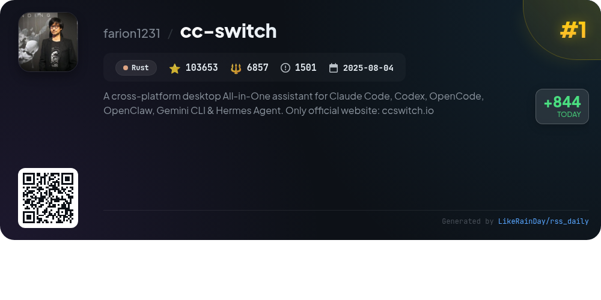
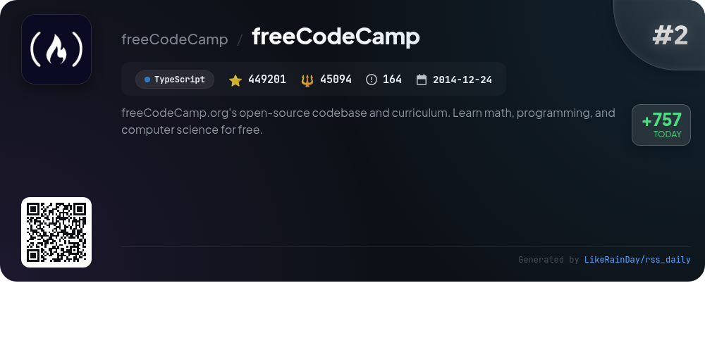
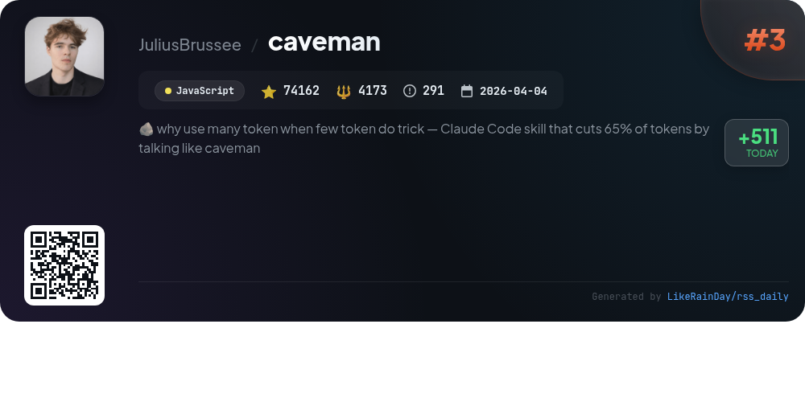
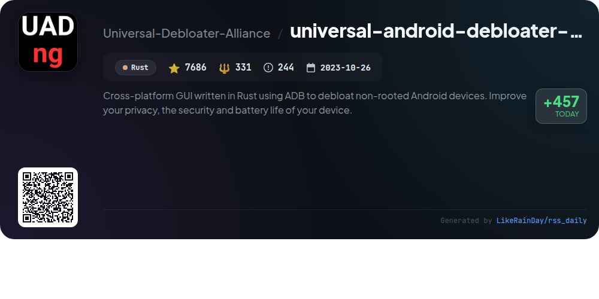
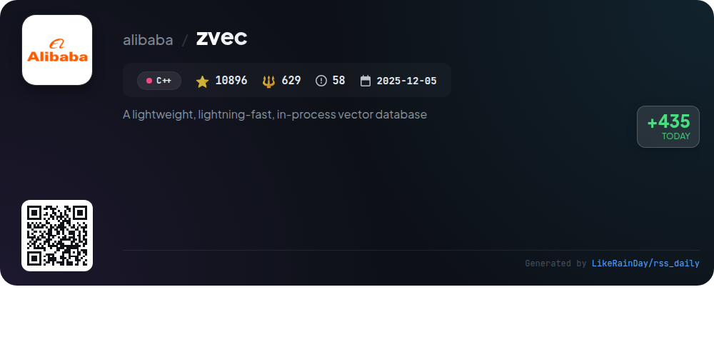
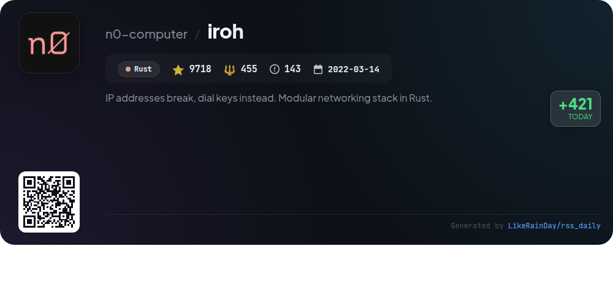
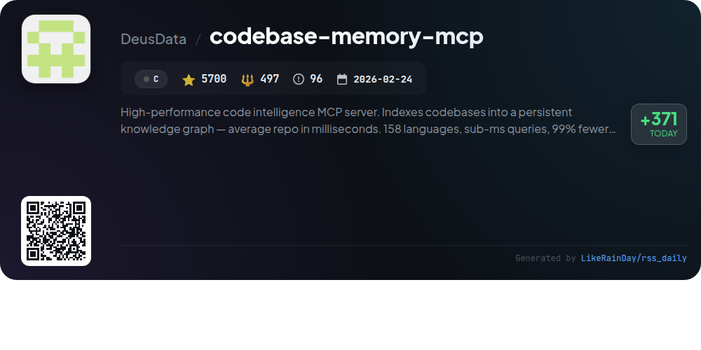
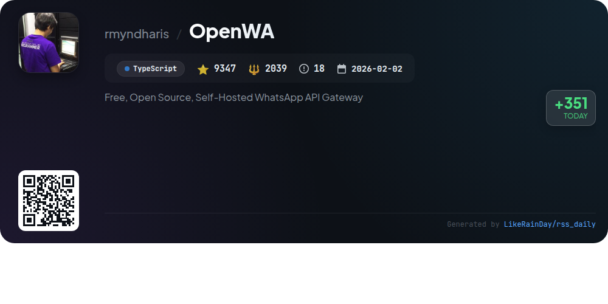
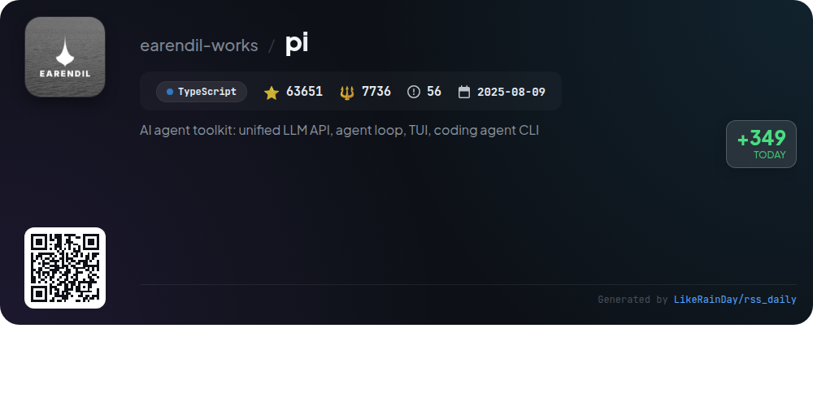
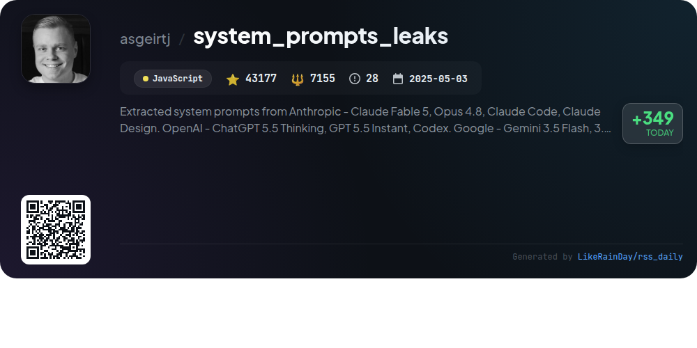

# 📊 🌟 GitHub Trending Daily - 2026-06-18

> > 📅 每日精选 GitHub 热门仓库 | 基于智能算法推荐

## 📋 Overview

**10** 个项目 | **777191** ⭐ | **74966** 🍴

**热门语言:** `TypeScript` (3) · `Rust` (3) · `JavaScript` (2)

**更新时间:** 2026-06-18 04:45 UTC

**分类分布:**

- 🌟 每日 Top 10 精选 (10 项)

---

## 🌟 每日 Top 10 精选

### 1. [cc-switch](https://github.com/farion1231/cc-switch)

> 🤖 **推荐理由**  
> *CC Switch is a cross-platform desktop assistant that streamlines the management of AI coding tools like Claude Code, Codex, Gemini CLI, and more. Key features include one-click provider switching, unified MCP and Skills management, and a user-friendly interface with over 50 presets. It offers system tray quick access, cloud sync, and built-in utilities for enhanced user experience. The app is built with Rust and Tauri, ensuring high performance across Windows, macOS, and Linux. For more information, visit ccswitch.io.*

- ⭐ 103653 stars
- 💻 Rust
- 📅 Updated: 2026-06-18

### 2. [freeCodeCamp](https://github.com/freeCodeCamp/freeCodeCamp)

> 🤖 **推荐理由**  
> *freeCodeCamp is an open-source platform offering a comprehensive curriculum for learning math, programming, and computer science at no cost. With over 449,000 stars on GitHub, it provides a self-paced learning experience through interactive coding challenges and certifications in areas like Full-Stack Development and language proficiency. Key features include a supportive community forum, a YouTube channel with free courses, and tools for interview preparation. The platform empowers individuals to transition into tech careers, having already helped over 100,000 people secure developer jobs.*

- ⭐ 449201 stars
- 💻 TypeScript
- 📅 Updated: 2026-06-18

### 3. [caveman](https://github.com/JuliusBrussee/caveman)

> 🤖 **推荐理由**  
> *Caveman is a JavaScript skill/plugin that optimizes communication by reducing response tokens by approximately 75% while maintaining technical accuracy. It transforms verbose outputs into concise, clear messages, enhancing readability and speed. Users can choose from various compression levels: `lite`, `full`, `ultra`, or `wenyan`. Key features include commands for compressing replies, generating commit messages, and rewriting files in caveman-speak. With over 74,000 stars, it integrates seamlessly with multiple agents, enabling efficient coding and communication across languages.*

- ⭐ 74162 stars
- 💻 JavaScript
- 📅 Updated: 2026-06-18

### 4. [universal-android-debloater-next-generation](https://github.com/Universal-Debloater-Alliance/universal-android-debloater-next-generation)

> 🤖 **推荐理由**  
> *Universal Android Debloater Next Generation is a cross-platform GUI tool written in Rust that utilizes ADB to debloat non-rooted Android devices, enhancing privacy, security, and battery life. With over 7,600 stars, it allows users to remove unnecessary system apps, reducing the attack surface of their devices. UAD-ng does not collect user data and provides comprehensive documentation on usage, features, and suggested app replacements. It also integrates with various projects for enhanced debloating capabilities. Join the community on Discord for support.*

- ⭐ 7686 stars
- 💻 Rust
- 📅 Updated: 2026-06-18

### 5. [zvec](https://github.com/alibaba/zvec)

> 🤖 **推荐理由**  
> *Zvec is a lightweight, high-performance in-process vector database designed for seamless integration into applications. With over 10,800 stars on GitHub, it offers rapid similarity search capabilities for billions of vectors. Key features include support for dense and sparse vectors, native full-text search, hybrid retrieval, and durable storage with write-ahead logging. Zvec runs on various platforms and provides official SDKs for Python, Node.js, Go, and Rust. It’s ideal for production environments requiring low-latency and scalable data operations.*

- ⭐ 10896 stars
- 💻 C++
- 📅 Updated: 2026-06-18

### 6. [iroh](https://github.com/n0-computer/iroh)

> 🤖 **推荐理由**  
> *Iroh is a modular networking stack built in Rust, allowing connections via public keys instead of IP addresses. With features like hole-punching and fallback to public relay servers, it optimizes connectivity. Leveraging QUIC for secure and efficient communication, Iroh provides pre-built protocols such as iroh-blobs for scalable blob transfers and iroh-gossip for publish-subscribe networks. The project has garnered over 9,700 stars on GitHub, highlighting its community interest and robust capabilities for networking applications.*

- ⭐ 9718 stars
- 💻 Rust
- 📅 Updated: 2026-06-18

### 7. [codebase-memory-mcp](https://github.com/DeusData/codebase-memory-mcp)

> 🤖 **推荐理由**  
> *High-performance code intelligence MCP server. Indexes codebases into a persistent knowledge graph — average repo in milliseconds. 158 languages, su. popular project, actively maintained, recently updated*

- ⭐ 5700 stars
- 🍴 497 forks
- 💻 C
- 📅 Updated: 2026-06-18

### 8. [OpenWA](https://github.com/rmyndharis/OpenWA)

> 🤖 **推荐理由**  
> *OpenWA is a free, open-source, self-hosted WhatsApp API Gateway designed for developers seeking control over their messaging infrastructure. Key features include a pluggable architecture for easy customization of databases (SQLite/PostgreSQL), storage (Local/S3), and caching (Memory/Redis). It offers a REST API, multi-session management, webhooks, and a modern React dashboard for user-friendly management. OpenWA supports Docker for seamless deployment and integrates with tools like n8n for workflow automation, making it a versatile solution for WhatsApp automation and messaging needs.*

- ⭐ 9347 stars
- 💻 TypeScript
- 📅 Updated: 2026-06-18

### 9. [pi](https://github.com/earendil-works/pi)

> 🤖 **推荐理由**  
> *Pi is an AI agent toolkit offering a unified LLM API, an agent loop, a terminal user interface (TUI), and an interactive coding agent CLI. Key features include the ability to integrate multiple LLM providers (OpenAI, Anthropic, Google) through the `@earendil-works/pi-ai` package, a robust agent runtime for tool management in `@earendil-works/pi-agent-core`, and the coding agent CLI for seamless coding interactions. The project encourages sharing open-source coding agent sessions to enhance real-world task performance. Contributions are welcome, with a focus on security and supply-chain integrity.*

- ⭐ 63651 stars
- 💻 TypeScript
- 📅 Updated: 2026-06-18

### 10. [system_prompts_leaks](https://github.com/asgeirtj/system_prompts_leaks)

> 🤖 **推荐理由**  
> *The "system_prompts_leaks" GitHub project documents extracted system prompts from major AI models, including Anthropic's Claude, OpenAI's ChatGPT, Google's Gemini, and xAI's Grok. With over 43,000 stars, it offers an extensive repository of prompts, regularly updated with the latest versions and changes. Key features include detailed comparisons of model updates, integration guides, and various AI tools. This project serves as a valuable resource for understanding and utilizing AI chatbot instructions across multiple platforms.*

- ⭐ 43177 stars
- 💻 JavaScript
- 📅 Updated: 2026-06-18

---

## 📡 RSS订阅

通过 RSS 订阅，第一时间获取每日精选项目：

- 🔔 [RSS 订阅源] (../../daily-top.xml)
- 🔔 [每日简报] (../../GITHUB_TODAY_CN.md)
- 🔔 [每日 Top 10 精选](../../daily-top.xml)

---

*⚡ Powered by Smart Trending Algorithm | Generated at 2026-06-18 04:45:14 UTC
