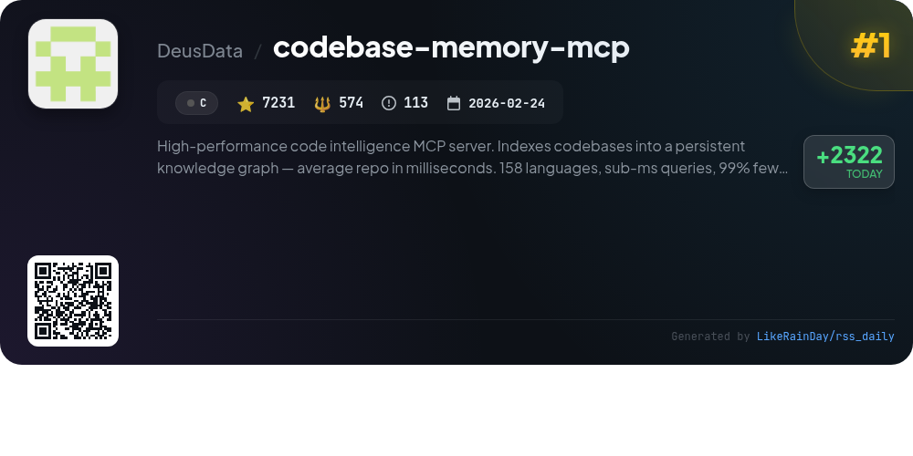
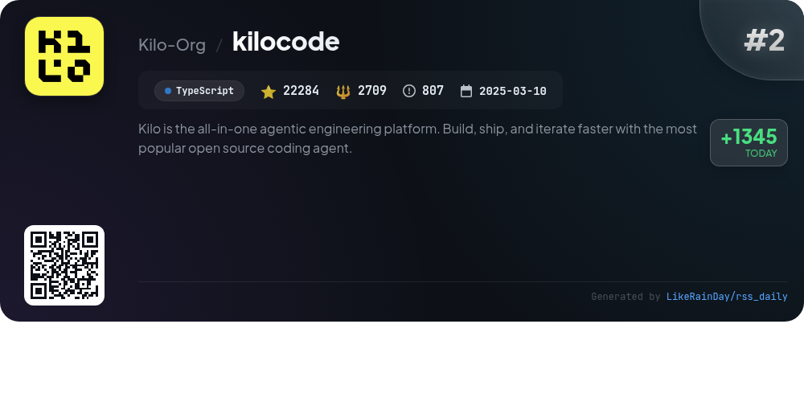
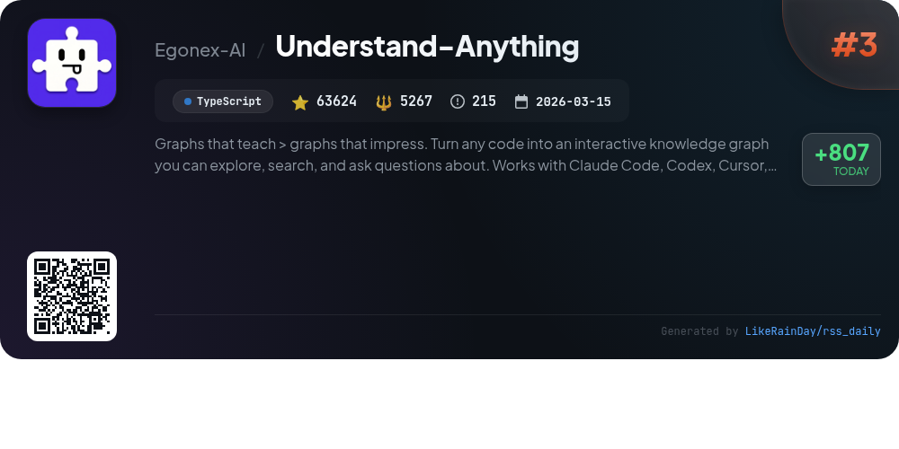
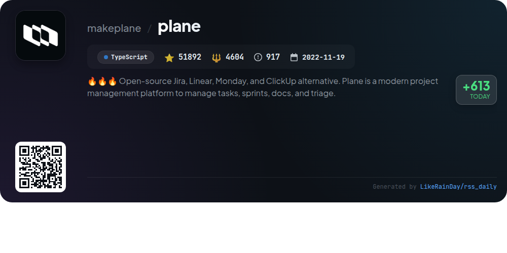
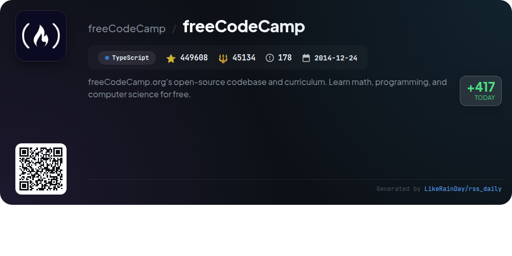
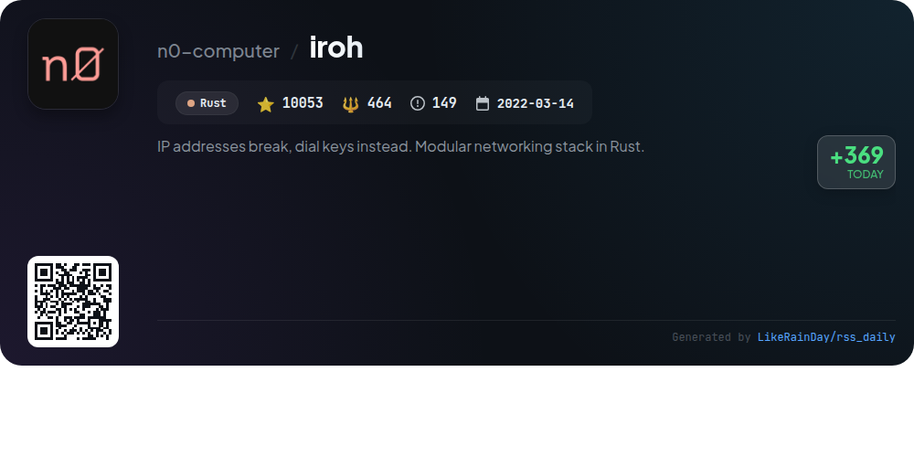
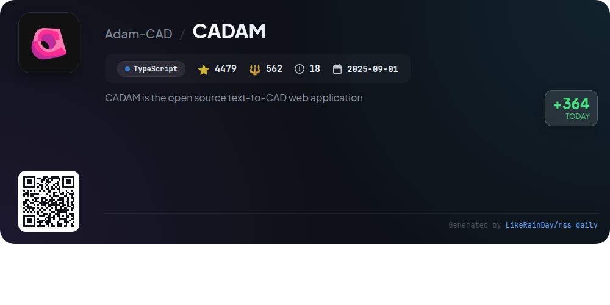
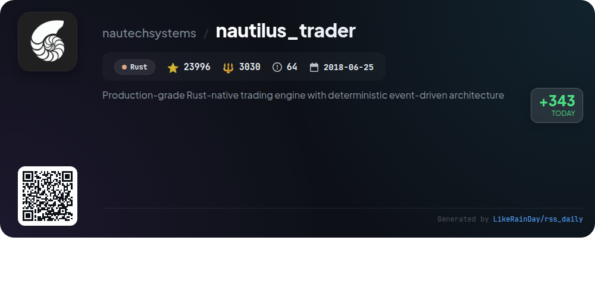
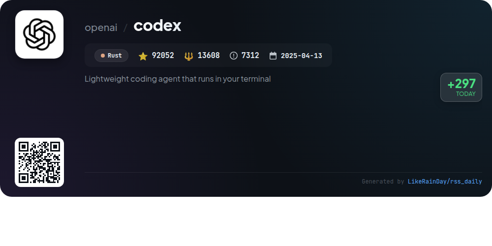
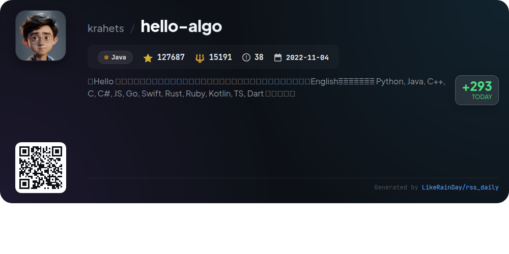

# 📊 🌟 GitHub Trending Daily - 2026-06-19

> > 📅 每日精选 GitHub 热门仓库 | 基于智能算法推荐

## 📋 Overview

**10** 个项目 | **852906** ⭐ | **91143** 🍴

**热门语言:** `TypeScript` (5) · `Rust` (3) · `C` (1)

**更新时间:** 2026-06-19 05:03 UTC

**分类分布:**

- 🌟 每日 Top 10 精选 (10 项)

---

## 🌟 每日 Top 10 精选

### 1. [codebase-memory-mcp](https://github.com/DeusData/codebase-memory-mcp)

> 🤖 **推荐理由**  
> *High-performance code intelligence MCP server. Indexes codebases into a persistent knowledge graph — average repo in milliseconds. 158 languages, su. popular project, actively maintained, recently updated*

- ⭐ 7231 stars
- 🍴 574 forks
- 💻 C
- 📅 Updated: 2026-06-19

### 2. [kilocode](https://github.com/Kilo-Org/kilocode)

> 🤖 **推荐理由**  
> *KiloCode is an open-source, all-in-one coding agentic engineering platform that accelerates development in VS Code, JetBrains, and the CLI. With over 22,000 stars, it supports 500+ models for tasks like code generation, debugging, and reviews. Key features include inline autocomplete, self-checking capabilities, and terminal/browser control. Users can switch models mid-task and operate in autonomous mode for CI/CD. KiloCode also offers cloud access and specialized agents tailored for different coding tasks. Join the community on Discord and Reddit for support and collaboration.*

- ⭐ 22284 stars
- 💻 TypeScript
- 📅 Updated: 2026-06-19

### 3. [Understand-Anything](https://github.com/Egonex-AI/Understand-Anything)

> 🤖 **推荐理由**  
> *Understand-Anything is an open-source project that transforms any codebase into an interactive knowledge graph, enabling exploration, search, and inquiry. It supports tools like Claude Code, Codex, and Copilot. Key features include structural graph navigation, business logic visualization, guided tours, fuzzy search, and impact analysis. The dashboard dynamically adapts to different user roles, making it suitable for developers and project managers alike. With a focus on enhancing understanding rather than mere presentation, it aims to streamline onboarding and code comprehension.*

- ⭐ 63624 stars
- 💻 TypeScript
- 📅 Updated: 2026-06-19

### 4. [plane](https://github.com/makeplane/plane)

> 🤖 **推荐理由**  
> *Plane is an open-source project management platform designed as an alternative to Jira, Linear, Monday, and ClickUp. With over 51,000 stars, it offers features like task management with rich text editing, sprint tracking through Cycles, customizable workflow views, and AI-enhanced note-taking with Plane Pages. Users can choose between a cloud setup or self-hosting for data control. Real-time analytics provide insights for project optimization. Engage with the community through forums and GitHub discussions for support and contributions.*

- ⭐ 51892 stars
- 💻 TypeScript
- 📅 Updated: 2026-06-19

### 5. [freeCodeCamp](https://github.com/freeCodeCamp/freeCodeCamp)

> 🤖 **推荐理由**  
> *freeCodeCamp is an open-source platform offering a comprehensive curriculum for learning math, programming, and computer science for free. With over 449,000 stars on GitHub, it features self-paced full-stack web development and machine learning courses, alongside certifications in various programming languages. Users can access thousands of interactive challenges, a supportive community forum, a YouTube channel with free courses, and additional resources for job interview preparation. The platform is operated by a donor-supported nonprofit, helping over 100,000 individuals start their tech careers.*

- ⭐ 449608 stars
- 💻 TypeScript
- 📅 Updated: 2026-06-19

### 6. [iroh](https://github.com/n0-computer/iroh)

> 🤖 **推荐理由**  
> *Iroh is a modular networking stack written in Rust, enabling connections via public key dialing instead of IP addresses. Key features include efficient hole-punching to establish direct connections and fallback to public relay servers for optimal performance. Built on QUIC, Iroh offers authenticated encryption and concurrent streams. It supports various protocols like iroh-blobs for scalable blob transfers, iroh-gossip for publish-subscribe networks, and iroh-docs for key-value storage. With over 10,000 stars, it provides bindings for multiple languages and comprehensive documentation.*

- ⭐ 10053 stars
- 💻 Rust
- 📅 Updated: 2026-06-19

### 7. [CADAM](https://github.com/Adam-CAD/CADAM)

> 🤖 **推荐理由**  
> *CADAM is an open-source text-to-CAD web application that enables users to generate 3D models from natural language descriptions and images, all within the browser. Key features include AI-powered model generation, interactive parametric controls for real-time adjustments, and multiple export formats (.STL, .SCAD, .DXF). It utilizes WebAssembly for efficient performance and offers support for libraries like BOSL and MCAD. CADAM’s user-friendly interface allows for instant previews and smart updates, making it a valuable tool for designers and engineers.*

- ⭐ 4479 stars
- 💻 TypeScript
- 📅 Updated: 2026-06-19

### 8. [nautilus_trader](https://github.com/nautechsystems/nautilus_trader)

> 🤖 **推荐理由**  
> *NautilusTrader is a production-grade, Rust-native trading engine designed for multi-asset, multi-venue trading systems. It features a deterministic event-driven architecture, enabling seamless transitions from research to live execution without code changes. Key highlights include high performance via Rust, Python integration for strategy development, and support for various asset classes and trading venues. The engine offers advanced order types, backtesting capabilities, and modular adapters for easy integration with APIs. NautilusTrader prioritizes reliability, portability, and customization, making it ideal for quantitative traders.*

- ⭐ 23996 stars
- 💻 Rust
- 📅 Updated: 2026-06-19

### 9. [codex](https://github.com/openai/codex)

> 🤖 **推荐理由**  
> *Codex is a lightweight coding agent from OpenAI that runs locally on your terminal, developed in Rust. With over 92,000 stars on GitHub, it seamlessly integrates with various IDEs and offers a desktop app experience. Users can quickly install Codex CLI via curl, PowerShell, npm, or Homebrew. It supports ChatGPT account integration for enhanced functionality, catering to Plus, Pro, Business, Edu, or Enterprise plans. Comprehensive documentation, contributing guidelines, and installation instructions are available, making it user-friendly for developers.*

- ⭐ 92052 stars
- 💻 Rust
- 📅 Updated: 2026-06-19

### 10. [hello-algo](https://github.com/krahets/hello-algo)

> 🤖 **推荐理由**  
> *Hello-algo is an open-source tutorial designed to teach data structures and algorithms through interactive animations and runnable code. It supports multiple languages, including Python, Java, C++, and more, making it accessible to a diverse audience. With a focus on clarity and ease of understanding, it guides beginners through complex concepts while encouraging collaborative learning. Users can engage through comments and contributions, enhancing the content continuously. The project is available in Simplified Chinese, Traditional Chinese, English, and Japanese, making it a valuable resource for learners worldwide.*

- ⭐ 127687 stars
- 💻 Java
- 📅 Updated: 2026-06-19

---

## 📡 RSS订阅

通过 RSS 订阅，第一时间获取每日精选项目：

- 🔔 [RSS 订阅源] (../../daily-top.xml)
- 🔔 [每日简报] (../../GITHUB_TODAY_CN.md)
- 🔔 [每日 Top 10 精选](../../daily-top.xml)

---

*⚡ Powered by Smart Trending Algorithm | Generated at 2026-06-19 05:03:51 UTC
