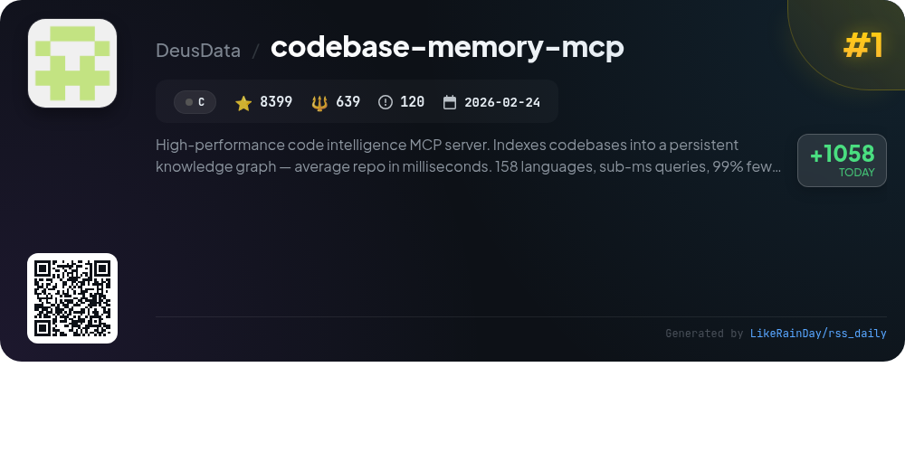
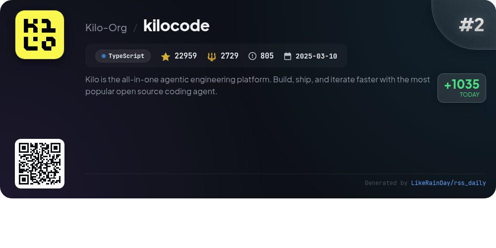
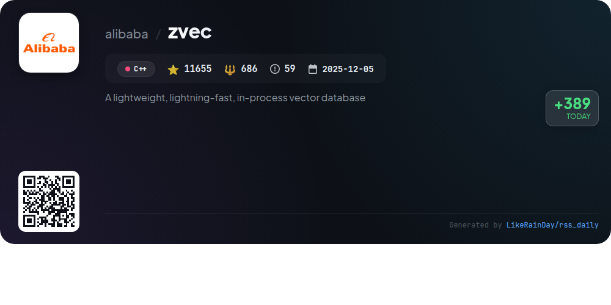
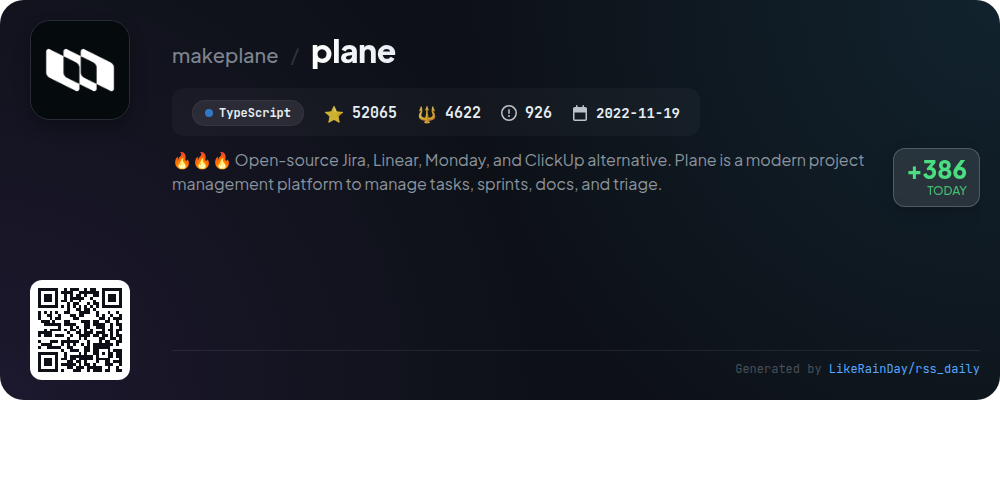
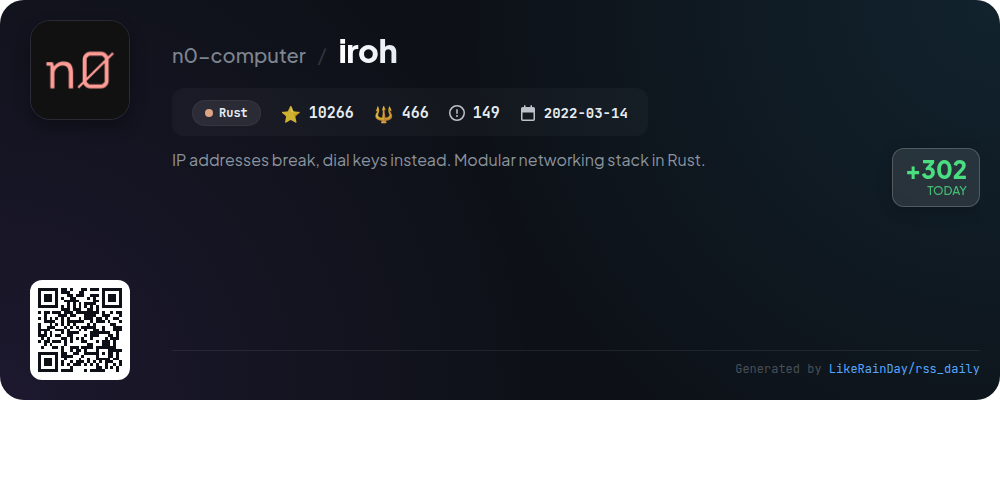
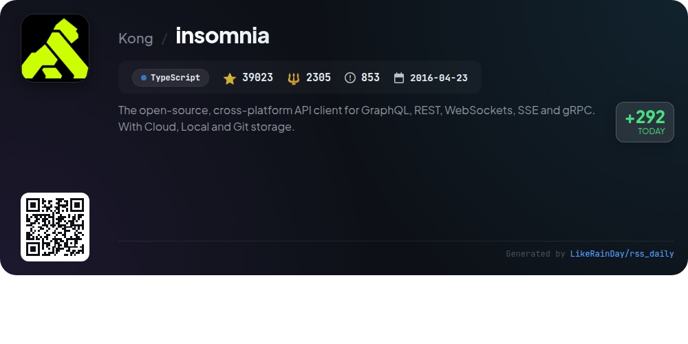
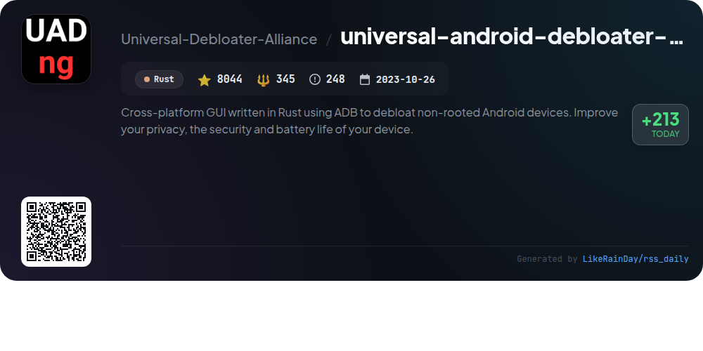
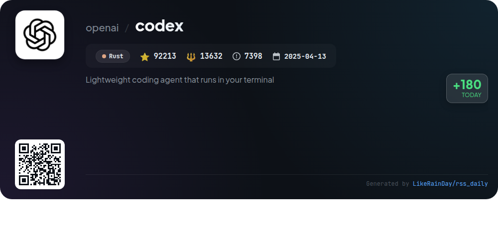

# 📊 🌟 GitHub Trending Daily - 2026-06-20

> > 📅 Daily Picks of GitHub Trending Repositories | Powered by Smart Algorithms

## 📋 Overview

**10** Projects | **252516** ⭐ | **25947** 🍴

**Top Languages:** `TypeScript` (4) · `Rust` (3) · `C` (1)

**Updated:** 2026-06-20 04:17 UTC

**Categories:**

- 🌟 Daily Top 10 (10 items)

---

## 🌟 Daily Top 10

### 1. [codebase-memory-mcp](https://github.com/DeusData/codebase-memory-mcp)

> 🤖 **Why Recommend**  
> *High-performance code intelligence MCP server. Indexes codebases into a persistent knowledge graph — average repo in milliseconds. 158 languages, su. popular project, actively maintained, recently updated*

- ⭐ 8399 stars
- 🍴 639 forks
- 💻 C
- 📅 Updated: 2026-06-20

### 2. [kilocode](https://github.com/Kilo-Org/kilocode)

> 🤖 **Why Recommend**  
> *KiloCode is an all-in-one open-source coding agent platform designed to enhance development speed and efficiency. With over 22,000 stars, it supports integration with VS Code, JetBrains, and CLI environments. Key features include access to 500+ AI models, task-specific agents for coding, planning, debugging, and automated code reviews. Kilo offers inline autocomplete, self-checking code generation, and autonomous operation for CI/CD pipelines. Built for flexibility, it allows mid-task model switching and requires no API keys, making it user-friendly and accessible for developers.*

- ⭐ 22959 stars
- 💻 TypeScript
- 📅 Updated: 2026-06-20

### 3. [palmier-pro](https://github.com/palmier-io/palmier-pro)

> 🤖 **Why Recommend**  
> *Palmier Pro is an open-source video editor for macOS, designed for seamless integration with AI tools. Built in Swift, it offers a user-friendly timeline for collaborative editing alongside generative AI features, utilizing models like Seedance and Kling. Users can connect to agents such as Claude and Codex via a built-in MCP server, enhancing the editing experience. While the core editor is free and open-source, generative AI features require a subscription. Compatible exclusively with macOS 26 (Tahoe) on Apple Silicon, Palmier Pro aims to redefine video editing workflows.*

- ⭐ 2020 stars
- 💻 Swift
- 📅 Updated: 2026-06-20

### 4. [zvec](https://github.com/alibaba/zvec)

> 🤖 **Why Recommend**  
> *Zvec is a lightweight, in-process vector database designed for high-performance similarity search, boasting over 11,600 stars on GitHub. Key features include support for both dense and sparse vectors, native full-text search, and hybrid queries that combine vector and text-based searches. It enables efficient data storage with write-ahead logging for persistence and concurrent access. With SDKs available for Python, Node.js, Go, and Rust, Zvec easily integrates into various applications. Ideal for production workloads, it emphasizes speed and scalability.*

- ⭐ 11655 stars
- 💻 C++
- 📅 Updated: 2026-06-20

### 5. [plane](https://github.com/makeplane/plane)

> 🤖 **Why Recommend**  
> *Plane is an open-source project management platform designed to streamline task management, sprints, and documentation. Key features include customizable work items with a rich text editor, cycle tracking with burn-down charts, modular project organization, and real-time analytics. Users can choose between a cloud solution for quick setup or self-hosting for full data control. With a strong community focus, Plane encourages contributions and feedback through forums and GitHub discussions. Explore more at [plane.so](https://plane.so).*

- ⭐ 52065 stars
- 💻 TypeScript
- 📅 Updated: 2026-06-20

### 6. [flue](https://github.com/withastro/flue)

> 🤖 **Why Recommend**  
> *Flue is a TypeScript framework designed for building autonomous agents and AI workflows. It allows developers to create agents that maintain context, execute tasks, and interact with existing systems. Key features include secure sandboxes for executing tasks, durable execution for progress recovery, and the ability to define specialized subagents. Flue supports various deployment environments, including Node.js and cloud platforms. With built-in tools for observability and integration with services like Slack and GitHub, Flue empowers developers to create robust and intelligent workflows.*

- ⭐ 5872 stars
- 💻 TypeScript
- 📅 Updated: 2026-06-20

### 7. [iroh](https://github.com/n0-computer/iroh)

> 🤖 **Why Recommend**  
> *Iroh is a modular networking stack developed in Rust that enables seamless communication by dialing via public keys instead of IP addresses. It features efficient hole-punching for direct connections and a fallback to public relay servers, ensuring optimal performance. Built on the QUIC protocol, Iroh offers authenticated encryption and concurrent streams. Key services include iroh-blobs for scalable blob transfers, iroh-gossip for publish-subscribe networks, and an eventually-consistent key-value store. The project has gained significant traction with over 10,000 stars on GitHub.*

- ⭐ 10266 stars
- 💻 Rust
- 📅 Updated: 2026-06-20

### 8. [insomnia](https://github.com/Kong/insomnia)

> 🤖 **Why Recommend**  
> *Insomnia is an open-source, cross-platform API client designed for GraphQL, REST, WebSockets, SSE, and gRPC, boasting over 39,000 stars on GitHub. Key features include API debugging, design with an OpenAPI editor, testing with native suites, and mocking capabilities via cloud or self-hosted servers. It supports Local Vault, Git Sync, and Cloud Sync for flexible project storage. Insomnia also offers collaboration tools, a CLI for CI/CD integration, and a rich ecosystem of plugins. Available for Mac, Windows, and Linux, it enables users to manage sensitive data securely while ensuring ease of collaboration.*

- ⭐ 39023 stars
- 💻 TypeScript
- 📅 Updated: 2026-06-20

### 9. [universal-android-debloater-next-generation](https://github.com/Universal-Debloater-Alliance/universal-android-debloater-next-generation)

> 🤖 **Why Recommend**  
> *Universal Android Debloater Next Generation is a cross-platform GUI tool written in Rust that uses ADB to debloat non-rooted Android devices, enhancing privacy, security, and battery life. With over 8,000 stars on GitHub, it helps users remove unnecessary system apps, thus reducing the attack surface. The project prioritizes user privacy, collecting no data, and offers comprehensive documentation, including a usage guide and app replacements. Community integrations include Canta for rootless debloating and AppManager for advanced app management. Join the Discord for support and collaboration.*

- ⭐ 8044 stars
- 💻 Rust
- 📅 Updated: 2026-06-20

### 10. [codex](https://github.com/openai/codex)

> 🤖 **Why Recommend**  
> *Codex is a lightweight coding agent by OpenAI that runs locally in your terminal, designed for seamless integration with code editors like VS Code and desktop app experiences. With over 92,000 stars, it offers easy installation via curl, npm, or Homebrew. Users can sign in with a ChatGPT account to access features, or utilize an API key for advanced setups. Codex enhances coding efficiency by providing advanced AI assistance, making it suitable for developers across various plans. Comprehensive documentation and contribution guidelines are available on GitHub.*

- ⭐ 92213 stars
- 💻 Rust
- 📅 Updated: 2026-06-20

---

## 📡 RSS Subscription

Subscribe via RSS to get daily trending updates:

- 🔔 [RSS XML] (../../daily-top.xml)
- 🔔 [Daily Report] (../../GITHUB_TODAY.md)
- 🔔 [Daily Top 10](../../daily-top.xml)

---

*⚡ Powered by Smart Trending Algorithm | Generated at 2026-06-20 04:17:21 UTC
