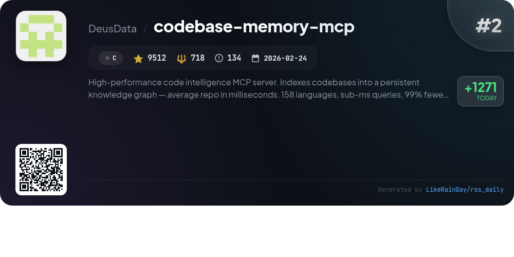
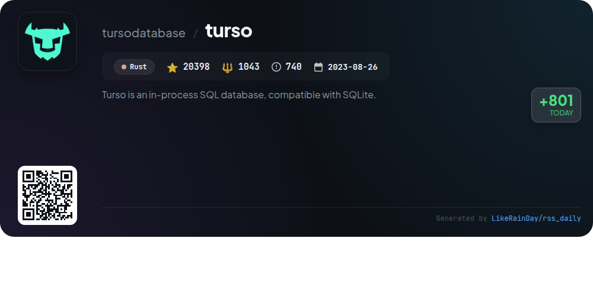
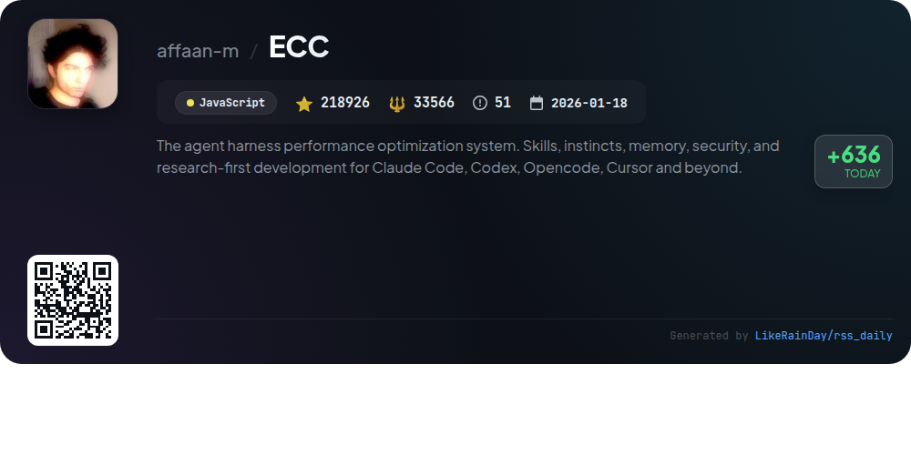
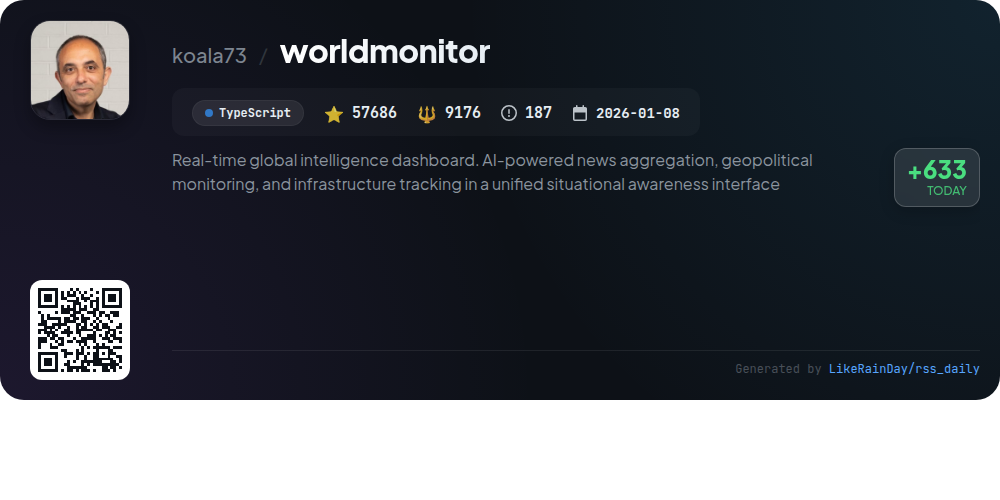
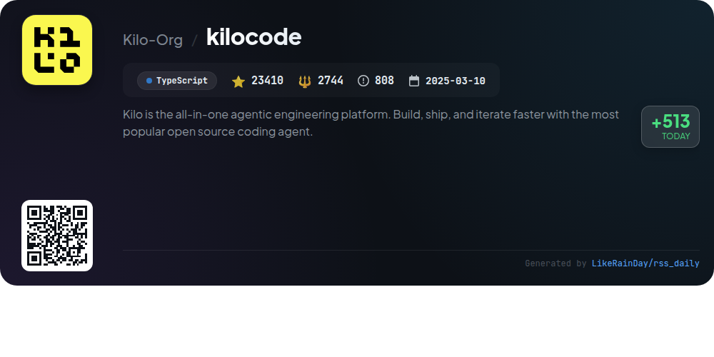
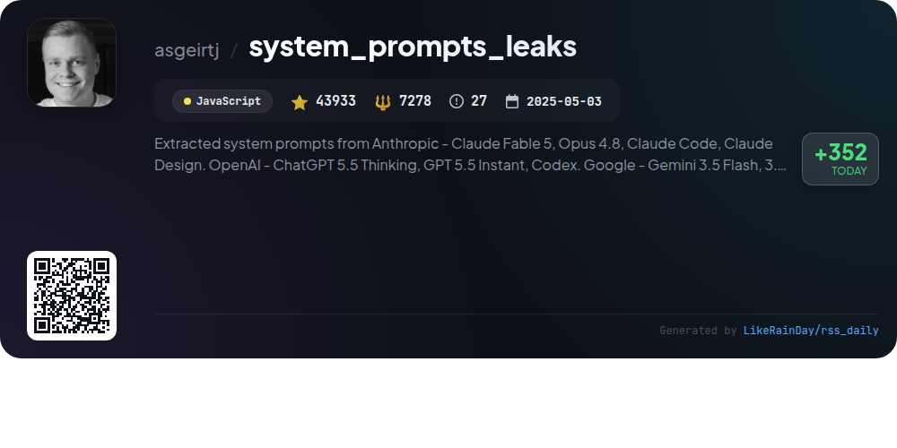
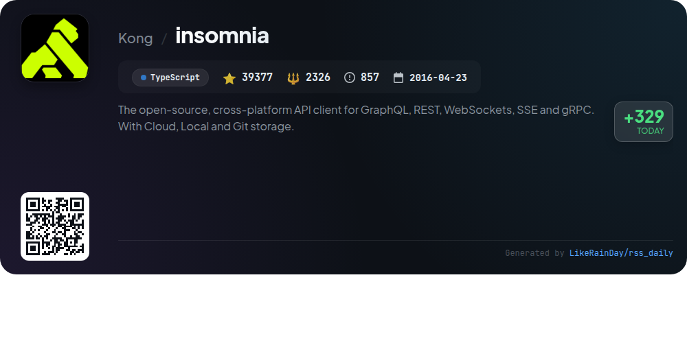
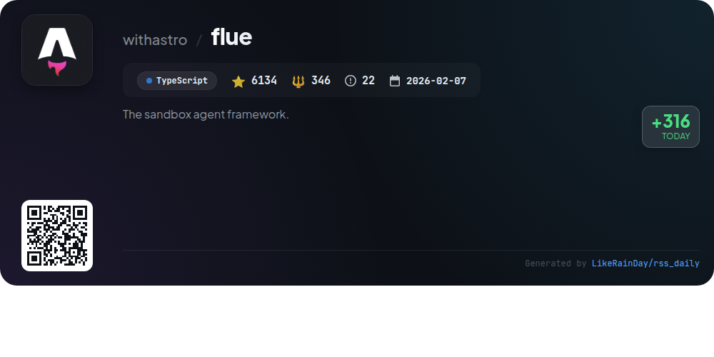

# 📊 🌟 GitHub Trending Daily - 2026-06-21

> > 📅 每日精选 GitHub 热门仓库 | 基于智能算法推荐

## 📋 Overview

**10** 个项目 | **478079** ⭐ | **68403** 🍴

**热门语言:** `TypeScript` (4) · `Rust` (2) · `JavaScript` (2)

**更新时间:** 2026-06-21 04:59 UTC

**分类分布:**

- 🌟 每日 Top 10 精选 (10 项)

---

## 🌟 每日 Top 10 精选

### 1. [Pake](https://github.com/tw93/Pake)

> 🤖 **推荐理由**  
> *Pake is a Rust-based tool that enables users to convert any webpage into a lightweight desktop app with a single command, supporting macOS, Windows, and Linux. Key features include a package size nearly 20 times smaller than Electron, fast performance, and ease of use with one-command packaging via CLI. It offers customization options, immersive windows, and support for shortcuts. Users can quickly start with pre-made packages or utilize the CLI for advanced packaging options. Pake is open-source under GPL-3.0, allowing full ownership of built applications.*

- ⭐ 55077 stars
- 💻 Rust
- 📅 Updated: 2026-06-21

### 2. [codebase-memory-mcp](https://github.com/DeusData/codebase-memory-mcp)

> 🤖 **推荐理由**  
> *High-performance code intelligence MCP server. Indexes codebases into a persistent knowledge graph — average repo in milliseconds. 158 languages, su. popular project, actively maintained, recently updated*

- ⭐ 9512 stars
- 🍴 718 forks
- 💻 C
- 📅 Updated: 2026-06-21

### 3. [palmier-pro](https://github.com/palmier-io/palmier-pro)

> 🤖 **推荐理由**  
> *Palmier Pro is an open-source video editor designed for macOS, built in Swift with a focus on integrating AI into the editing workflow. Key features include generative AI for video and image creation, seamless collaboration with AI agents via an MCP server, and a user-friendly timeline editor. While the core editor is free and open-source, generative AI capabilities require a subscription. Compatible with macOS 26 (Tahoe) on Apple Silicon, Palmier Pro offers a modern alternative to traditional editors like Premiere Pro, promoting creative collaboration and innovation.*

- ⭐ 3626 stars
- 💻 Swift
- 📅 Updated: 2026-06-21

### 4. [turso](https://github.com/tursodatabase/turso)

> 🤖 **推荐理由**  
> *Turso is an in-process SQL database, compatible with SQLite.. popular project, actively maintained, recently updated*

- ⭐ 20398 stars
- 🍴 1043 forks
- 💻 Rust
- 📅 Updated: 2026-06-21

### 5. [ECC](https://github.com/affaan-m/ECC)

> 🤖 **推荐理由**  
> *ECC is a performance optimization system for AI agents like Claude Code, Codex, and Cursor, boasting over 218,000 stars on GitHub. Core features include skills, instincts, memory optimization, security scanning, and continuous learning, facilitating cross-harness workflows. ECC supports 12 programming languages and offers a robust ecosystem with 67 agents and 271 skills. Key highlights are the AgentShield security auditor, a user-friendly dashboard GUI, and customizable workflows. It integrates seamlessly with various platforms, providing a comprehensive solution for AI-driven development.*

- ⭐ 218926 stars
- 💻 JavaScript
- 📅 Updated: 2026-06-21

### 6. [worldmonitor](https://github.com/koala73/worldmonitor)

> 🤖 **推荐理由**  
> *World Monitor is a real-time global intelligence dashboard that utilizes AI for news aggregation, geopolitical monitoring, and infrastructure tracking. Key features include over 500 curated news feeds across 15 categories, a dual map engine with 3D and flat map visualizations, and a Country Instability Index for 31 Tier-1 countries. The platform supports multiple site variants (world, tech, finance, etc.) and offers a native desktop application for macOS, Windows, and Linux. With a focus on situational awareness, World Monitor integrates diverse data from over 65 sources, providing users with comprehensive insights.*

- ⭐ 57686 stars
- 💻 TypeScript
- 📅 Updated: 2026-06-21

### 7. [kilocode](https://github.com/Kilo-Org/kilocode)

> 🤖 **推荐理由**  
> *KiloCode is an all-in-one, open-source coding agent platform designed for faster development across VS Code, JetBrains, and CLI environments. With over 500 models available, users can seamlessly switch between coding, planning, debugging, and reviewing tasks without API keys. Key features include natural language code generation, inline autocompletion, self-checking, terminal automation, and autonomous CI/CD operations. KiloCode supports collaboration through a community-driven approach and offers flexible pricing based on model providers. Join the community on Discord and Reddit for support and insights.*

- ⭐ 23410 stars
- 💻 TypeScript
- 📅 Updated: 2026-06-21

### 8. [system_prompts_leaks](https://github.com/asgeirtj/system_prompts_leaks)

> 🤖 **推荐理由**  
> *The "system_prompts_leaks" GitHub project documents extracted system prompts from major AI models including Anthropic's Claude, OpenAI's ChatGPT, Google's Gemini, and xAI's Grok. With over 43,000 stars, it serves as a comprehensive resource for accessing and comparing the instructions behind these AI systems. Key features include regular updates, detailed model prompts, and diffs to track changes across versions. The repository aims to enhance understanding of AI functionalities by revealing the underlying prompts that guide their responses.*

- ⭐ 43933 stars
- 💻 JavaScript
- 📅 Updated: 2026-06-21

### 9. [insomnia](https://github.com/Kong/insomnia)

> 🤖 **推荐理由**  
> *Insomnia is an open-source, cross-platform API client supporting GraphQL, REST, WebSockets, SSE, and gRPC. With 39,377 stars on GitHub, it offers powerful features for debugging, designing, testing, and mocking APIs. Key highlights include a native OpenAPI editor, CI/CD pipeline integration via the Insomnia CLI, and collaboration tools. Users can choose from Local Vault, Cloud Sync, or Git Sync for project storage, ensuring flexibility in data management. Insomnia also supports third-party plugins, enhancing functionality further. Available for Mac, Windows, and Linux, it provides a robust solution for API development.*

- ⭐ 39377 stars
- 💻 TypeScript
- 📅 Updated: 2026-06-21

### 10. [flue](https://github.com/withastro/flue)

> 🤖 **推荐理由**  
> *Flue is a powerful TypeScript framework designed for building autonomous agents and AI workflows. With features like durable execution, secure sandboxes, and the ability to maintain context across interactions, Flue enables agents to autonomously tackle complex tasks. Key highlights include customizable agents, structured workflows, reusable skills, and integration with various tools and services. Flue supports deployment on platforms like Node.js, Cloudflare Workers, and GitHub Actions, making it versatile for any developer looking to leverage AI-driven automation.*

- ⭐ 6134 stars
- 💻 TypeScript
- 📅 Updated: 2026-06-21

---

## 📡 RSS订阅

通过 RSS 订阅，第一时间获取每日精选项目：

- 🔔 [RSS 订阅源] (../../daily-top.xml)
- 🔔 [每日简报] (../../GITHUB_TODAY_CN.md)
- 🔔 [每日 Top 10 精选](../../daily-top.xml)

---

*⚡ Powered by Smart Trending Algorithm | Generated at 2026-06-21 04:59:52 UTC
