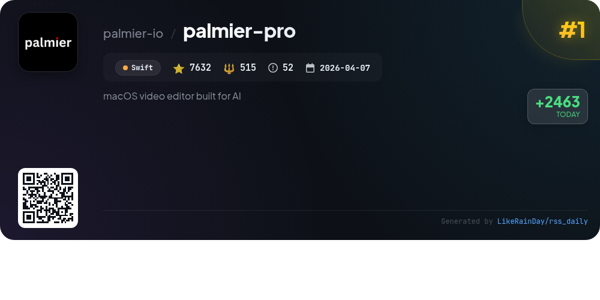
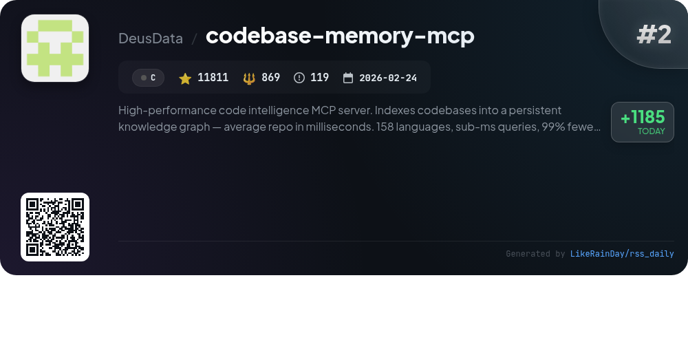
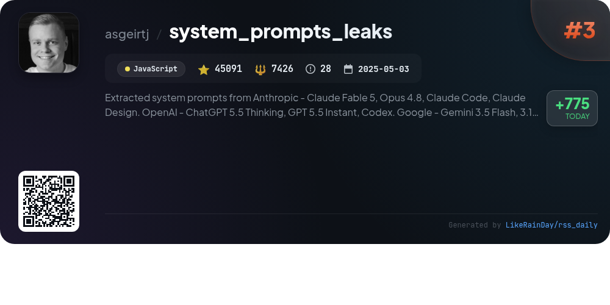
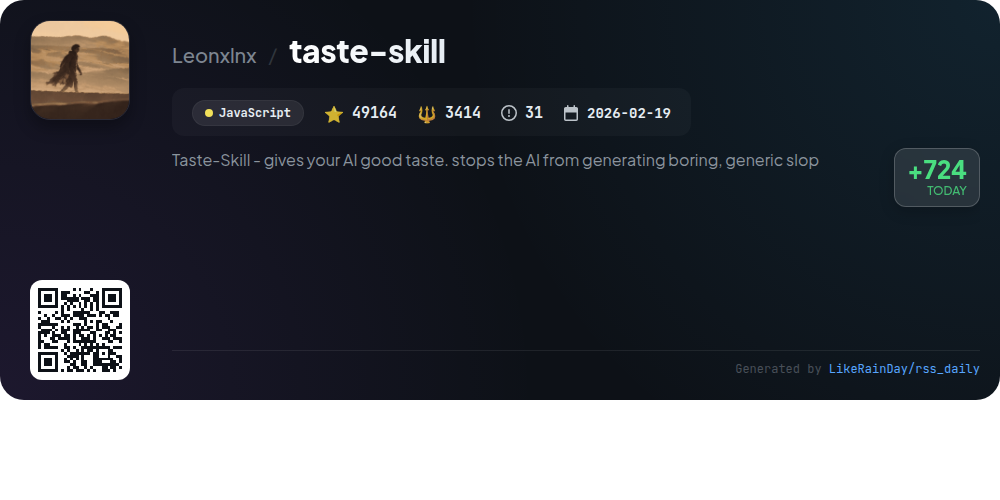
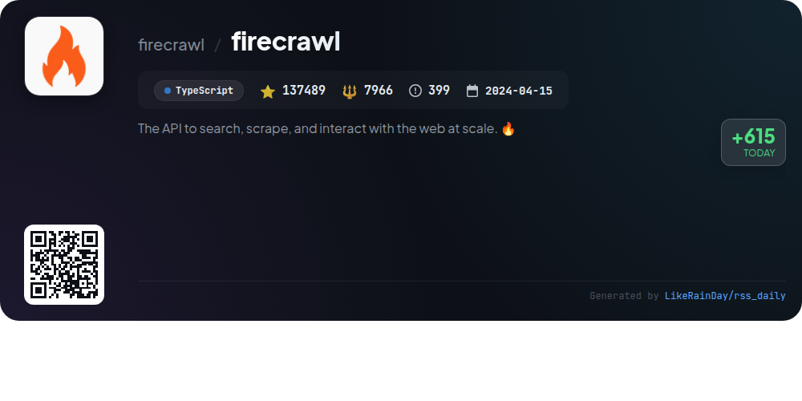
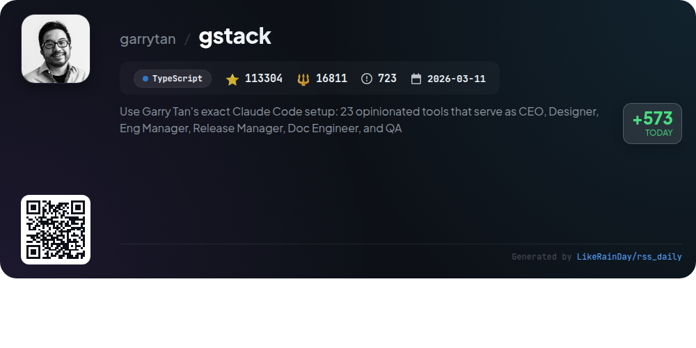
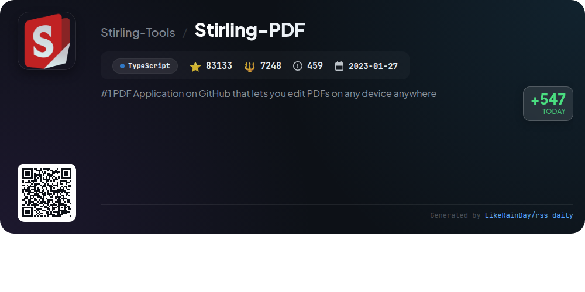
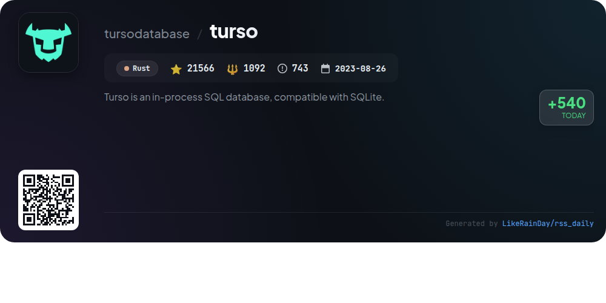
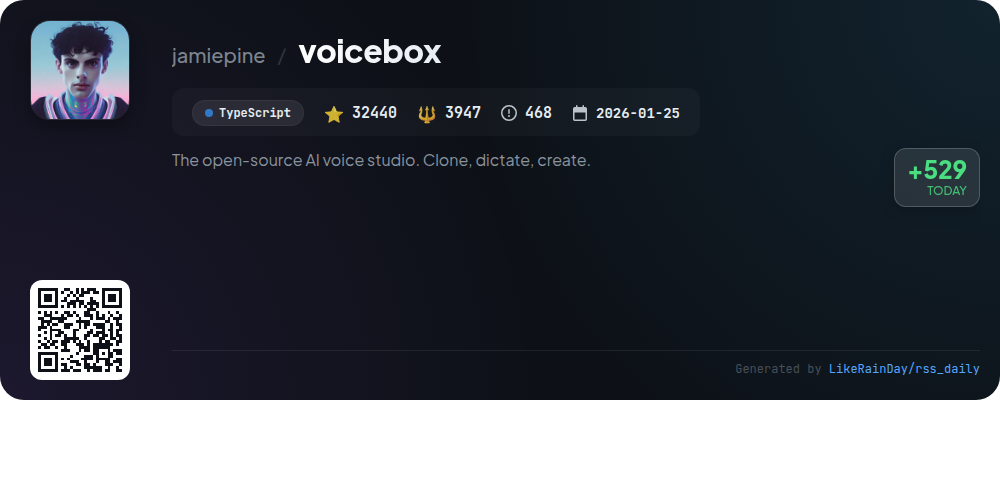
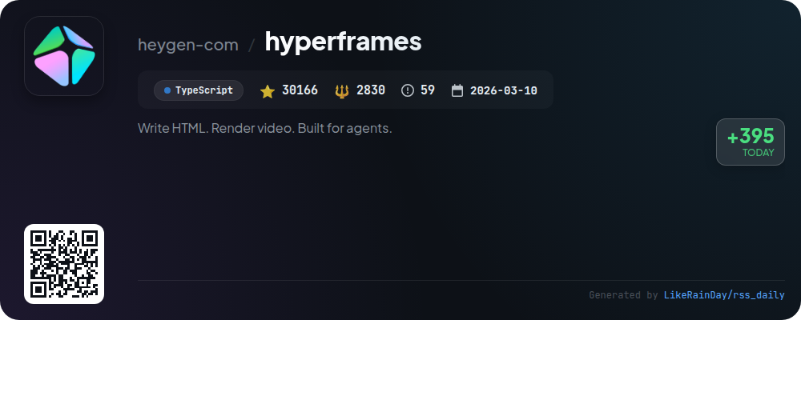

# 📊 🌟 GitHub Trending Daily - 2026-06-23

> > 📅 Daily Picks of GitHub Trending Repositories | Powered by Smart Algorithms

## 📋 Overview

**10** Projects | **531796** ⭐ | **52118** 🍴

**Top Languages:** `TypeScript` (5) · `JavaScript` (2) · `C` (1)

**Updated:** 2026-06-23 04:06 UTC

**Categories:**

- 🌟 Daily Top 10 (10 items)

---

## 🌟 Daily Top 10

### 1. [palmier-pro](https://github.com/palmier-io/palmier-pro)

> 🤖 **Why Recommend**  
> *Palmier Pro is an open-source macOS video editor designed for AI integration, built with Swift. It allows users to collaboratively generate and edit videos using advanced generative AI models like Seedance and Nano Banana Pro. Key features include a seamless timeline editor, connectivity with AI agents via MCP server, and free usage of the core video editing tools, with optional subscription-based generative AI capabilities. Exclusively for macOS 26 on Apple Silicon, Palmier Pro aims to redefine video editing workflows by merging traditional editing with cutting-edge AI technology.*

- ⭐ 7632 stars
- 💻 Swift
- 📅 Updated: 2026-06-23

### 2. [codebase-memory-mcp](https://github.com/DeusData/codebase-memory-mcp)

> 🤖 **Why Recommend**  
> *High-performance code intelligence MCP server. Indexes codebases into a persistent knowledge graph — average repo in milliseconds. 158 languages, su. popular project, actively maintained, recently updated*

- ⭐ 11811 stars
- 🍴 869 forks
- 💻 C
- 📅 Updated: 2026-06-23

### 3. [system_prompts_leaks](https://github.com/asgeirtj/system_prompts_leaks)

> 🤖 **Why Recommend**  
> *The "system_prompts_leaks" GitHub repository documents extracted system prompts from various AI chatbots, including Claude, ChatGPT, Gemini, and Grok. With over 45,000 stars, it serves as a comprehensive resource for understanding the internal instructions guiding these models. Key features include regular updates on new models, detailed prompt comparisons (e.g., Claude Fable 5 vs. Opus 4.8), and a variety of prompts for tools like GitHub Copilot and Google Assistant. This project enhances transparency in AI behavior and is frequently referenced in media, including The Washington Post.*

- ⭐ 45091 stars
- 💻 JavaScript
- 📅 Updated: 2026-06-23

### 4. [taste-skill](https://github.com/Leonxlnx/taste-skill)

> 🤖 **Why Recommend**  
> *Taste-Skill is a JavaScript framework designed to enhance AI-generated interfaces by promoting visually appealing, non-generic designs. With over 49,000 stars, it offers portable Agent Skills that improve layout, typography, and motion. Key features include various skills for image generation, redesigning existing projects, and enforcing output quality. Users can easily install skills via `npx`, and the framework supports multiple coding agents like Codex and ChatGPT. Taste-Skill aims to elevate the aesthetics of AI-driven frontends, making them more engaging and sophisticated.*

- ⭐ 49164 stars
- 💻 JavaScript
- 📅 Updated: 2026-06-23

### 5. [firecrawl](https://github.com/firecrawl/firecrawl)

> 🤖 **Why Recommend**  
> *Firecrawl is a powerful API for searching, scraping, and interacting with the web at scale, built in TypeScript and open-source. With industry-leading reliability, it covers 96% of the web, including JavaScript-heavy pages, providing clean data in various formats like Markdown and JSON. Key features include web search, content scraping, page interaction, automated data gathering, and website crawling. It integrates seamlessly with AI agents and supports batch scraping. Firecrawl is designed for real-time applications, ensuring rapid and efficient data extraction.*

- ⭐ 137489 stars
- 💻 TypeScript
- 📅 Updated: 2026-06-23

### 6. [gstack](https://github.com/garrytan/gstack)

> 🤖 **Why Recommend**  
> *gstack is an open-source project that transforms Garry Tan's "Claude Code" setup into a powerful AI-driven software development toolkit. It features 23 specialized tools, acting as a virtual engineering team, facilitating roles such as CEO, Designer, and QA. Key capabilities include streamlined planning with `/office-hours`, automated code reviews with `/review`, and effective QA testing with `/qa`. gstack empowers founders and engineers to ship high-quality products rapidly by integrating AI into every stage of development, from ideation to deployment, significantly enhancing productivity.*

- ⭐ 113304 stars
- 💻 TypeScript
- 📅 Updated: 2026-06-23

### 7. [Stirling-PDF](https://github.com/Stirling-Tools/Stirling-PDF)

> 🤖 **Why Recommend**  
> *Stirling PDF is a leading open-source PDF editing platform, boasting over 83,000 stars on GitHub. It enables users to edit, sign, redact, convert, and automate PDFs on any device or via self-hosted servers, ensuring data privacy. Key features include a desktop client, a browser-based UI, 50+ editing tools, no-code automation workflows, and REST APIs for integration. The platform supports enterprise-grade solutions with SSO and auditing. Available in 40+ languages, Stirling PDF is ideal for both individual users and organizations seeking robust PDF management solutions.*

- ⭐ 83133 stars
- 💻 TypeScript
- 📅 Updated: 2026-06-23

### 8. [turso](https://github.com/tursodatabase/turso)

> 🤖 **Why Recommend**  
> *Turso is an in-process SQL database, compatible with SQLite.. popular project, actively maintained, recently updated*

- ⭐ 21566 stars
- 🍴 1092 forks
- 💻 Rust
- 📅 Updated: 2026-06-23

### 9. [voicebox](https://github.com/jamiepine/voicebox)

> 🤖 **Why Recommend**  
> *Voicebox is an open-source AI voice studio enabling users to clone voices, generate speech, and dictate across applications, all locally on their devices. Key features include voice cloning from brief audio samples, support for 23 languages through 7 TTS engines, and advanced post-processing effects. It offers global dictation hotkeys, a multi-track stories editor, and seamless integration with MCP-aware agents for voice output. With a focus on privacy, all data remains on the user's machine, making Voicebox a versatile tool for content creation, accessibility, and interactive applications.*

- ⭐ 32440 stars
- 💻 TypeScript
- 📅 Updated: 2026-06-23

### 10. [hyperframes](https://github.com/heygen-com/hyperframes)

> 🤖 **Why Recommend**  
> *HyperFrames is an open-source framework that transforms HTML and CSS into deterministic MP4 videos, designed for both manual and AI-driven workflows. With a powerful CLI and agent skills integration, users can create videos by simply writing HTML, adding media, and utilizing seekable animations. Key features include a browser-based editor, reusable components, and AWS Lambda rendering for distributed workflows. Its HTML-native approach allows easy collaboration and ensures consistent output. Explore the community-driven catalog for ready-to-use blocks and templates at hyperframes.dev.*

- ⭐ 30166 stars
- 💻 TypeScript
- 📅 Updated: 2026-06-23

---

## 📡 RSS Subscription

Subscribe via RSS to get daily trending updates:

- 🔔 [RSS XML] (../../daily-top.xml)
- 🔔 [Daily Report] (../../GITHUB_TODAY.md)
- 🔔 [Daily Top 10](../../daily-top.xml)

---

*⚡ Powered by Smart Trending Algorithm | Generated at 2026-06-23 04:06:58 UTC
