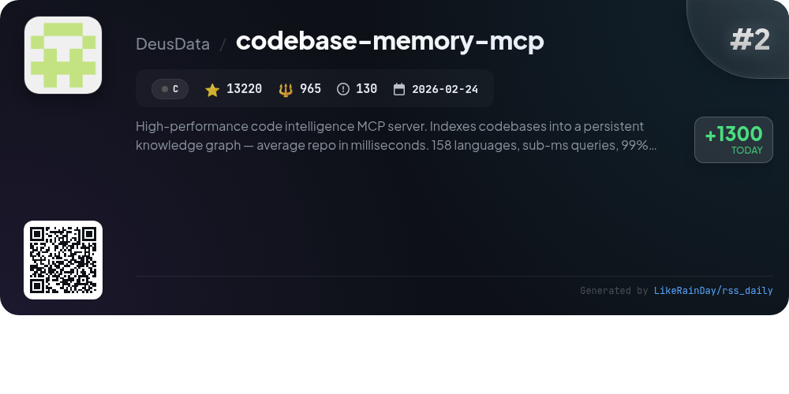
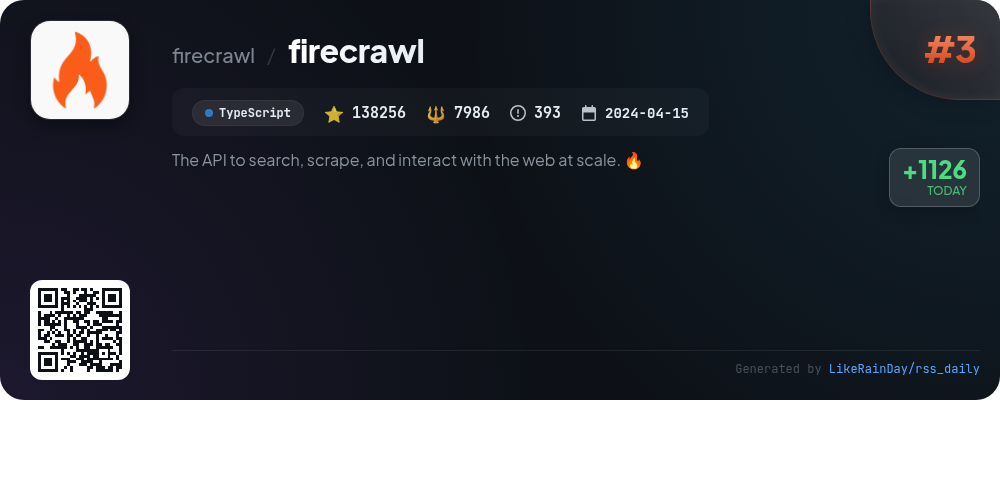
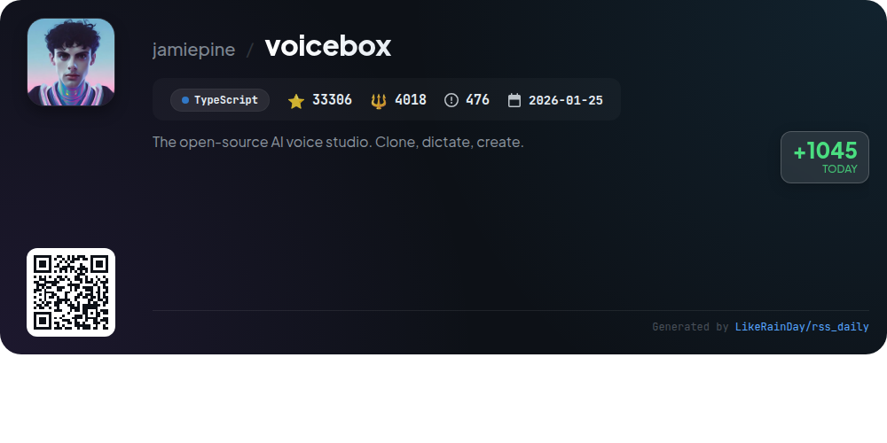
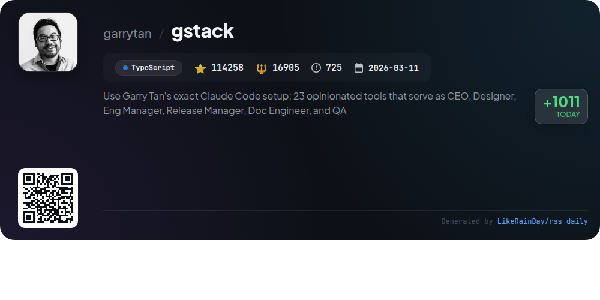
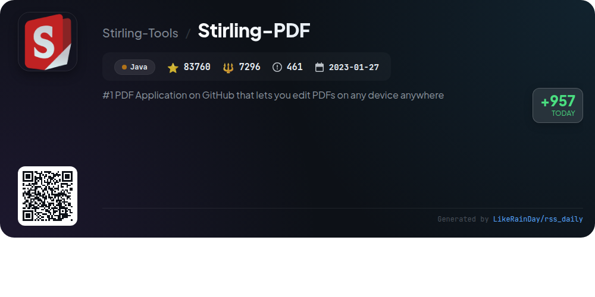
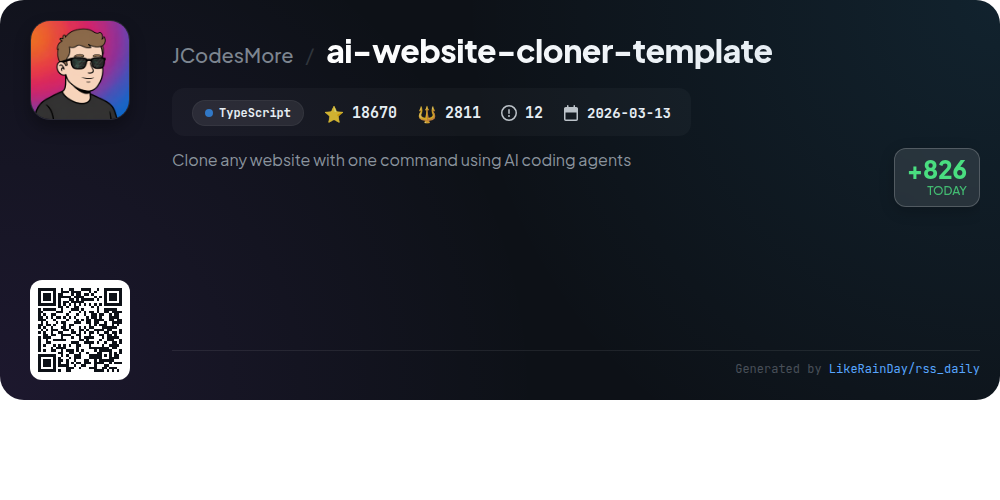
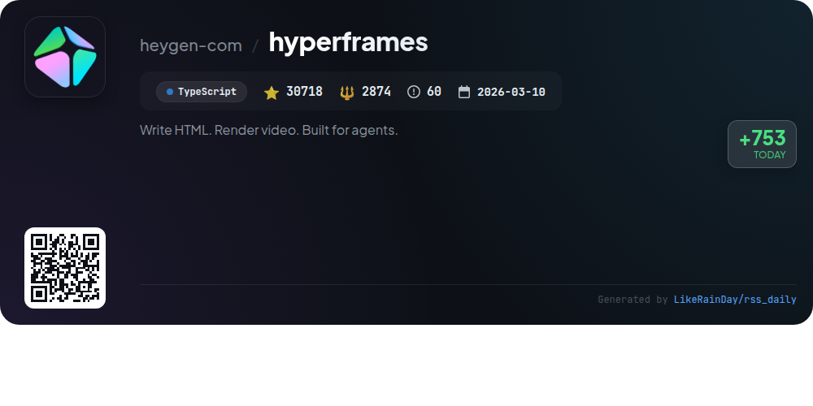
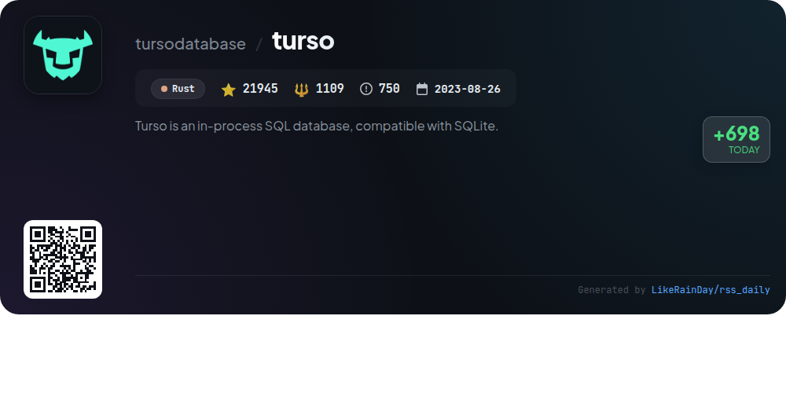
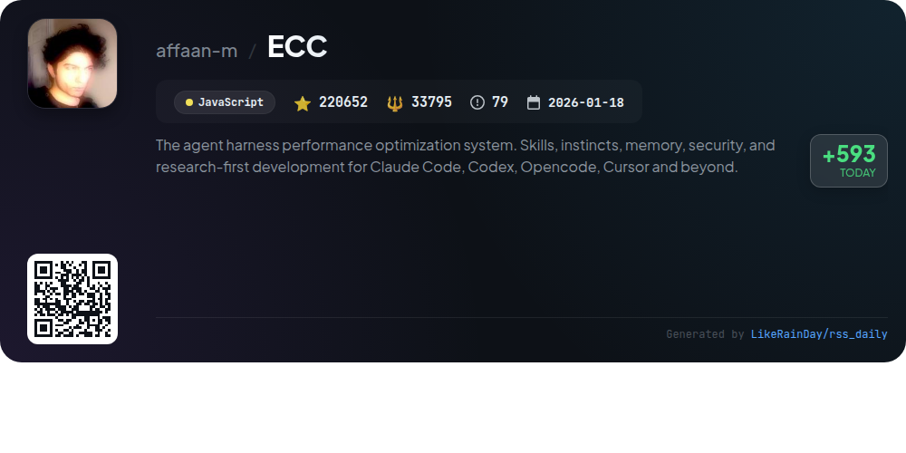

# 📊 🌟 GitHub Trending Daily - 2026-06-24

> > 📅 每日精选 GitHub 热门仓库 | 基于智能算法推荐

## 📋 Overview

**10** 个项目 | **683312** ⭐ | **78317** 🍴

**热门语言:** `TypeScript` (5) · `Rust` (1) · `Swift` (1)

**更新时间:** 2026-06-24 04:09 UTC

**分类分布:**

- 🌟 每日 Top 10 精选 (10 项)

---

## 🌟 每日 Top 10 精选

### 1. [palmier-pro](https://github.com/palmier-io/palmier-pro)

> 🤖 **推荐理由**  
> *Palmier Pro is an open-source macOS video editor designed for AI integration, built from the ground up using Swift. It features a timeline where users can collaboratively generate and edit videos with advanced AI models like Seedance and Nano Banana Pro. The editor supports connections with AI agents such as Claude and Codex via an MCP server, enabling seamless project collaboration. While the core editor is free, generative AI features require a subscription. Palmier Pro is optimized for macOS 26 on Apple Silicon and emphasizes community engagement through Discord and social media.*

- ⭐ 8527 stars
- 💻 Swift
- 📅 Updated: 2026-06-24

### 2. [codebase-memory-mcp](https://github.com/DeusData/codebase-memory-mcp)

> 🤖 **推荐理由**  
> *High-performance code intelligence MCP server. Indexes codebases into a persistent knowledge graph — average repo in milliseconds. 158 languages, su. popular project, actively maintained, recently updated*

- ⭐ 13220 stars
- 🍴 965 forks
- 💻 C
- 📅 Updated: 2026-06-24

### 3. [firecrawl](https://github.com/firecrawl/firecrawl)

> 🤖 **推荐理由**  
> *Firecrawl is an open-source API designed for scalable web searching, scraping, and interaction. Key features include industry-leading reliability with 96% web coverage, rapid response times (P95 latency of 3.4s), and LLM-ready outputs in markdown and structured formats. Users can easily search the web, scrape content, and automate data gathering through its Agent feature. Additional capabilities include crawling websites, mapping URLs, and batch scraping. Firecrawl integrates seamlessly with AI agents and supports various programming languages via SDKs.*

- ⭐ 138256 stars
- 💻 TypeScript
- 📅 Updated: 2026-06-24

### 4. [voicebox](https://github.com/jamiepine/voicebox)

> 🤖 **推荐理由**  
> *Voicebox is an open-source AI voice studio that enables users to clone voices, generate speech, and dictate text across applications, all while ensuring complete privacy as it runs locally. Key features include voice cloning from audio samples, support for 23 languages via seven TTS engines, and expressive speech with paralinguistic tags. It offers global dictation hotkeys, a multi-track stories editor, and a REST API for integration. Voicebox is built with Tauri for native performance, making it compatible across macOS, Windows, and Linux, and includes a built-in LLM for refining voice outputs.*

- ⭐ 33306 stars
- 💻 TypeScript
- 📅 Updated: 2026-06-24

### 5. [gstack](https://github.com/garrytan/gstack)

> 🤖 **推荐理由**  
> *gstack is an open-source project that transforms AI into a virtual engineering team, featuring 23 specialized tools to streamline product development for CEOs, designers, and engineers. Key functionalities include planning, reviewing, testing, and shipping software efficiently. It automates feedback loops with commands like `/office-hours`, `/plan-ceo-review`, and `/qa`, ensuring comprehensive oversight. With the capability to run multiple parallel sprints, gstack enhances productivity through structured workflows, making it ideal for startups and tech leads. Available under MIT license, it encourages community contributions and improvements.*

- ⭐ 114258 stars
- 💻 TypeScript
- 📅 Updated: 2026-06-24

### 6. [Stirling-PDF](https://github.com/Stirling-Tools/Stirling-PDF)

> 🤖 **推荐理由**  
> *Stirling-PDF is a leading open-source PDF editing platform available on GitHub, boasting over 83,760 stars. It offers versatile functionality across desktop, browser, and self-hosted environments, allowing users to edit, sign, redact, convert, and automate PDFs without relying on external services. Key features include 50+ PDF tools, no-code automation workflows, enterprise-grade security with SSO, and REST APIs for seamless integration. The platform supports 40+ languages, making it accessible globally. Explore more at the [documentation](https://docs.stirlingpdf.com).*

- ⭐ 83760 stars
- 💻 Java
- 📅 Updated: 2026-06-24

### 7. [ai-website-cloner-template](https://github.com/JCodesMore/ai-website-cloner-template)

> 🤖 **推荐理由**  
> *The AI Website Cloner Template allows users to effortlessly clone any website into a modern Next.js codebase using AI coding agents with a single command. Key features include design token extraction, component specification generation, and parallel assembly of site components. It supports multiple AI agents, with Claude Code recommended for optimal results. Ideal for platform migrations, recovering lost code, or learning about web design, the project is built on TypeScript and Next.js, ensuring a clean and efficient structure. The template is licensed under MIT.*

- ⭐ 18670 stars
- 💻 TypeScript
- 📅 Updated: 2026-06-24

### 8. [hyperframes](https://github.com/heygen-com/hyperframes)

> 🤖 **推荐理由**  
> *HyperFrames is an open-source framework that transforms HTML, CSS, and media into deterministic MP4 videos, designed for easy integration with AI coding agents. Key features include a CLI for local video creation, support for various animation libraries, and a catalog of reusable components. Users can quickly scaffold projects, preview compositions, and render videos using headless Chrome and FFmpeg. HyperFrames emphasizes HTML-native authoring, making it accessible for developers, and offers a community-driven playground at hyperframes.dev. It's ideal for product launches, data visualizations, and automated content creation.*

- ⭐ 30718 stars
- 💻 TypeScript
- 📅 Updated: 2026-06-24

### 9. [turso](https://github.com/tursodatabase/turso)

> 🤖 **推荐理由**  
> *Turso is an in-process SQL database, compatible with SQLite.. popular project, actively maintained, recently updated*

- ⭐ 21945 stars
- 🍴 1109 forks
- 💻 Rust
- 📅 Updated: 2026-06-24

### 10. [ECC](https://github.com/affaan-m/ECC)

> 🤖 **推荐理由**  
> *ECC is a powerful performance optimization system designed for AI agent workflows, supporting tools like Claude Code, Codex, and Cursor. Key features include skills and instincts for enhanced learning, security scanning via AgentShield, and a cross-harness architecture that facilitates seamless integration across multiple platforms. With over 220,000 stars, ECC offers a comprehensive set of agents, skills, and commands, alongside a user-friendly dashboard for visual management. It emphasizes security, continuous learning, and collaboration, making it ideal for developers seeking to enhance their AI-driven projects.*

- ⭐ 220652 stars
- 💻 JavaScript
- 📅 Updated: 2026-06-24

---

## 📡 RSS订阅

通过 RSS 订阅，第一时间获取每日精选项目：

- 🔔 [RSS 订阅源] (../../daily-top.xml)
- 🔔 [每日简报] (../../GITHUB_TODAY_CN.md)
- 🔔 [每日 Top 10 精选](../../daily-top.xml)

---

*⚡ Powered by Smart Trending Algorithm | Generated at 2026-06-24 04:09:31 UTC
