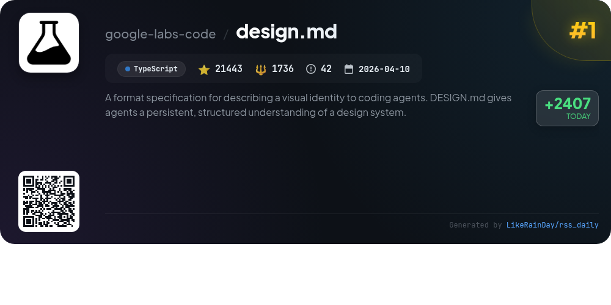
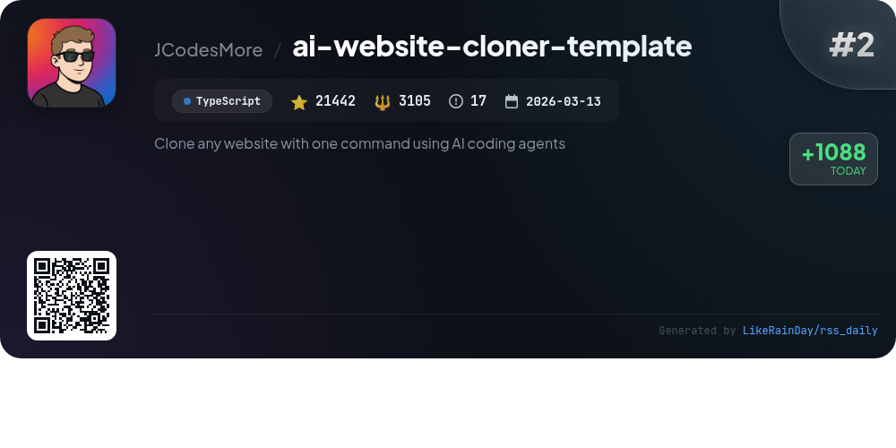
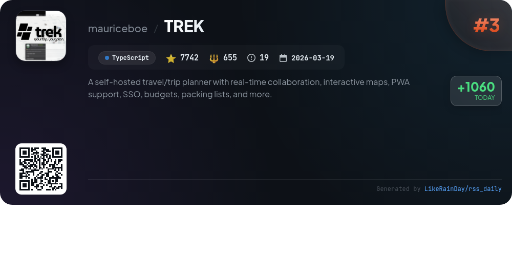
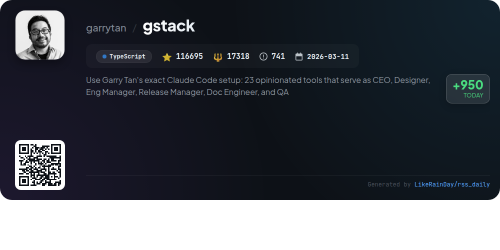
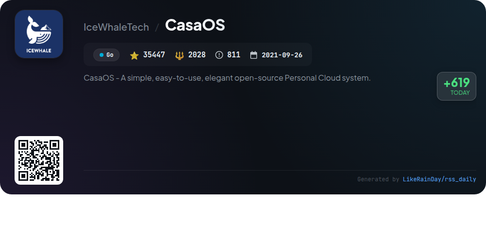
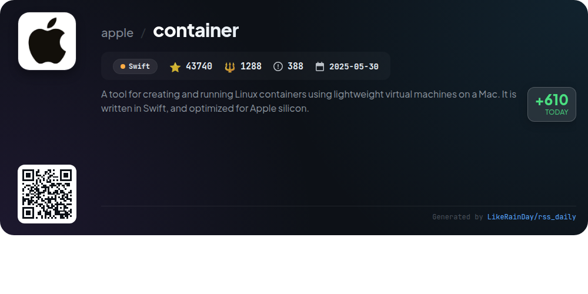
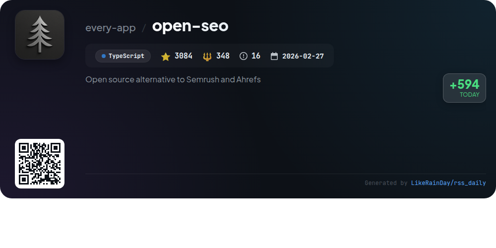
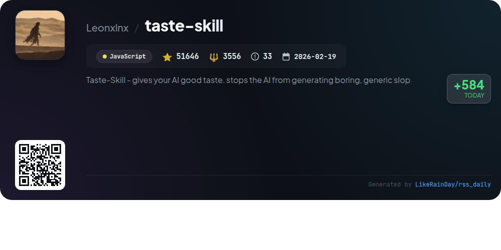
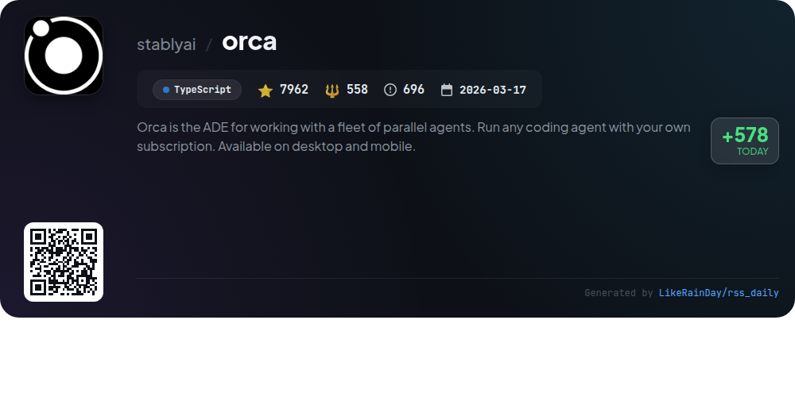
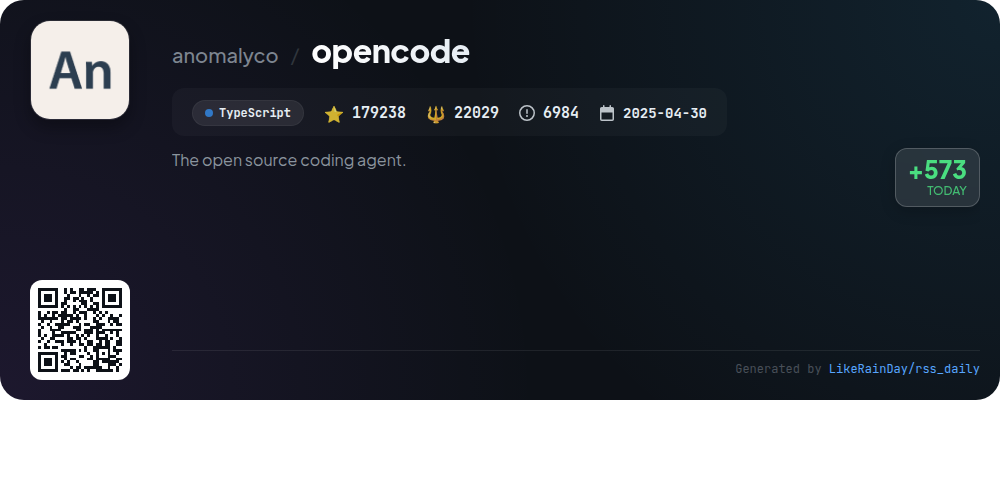

# 📊 🌟 GitHub Trending Daily - 2026-06-27

> > 📅 每日精选 GitHub 热门仓库 | 基于智能算法推荐

## 📋 Overview

**10** 个项目 | **488439** ⭐ | **52621** 🍴

**热门语言:** `TypeScript` (7) · `JavaScript` (1) · `Swift` (1)

**更新时间:** 2026-06-27 04:03 UTC

**分类分布:**

- 🌟 每日 Top 10 精选 (10 项)

---

## 🌟 每日 Top 10 精选

### 1. [design.md](https://github.com/google-labs-code/design.md)

> 🤖 **推荐理由**  
> *DESIGN.md is a TypeScript-based format specification designed to define a visual identity for coding agents, combining machine-readable design tokens with human-readable rationale. Key features include token validation, structural linting, and version comparison to identify changes. The CLI allows users to validate DESIGN.md files, export tokens to various formats (like Tailwind), and ensure compliance with WCAG standards. With over 21,000 stars, DESIGN.md provides a robust framework for maintaining design consistency across projects, making it a valuable tool for developers and designers alike.*

- ⭐ 21443 stars
- 💻 TypeScript
- 📅 Updated: 2026-06-27

### 2. [ai-website-cloner-template](https://github.com/JCodesMore/ai-website-cloner-template)

> 🤖 **推荐理由**  
> *The AI Website Cloner Template enables users to clone any website effortlessly using AI coding agents. With a simple command, `/clone-website <target-url>`, it inspects, extracts design tokens, and reconstructs the site into a clean Next.js codebase. Key features include multi-phase cloning, detailed component specifications, and support for various AI agents like Claude Code and GitHub Copilot. Ideal for platform migration, recovering lost code, or learning web design techniques. Built with TypeScript and Next.js, it prioritizes modern web standards and usability.*

- ⭐ 21442 stars
- 💻 TypeScript
- 📅 Updated: 2026-06-27

### 3. [TREK](https://github.com/mauriceboe/TREK)

> 🤖 **推荐理由**  
> *TREK is a self-hosted travel planner that offers real-time collaboration, interactive maps, and comprehensive travel management tools. Key features include a drag-and-drop trip planner, budget tracking, packing lists, and a journey journal. The platform supports Single Sign-On (SSO), two-factor authentication, and is accessible as a Progressive Web App (PWA). With a focus on user collaboration, TREK allows multi-user trips and instant updates via WebSocket. It integrates AI for automated trip planning and provides extensive customization options for a personalized experience.*

- ⭐ 7742 stars
- 💻 TypeScript
- 📅 Updated: 2026-06-27

### 4. [gstack](https://github.com/garrytan/gstack)

> 🤖 **推荐理由**  
> *gstack is an open-source toolkit by Garry Tan, designed to supercharge individual productivity using AI-driven workflows. With 23 specialized tools, it transforms Claude Code into a virtual engineering team, facilitating roles like CEO, Designer, and QA. Key features include streamlined project management, automated reviews, and comprehensive QA testing, enabling users to ship products faster than traditional teams. Ideal for founders and tech leads, gstack enhances collaboration, ensures code quality, and keeps documentation up-to-date, all while being free and MIT licensed.*

- ⭐ 116695 stars
- 💻 TypeScript
- 📅 Updated: 2026-06-27

### 5. [CasaOS](https://github.com/IceWhaleTech/CasaOS)

> 🤖 **推荐理由**  
> *CasaOS is an open-source personal cloud system designed for simplicity and elegance, built with Go. With over 35,000 stars on GitHub, it offers a user-friendly interface for managing personal data, supporting various hardware like ZimaBoard and Raspberry Pi. Key features include one-click app installations (e.g., Nextcloud, HomeAssistant), Docker app compatibility, and intuitive drive management. CasaOS empowers users to control their data, reduce SaaS costs, and enhance smart device integration, making it a robust solution for individual and small organizational needs.*

- ⭐ 35447 stars
- 💻 Go
- 📅 Updated: 2026-06-27

### 6. [container](https://github.com/apple/container)

> 🤖 **推荐理由**  
> *`container` is a Swift-based tool for creating and running Linux containers as lightweight virtual machines on Macs, specifically optimized for Apple silicon. With 43,740 stars on GitHub, it supports OCI-compatible container images, allowing users to pull, run, and push images from standard registries. Key features include easy installation, upgrade/downgrade options, and comprehensive documentation for building and managing containers. It leverages the Containerization Swift package for efficient process management and is actively developed, ensuring ongoing enhancements and support.*

- ⭐ 43740 stars
- 💻 Swift
- 📅 Updated: 2026-06-27

### 7. [open-seo](https://github.com/every-app/open-seo)

> 🤖 **推荐理由**  
> *OpenSEO is an open-source SEO tool designed as a cost-effective alternative to Semrush and Ahrefs, offering a pay-as-you-go model. Key features include keyword research, rank tracking, competitor insights, and site audits, all powered by a simple, user-friendly interface. Users can connect AI agents like Claude Code and OpenClaw to enhance SEO tasks with pre-built or custom workflows. OpenSEO supports self-hosting via Docker or Cloudflare, and its pricing structure allows users to pay only for DataForSEO API usage, making it budget-friendly.*

- ⭐ 3084 stars
- 💻 TypeScript
- 📅 Updated: 2026-06-27

### 8. [taste-skill](https://github.com/Leonxlnx/taste-skill)

> 🤖 **推荐理由**  
> *Taste Skill is a JavaScript framework designed to enhance AI-generated frontends, preventing the creation of generic designs. It offers a suite of portable Agent Skills, including layout, typography, and image generation capabilities for web and mobile applications. Key features include adjustable design parameters (variance, motion, density) and multiple specialized skills for various design needs, such as redesigning existing projects and generating brand kits. With over 51,000 stars, it's a popular tool for developers seeking to elevate UI aesthetics using AI.*

- ⭐ 51646 stars
- 💻 JavaScript
- 📅 Updated: 2026-06-27

### 9. [orca](https://github.com/stablyai/orca)

> 🤖 **推荐理由**  
> *Orca is an advanced development environment (ADE) designed for managing a fleet of parallel coding agents, allowing users to run any coding agent with their subscription. Key features include mobile companion apps for iOS and Android, parallel worktrees for testing multiple agents simultaneously, terminal splits with WebGL rendering, and integrated GitHub/Linear support for seamless task management. Users can also annotate AI-generated diffs, utilize drag-and-drop functionality, and automate workflows via the Orca CLI. Available on macOS, Windows, and Linux, Orca is ideal for enhancing productivity for developers.*

- ⭐ 7962 stars
- 💻 TypeScript
- 📅 Updated: 2026-06-27

### 10. [opencode](https://github.com/anomalyco/opencode)

> 🤖 **推荐理由**  
> *OpenCode is an open-source AI coding agent built with TypeScript, boasting over 179,000 stars on GitHub. It features two main agents: a full-access development agent and a read-only analysis agent, facilitating code exploration and planning. OpenCode is available as a desktop app for macOS, Windows, and Linux, with easy installation via various package managers. It emphasizes community engagement through Discord and provides comprehensive documentation for users and contributors. Explore more at opencode.ai.*

- ⭐ 179238 stars
- 💻 TypeScript
- 📅 Updated: 2026-06-27

---

## 📡 RSS订阅

通过 RSS 订阅，第一时间获取每日精选项目：

- 🔔 [RSS 订阅源] (../../daily-top.xml)
- 🔔 [每日简报] (../../GITHUB_TODAY_CN.md)
- 🔔 [每日 Top 10 精选](../../daily-top.xml)

---

*⚡ Powered by Smart Trending Algorithm | Generated at 2026-06-27 04:03:20 UTC
