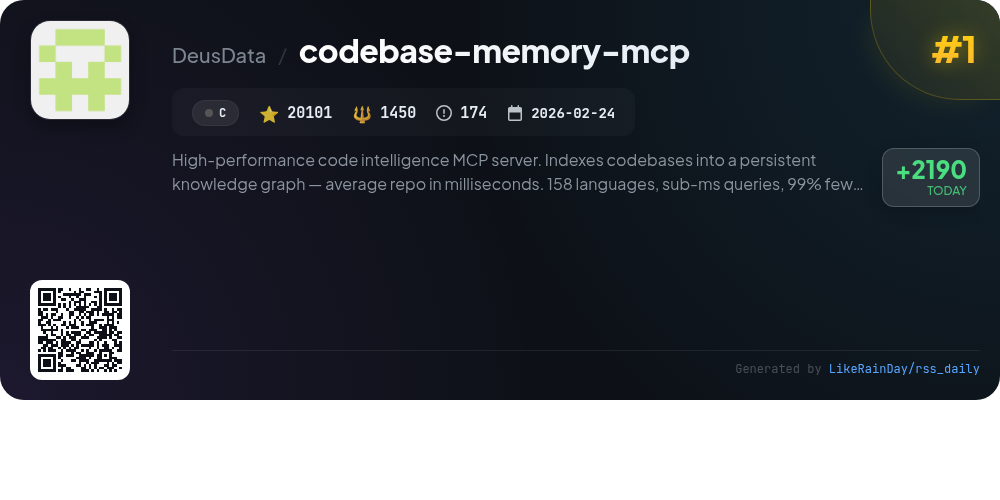
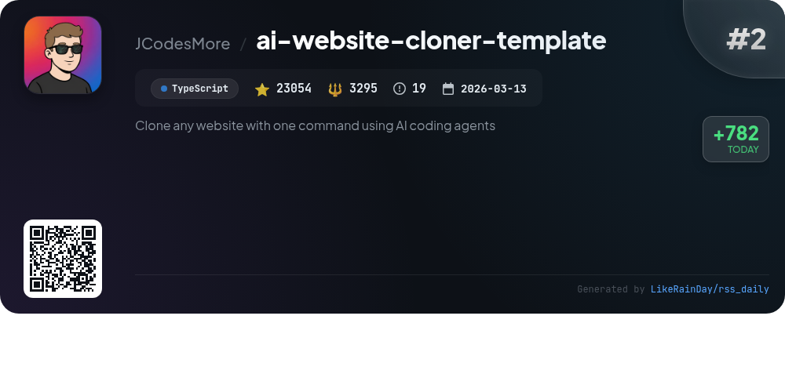
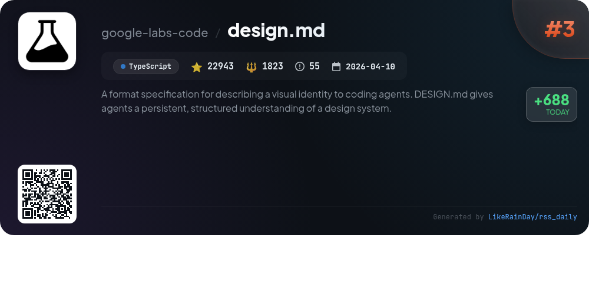
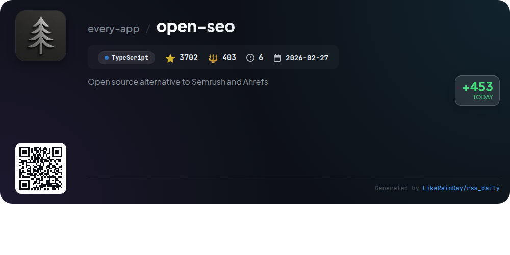
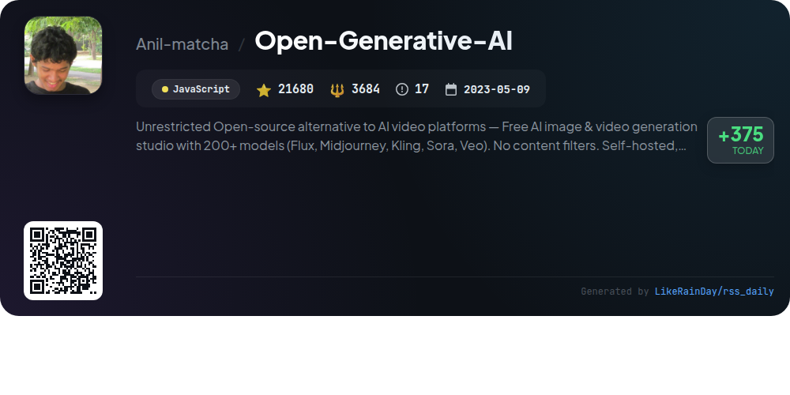
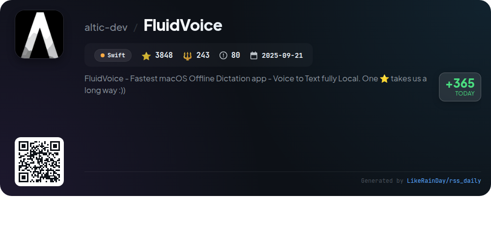
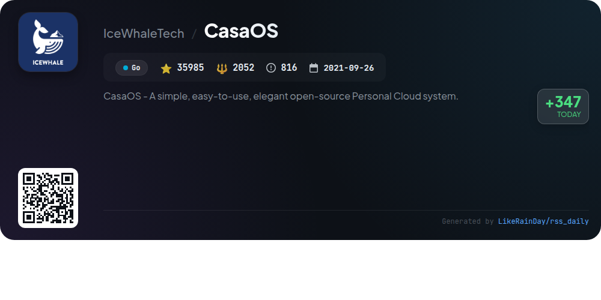
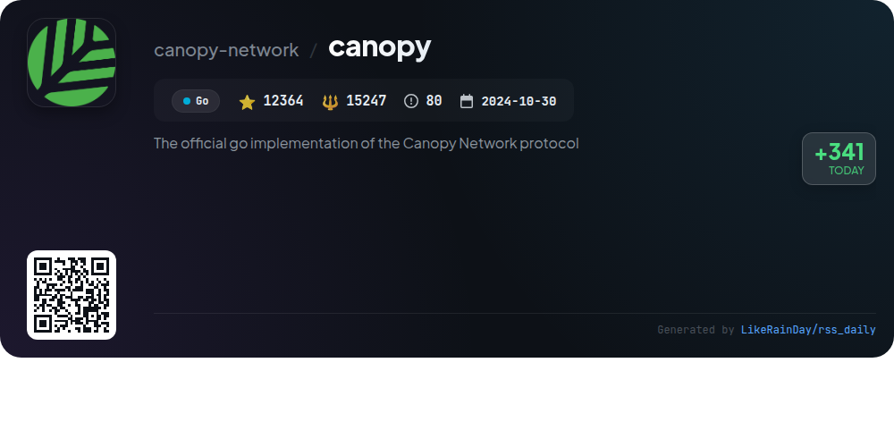
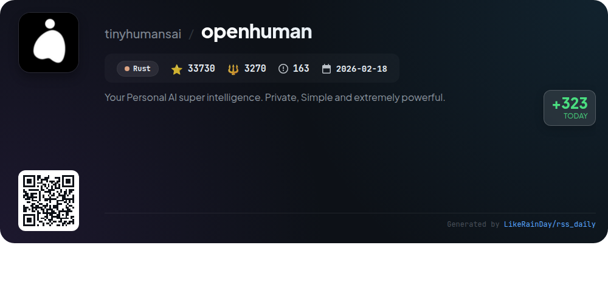
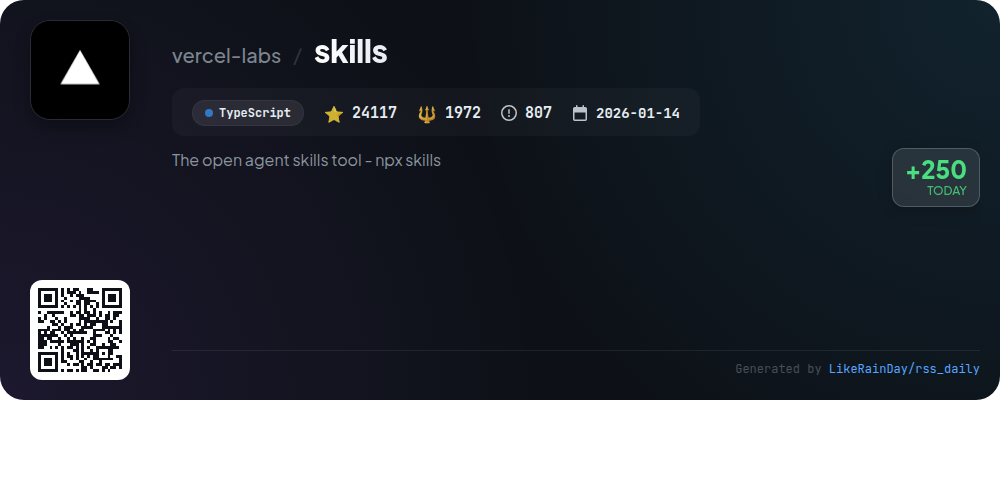

# 📊 🌟 GitHub Trending Daily - 2026-06-29

> > 📅 Daily Picks of GitHub Trending Repositories | Powered by Smart Algorithms

## 📋 Overview

**10** Projects | **201524** ⭐ | **33439** 🍴

**Top Languages:** `TypeScript` (4) · `Go` (2) · `Rust` (1)

**Updated:** 2026-06-29 04:44 UTC

**Categories:**

- 🌟 Daily Top 10 (10 items)

---

## 🌟 Daily Top 10

### 1. [codebase-memory-mcp](https://github.com/DeusData/codebase-memory-mcp)

> 🤖 **Why Recommend**  
> *High-performance code intelligence MCP server. Indexes codebases into a persistent knowledge graph — average repo in milliseconds. 158 languages, su. popular project, actively maintained, recently updated*

- ⭐ 20101 stars
- 🍴 1450 forks
- 💻 C
- 📅 Updated: 2026-06-29

### 2. [ai-website-cloner-template](https://github.com/JCodesMore/ai-website-cloner-template)

> 🤖 **Why Recommend**  
> *The AI Website Cloner Template allows users to effortlessly clone any website into a modern Next.js codebase using AI coding agents. With over 23,000 stars, it features a streamlined process: point to a URL, run the `/clone-website` command, and let the AI extract design tokens, assets, and generate component specifications. It supports various AI platforms, including Claude Code and GitHub Copilot. Ideal for site migrations, recovering lost code, or learning from existing designs, this tool ensures a clean, customizable output while adhering to ethical standards.*

- ⭐ 23054 stars
- 💻 TypeScript
- 📅 Updated: 2026-06-29

### 3. [design.md](https://github.com/google-labs-code/design.md)

> 🤖 **Why Recommend**  
> *DESIGN.md is a TypeScript-based project that provides a format specification for defining a visual identity to coding agents. With over 22,000 stars, it combines machine-readable design tokens (YAML) and human-readable rationale (Markdown) to create a structured design system. Key features include linting for structural correctness, comparison of design versions for regressions, and export capabilities to various formats like Tailwind and DTCG. Its CLI tools validate design files, enhancing token interoperability and ensuring adherence to accessibility standards.*

- ⭐ 22943 stars
- 💻 TypeScript
- 📅 Updated: 2026-06-29

### 4. [open-seo](https://github.com/every-app/open-seo)

> 🤖 **Why Recommend**  
> *OpenSEO is an open-source SEO tool designed as an affordable alternative to Semrush and Ahrefs, offering a pay-as-you-go model. Key features include a user-friendly interface, essential workflows for keyword research, rank tracking, competitor insights, and AI integration with agents like Claude Code and Hermes. Users can self-host via Docker or Cloudflare and leverage pre-built agent skills for tailored SEO tasks. OpenSEO is free to use, with costs incurred only for DataForSEO API usage, making it a flexible and powerful solution for SEO needs.*

- ⭐ 3702 stars
- 💻 TypeScript
- 📅 Updated: 2026-06-29

### 5. [Open-Generative-AI](https://github.com/Anil-matcha/Open-Generative-AI)

> 🤖 **Why Recommend**  
> *Open-Generative-AI is a free, open-source AI generation studio for images and videos, featuring over 200 models like Flux and Midjourney. It offers unrestricted creative freedom without content filters and no subscription fees. Users can generate images, videos, and animate portraits with lip sync capabilities. The platform supports multi-image inputs and provides local inference options via a desktop app. Designed for self-hosting, it ensures full data control and customization. Join the community on Discord for support and collaboration.*

- ⭐ 21680 stars
- 💻 JavaScript
- 📅 Updated: 2026-06-29

### 6. [FluidVoice](https://github.com/altic-dev/FluidVoice)

> 🤖 **Why Recommend**  
> *FluidVoice is a fast, macOS offline dictation app that converts voice to text using local AI, ensuring privacy with no data leaving your device. Key features include Fluid Intelligence for smart formatting, Command Mode for controlling your Mac via voice, and Write Mode for seamless text input across apps. It supports multiple speech models and offers a customizable interface with light/dark theming. With 3,848 stars on GitHub, FluidVoice prioritizes user experience, providing real-time transcription, audio history, and optional AI enhancements for improved accuracy.*

- ⭐ 3848 stars
- 💻 Swift
- 📅 Updated: 2026-06-29

### 7. [CasaOS](https://github.com/IceWhaleTech/CasaOS)

> 🤖 **Why Recommend**  
> *CasaOS is an open-source personal cloud system designed for ease of use and elegance. With over 35,000 stars on GitHub, it supports various hardware, including ZimaBoard and Raspberry Pi. Key features include an intuitive UI, one-click app installations (e.g., Nextcloud, HomeAssistant), and seamless Docker app integration. CasaOS emphasizes data ownership and provides a platform for managing personal data and smart devices. Its community-driven approach fosters collaborative innovation, making it a robust solution for individuals and small organizations seeking cost-effective cloud computing.*

- ⭐ 35985 stars
- 💻 Go
- 📅 Updated: 2026-06-29

### 8. [canopy](https://github.com/canopy-network/canopy)

> 🤖 **Why Recommend**  
> *Canopy is the official Go implementation of the Canopy Network Protocol, designed to create a recursive framework for building blockchains. Key features include a Byzantine Fault Tolerant consensus mechanism, a Finite State Machine for transaction logic, and secure peer-to-peer networking. The project is currently in Betanet status, with comprehensive documentation available via its wiki. Users can easily run the Canopy binary or use Docker for a containerized setup. Contributions are welcomed, fostering community involvement in this innovative peer-to-peer launchpad for new chains.*

- ⭐ 12364 stars
- 💻 Go
- 📅 Updated: 2026-06-29

### 9. [openhuman](https://github.com/tinyhumansai/openhuman)

> 🤖 **Why Recommend**  
> *OpenHuman is an open-source AI super intelligence built to enhance personal productivity. Key features include a user-friendly interface, local memory management, and over 100 one-click OAuth integrations with popular services like Gmail and Notion. It offers a unique Memory Tree that organizes data into an Obsidian-style knowledge base, enabling efficient context retrieval. The platform supports smart token compression for cost-effective processing and includes native tools for coding, web search, and voice interactions. OpenHuman prioritizes user privacy and is designed for rapid integration into daily workflows.*

- ⭐ 33730 stars
- 💻 Rust
- 📅 Updated: 2026-06-29

### 10. [skills](https://github.com/vercel-labs/skills)

> 🤖 **Why Recommend**  
> *The open agent skills tool - npx skills. popular project, actively maintained, recently updated*

- ⭐ 24117 stars
- 🍴 1972 forks
- 💻 TypeScript
- 📅 Updated: 2026-06-29

---

## 📡 RSS Subscription

Subscribe via RSS to get daily trending updates:

- 🔔 [RSS XML] (../../daily-top.xml)
- 🔔 [Daily Report] (../../GITHUB_TODAY.md)
- 🔔 [Daily Top 10](../../daily-top.xml)

---

*⚡ Powered by Smart Trending Algorithm | Generated at 2026-06-29 04:44:57 UTC
