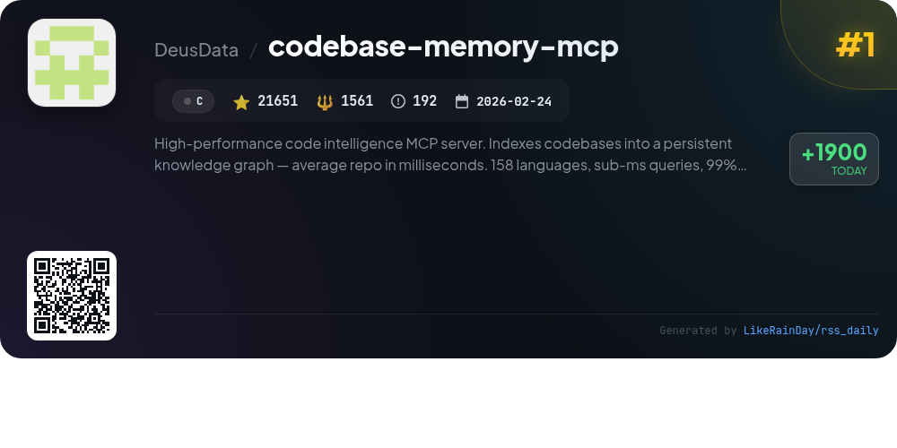
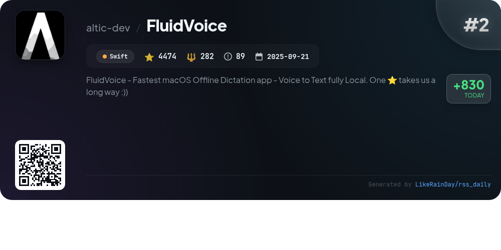
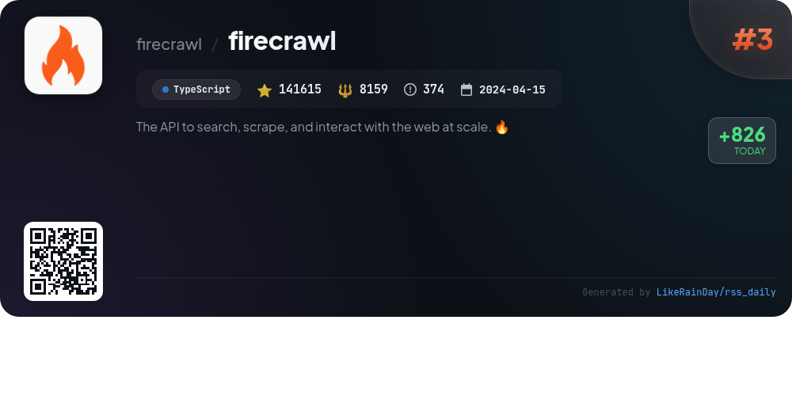
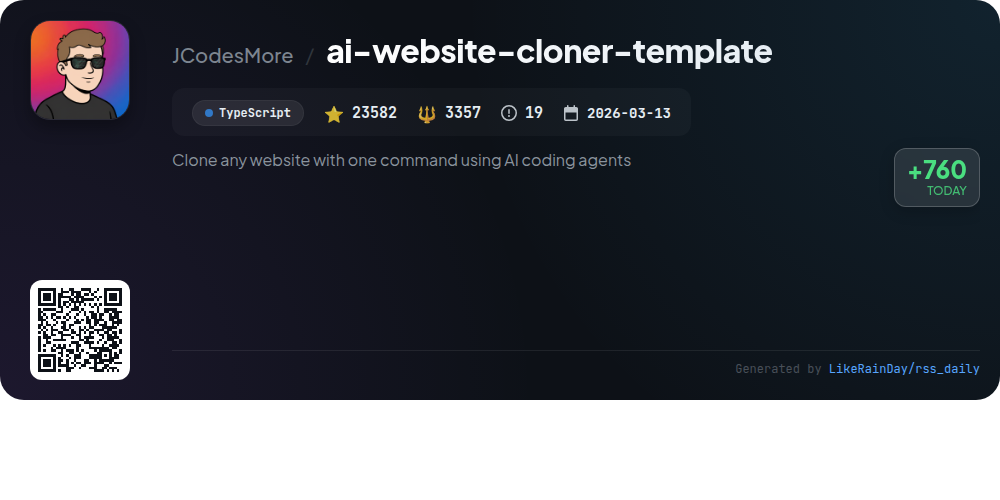
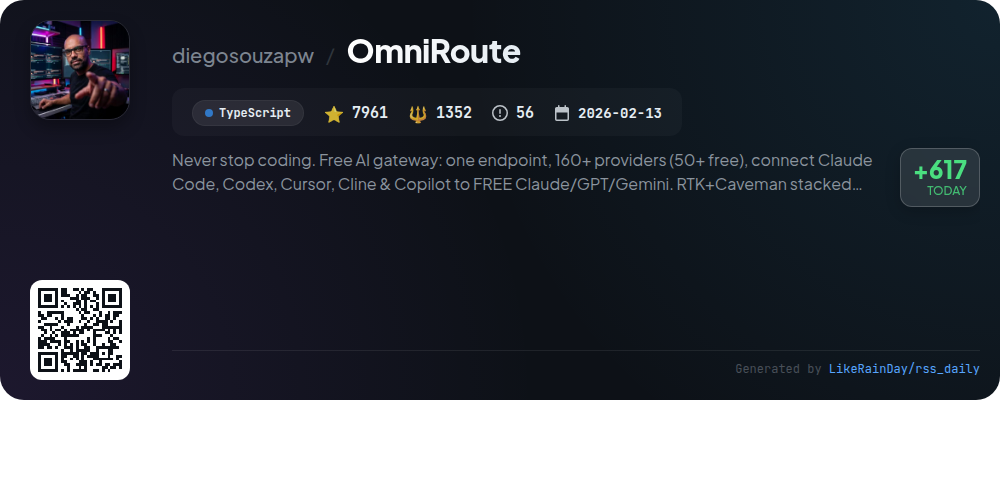
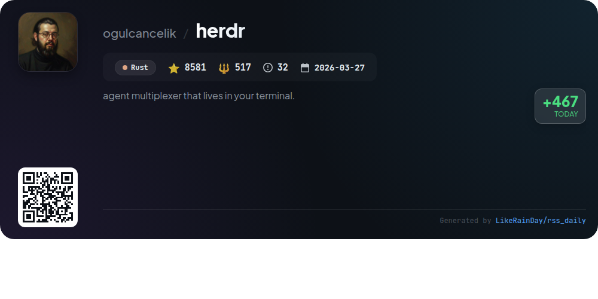
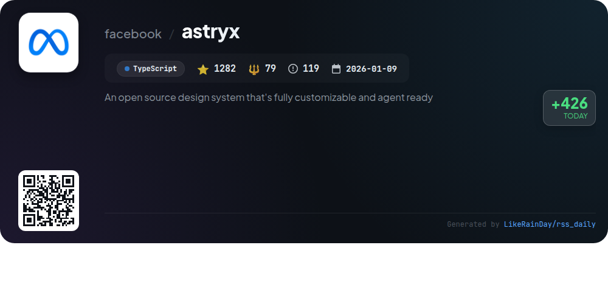
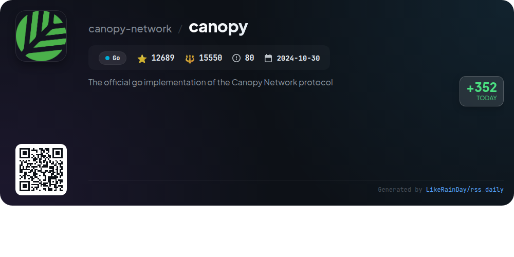
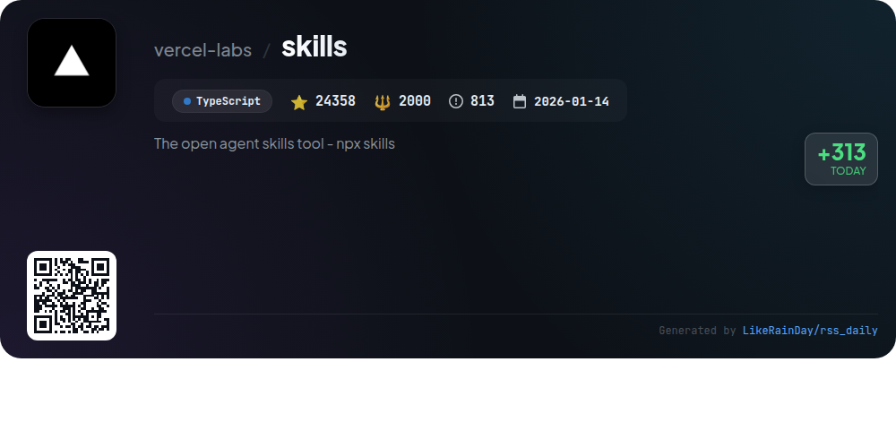
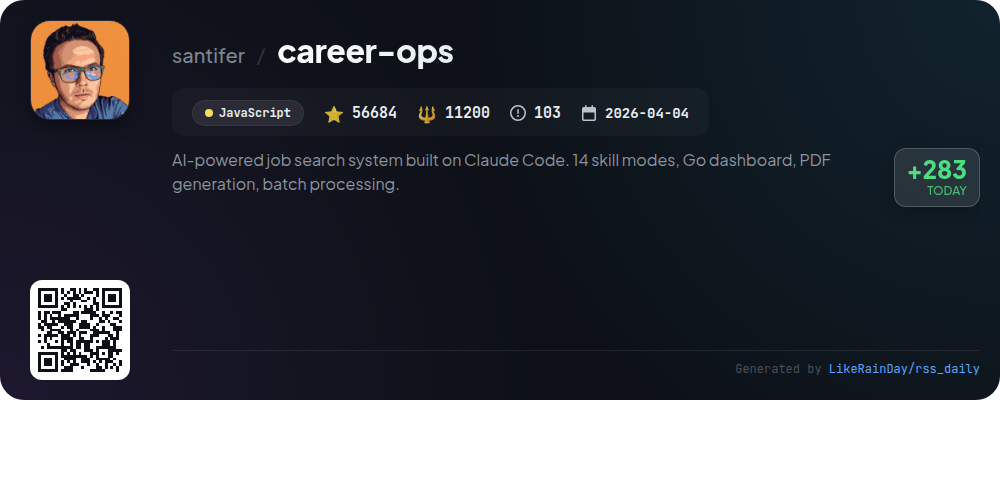

# 📊 🌟 GitHub Trending Daily - 2026-06-30

> > 📅 每日精选 GitHub 热门仓库 | 基于智能算法推荐

## 📋 Overview

**10** 个项目 | **302877** ⭐ | **44057** 🍴

**热门语言:** `TypeScript` (5) · `JavaScript` (1) · `Rust` (1)

**更新时间:** 2026-06-30 04:12 UTC

**分类分布:**

- 🌟 每日 Top 10 精选 (10 项)

---

## 🌟 每日 Top 10 精选

### 1. [codebase-memory-mcp](https://github.com/DeusData/codebase-memory-mcp)

> 🤖 **推荐理由**  
> *High-performance code intelligence MCP server. Indexes codebases into a persistent knowledge graph — average repo in milliseconds. 158 languages, su. popular project, actively maintained, recently updated*

- ⭐ 21651 stars
- 🍴 1561 forks
- 💻 C
- 📅 Updated: 2026-06-30

### 2. [FluidVoice](https://github.com/altic-dev/FluidVoice)

> 🤖 **推荐理由**  
> *FluidVoice is an open-source, offline dictation app for macOS that transforms voice into text with lightning speed, utilizing local AI for enhanced accuracy. Key features include real-time transcription, command mode for system control, and write mode for text input across applications. The app supports multiple speech models and offers optional AI enhancement through its Fluid Intelligence. Privacy-focused, all processing occurs on-device, ensuring user data remains secure. With over 4,400 stars, FluidVoice is designed to streamline dictation while keeping user interactions local and private.*

- ⭐ 4474 stars
- 💻 Swift
- 📅 Updated: 2026-06-30

### 3. [firecrawl](https://github.com/firecrawl/firecrawl)

> 🤖 **推荐理由**  
> *Firecrawl is a powerful API designed for searching, scraping, and interacting with the web at scale. It boasts industry-leading reliability, covering 96% of the web, and offers features like autonomous data gathering, LLM-ready output in clean markdown or structured JSON, and seamless integration with AI agents. Key services include web search, content scraping, interactive page manipulation, and comprehensive site crawling. Open-source and cloud-hosted, Firecrawl simplifies data extraction while handling complex tasks like proxy rotation and rate limiting.*

- ⭐ 141615 stars
- 💻 TypeScript
- 📅 Updated: 2026-06-30

### 4. [ai-website-cloner-template](https://github.com/JCodesMore/ai-website-cloner-template)

> 🤖 **推荐理由**  
> *AI Website Cloner Template is a powerful TypeScript-based tool that allows users to clone any website with a single command using AI coding agents. With over 23,000 stars on GitHub, this reusable template transforms websites into clean Next.js codebases. Key features include design token extraction, component spec writing, and parallel builders for efficient reconstruction. It supports various AI agents, including Claude Code for optimal results. Ideal for platform migrations, recovering lost source code, or educational purposes, it promotes ethical use by prohibiting impersonation and scraping against terms of service.*

- ⭐ 23582 stars
- 💻 TypeScript
- 📅 Updated: 2026-06-30

### 5. [OmniRoute](https://github.com/diegosouzapw/OmniRoute)

> 🤖 **推荐理由**  
> *OmniRoute is a free AI gateway enabling seamless access to 237 AI providers through a single endpoint, with over 50 free options. Key features include smart auto-fallback to prevent downtime, RTK + Caveman compression saving 15–95% tokens, and support for major coding agents like Claude Code and Codex. Users benefit from ~1.6 billion free tokens per month, robust security features, and multi-platform support (Web, Desktop, PWA). Designed for efficiency, it streamlines AI interactions while minimizing costs, making it an essential tool for developers.*

- ⭐ 7961 stars
- 💻 TypeScript
- 📅 Updated: 2026-06-30

### 6. [herdr](https://github.com/ogulcancelik/herdr)

> 🤖 **推荐理由**  
> *Herdr is a Rust-based terminal multiplexer with 8,581 stars that enables seamless management of coding agents in one terminal. Key features include real terminals for each agent, real-time state monitoring (blocked, working, done), and mouse-native workspaces with tabs and panes. Herdr supports SSH, ensuring persistence when detaching and reattaching sessions. It offers a lightweight installation (single ~10MB binary) and scriptable capabilities via a local socket API. Agents can be integrated for enhanced functionality, making Herdr a powerful tool for developers managing multiple agents efficiently.*

- ⭐ 8581 stars
- 💻 Rust
- 📅 Updated: 2026-06-30

### 7. [astryx](https://github.com/facebook/astryx)

> 🤖 **推荐理由**  
> *Astryx is an open-source design system built for flexibility and collaboration, currently in beta. Developed at Meta, it powers over 13,000 apps and offers 150+ accessible components, dark mode, and customizable themes. Key features include open internals for component composition, no styling lock-in, and a seamless API for both humans and AI. With easy setup via npm, comprehensive CLI tools, and strong documentation, Astryx facilitates efficient design and development workflows. It supports TypeScript and integrates smoothly with existing styling methods like Tailwind and CSS modules.*

- ⭐ 1282 stars
- 💻 TypeScript
- 📅 Updated: 2026-06-30

### 8. [canopy](https://github.com/canopy-network/canopy)

> 🤖 **推荐理由**  
> *Canopy is the official Go implementation of the Canopy Network protocol, designed to create a recursive framework for building independent blockchains. Key features include a centralized Controller for communication, a Finite State Machine for transaction logic, Byzantine Fault Tolerant consensus for reliability, and secure Peer-to-Peer networking. Currently in Betanet, Canopy supports containerized environments via Docker and offers extensive documentation for developers. This open-source project encourages community contributions and aims to power a decentralized web of utility and security.*

- ⭐ 12689 stars
- 💻 Go
- 📅 Updated: 2026-06-30

### 9. [skills](https://github.com/vercel-labs/skills)

> 🤖 **推荐理由**  
> *The open agent skills tool - npx skills. popular project, actively maintained, recently updated*

- ⭐ 24358 stars
- 🍴 2000 forks
- 💻 TypeScript
- 📅 Updated: 2026-06-30

### 10. [career-ops](https://github.com/santifer/career-ops)

> 🤖 **推荐理由**  
> *Career-Ops is an AI-powered job search system that transforms any coding CLI into a job application command center. Key features include an auto-pipeline for job evaluations, PDF generation for tailored CVs, and batch processing for multiple offers. It evaluates job listings with a structured scoring system, scans job portals, and ensures integrity in tracking applications. Built on Claude Code, it allows users to customize their experience and generates negotiation scripts and cover letters. With over 56,000 stars on GitHub, it streamlines the job search process for candidates.*

- ⭐ 56684 stars
- 💻 JavaScript
- 📅 Updated: 2026-06-30

---

## 📡 RSS订阅

通过 RSS 订阅，第一时间获取每日精选项目：

- 🔔 [RSS 订阅源] (../../daily-top.xml)
- 🔔 [每日简报] (../../GITHUB_TODAY_CN.md)
- 🔔 [每日 Top 10 精选](../../daily-top.xml)

---

*⚡ Powered by Smart Trending Algorithm | Generated at 2026-06-30 04:12:31 UTC
