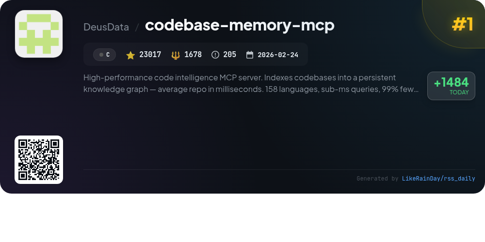
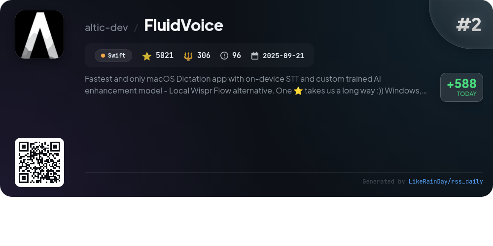
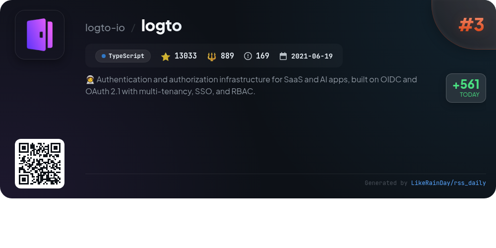
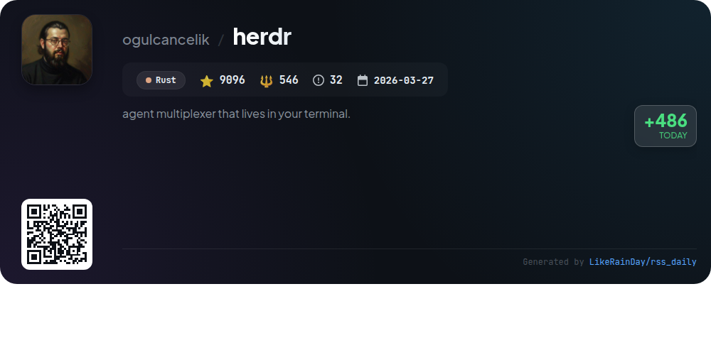
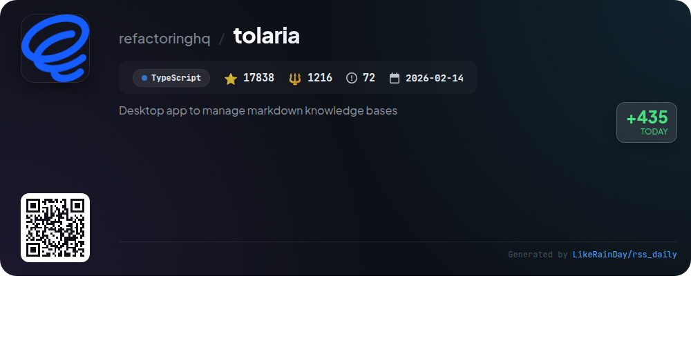
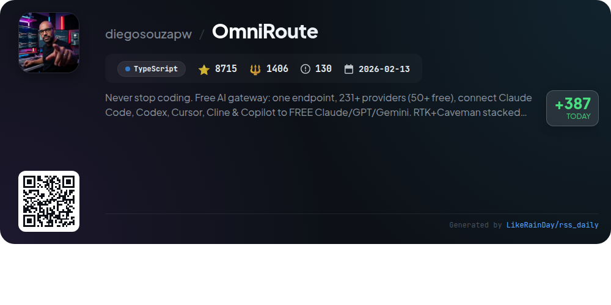
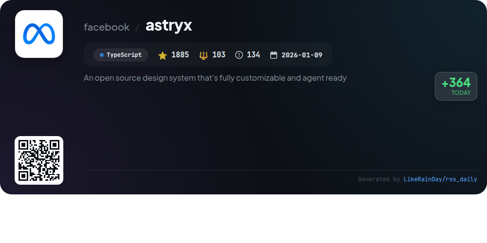
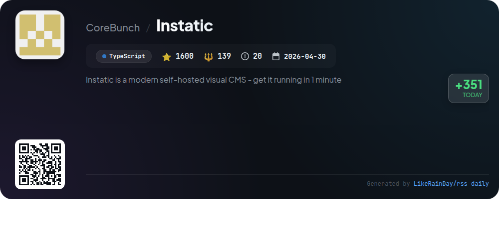
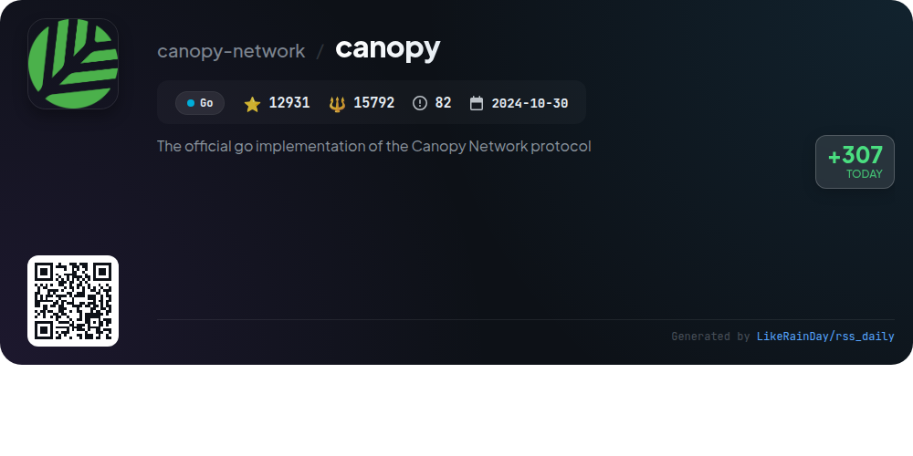
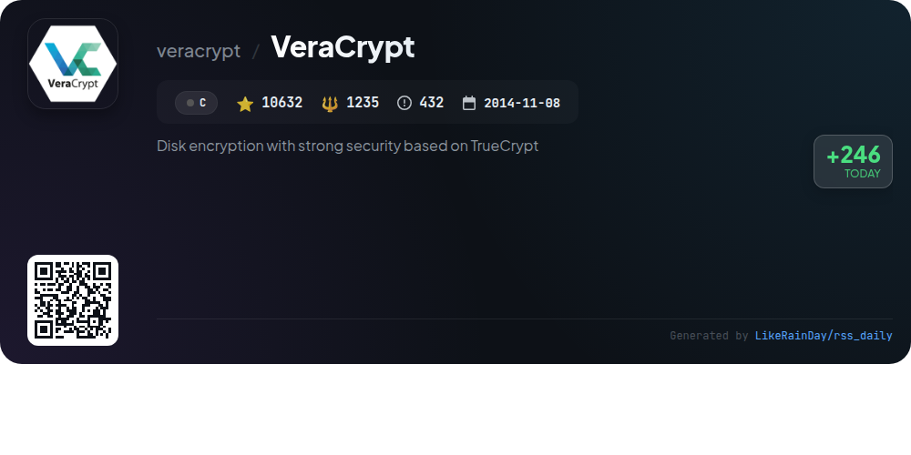

# 📊 🌟 GitHub Trending Daily - 2026-07-01

> > 📅 每日精选 GitHub 热门仓库 | 基于智能算法推荐

## 📋 Overview

**10** 个项目 | **103768** ⭐ | **23310** 🍴

**热门语言:** `TypeScript` (5) · `C` (2) · `Swift` (1)

**更新时间:** 2026-07-01 04:27 UTC

**分类分布:**

- 🌟 每日 Top 10 精选 (10 项)

---

## 🌟 每日 Top 10 精选

### 1. [codebase-memory-mcp](https://github.com/DeusData/codebase-memory-mcp)

> 🤖 **推荐理由**  
> *High-performance code intelligence MCP server. Indexes codebases into a persistent knowledge graph — average repo in milliseconds. 158 languages, su. popular project, actively maintained, recently updated*

- ⭐ 23017 stars
- 🍴 1678 forks
- 💻 C
- 📅 Updated: 2026-07-01

### 2. [FluidVoice](https://github.com/altic-dev/FluidVoice)

> 🤖 **推荐理由**  
> *FluidVoice is a fast, open-source dictation app for macOS, featuring on-device speech-to-text (STT) and a custom AI enhancement model called Fluid Intelligence. Key highlights include real-time transcription, command and write modes for seamless text entry, and support for multiple speech models. The app prioritizes user privacy by keeping data local, with optional cloud AI integration. Additional features include adaptive theming, audio history, and daily usage stats. FluidVoice is set to expand to Windows, iOS, and Linux, making it a versatile choice for dictation needs.*

- ⭐ 5021 stars
- 💻 Swift
- 📅 Updated: 2026-07-01

### 3. [logto](https://github.com/logto-io/logto)

> 🤖 **推荐理由**  
> *🧑‍🚀 Authentication and authorization infrastructure for SaaS and AI apps, built on OIDC and OAuth 2.1 with multi-tenancy, SSO, and RBAC.. popular project, actively maintained, recently updated*

- ⭐ 13033 stars
- 🍴 889 forks
- 💻 TypeScript
- 📅 Updated: 2026-07-01

### 4. [herdr](https://github.com/ogulcancelik/herdr)

> 🤖 **推荐理由**  
> *Herdr is a terminal multiplexer designed for managing coding agents seamlessly. With over 9,000 stars on GitHub, it allows users to run agents in real terminals, displaying their statuses as blocked, working, or done. Herdr supports workspaces, tabs, and panes, enabling efficient organization and interaction via mouse or keyboard. It maintains agent persistence during detachment and runs on any system via a single lightweight Rust binary. Additionally, it features a scriptable local socket API for custom integrations, ensuring versatility in agent management.*

- ⭐ 9096 stars
- 💻 Rust
- 📅 Updated: 2026-07-01

### 5. [tolaria](https://github.com/refactoringhq/tolaria)

> 🤖 **推荐理由**  
> *Tolaria is a powerful open-source desktop app for managing markdown knowledge bases on macOS, Windows, and Linux, boasting 17,838 stars on GitHub. It facilitates personal knowledge management, company documentation, and AI integration, all while ensuring data ownership with a files-first and Git-first approach. Key features include offline functionality, no account requirements, customizable note types, and a keyboard-first design. Built from real user experience, Tolaria supports a variety of AI agents and offers seamless installation and local setup options.*

- ⭐ 17838 stars
- 💻 TypeScript
- 📅 Updated: 2026-07-01

### 6. [OmniRoute](https://github.com/diegosouzapw/OmniRoute)

> 🤖 **推荐理由**  
> *OmniRoute is a versatile AI gateway that connects over 236 providers, including 50+ free options, through a single endpoint, enhancing coding efficiency. Key features include smart auto-fallback to prevent downtime, RTK and Caveman compression for saving 15-95% tokens, and support for multiple coding agents like Claude Code, Codex, and Copilot. With around 1.6B free tokens available monthly, OmniRoute maximizes resource usage while minimizing costs. Its seamless integration with various platforms ensures developers can easily access AI tools without complex setups.*

- ⭐ 8715 stars
- 💻 TypeScript
- 📅 Updated: 2026-07-01

### 7. [astryx](https://github.com/facebook/astryx)

> 🤖 **推荐理由**  
> *Astryx is an open source, highly customizable design system, currently in beta, built on React and StyleX. With over 1,800 stars, it offers 150+ accessible components, brand-level theming, dark mode, and ready-to-ship templates. Key features include open internals for flexible component use, no styling lock-in, and a theme system that allows easy customization. The API and CLI facilitate seamless collaboration between developers and AI assistants. It supports various setups with minimal configuration, making it ideal for modern development workflows.*

- ⭐ 1885 stars
- 💻 TypeScript
- 📅 Updated: 2026-07-01

### 8. [Instatic](https://github.com/CoreBunch/Instatic)

> 🤖 **推荐理由**  
> *Instatic is a modern self-hosted visual CMS built on a single Bun server, allowing users to manage their website's design, content, and publishing seamlessly. Key features include a clean semantic HTML output, a powerful visual editor with live mode, reusable components, and a robust data management system. It supports SQLite and Postgres for database options and offers one-click deployment through Railway. Instatic combines design, build, management, and analytics in one package, ensuring fast performance and flexibility, making it ideal for developers and site owners looking for full control.*

- ⭐ 1600 stars
- 💻 TypeScript
- 📅 Updated: 2026-07-01

### 9. [canopy](https://github.com/canopy-network/canopy)

> 🤖 **推荐理由**  
> *Canopy is the official Go implementation of the Canopy Network protocol, designed to create a recursive framework for building blockchains. Key features include a Byzantine Fault Tolerant consensus mechanism, secure peer-to-peer networking, and a persistence layer for efficient data management. Canopy supports the development of new chains in an "unstoppable" architecture, enhancing utility and security. Currently in Betanet, it encourages community contributions and provides extensive documentation for developers. For more details, visit [canopynetwork.org](https://canopynetwork.org).*

- ⭐ 12931 stars
- 💻 Go
- 📅 Updated: 2026-07-01

### 10. [VeraCrypt](https://github.com/veracrypt/VeraCrypt)

> 🤖 **推荐理由**  
> *VeraCrypt is a powerful disk encryption tool, enhancing the original TrueCrypt 7.1a with robust security features. With over 10,600 stars on GitHub, it supports multiple platforms, including Windows, Linux, macOS, FreeBSD, and OpenBSD. Key features include strong encryption algorithms, a user-friendly interface, and a digitally signed driver for secure functionality on modern Windows systems. VeraCrypt allows users to create encrypted volumes and system partitions, ensuring data confidentiality. The project is open-source, encouraging community contributions under specific license terms.*

- ⭐ 10632 stars
- 💻 C
- 📅 Updated: 2026-07-01

---

## 📡 RSS订阅

通过 RSS 订阅，第一时间获取每日精选项目：

- 🔔 [RSS 订阅源] (../../daily-top.xml)
- 🔔 [每日简报] (../../GITHUB_TODAY_CN.md)
- 🔔 [每日 Top 10 精选](../../daily-top.xml)

---

*⚡ Powered by Smart Trending Algorithm | Generated at 2026-07-01 04:27:48 UTC
