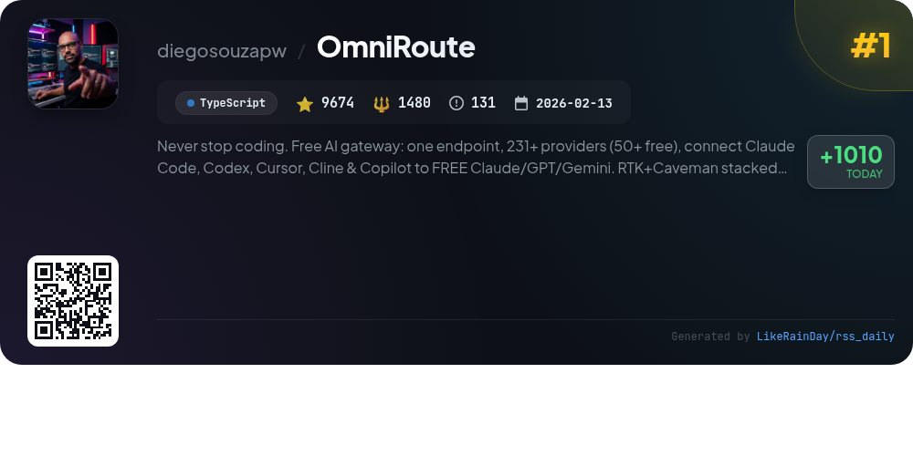
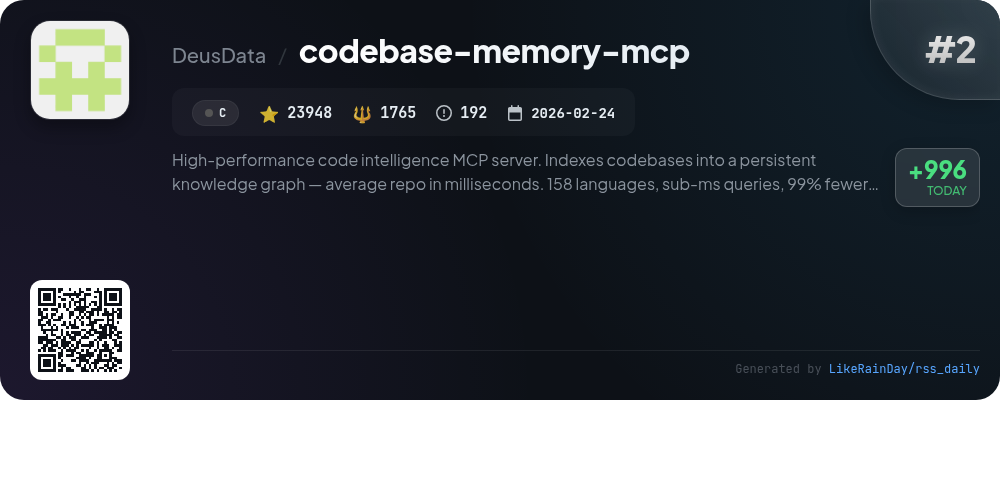
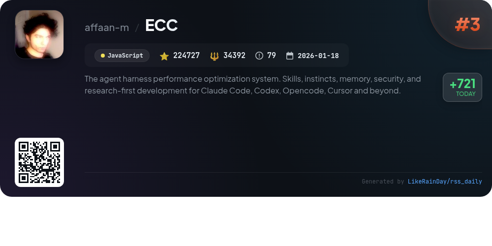
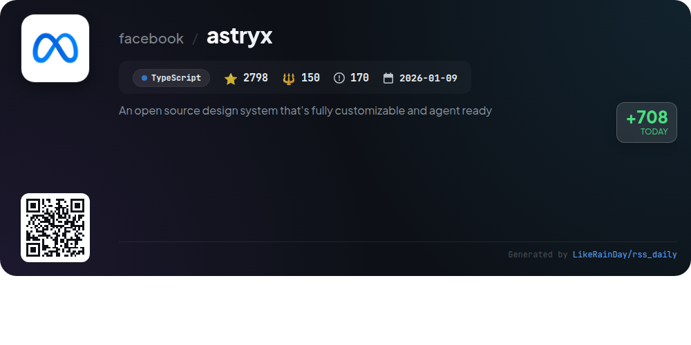
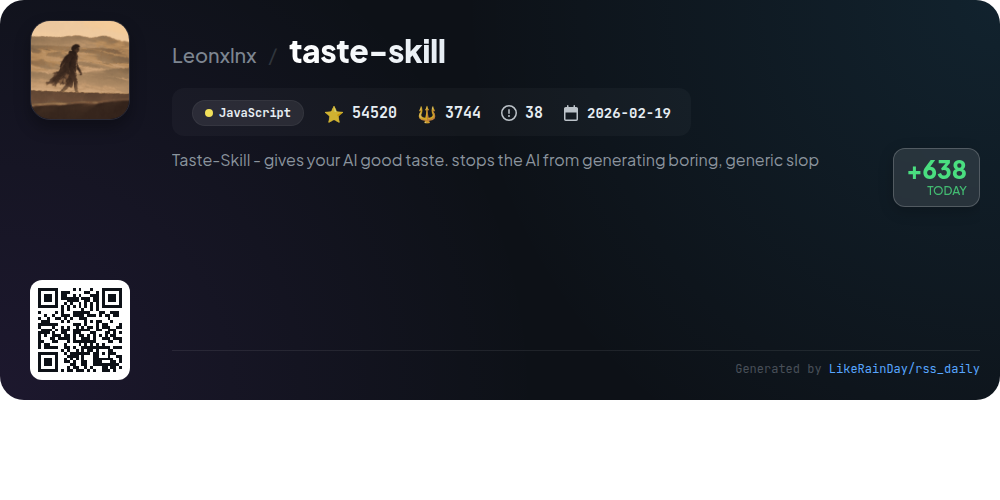
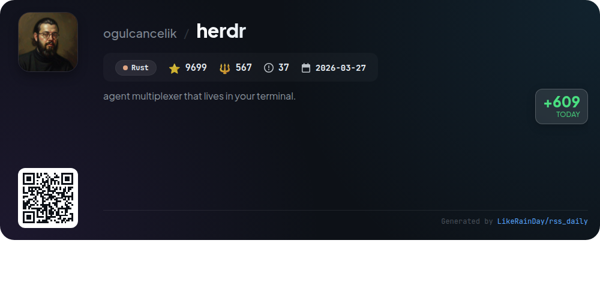
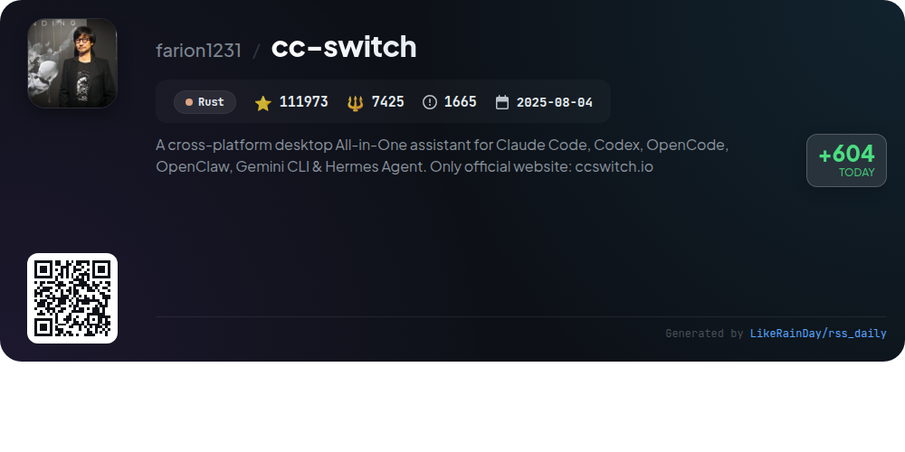
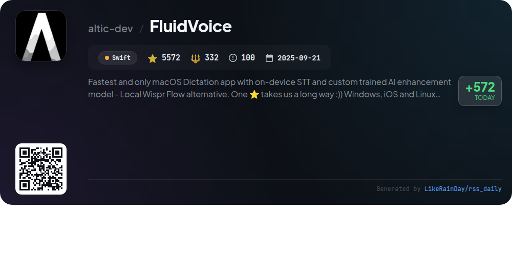
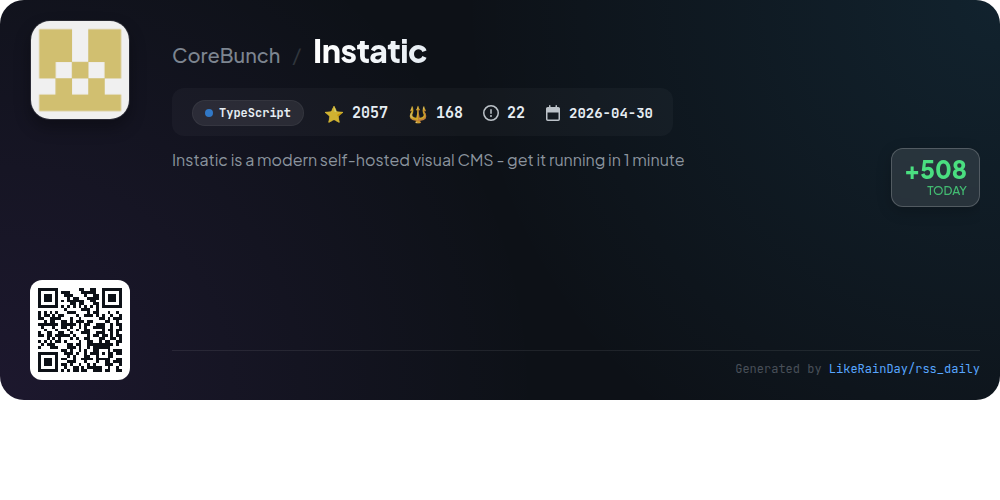
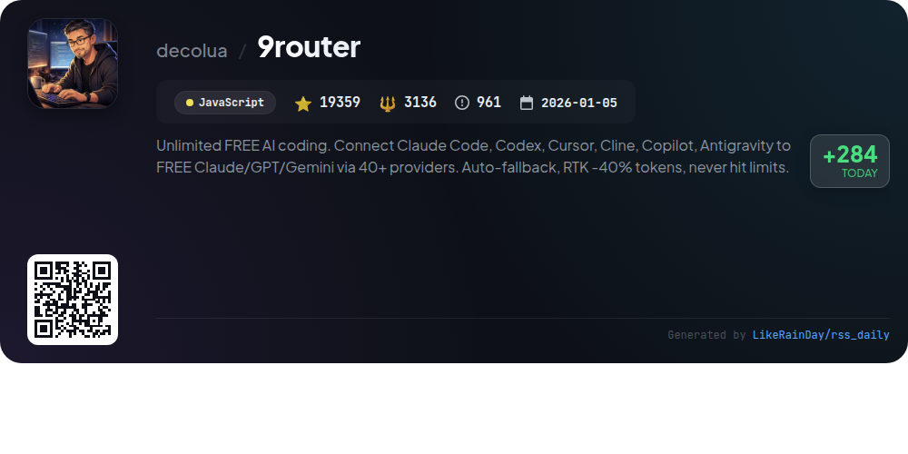

# 📊 🌟 GitHub Trending Daily - 2026-07-02

> > 📅 Daily Picks of GitHub Trending Repositories | Powered by Smart Algorithms

## 📋 Overview

**10** Projects | **464327** ⭐ | **53159** 🍴

**Top Languages:** `JavaScript` (3) · `TypeScript` (3) · `Rust` (2)

**Updated:** 2026-07-02 04:07 UTC

**Categories:**

- 🌟 Daily Top 10 (10 items)

---

## 🌟 Daily Top 10

### 1. [OmniRoute](https://github.com/diegosouzapw/OmniRoute)

> 🤖 **Why Recommend**  
> *OmniRoute is a powerful AI gateway that connects over 231 providers, including 50+ free options, through a single endpoint. Built in TypeScript, it seamlessly integrates tools like Claude Code, Codex, and Copilot while employing RTK and Caveman compression to save 15-95% on tokens. Key features include smart auto-fallback, multi-modal APIs, and a robust CLI for extensive customization. With approximately 1.6 billion free tokens available monthly and a focus on local-first architecture, OmniRoute ensures users can maximize resources without incurring costs.*

- ⭐ 9674 stars
- 💻 TypeScript
- 📅 Updated: 2026-07-02

### 2. [codebase-memory-mcp](https://github.com/DeusData/codebase-memory-mcp)

> 🤖 **Why Recommend**  
> *High-performance code intelligence MCP server. Indexes codebases into a persistent knowledge graph — average repo in milliseconds. 158 languages, su. popular project, actively maintained, recently updated*

- ⭐ 23948 stars
- 🍴 1765 forks
- 💻 C
- 📅 Updated: 2026-07-02

### 3. [ECC](https://github.com/affaan-m/ECC)

> 🤖 **Why Recommend**  
> *ECC is a performance optimization system for AI agents, supporting Codex, Claude Code, OpenCode, and more. With over 224,000 stars, it offers skills, instincts, memory optimization, and security scanning to enhance coding workflows. Key features include 67 specialized agents, 277 reusable skills, and a comprehensive hook system for task automation. ECC facilitates continuous learning, cross-platform integration, and user-friendly installation via plugins. It also includes security auditing through the AgentShield tool, ensuring safe and efficient development practices.*

- ⭐ 224727 stars
- 💻 JavaScript
- 📅 Updated: 2026-07-02

### 4. [astryx](https://github.com/facebook/astryx)

> 🤖 **Why Recommend**  
> *Astryx is an open-source design system, currently in beta, built with TypeScript and React, designed for seamless collaboration between developers and AI. It offers over 150 customizable components, brand theming, dark mode, and ready-to-ship templates. Key features include open internals for flexible composition, no styling lock-in, and easy customization through CSS variables. The system supports CLI tooling for efficient component management and documentation. Astryx has been developed over eight years at Meta, powering 13,000+ apps, ensuring robust accessibility and design consistency.*

- ⭐ 2798 stars
- 💻 TypeScript
- 📅 Updated: 2026-07-02

### 5. [taste-skill](https://github.com/Leonxlnx/taste-skill)

> 🤖 **Why Recommend**  
> *Taste Skill is an innovative JavaScript framework designed to enhance AI-generated frontends, preventing bland and generic designs. It offers a suite of specialized Agent Skills, including layout, typography, and motion enhancements, alongside image-generation capabilities for design references. Key features include adjustable parameters for design variance, motion intensity, and visual density, enabling tailored outputs. With over 54,520 stars, Taste Skill integrates seamlessly with major coding agents like Codex and ChatGPT, making it a versatile tool for developers seeking high-quality UI solutions.*

- ⭐ 54520 stars
- 💻 JavaScript
- 📅 Updated: 2026-07-02

### 6. [herdr](https://github.com/ogulcancelik/herdr)

> 🤖 **Why Recommend**  
> *Herdr is a powerful agent multiplexer designed for terminal users, enabling seamless management of multiple agents within a single interface. Built in Rust, it boasts high performance and reliability. Key features include easy agent integration, real-time communication, and streamlined workflows for developers and system administrators. With nearly 10,000 stars, Herdr stands out for its efficiency in enhancing productivity and simplifying terminal tasks. This versatile tool caters to users seeking a robust solution for handling multiple processes effortlessly.*

- ⭐ 9699 stars
- 💻 Rust
- 📅 Updated: 2026-07-02

### 7. [cc-switch](https://github.com/farion1231/cc-switch)

> 🤖 **Why Recommend**  
> *CC Switch is a cross-platform desktop assistant for managing multiple AI tools, including Claude Code, Codex, and Gemini CLI. It features a unified interface for easy provider management with 50+ presets, eliminating manual config edits. Key highlights include instant provider switching via system tray, cloud sync across devices, and a comprehensive MCP and Skills management panel. Built with Rust and Tauri, CC Switch ensures reliability and robust performance. It streamlines AI coding workflows, making it a valuable tool for developers. Explore more at ccswitch.io.*

- ⭐ 111973 stars
- 💻 Rust
- 📅 Updated: 2026-07-02

### 8. [FluidVoice](https://github.com/altic-dev/FluidVoice)

> 🤖 **Why Recommend**  
> *FluidVoice is an open-source, on-device dictation app for macOS that offers the fastest speech-to-text (STT) capabilities with a custom-trained AI model for enhanced transcription. Key features include Fluid Intelligence for smart formatting, Command Mode for controlling your Mac via voice, and Write Mode for dictating in any app. It supports multiple speech models and ensures data privacy by processing locally. With over 5,500 stars on GitHub, FluidVoice is set to expand to Windows and iOS. Join the community and experience seamless dictation without cloud dependencies.*

- ⭐ 5572 stars
- 💻 Swift
- 📅 Updated: 2026-07-02

### 9. [Instatic](https://github.com/CoreBunch/Instatic)

> 🤖 **Why Recommend**  
> *Instatic is a modern self-hosted visual CMS that combines design, content management, and publishing in a single Bun server, allowing users to deploy in under one minute. It features a clean semantic HTML output, a powerful canvas editor, and a universal content model for pages, posts, and custom collections. Key highlights include an integrated Core Framework for design tokens, a sandboxed plugin system for secure extensibility, and robust analytics. Instatic is ideal for developers seeking ownership, flexibility, and performance without vendor lock-in, all under an MIT license.*

- ⭐ 2057 stars
- 💻 TypeScript
- 📅 Updated: 2026-07-02

### 10. [9router](https://github.com/decolua/9router)

> 🤖 **Why Recommend**  
> *9Router is a powerful open-source AI coding router that enables unlimited free AI coding by connecting various AI tools like Claude Code, Codex, and Copilot to over 40 providers. Key features include an RTK Token Saver that reduces token usage by 20-40%, auto-fallback between paid and free models, real-time quota tracking, and multi-account support for optimal resource management. It seamlessly integrates with major CLI tools, offering a flexible deployment across local, VPS, Docker, and cloud environments, ensuring developers never hit limits while minimizing costs.*

- ⭐ 19359 stars
- 💻 JavaScript
- 📅 Updated: 2026-07-02

---

## 📡 RSS Subscription

Subscribe via RSS to get daily trending updates:

- 🔔 [RSS XML] (../../daily-top.xml)
- 🔔 [Daily Report] (../../GITHUB_TODAY.md)
- 🔔 [Daily Top 10](../../daily-top.xml)

---

*⚡ Powered by Smart Trending Algorithm | Generated at 2026-07-02 04:07:01 UTC
