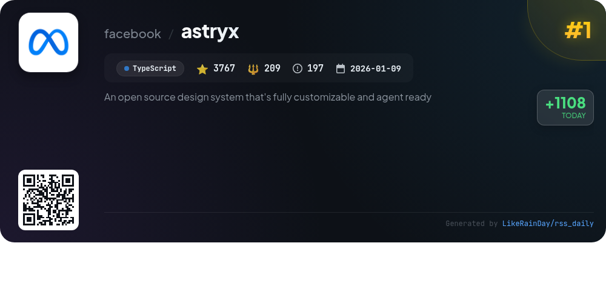
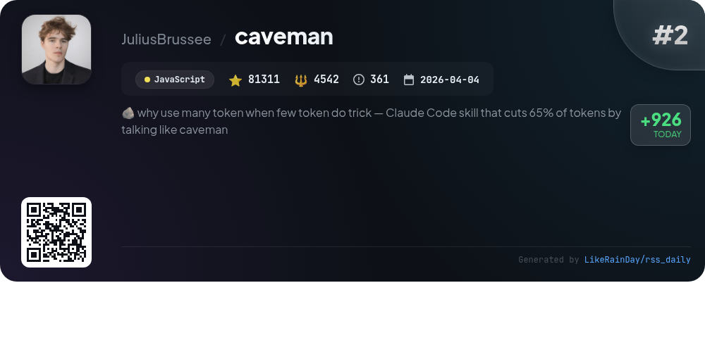
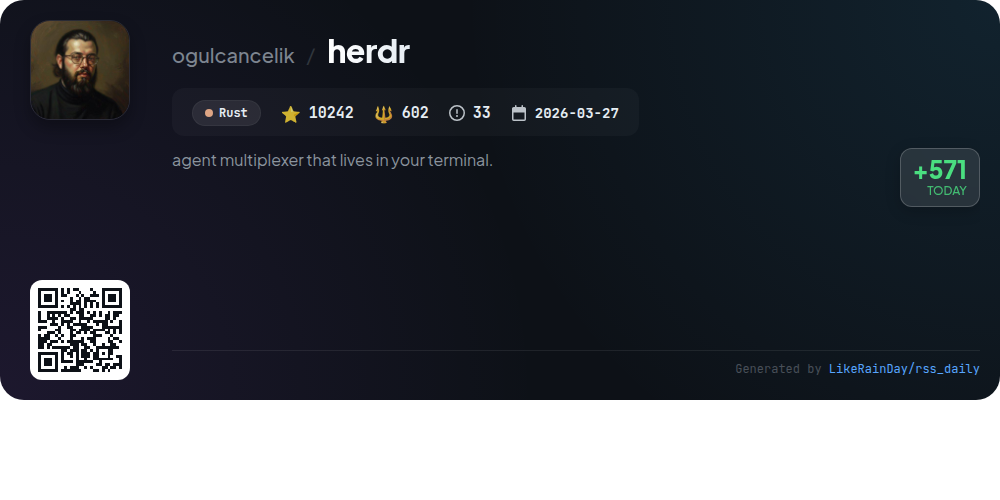
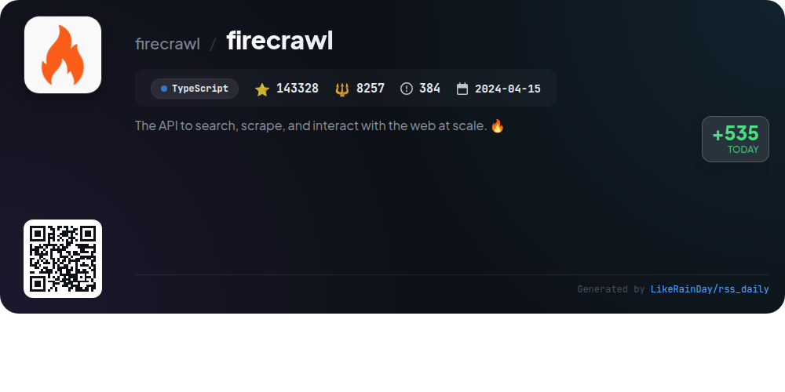
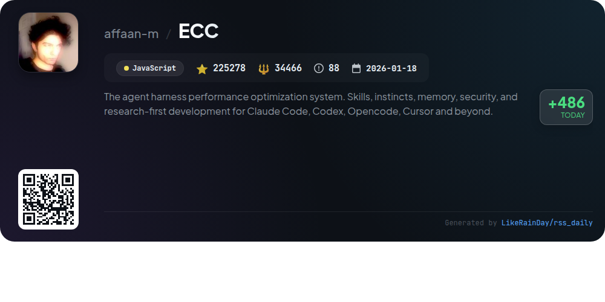
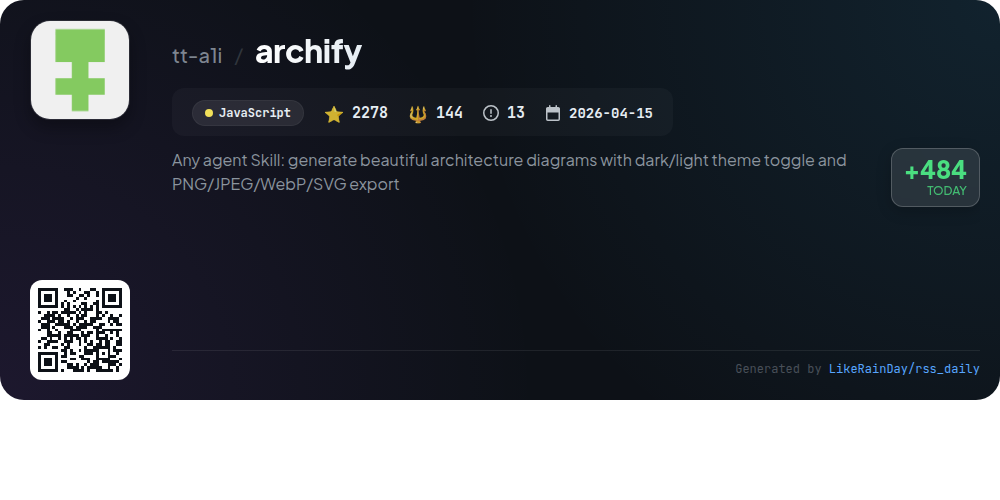
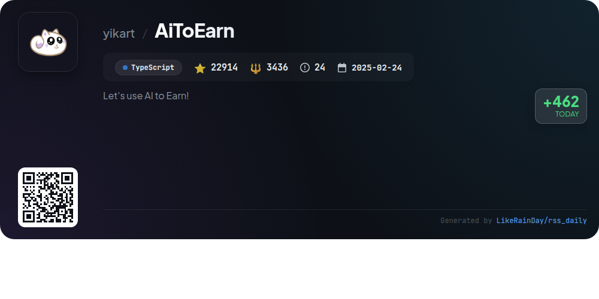
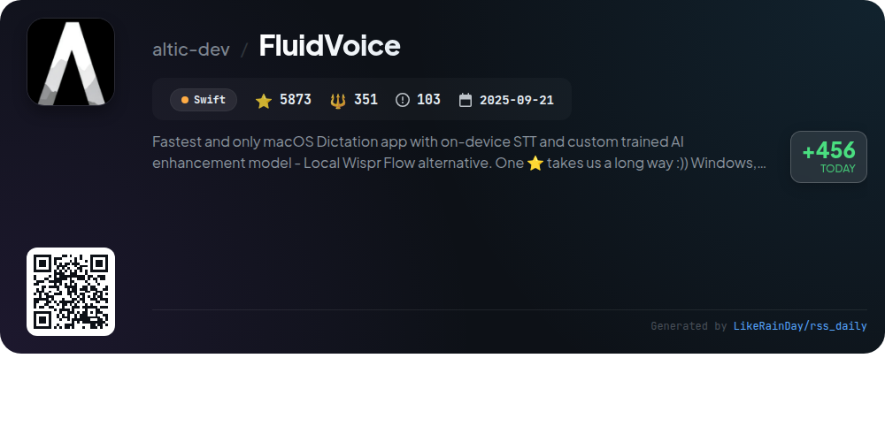
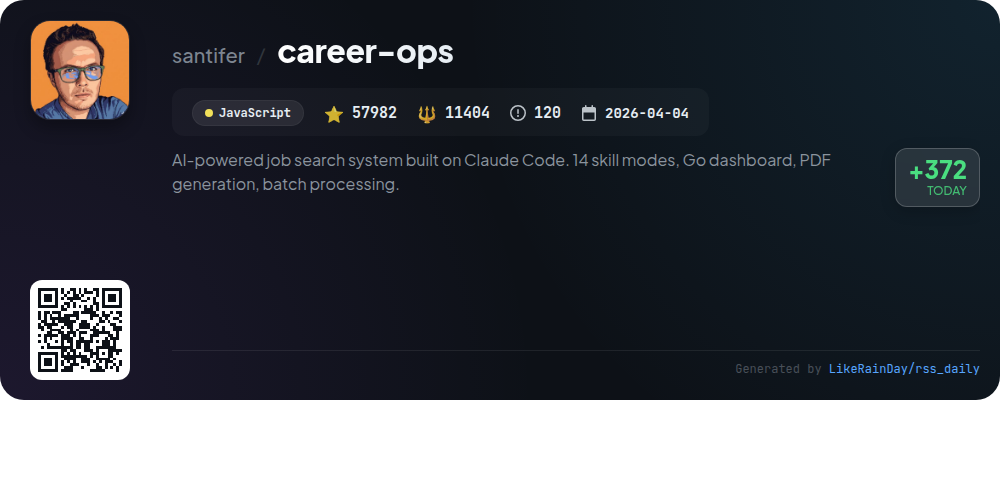

# 📊 🌟 GitHub Trending Daily - 2026-07-03

> > 📅 Daily Picks of GitHub Trending Repositories | Powered by Smart Algorithms

## 📋 Overview

**10** Projects | **563299** ⭐ | **64941** 🍴

**Top Languages:** `TypeScript` (4) · `JavaScript` (4) · `Swift` (1)

**Updated:** 2026-07-03 03:53 UTC

**Categories:**

- 🌟 Daily Top 10 (10 items)

---

## 🌟 Daily Top 10

### 1. [astryx](https://github.com/facebook/astryx)

> 🤖 **Why Recommend**  
> *Astryx is an open-source design system, currently in Beta, built on React and StyleX, featuring over 150 customizable, accessible components. It offers brand-level theming, dark mode support, and ready-to-use templates, making it easy to implement without complex configurations. Key highlights include open internals, no styling lock-in, and an intuitive API designed for both developers and AI assistants. Astryx supports TypeScript and encourages contributions, providing a comprehensive CLI and multiple customization themes. It is ideal for teams aiming for cohesive and adaptable UI solutions.*

- ⭐ 3767 stars
- 💻 TypeScript
- 📅 Updated: 2026-07-03

### 2. [caveman](https://github.com/JuliusBrussee/caveman)

> 🤖 **Why Recommend**  
> *Caveman is a JavaScript skill/plugin for Claude Code that dramatically reduces output tokens by simplifying language without losing technical accuracy. With an average of 65% token savings, it allows agents to communicate more efficiently, supporting various languages. Key features include multiple compression levels, conventional commit messages, one-line PR comments, and real-time token usage statistics. Caveman integrates seamlessly with over 30 agents, enhancing readability and speed while minimizing costs. Ideal for developers seeking concise, effective communication.*

- ⭐ 81311 stars
- 💻 JavaScript
- 📅 Updated: 2026-07-03

### 3. [OmniRoute](https://github.com/diegosouzapw/OmniRoute)

> 🤖 **Why Recommend**  
> *OmniRoute is a powerful AI gateway that allows seamless integration of over 237 AI models, with 90+ available for free, through a single endpoint. Key features include smart auto-fallbacks, token compression saving up to 95%, and support for multiple coding agents like Claude Code and Codex. It offers approximately 1.6 billion free tokens per month, enabling developers to efficiently manage AI interactions without hitting usage limits. OmniRoute is designed for flexibility, running on various platforms, and emphasizes privacy with local-first architecture.*

- ⭐ 10326 stars
- 💻 TypeScript
- 📅 Updated: 2026-07-03

### 4. [herdr](https://github.com/ogulcancelik/herdr)

> 🤖 **Why Recommend**  
> *Herdr is a powerful terminal-based agent multiplexer written in Rust, enabling users to run and manage multiple coding agents seamlessly. It features real terminals for each agent, providing accurate TUI rendering, and displays agent status (blocked, working, done) at a glance. With mouse-native workspaces, tabs, and panes, Herdr allows easy organization and management. It maintains session persistence across detachments, operates over SSH, and is lightweight (single ~10MB binary). Herdr supports various integrations and provides a local socket API for scriptability, making it ideal for developers wanting a robust, efficient workflow.*

- ⭐ 10242 stars
- 💻 Rust
- 📅 Updated: 2026-07-03

### 5. [firecrawl](https://github.com/firecrawl/firecrawl)

> 🤖 **Why Recommend**  
> *Firecrawl is a robust API designed for large-scale web searching, scraping, and interaction. With 143,328 stars on GitHub, it offers unmatched reliability, covering 96% of the web, including JS-heavy pages. Key features include fast data retrieval, LLM-ready outputs in Markdown and JSON, and seamless integration with AI agents. Users can search, scrape, and interact with web content effortlessly, utilizing endpoints for batch scraping and website crawling. As an open-source solution, Firecrawl combines collaborative development with powerful, automated data gathering capabilities.*

- ⭐ 143328 stars
- 💻 TypeScript
- 📅 Updated: 2026-07-03

### 6. [ECC](https://github.com/affaan-m/ECC)

> 🤖 **Why Recommend**  
> *ECC is a high-performance optimization system for AI agents, built in JavaScript and boasting over 225,000 stars. It integrates skills, memory optimization, security, and continuous learning across platforms like Claude Code, Codex, and OpenCode. Key features include a comprehensive dashboard for managing agents, skills, and commands, alongside advanced security auditing via AgentShield. ECC supports various languages and frameworks, providing a robust environment for development and deployment, making it ideal for team collaboration in AI-driven projects.*

- ⭐ 225278 stars
- 💻 JavaScript
- 📅 Updated: 2026-07-03

### 7. [archify](https://github.com/tt-a1i/archify)

> 🤖 **Why Recommend**  
> *Archify is a powerful tool for generating stunning architecture diagrams, workflow representations, and data-flow visuals from plain-English descriptions. Key features include a dark/light theme toggle, ultra-crisp image exports in PNG/JPEG/WebP/SVG formats, and seamless clipboard copying. It supports various diagram types, such as architecture, workflow, sequence, data flow, and lifecycle diagrams, all within a self-contained HTML file. With no design skills required, users can easily iterate and refine diagrams through chat, making it ideal for technical communication and documentation.*

- ⭐ 2278 stars
- 💻 JavaScript
- 📅 Updated: 2026-07-03

### 8. [AiToEarn](https://github.com/yikart/AiToEarn)

> 🤖 **Why Recommend**  
> *AiToEarn is an innovative AI-driven platform designed to help creators, brands, and businesses monetize and distribute content across major social media channels, including TikTok, YouTube, and Instagram. Key features include automated content creation, multi-platform publishing, and interactive engagement tools, enabling users to streamline their content marketing efforts. With flexible monetization models like CPS, CPE, and CPM, AiToEarn maximizes revenue potential for content creators. The platform supports quick access through various deployment methods, including web use and Docker.*

- ⭐ 22914 stars
- 💻 TypeScript
- 📅 Updated: 2026-07-03

### 9. [FluidVoice](https://github.com/altic-dev/FluidVoice)

> 🤖 **Why Recommend**  
> *FluidVoice is an open-source macOS dictation app offering the fastest on-device speech-to-text (STT) capabilities with a unique AI enhancement model, Fluid Intelligence. Key features include real-time transcription, voice command control, and support for multiple speech models like Parakeet and Whisper. The app prioritizes user privacy by keeping data local, with options for cloud-based enhancements. With 5,873 stars on GitHub, it’s a compelling alternative for efficient dictation. iOS and Windows versions are in development, with a Linux version planned.*

- ⭐ 5873 stars
- 💻 Swift
- 📅 Updated: 2026-07-03

### 10. [career-ops](https://github.com/santifer/career-ops)

> 🤖 **Why Recommend**  
> *Career-Ops is an AI-powered job search system that transforms your job application process into an efficient pipeline. Key features include a 14-skill mode evaluation system, automated PDF generation for tailored CVs, and batch processing for evaluating multiple job offers. The platform scans job portals, tracks applications, and generates negotiation scripts and cover letters. Designed to empower candidates, Career-Ops allows users to filter job listings based on personalized criteria, ensuring a focused approach to job applications. With over 57,982 stars on GitHub, it's a community-driven tool for the modern job seeker.*

- ⭐ 57982 stars
- 💻 JavaScript
- 📅 Updated: 2026-07-03

---

## 📡 RSS Subscription

Subscribe via RSS to get daily trending updates:

- 🔔 [RSS XML] (../../daily-top.xml)
- 🔔 [Daily Report] (../../GITHUB_TODAY.md)
- 🔔 [Daily Top 10](../../daily-top.xml)

---

*⚡ Powered by Smart Trending Algorithm | Generated at 2026-07-03 03:53:35 UTC
