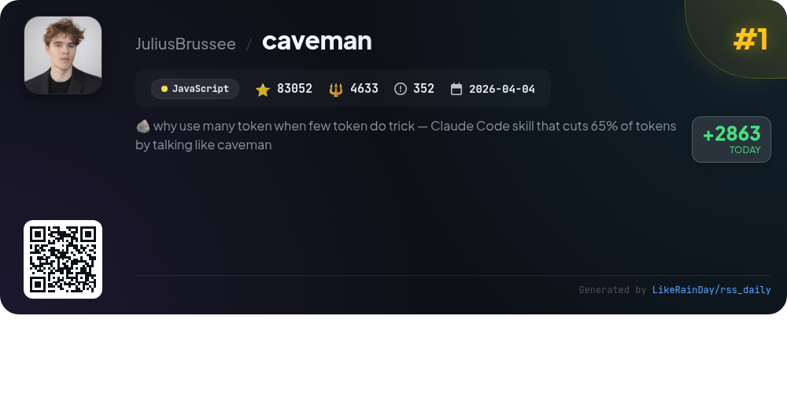
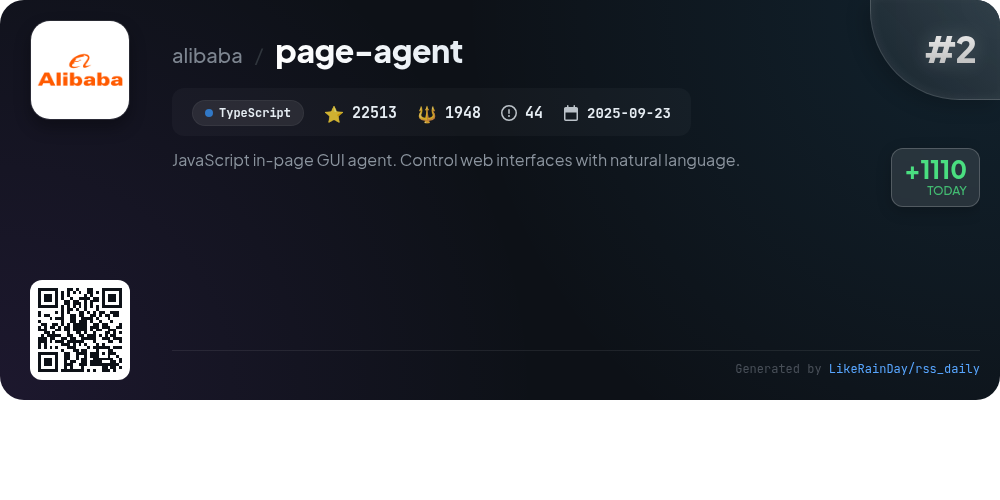
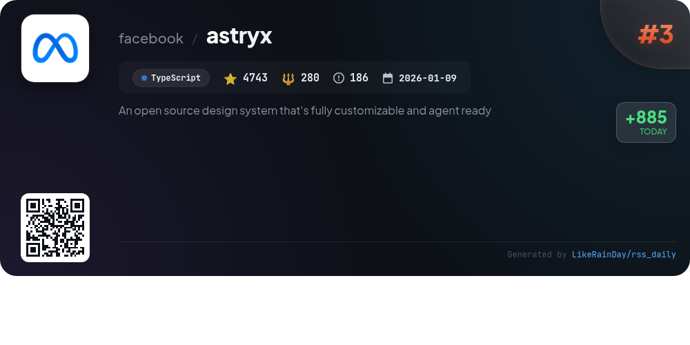
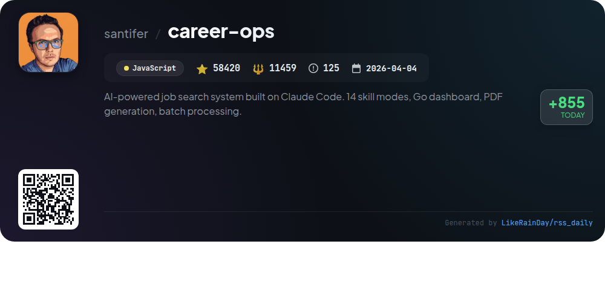
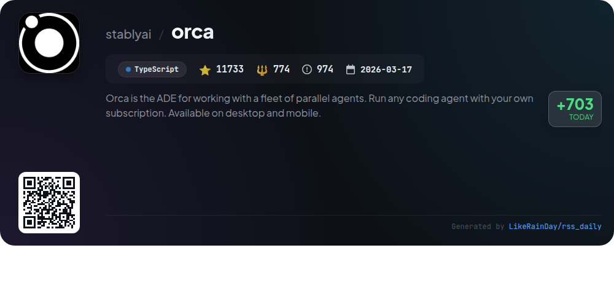
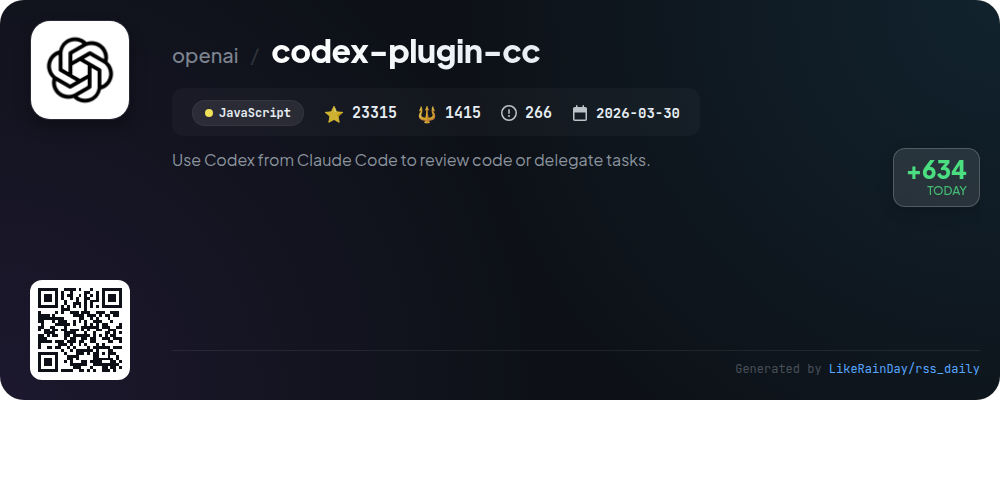
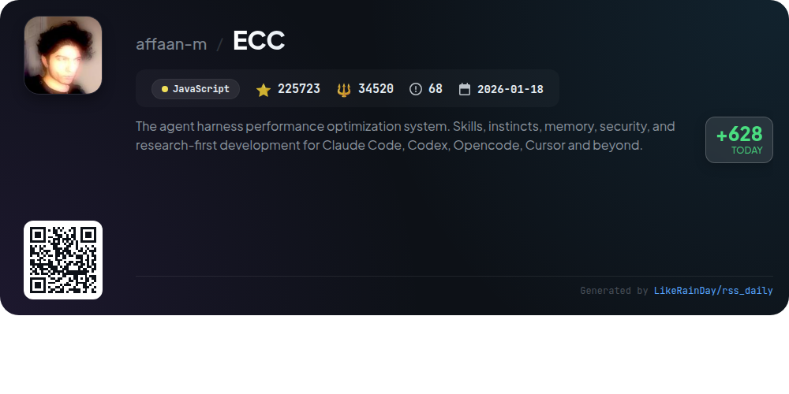
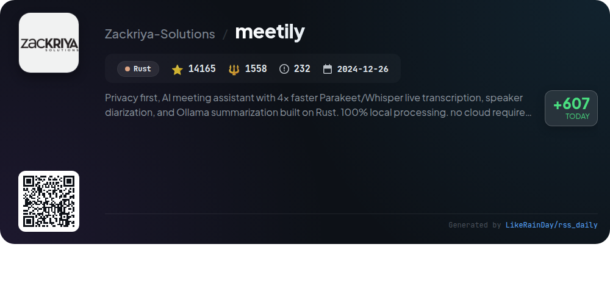
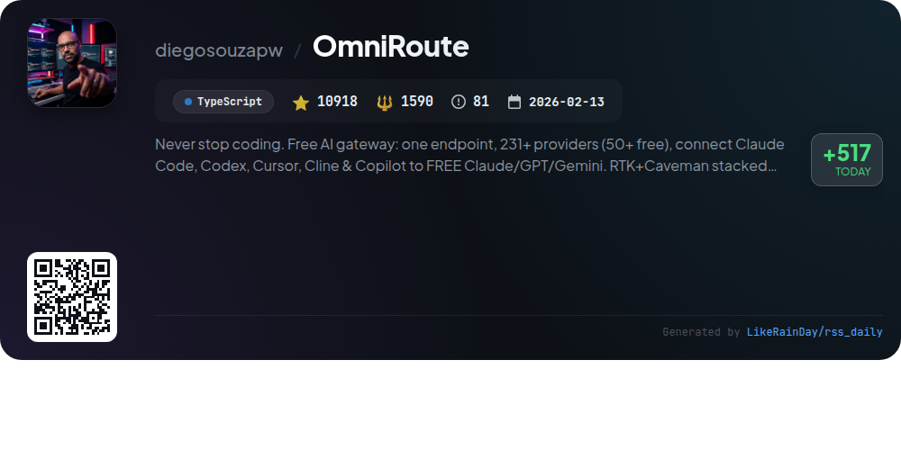
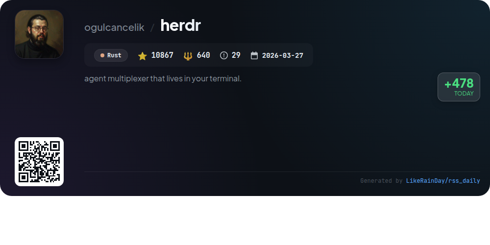

# 📊 🌟 GitHub Trending Daily - 2026-07-04

> > 📅 每日精选 GitHub 热门仓库 | 基于智能算法推荐

## 📋 Overview

**10** 个项目 | **465449** ⭐ | **58817** 🍴

**热门语言:** `TypeScript` (4) · `JavaScript` (4) · `Rust` (2)

**更新时间:** 2026-07-04 03:44 UTC

**分类分布:**

- 🌟 每日 Top 10 精选 (10 项)

---

## 🌟 每日 Top 10 精选

### 1. [caveman](https://github.com/JuliusBrussee/caveman)

> 🤖 **推荐理由**  
> *Caveman is a JavaScript plugin that enhances AI coding agents like Claude Code, Codex, and Gemini by reducing output tokens by 65% while maintaining technical accuracy. It simplifies responses into concise "caveman-speak," saving users money and improving readability. Key features include six response compression levels, session token statistics, and the ability to rewrite memory files for future savings. Installable with a single command, Caveman integrates seamlessly across 30+ agents, making it a valuable tool for efficient coding communication.*

- ⭐ 83052 stars
- 💻 JavaScript
- 📅 Updated: 2026-07-04

### 2. [page-agent](https://github.com/alibaba/page-agent)

> 🤖 **推荐理由**  
> *JavaScript in-page GUI agent. Control web interfaces with natural language.. popular project, actively maintained, recently updated*

- ⭐ 22513 stars
- 🍴 1948 forks
- 💻 TypeScript
- 📅 Updated: 2026-07-04

### 3. [astryx](https://github.com/facebook/astryx)

> 🤖 **推荐理由**  
> *Astryx is an open-source, fully customizable design system developed at Meta, currently in Beta. Built with TypeScript, React, and StyleX, it offers 150+ accessible components, brand-level theming, dark mode, and ready-to-ship templates. Key features include open internals for component composition, no styling lock-in, and easy customization through CSS property overrides. The system is designed for both humans and AI assistants, ensuring a cohesive development experience. It includes essential packages for core components, CLI tooling, and customizable themes, promoting strong conventions and accessibility.*

- ⭐ 4743 stars
- 💻 TypeScript
- 📅 Updated: 2026-07-04

### 4. [career-ops](https://github.com/santifer/career-ops)

> 🤖 **推荐理由**  
> *Career-Ops is an AI-driven job search system designed to optimize the application process. Key features include a structured A-F job evaluation, ATS-optimized CV and cover letter generation, batch processing of job offers, and automated scanning of major job portals. The platform allows users to track applications in a single dashboard while providing insights into company culture and contact discovery for networking. With support for multiple AI coding CLIs, it transforms job searching into a streamlined and personalized experience. Open source and built with Claude Code.*

- ⭐ 58420 stars
- 💻 JavaScript
- 📅 Updated: 2026-07-04

### 5. [orca](https://github.com/stablyai/orca)

> 🤖 **推荐理由**  
> *Orca is a powerful IDE designed for managing parallel agents, enabling users to run coding agents like Codex and ClaudeCode simultaneously in isolated worktrees. Key features include a mobile companion app for monitoring agents, terminal splits with advanced functionality, and a design mode for easy UI element interaction. Users can manage tasks seamlessly with integrated GitHub and Linear support, SSH worktrees for remote operations, and extensive CLI scripting capabilities. Available on macOS, Windows, and Linux, Orca enhances productivity for developers, making it a versatile tool for AI-driven coding.*

- ⭐ 11733 stars
- 💻 TypeScript
- 📅 Updated: 2026-07-04

### 6. [codex-plugin-cc](https://github.com/openai/codex-plugin-cc)

> 🤖 **推荐理由**  
> *The Codex Plugin for Claude Code enables seamless integration of Codex for code reviews and task delegation. Key features include commands for normal (`/codex:review`) and adversarial reviews (`/codex:adversarial-review`), as well as task management with commands like `/codex:rescue`, `/codex:transfer`, and `/codex:status`. Users can efficiently review code, challenge design decisions, and delegate tasks to Codex while managing background jobs. This plugin enhances developer workflows by leveraging Codex's capabilities directly within Claude Code, requiring a ChatGPT subscription or OpenAI API key.*

- ⭐ 23315 stars
- 💻 JavaScript
- 📅 Updated: 2026-07-04

### 7. [ECC](https://github.com/affaan-m/ECC)

> 🤖 **推荐理由**  
> *ECC is a powerful performance optimization system for AI agents, supporting platforms like Claude Code, Codex, and Cursor. It features a comprehensive framework for skills, instincts, memory optimization, and security scanning, enabling efficient workflows across various coding environments. Key highlights include over 67 specialized subagents, 277 skills, and automated hooks for context management and task execution. With continuous learning capabilities and extensive community support, ECC is designed for real-world applications, ensuring seamless integration and enhanced productivity in development processes.*

- ⭐ 225723 stars
- 💻 JavaScript
- 📅 Updated: 2026-07-04

### 8. [meetily](https://github.com/Zackriya-Solutions/meetily)

> 🤖 **推荐理由**  
> *Meetily is a privacy-first AI meeting assistant that offers real-time transcription, speaker diarization, and AI-generated summaries, all processed locally on your device without cloud dependency. Built in Rust, it supports macOS and Windows and is open-source, ensuring data sovereignty and compliance. Key features include 4x faster transcription using Parakeet/Whisper models, customizable AI endpoints, and professional audio mixing. Meetily PRO enhances accuracy and workflow capabilities, making it ideal for enterprises focused on privacy and control.*

- ⭐ 14165 stars
- 💻 Rust
- 📅 Updated: 2026-07-04

### 9. [OmniRoute](https://github.com/diegosouzapw/OmniRoute)

> 🤖 **推荐理由**  
> *OmniRoute is a powerful AI gateway that connects developers to over 237 providers, including 90+ free options, through a single endpoint. Key features include smart auto-fallback, extensive routing strategies, and RTK + Caveman compression, which saves 15-95% on token usage. It enables seamless integration with popular coding tools like Claude Code, Codex, and Copilot. With robust security, a user-friendly dashboard, and support for various platforms (PWA, Desktop), OmniRoute enhances productivity while reducing costs. Join a thriving community and streamline your AI development today.*

- ⭐ 10918 stars
- 💻 TypeScript
- 📅 Updated: 2026-07-04

### 10. [herdr](https://github.com/ogulcancelik/herdr)

> 🤖 **推荐理由**  
> *Herdr is an innovative agent multiplexer designed for terminal use, enabling users to manage multiple coding agents seamlessly. Key features include dedicated terminals for each agent, real-time state visibility (blocked, working, done), and intuitive workspace management with tabs and panes. Herdr runs as a lightweight Rust binary, ensuring persistence and allowing remote access via SSH without GUI dependencies. It supports various agents, providing a scriptable interface through a local socket API. With Herdr, users can optimize their workflow in a familiar terminal environment.*

- ⭐ 10867 stars
- 💻 Rust
- 📅 Updated: 2026-07-04

---

## 📡 RSS订阅

通过 RSS 订阅，第一时间获取每日精选项目：

- 🔔 [RSS 订阅源] (../../daily-top.xml)
- 🔔 [每日简报] (../../GITHUB_TODAY_CN.md)
- 🔔 [每日 Top 10 精选](../../daily-top.xml)

---

*⚡ Powered by Smart Trending Algorithm | Generated at 2026-07-04 03:44:35 UTC
