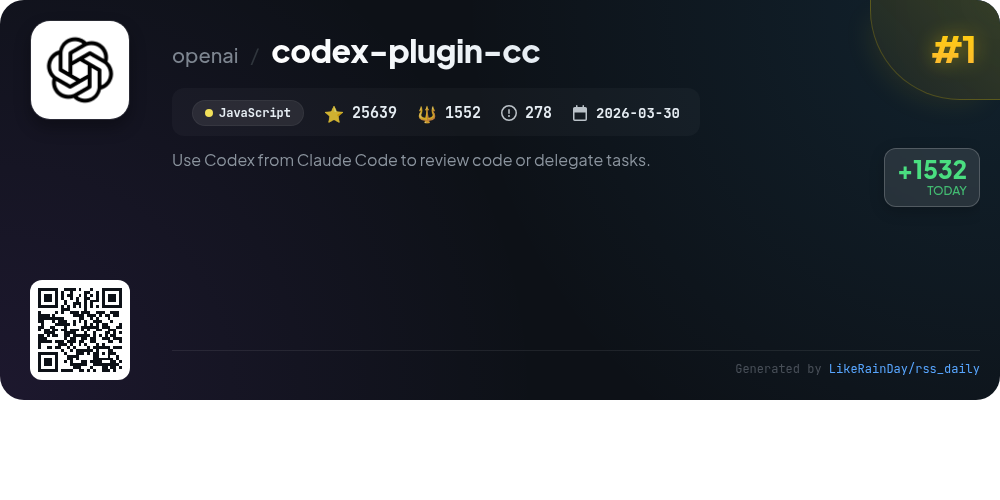
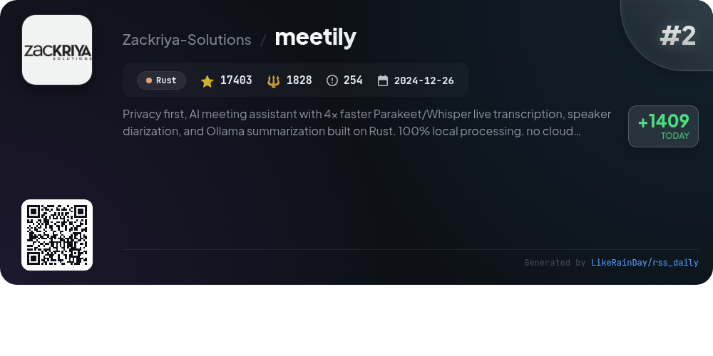
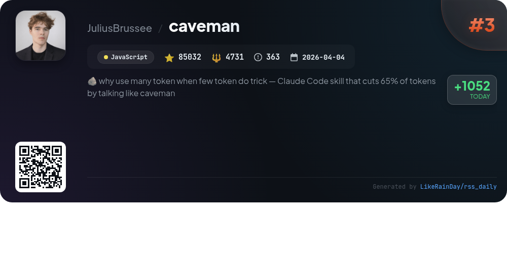
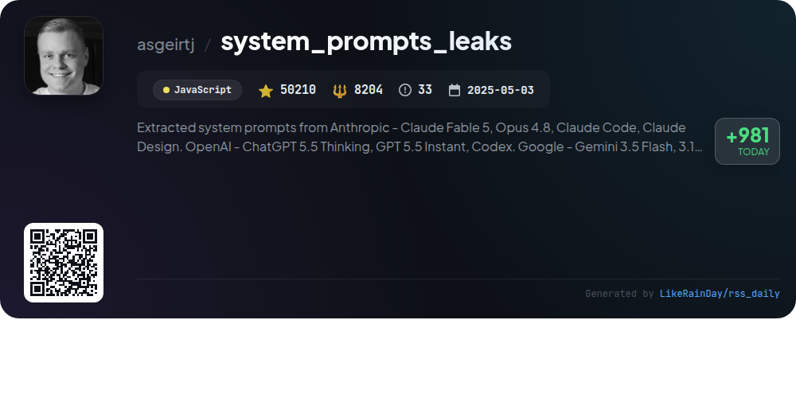
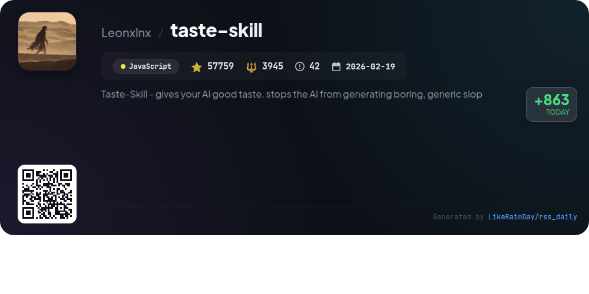
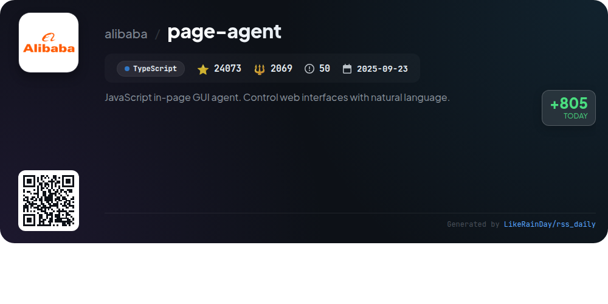
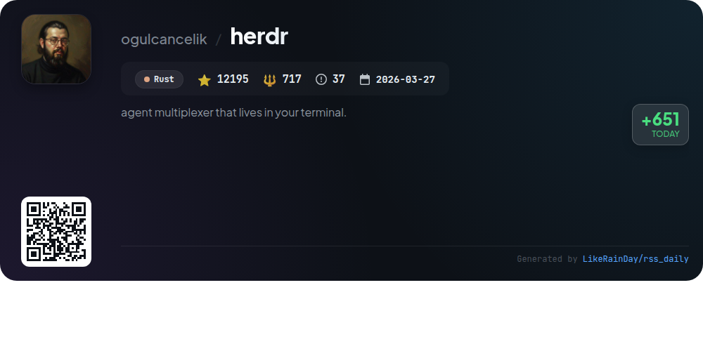
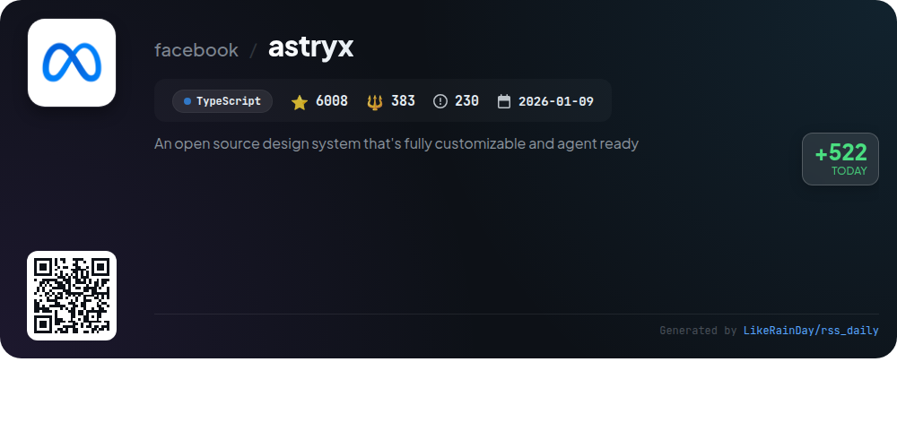
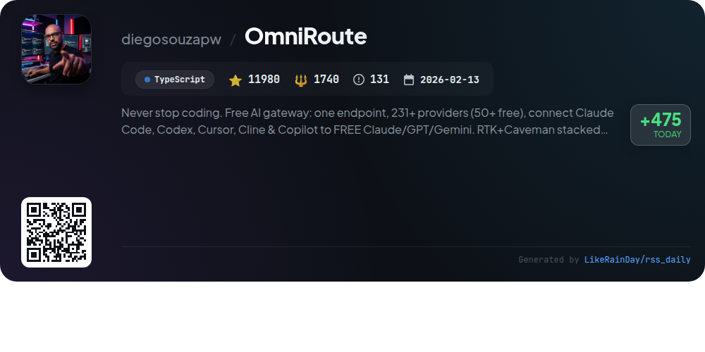
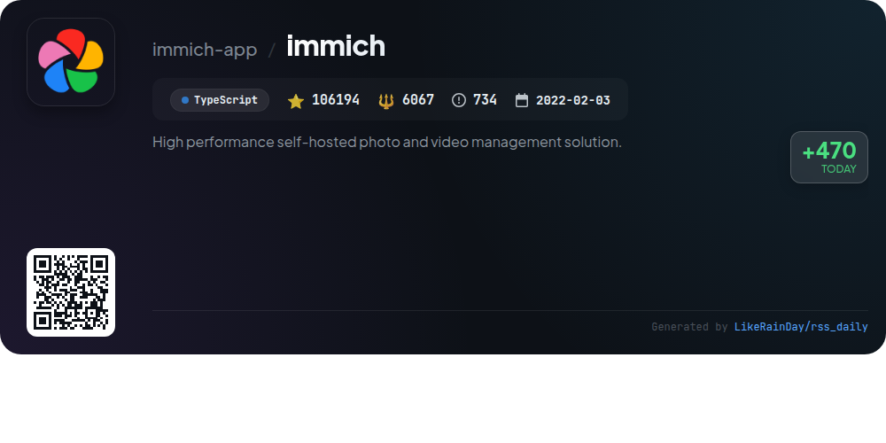

# 📊 🌟 GitHub Trending Daily - 2026-07-06

> > 📅 Daily Picks of GitHub Trending Repositories | Powered by Smart Algorithms

## 📋 Overview

**10** Projects | **396493** ⭐ | **31236** 🍴

**Top Languages:** `JavaScript` (4) · `TypeScript` (4) · `Rust` (2)

**Updated:** 2026-07-06 04:10 UTC

**Categories:**

- 🌟 Daily Top 10 (10 items)

---

## 🌟 Daily Top 10

### 1. [codex-plugin-cc](https://github.com/openai/codex-plugin-cc)

> 🤖 **Why Recommend**  
> *The Codex Plugin for Claude Code enables seamless code reviews and task delegation using Codex. Key features include `/codex:review` for standard reviews, `/codex:adversarial-review` for challenging design assumptions, and various commands to manage tasks like `/codex:rescue`, `/codex:transfer`, `/codex:status`, and `/codex:result`. This integration supports background processing and maintains continuity in debugging sessions. Users require a ChatGPT subscription or OpenAI API key and Node.js 18.18+. The plugin simplifies incorporating Codex into existing workflows, enhancing productivity for developers.*

- ⭐ 25639 stars
- 💻 JavaScript
- 📅 Updated: 2026-07-06

### 2. [meetily](https://github.com/Zackriya-Solutions/meetily)

> 🤖 **Why Recommend**  
> *Meetily is a privacy-first AI meeting assistant that offers 4x faster live transcription using Parakeet/Whisper, speaker diarization, and AI-generated summaries, all processed locally on macOS and Windows. This open-source tool prioritizes data sovereignty, ensuring that sensitive information remains on your device. Key features include real-time transcription, customizable AI provider support, and professional audio mixing. Meetily PRO enhances these capabilities with advanced accuracy, custom workflows, and team-ready features. With over 17,000 stars on GitHub, it is the leading self-hosted solution for meeting intelligence.*

- ⭐ 17403 stars
- 💻 Rust
- 📅 Updated: 2026-07-06

### 3. [caveman](https://github.com/JuliusBrussee/caveman)

> 🤖 **Why Recommend**  
> *Caveman is a JavaScript plugin designed to enhance AI coding agents like Claude Code, Codex, and Gemini by reducing output tokens by up to 65% while maintaining technical accuracy. It transforms verbose responses into concise caveman-speak, ensuring the essence of the message is retained. With easy installation and six adjustable verbosity levels, users can optimize their interactions for clarity and brevity. Key features include real-time token savings statistics, memory file compression, and integration with 30+ agents, making it a powerful tool for efficient AI communication.*

- ⭐ 85032 stars
- 💻 JavaScript
- 📅 Updated: 2026-07-06

### 4. [system_prompts_leaks](https://github.com/asgeirtj/system_prompts_leaks)

> 🤖 **Why Recommend**  
> *The "system_prompts_leaks" GitHub project provides a comprehensive collection of extracted system prompts from various leading AI chatbots, including Anthropic's Claude, OpenAI's ChatGPT, Google's Gemini, and xAI's Grok. With over 50,210 stars, it regularly updates its repository with the latest prompts and tools, allowing users to explore and analyze the underlying instructions that guide AI behavior. Key features include detailed documentation of prompts, version comparisons, and integration with various platforms like GitHub Copilot and VS Code, making it a valuable resource for developers and AI enthusiasts alike.*

- ⭐ 50210 stars
- 💻 JavaScript
- 📅 Updated: 2026-07-06

### 5. [taste-skill](https://github.com/Leonxlnx/taste-skill)

> 🤖 **Why Recommend**  
> *Taste Skill is a JavaScript-based framework designed to enhance AI-generated interfaces, preventing bland designs. With over 57,000 stars, it offers portable Agent Skills focusing on layout, typography, and motion, alongside image-generation capabilities for web and mobile. Key features include customizable design parameters, multiple specialized skills like `gpt-taste` for stricter rules, and `image-to-code-skill` for seamless design-to-code workflows. It's framework-agnostic, ensuring compatibility with various coding environments. Explore more at [tasteskill.dev](https://tasteskill.dev).*

- ⭐ 57759 stars
- 💻 JavaScript
- 📅 Updated: 2026-07-06

### 6. [page-agent](https://github.com/alibaba/page-agent)

> 🤖 **Why Recommend**  
> *JavaScript in-page GUI agent. Control web interfaces with natural language.. popular project, actively maintained, recently updated*

- ⭐ 24073 stars
- 🍴 2069 forks
- 💻 TypeScript
- 📅 Updated: 2026-07-06

### 7. [herdr](https://github.com/ogulcancelik/herdr)

> 🤖 **Why Recommend**  
> *herdr is a Rust-based agent multiplexer that operates directly in your terminal, allowing you to run multiple coding agents seamlessly. Key features include individual real terminals for each agent, a sidebar displaying agent states (blocked, working, done, idle), and the ability to organize workspaces, tabs, and panes. It runs anywhere via SSH, maintains session persistence even when detached, and supports a variety of agents with native integrations. Lightweight and dependency-free, herdr enhances productivity without the need for a GUI or telemetry.*

- ⭐ 12195 stars
- 💻 Rust
- 📅 Updated: 2026-07-06

### 8. [astryx](https://github.com/facebook/astryx)

> 🤖 **Why Recommend**  
> *Astryx is an open-source design system, currently in beta, developed at Meta and now available for customization. Built with TypeScript, React, and StyleX, it features 150+ accessible components, brand-level theming, dark mode, and ready-to-use templates. Unique aspects include open internals for deep customization, no styling lock-in, and an API designed for both humans and AI assistants. Key packages include core components, CLI tooling, and customizable themes. Astryx streamlines development with a focus on flexibility, usability, and comprehensive documentation.*

- ⭐ 6008 stars
- 💻 TypeScript
- 📅 Updated: 2026-07-06

### 9. [OmniRoute](https://github.com/diegosouzapw/OmniRoute)

> 🤖 **Why Recommend**  
> *OmniRoute is a powerful AI gateway that connects over 237 AI providers (90+ free) through a single endpoint, enabling seamless integration with tools like Claude Code, Codex, and Copilot. Key features include smart auto-fallback across providers, RTK + Caveman compression that saves 15-95% tokens, and a user-friendly dashboard for tracking free tier usage. With built-in multi-platform support, it runs on desktop, PWA, and Termux, while offering a full CLI and agent protocols for automation. OmniRoute empowers developers to optimize costs and maximize efficiency in AI interactions.*

- ⭐ 11980 stars
- 💻 TypeScript
- 📅 Updated: 2026-07-06

### 10. [immich](https://github.com/immich-app/immich)

> 🤖 **Why Recommend**  
> *Immich is a high-performance self-hosted photo and video management solution, boasting over 106,000 stars on GitHub. Key features include auto backups, multi-user support, advanced search capabilities (metadata, objects, faces), and album sharing. The platform supports both web and mobile applications, allowing users to upload, view, and manage media seamlessly. Notable functionalities include live photo backup, offline support, and facial recognition. Immich is built with TypeScript and operates under the AGPLv3 license, ensuring robust community collaboration and contributions.*

- ⭐ 106194 stars
- 💻 TypeScript
- 📅 Updated: 2026-07-06

---

## 📡 RSS Subscription

Subscribe via RSS to get daily trending updates:

- 🔔 [RSS XML] (../../daily-top.xml)
- 🔔 [Daily Report] (../../GITHUB_TODAY.md)
- 🔔 [Daily Top 10](../../daily-top.xml)

---

*⚡ Powered by Smart Trending Algorithm | Generated at 2026-07-06 04:10:24 UTC
