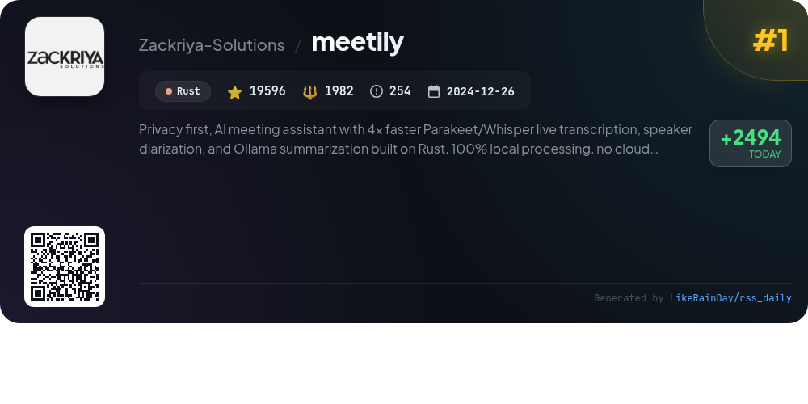
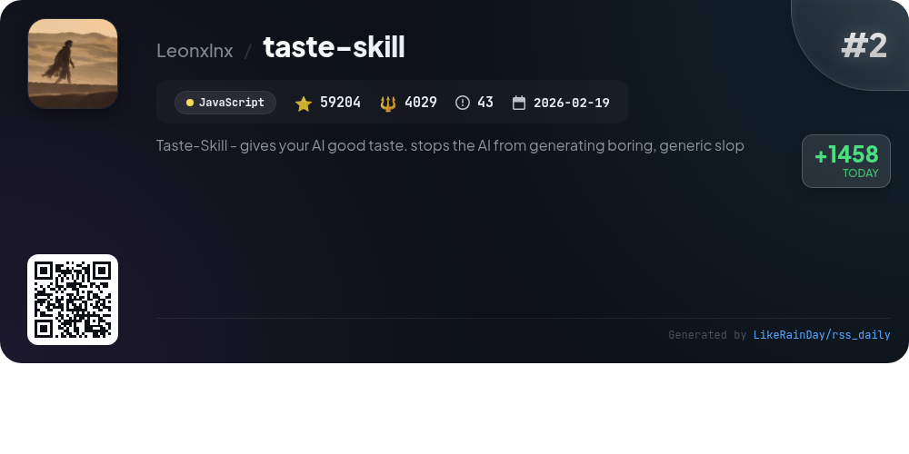
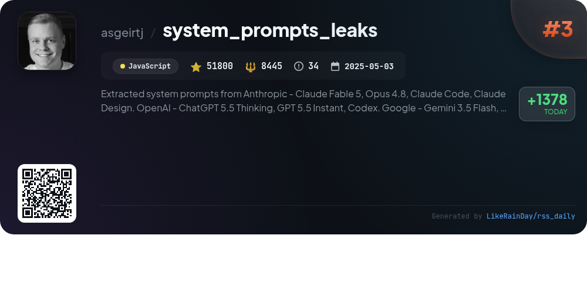
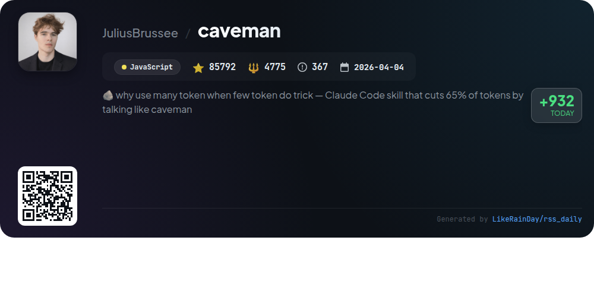
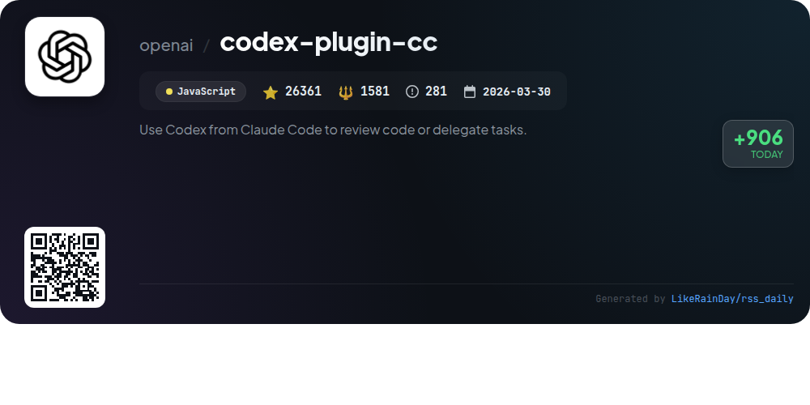
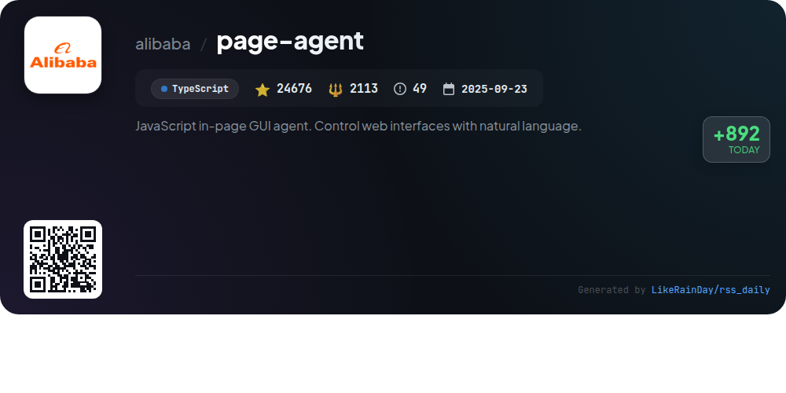
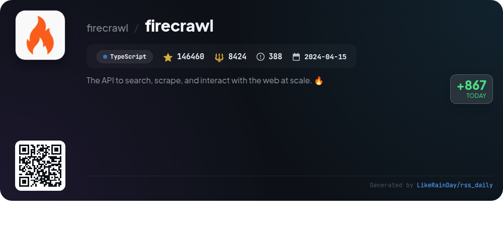
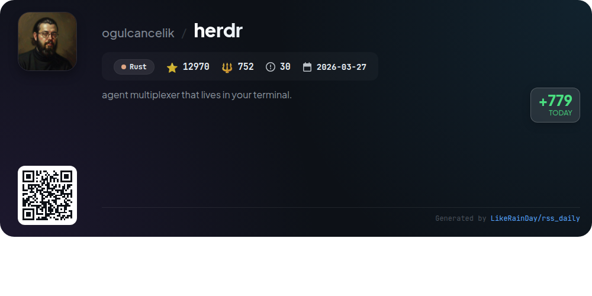
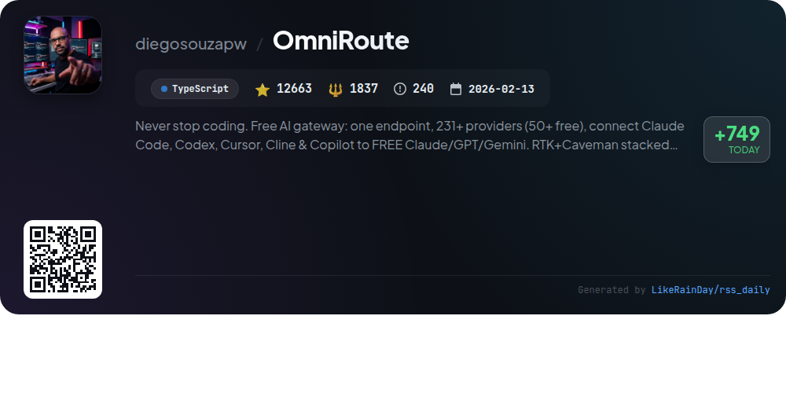
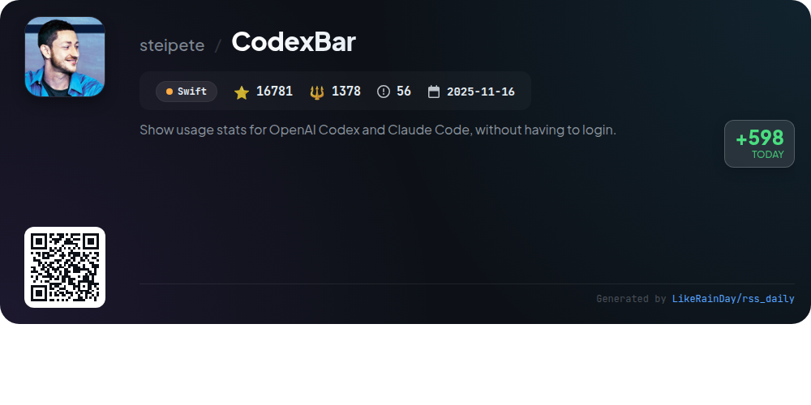

# 📊 🌟 GitHub Trending Daily - 2026-07-07

> > 📅 每日精选 GitHub 热门仓库 | 基于智能算法推荐

## 📋 Overview

**10** 个项目 | **456303** ⭐ | **35316** 🍴

**热门语言:** `JavaScript` (4) · `TypeScript` (3) · `Rust` (2)

**更新时间:** 2026-07-07 04:01 UTC

**分类分布:**

- 🌟 每日 Top 10 精选 (10 项)

---

## 🌟 每日 Top 10 精选

### 1. [meetily](https://github.com/Zackriya-Solutions/meetily)

> 🤖 **推荐理由**  
> *Meetily is a privacy-first AI meeting assistant that operates entirely on your local machine, ensuring complete data sovereignty. Built with Rust, it offers real-time transcription using Parakeet/Whisper, speaker diarization, and AI-generated summaries via Ollama. Key features include local processing, multi-platform support (macOS, Windows, Linux), and open-source accessibility. Ideal for professionals and enterprises, Meetily prioritizes privacy and compliance while providing customizable, offline functionality. Explore advanced options with Meetily PRO for enhanced accuracy and team features.*

- ⭐ 19596 stars
- 💻 Rust
- 📅 Updated: 2026-07-07

### 2. [taste-skill](https://github.com/Leonxlnx/taste-skill)

> 🤖 **推荐理由**  
> *Taste-Skill is an innovative JavaScript framework designed to enhance AI-generated frontends, preventing the production of generic UIs. With over 59,000 stars, it features portable Agent Skills for improved layout, typography, and motion. Notable services include image-generation skills for web and mobile, along with various design-focused skills like "redesign-skill" and "soft-skill." The framework is compatible with major coding agents and allows users to install skills easily via the `npx skills add` command, ensuring a streamlined development experience.*

- ⭐ 59204 stars
- 💻 JavaScript
- 📅 Updated: 2026-07-07

### 3. [system_prompts_leaks](https://github.com/asgeirtj/system_prompts_leaks)

> 🤖 **推荐理由**  
> *The "system_prompts_leaks" GitHub project is a comprehensive repository documenting extracted system prompts from various AI chatbots, including Anthropic's Claude, OpenAI's ChatGPT, Google's Gemini, and xAI's Grok. With over 51,800 stars, it provides regularly updated insights into the prompts driving these models. Key features include detailed documentation of system prompts for multiple models, change logs for updates, and a focus on transparency in AI interactions. This project serves as a valuable resource for developers and researchers interested in understanding AI behavior.*

- ⭐ 51800 stars
- 💻 JavaScript
- 📅 Updated: 2026-07-07

### 4. [caveman](https://github.com/JuliusBrussee/caveman)

> 🤖 **推荐理由**  
> *Caveman is a JavaScript skill/plugin that optimizes AI coding agents like Claude Code, Codex, and Gemini to communicate in a concise manner, reducing output tokens by an average of 65%. It offers various modes (lite, full, ultra, wenyan) for tailored brevity while maintaining technical accuracy. Key features include session token savings stats, memory file compression, and integration with 30+ agents. The installation is straightforward, requiring a single command. Caveman aims to enhance readability and speed, making it an efficient tool for developers.*

- ⭐ 85792 stars
- 💻 JavaScript
- 📅 Updated: 2026-07-07

### 5. [codex-plugin-cc](https://github.com/openai/codex-plugin-cc)

> 🤖 **推荐理由**  
> *The Codex Plugin for Claude Code enables seamless integration of Codex for code reviews and task delegation. With commands like `/codex:review` for standard reviews, `/codex:adversarial-review` for challenging code decisions, and `/codex:rescue` for delegating tasks, users can enhance their coding workflow efficiently. Key features include task management with `/codex:status`, `/codex:result`, and `/codex:cancel`, along with setup and configuration options. This plugin is designed for Claude Code users to leverage Codex's capabilities directly within their existing environment.*

- ⭐ 26361 stars
- 💻 JavaScript
- 📅 Updated: 2026-07-07

### 6. [page-agent](https://github.com/alibaba/page-agent)

> 🤖 **推荐理由**  
> *JavaScript in-page GUI agent. Control web interfaces with natural language.. popular project, actively maintained, recently updated*

- ⭐ 24676 stars
- 🍴 2113 forks
- 💻 TypeScript
- 📅 Updated: 2026-07-07

### 7. [firecrawl](https://github.com/firecrawl/firecrawl)

> 🤖 **推荐理由**  
> *Firecrawl is an open-source API designed for scalable web searching, scraping, and interaction. Key features include industry-leading reliability, fast latency, and LLM-ready outputs like clean Markdown and structured JSON. It simplifies complex tasks such as rotating proxies and rate limits, allowing seamless integration with AI agents. Core services include search, scrape, interact, crawl, and batch scrape, making it an essential tool for developers needing efficient web data extraction. Firecrawl also supports media parsing and offers SDKs for various programming languages.*

- ⭐ 146460 stars
- 💻 TypeScript
- 📅 Updated: 2026-07-07

### 8. [herdr](https://github.com/ogulcancelik/herdr)

> 🤖 **推荐理由**  
> *Herdr is a terminal-based agent multiplexer written in Rust, enabling users to run and manage multiple coding agents seamlessly. With 12,970 stars on GitHub, it offers real terminal views for each agent, displaying their status (blocked, working, done) at a glance. Key features include persistent sessions, mouse-native workspace management, and the ability to detach and reattach without losing agent state. Herdr runs anywhere via a lightweight binary and supports extensive integrations with various agents. It combines the functionality of tmux with enhanced agent awareness, making it ideal for developers.*

- ⭐ 12970 stars
- 💻 Rust
- 📅 Updated: 2026-07-07

### 9. [OmniRoute](https://github.com/diegosouzapw/OmniRoute)

> 🤖 **推荐理由**  
> *OmniRoute is a powerful AI gateway that connects over 237 providers (90+ free) through a single endpoint, enabling seamless integration of tools like Claude Code, Codex, and Copilot. Key features include smart auto-fallback across providers, RTK and Caveman compression to save 15-95% tokens, and a robust dashboard for tracking usage and costs. It supports multimodal APIs and offers a full CLI with 80+ commands, making it ideal for developers seeking cost-effective AI solutions. OmniRoute is open-source, ensuring privacy and flexibility.*

- ⭐ 12663 stars
- 💻 TypeScript
- 📅 Updated: 2026-07-07

### 10. [CodexBar](https://github.com/steipete/CodexBar)

> 🤖 **推荐理由**  
> *CodexBar is a macOS 14+ menu bar app that provides real-time usage stats for multiple AI coding providers, including OpenAI Codex, Claude, and many others, without requiring login. Key features include provider-specific usage meters, reset countdowns, credit balance tracking, and live status polling. Users can customize the display, merge icons for easy access, and utilize a bundled CLI for scripts and CI. With a privacy-first approach, CodexBar reuses existing provider sessions without storing passwords, making it a valuable tool for managing AI coding resources efficiently.*

- ⭐ 16781 stars
- 💻 Swift
- 📅 Updated: 2026-07-07

---

## 📡 RSS订阅

通过 RSS 订阅，第一时间获取每日精选项目：

- 🔔 [RSS 订阅源] (../../daily-top.xml)
- 🔔 [每日简报] (../../GITHUB_TODAY_CN.md)
- 🔔 [每日 Top 10 精选](../../daily-top.xml)

---

*⚡ Powered by Smart Trending Algorithm | Generated at 2026-07-07 04:01:52 UTC
