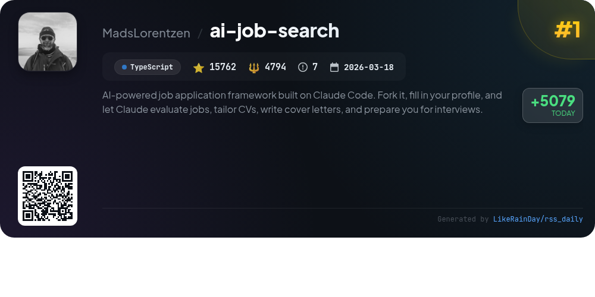
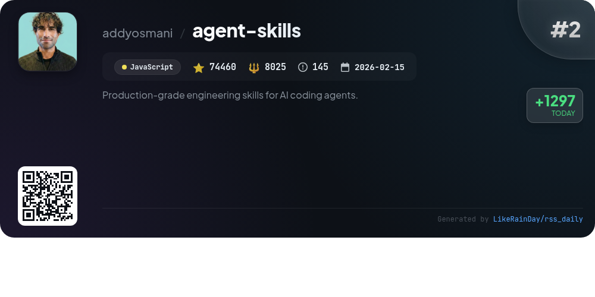
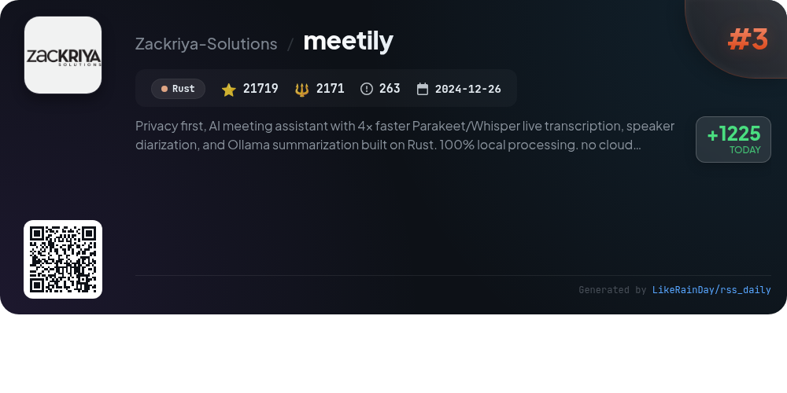
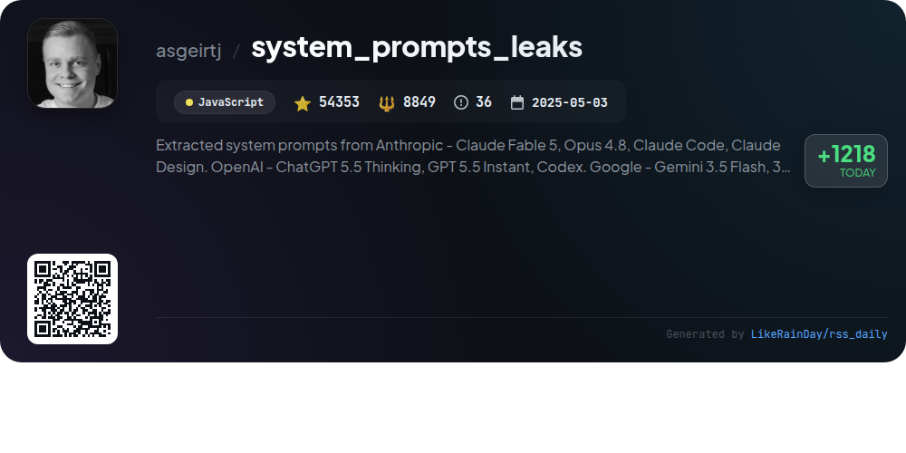
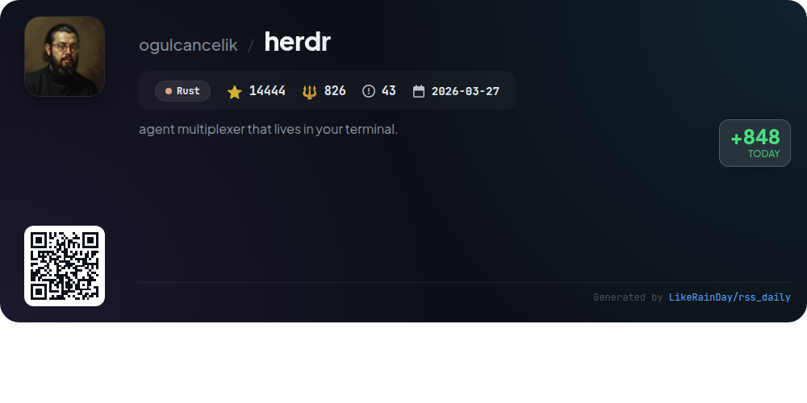
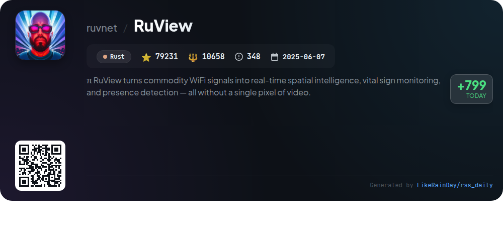
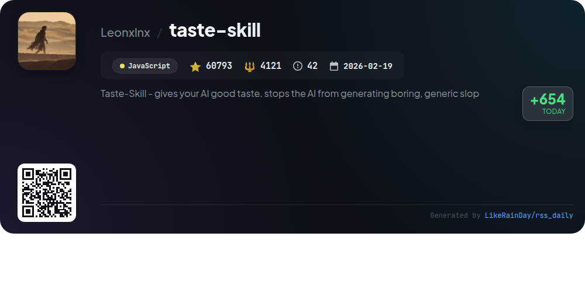
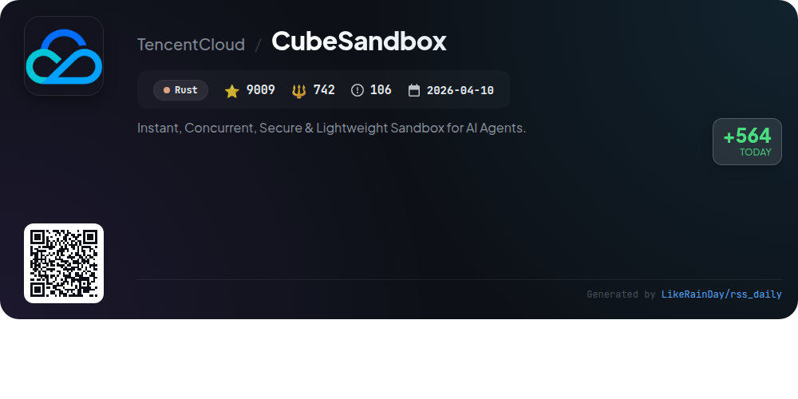
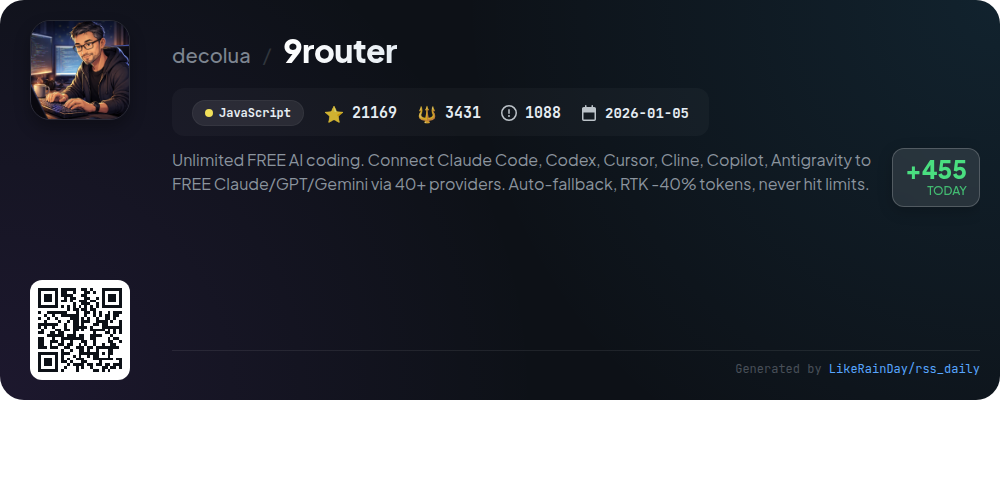
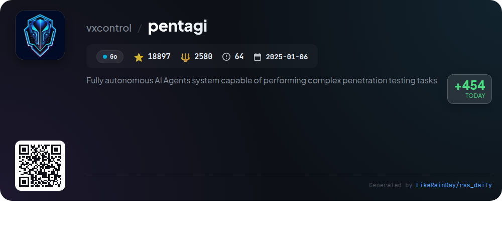

# 📊 🌟 GitHub Trending Daily - 2026-07-09

> > 📅 Daily Picks of GitHub Trending Repositories | Powered by Smart Algorithms

## 📋 Overview

**10** Projects | **369837** ⭐ | **46197** 🍴

**Top Languages:** `Rust` (4) · `JavaScript` (4) · `TypeScript` (1)

**Updated:** 2026-07-09 03:55 UTC

**Categories:**

- 🌟 Daily Top 10 (10 items)

---

## 🌟 Daily Top 10

### 1. [ai-job-search](https://github.com/MadsLorentzen/ai-job-search)

> 🤖 **Why Recommend**  
> *The ai-job-search project is an AI-driven job application framework utilizing Claude Code. Users can fork the project, input their profiles, and leverage Claude to evaluate job postings, customize CVs, craft cover letters, and prepare for interviews. Key features include a structured workflow for job fit evaluation, tailored application documents in LaTeX, and a reviewer agent for critique. The tool is adaptable for various job markets, initially designed for Denmark, and incorporates career guidance best practices, making job seeking efficient and tailored.*

- ⭐ 15762 stars
- 💻 TypeScript
- 📅 Updated: 2026-07-09

### 2. [agent-skills](https://github.com/addyosmani/agent-skills)

> 🤖 **Why Recommend**  
> *Agent Skills is a production-grade toolkit designed to enhance AI coding agents with structured engineering workflows. It features 24 skills that guide agents through the software development lifecycle—from defining specifications to shipping production-ready code. Key highlights include automated skill activation based on user actions, a command interface for seamless integration with various agents, and a focus on best practices derived from Google's engineering culture. The project encapsulates vital principles such as test-driven development, code reviews, and performance optimization, ensuring high-quality output with minimal manual intervention.*

- ⭐ 74460 stars
- 💻 JavaScript
- 📅 Updated: 2026-07-09

### 3. [meetily](https://github.com/Zackriya-Solutions/meetily)

> 🤖 **Why Recommend**  
> *Meetily is a privacy-first AI meeting assistant designed for macOS and Windows, offering real-time transcription, speaker diarization, and AI-generated summaries, all processed locally with no cloud dependency. Built with Rust, it supports Ollama, Claude, and other AI models while ensuring complete data sovereignty. Key features include multi-platform support, open-source accessibility, and GPU acceleration for enhanced performance. Meetily PRO offers advanced capabilities like custom summaries and auto-meeting detection. Ideal for professionals and enterprises prioritizing privacy and control over their meeting data.*

- ⭐ 21719 stars
- 💻 Rust
- 📅 Updated: 2026-07-09

### 4. [system_prompts_leaks](https://github.com/asgeirtj/system_prompts_leaks)

> 🤖 **Why Recommend**  
> *The "system_prompts_leaks" GitHub repository compiles extracted system prompts from prominent AI models, including Anthropic's Claude series, OpenAI's ChatGPT and Codex, Google's Gemini, and xAI's Grok. With over 54,000 stars, it serves as a valuable resource for understanding AI behavior. Key features include regularly updated prompts, detailed model comparisons, and integration documentation for various applications like GitHub Copilot and VS Code. This project helps users explore and leverage the underlying instructions driving contemporary AI chatbots.*

- ⭐ 54353 stars
- 💻 JavaScript
- 📅 Updated: 2026-07-09

### 5. [herdr](https://github.com/ogulcancelik/herdr)

> 🤖 **Why Recommend**  
> *Herdr is a powerful agent multiplexer designed for terminal use, built in Rust and boasting over 14,000 stars on GitHub. Key features include real-time visibility of agent statuses, persistent sessions that survive restarts, and a pure socket API for agent interaction. Users can leverage both keyboard and mouse controls, and extend functionality through plugins. Herdr is lightweight, requiring only a single Rust binary, and supports easy installation via curl or Homebrew. Comprehensive documentation and a marketplace for plugins enhance user experience.*

- ⭐ 14444 stars
- 💻 Rust
- 📅 Updated: 2026-07-09

### 6. [RuView](https://github.com/ruvnet/RuView)

> 🤖 **Why Recommend**  
> *RuView transforms commodity WiFi signals into real-time spatial intelligence, enabling presence detection, vital sign monitoring, and activity recognition without cameras or wearables. Key features include through-wall sensing, vital sign detection (breathing and heart rate), and activity tracking, all powered by low-cost ESP32 hardware. It integrates seamlessly with major smart home ecosystems like Home Assistant, Apple Home, Google Home, and Alexa. Built on Rust, RuView ensures privacy and edge processing, making it suitable for various applications in healthcare, security, and smart home automation.*

- ⭐ 79231 stars
- 💻 Rust
- 📅 Updated: 2026-07-09

### 7. [taste-skill](https://github.com/Leonxlnx/taste-skill)

> 🤖 **Why Recommend**  
> *Taste Skill is an innovative JavaScript framework designed to enhance AI-generated front-end interfaces, preventing bland outputs. With 60,793 stars, it offers a range of portable Agent Skills that improve layout, typography, and motion, ensuring visually appealing designs. Key features include multiple design variants, image generation skills for mockups, and specialized skills like redesigning existing projects and enforcing output quality. The framework is compatible with various coding agents and frameworks, streamlining the process of creating high-quality user interfaces.*

- ⭐ 60793 stars
- 💻 JavaScript
- 📅 Updated: 2026-07-09

### 8. [CubeSandbox](https://github.com/TencentCloud/CubeSandbox)

> 🤖 **Why Recommend**  
> *CubeSandbox is a high-performance, secure sandbox service for AI agents, built with RustVMM and KVM. It offers instant deployment with sub-60ms startup time and less than 5MB memory overhead, enabling high-density operations. Key features include hardware-level isolation, E2B SDK compatibility, a web console for management, automatic sandbox pause/resume, and a credential vault for secure API access. Additionally, it supports event-level snapshots for rollback and cloning. With over 9,000 stars on GitHub, CubeSandbox is a leading open-source solution for scalable AI workloads.*

- ⭐ 9009 stars
- 💻 Rust
- 📅 Updated: 2026-07-09

### 9. [9router](https://github.com/decolua/9router)

> 🤖 **Why Recommend**  
> *9Router is an innovative AI coding router that connects various coding tools (like Claude Code, Codex, and Copilot) to over 40 AI providers, enabling unlimited free AI coding with auto-fallback and 20-40% token savings. Key features include RTK Token Saver for compression, real-time quota tracking, multi-account support, and seamless format translation. It supports both subscription and free models, ensuring users never hit limits or incur high costs. With a user-friendly dashboard, 9Router optimizes coding efficiency while minimizing expenses, making it ideal for developers seeking reliable AI assistance.*

- ⭐ 21169 stars
- 💻 JavaScript
- 📅 Updated: 2026-07-09

### 10. [pentagi](https://github.com/vxcontrol/pentagi)

> 🤖 **Why Recommend**  
> *PentAGI is a fully autonomous AI agent system designed for comprehensive penetration testing, leveraging advanced LLMs to automate complex security assessments. Key features include a suite of 20+ professional security tools, multi-agent collaboration, detailed reporting, and integration with external search systems. It operates within isolated Docker environments, ensuring secure execution. With a robust API and customizable LLM provider configurations, PentAGI supports various models, including OpenAI and Anthropic. Notable services include advanced context management, knowledge graph integration, and extensive monitoring capabilities through Grafana and Langfuse.*

- ⭐ 18897 stars
- 💻 Go
- 📅 Updated: 2026-07-09

---

## 📡 RSS Subscription

Subscribe via RSS to get daily trending updates:

- 🔔 [RSS XML] (../../daily-top.xml)
- 🔔 [Daily Report] (../../GITHUB_TODAY.md)
- 🔔 [Daily Top 10](../../daily-top.xml)

---

*⚡ Powered by Smart Trending Algorithm | Generated at 2026-07-09 03:55:38 UTC
