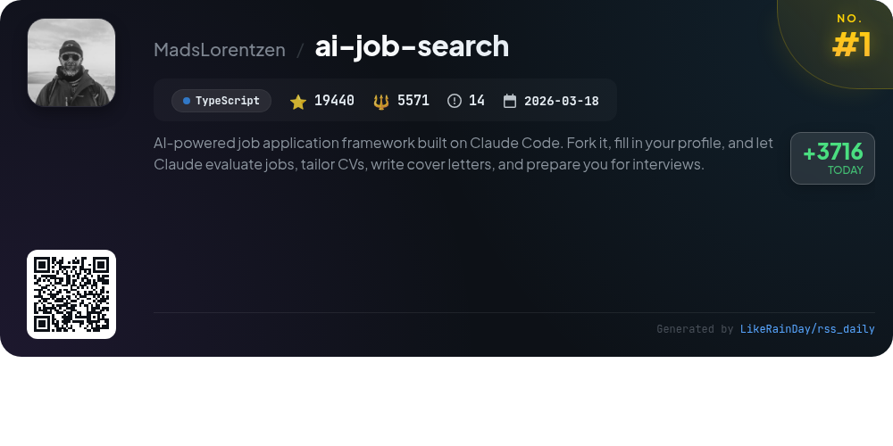
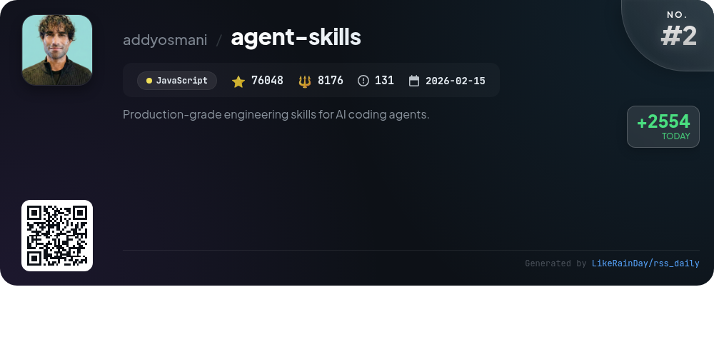
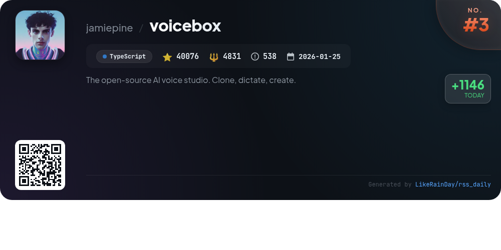
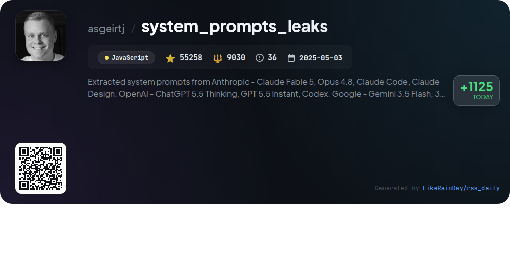
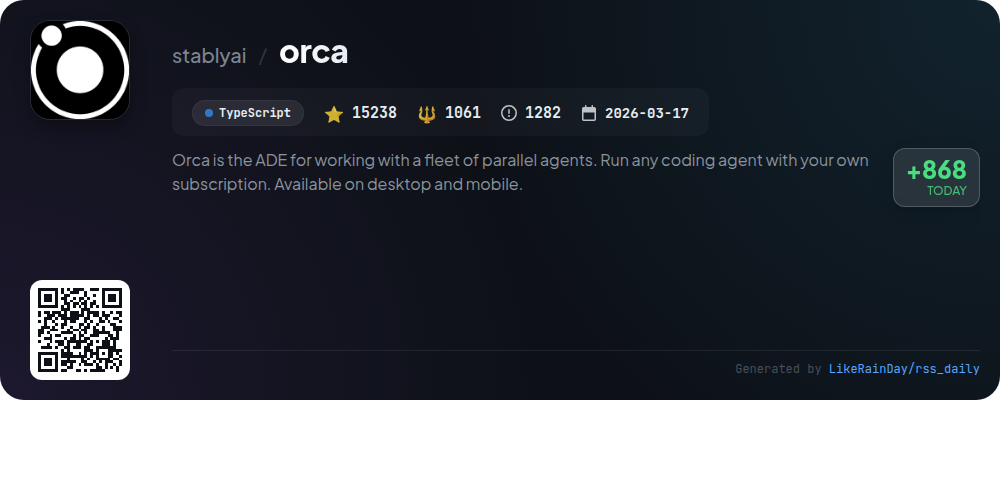
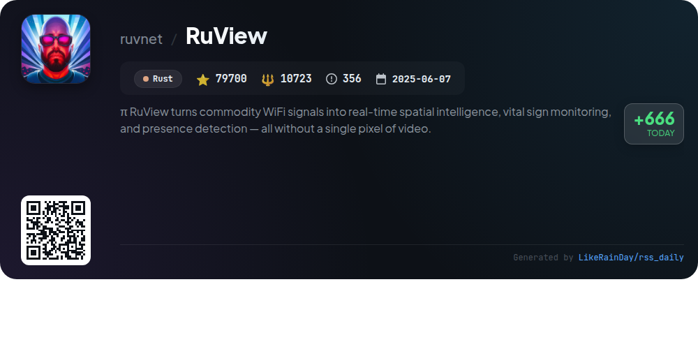
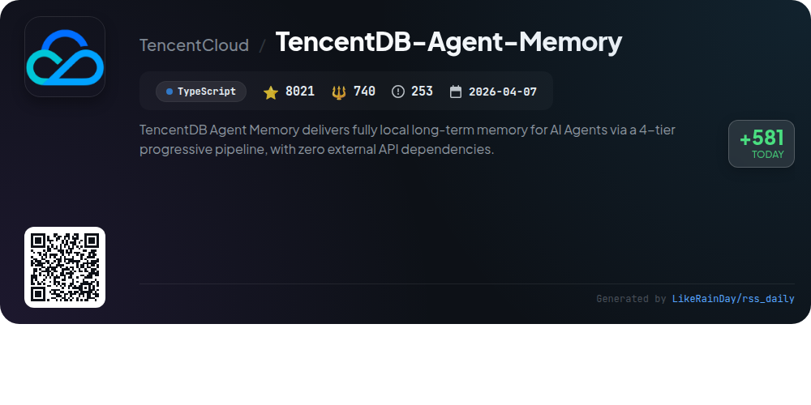
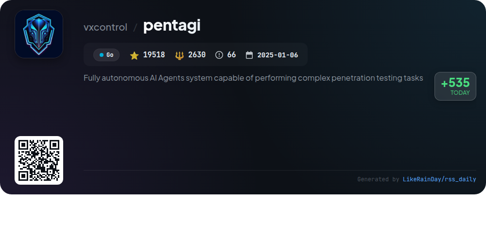
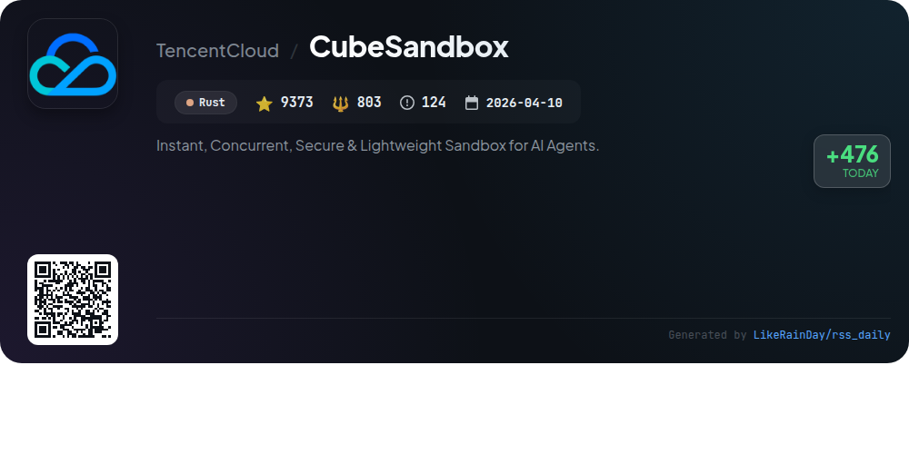
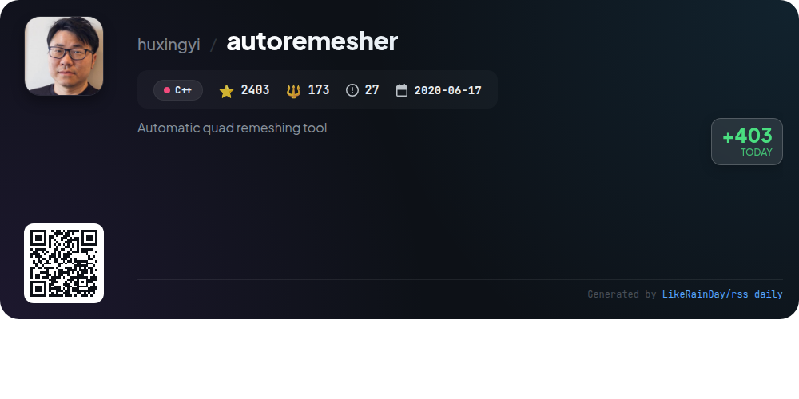

# 📊 🌟 GitHub Trending Daily - 2026-07-10

> > 📅 Daily Picks of GitHub Trending Repositories | Powered by Smart Algorithms

## 📋 Overview

**10** Projects | **325075** ⭐ | **43738** 🍴

**Top Languages:** `TypeScript` (4) · `Rust` (2) · `JavaScript` (2)

**Updated:** 2026-07-10 03:57 UTC

**Categories:**

- 🌟 Daily Top 10 (10 items)

---

## 🌟 Daily Top 10

### 1. [ai-job-search](https://github.com/MadsLorentzen/ai-job-search)

> 🤖 **Why Recommend**  
> *The AI Job Search project is an open-source framework leveraging Claude Code to streamline job applications. Key features include automated job evaluation, tailored CV and cover letter drafting, and interview preparation. Users can customize their profiles, search job portals (initially focused on Denmark), and apply with a structured workflow that includes ATS verification. The framework supports skill gap analysis and template customization, making it adaptable for various job markets. With 19,440 stars, it offers a robust tool for job seekers to enhance their application process efficiently.*

- ⭐ 19440 stars
- 💻 TypeScript
- 📅 Updated: 2026-07-10

### 2. [agent-skills](https://github.com/addyosmani/agent-skills)

> 🤖 **Why Recommend**  
> *Agent Skills provides production-grade engineering workflows for AI coding agents, enhancing software development with structured processes and quality gates. With 24 skills encompassing the entire development lifecycle—from defining and planning to building, verifying, reviewing, and shipping—this JavaScript project empowers agents to adhere to best practices consistently. Key features include automated task handling, integration with various coding tools, and pre-configured agent personas for specialized reviews. Ideal for achieving production-quality outcomes, Agent Skills encapsulates rigorous engineering principles from industry leaders.*

- ⭐ 76048 stars
- 💻 JavaScript
- 📅 Updated: 2026-07-10

### 3. [voicebox](https://github.com/jamiepine/voicebox)

> 🤖 **Why Recommend**  
> *Voicebox is an open-source AI voice studio that allows users to clone voices, generate speech in 23 languages, and dictate into any application. Key features include seven TTS engines, voice cloning, expressive speech with paralinguistic tags, and a multi-track stories editor. It operates entirely locally, ensuring complete privacy of voice data. Voicebox supports global dictation, agent voice output, and offers an API for integration. Built with Tauri for native performance, it runs on macOS, Windows, and Linux, making it a versatile tool for voice I/O tasks.*

- ⭐ 40076 stars
- 💻 TypeScript
- 📅 Updated: 2026-07-10

### 4. [system_prompts_leaks](https://github.com/asgeirtj/system_prompts_leaks)

> 🤖 **Why Recommend**  
> *The "system_prompts_leaks" GitHub project documents extracted system prompts from major AI chatbots, including Anthropic's Claude, OpenAI's ChatGPT, Google’s Gemini, and xAI's Grok. With over 55,000 stars, it serves as a valuable resource for understanding the underlying instructions of various AI models. Key features include regular updates on new prompts, detailed version comparisons, and links to official system prompts. The project aims to enhance transparency in AI by revealing hidden operational guidelines, making it a significant tool for researchers and developers alike.*

- ⭐ 55258 stars
- 💻 JavaScript
- 📅 Updated: 2026-07-10

### 5. [orca](https://github.com/stablyai/orca)

> 🤖 **Why Recommend**  
> *Orca is an advanced development environment designed for managing a fleet of parallel AI agents, enabling users to run multiple coding agents such as Codex, ClaudeCode, and OpenCode in isolated worktrees. Key features include mobile companion apps for iOS and Android, terminal splits, design mode for UI interaction, and seamless GitHub integration. Users can monitor agent performance, annotate AI-generated diffs, and employ SSH for remote operations. With support for any CLI agent and robust scripting capabilities, Orca enhances productivity for developers across desktop and mobile platforms.*

- ⭐ 15238 stars
- 💻 TypeScript
- 📅 Updated: 2026-07-10

### 6. [RuView](https://github.com/ruvnet/RuView)

> 🤖 **Why Recommend**  
> *RuView transforms commodity WiFi signals into real-time spatial intelligence, enabling presence detection, vital sign monitoring, and activity recognition without cameras or wearables. It operates via low-cost ESP32 sensors, integrating seamlessly with smart home ecosystems like Home Assistant, Apple Home, and Google Home. Key features include through-wall sensing, breathing and heart rate measurement, and environmental mapping. Built for edge applications, RuView uses a self-learning AI model, ensuring privacy and efficiency. With over 79,700 stars on GitHub, it represents a groundbreaking approach to contactless monitoring.*

- ⭐ 79700 stars
- 💻 Rust
- 📅 Updated: 2026-07-10

### 7. [TencentDB-Agent-Memory](https://github.com/TencentCloud/TencentDB-Agent-Memory)

> 🤖 **Why Recommend**  
> *TencentDB-Agent-Memory provides a robust long-term memory solution for AI agents through a 4-tier pipeline, eliminating external API dependencies. Key features include symbolic short-term memory, which reduces token usage by up to 61.38%, and layered long-term memory that organizes fragmented conversations into structured personas. The system enhances recall accuracy significantly, with improvements from 48% to 76%. It supports integration with OpenClaw and Hermes, offering local storage solutions and hybrid retrieval capabilities, making it a production-ready tool for efficient AI memory management.*

- ⭐ 8021 stars
- 💻 TypeScript
- 📅 Updated: 2026-07-10

### 8. [pentagi](https://github.com/vxcontrol/pentagi)

> 🤖 **Why Recommend**  
> *PentAGI is an innovative, fully autonomous AI agents system designed for complex penetration testing tasks. Key features include a sandboxed execution environment, integration of 20+ professional tools, advanced monitoring, detailed reporting, and a smart memory system for knowledge retention. Users benefit from a modular architecture with microservices, comprehensive REST and GraphQL APIs, and support for multiple LLM providers like OpenAI, Anthropic, and Google AI. With built-in community support, PentAGI empowers security professionals to conduct effective and efficient assessments.*

- ⭐ 19518 stars
- 💻 Go
- 📅 Updated: 2026-07-10

### 9. [CubeSandbox](https://github.com/TencentCloud/CubeSandbox)

> 🤖 **Why Recommend**  
> *CubeSandbox is a high-performance, lightweight sandbox service for AI agents, built with RustVMM and KVM. It features sub-60ms startup times, hardware-level isolation, and supports high-density deployments, allowing thousands of agents per node with minimal memory overhead. Key highlights include seamless E2B SDK compatibility, credential vaults for secure API access, and advanced snapshot capabilities for cloning and rollback. The service also offers a web console for management, auto-pause for cost optimization, and robust egress control, making it ideal for secure AI workloads.*

- ⭐ 9373 stars
- 💻 Rust
- 📅 Updated: 2026-07-10

### 10. [autoremesher](https://github.com/huxingyi/autoremesher)

> 🤖 **Why Recommend**  
> *Automatic quad remeshing tool. popular project, actively maintained, recently updated*

- ⭐ 2403 stars
- 🍴 173 forks
- 💻 C++
- 📅 Updated: 2026-07-10

---

## 📡 RSS Subscription

Subscribe via RSS to get daily trending updates:

- 🔔 [RSS XML] (../../daily-top.xml)
- 🔔 [Daily Report] (../../GITHUB_TODAY.md)
- 🔔 [Daily Top 10](../../daily-top.xml)

---

*⚡ Powered by Smart Trending Algorithm | Generated at 2026-07-10 03:57:00 UTC
