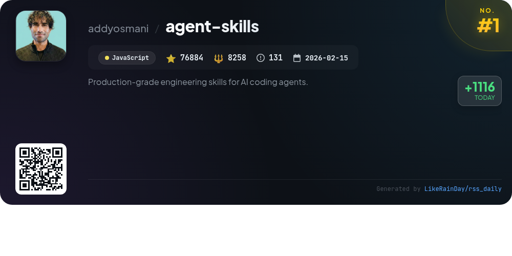
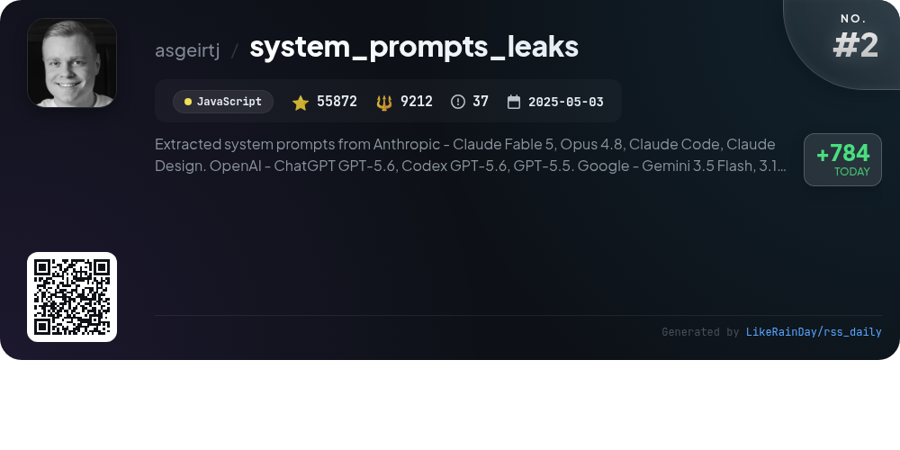
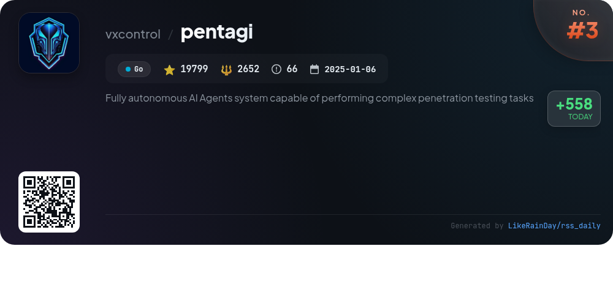
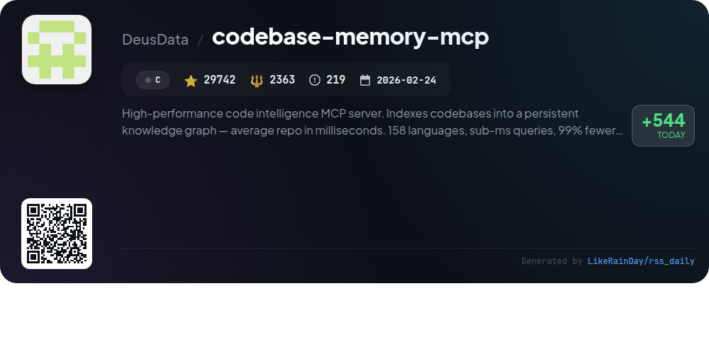
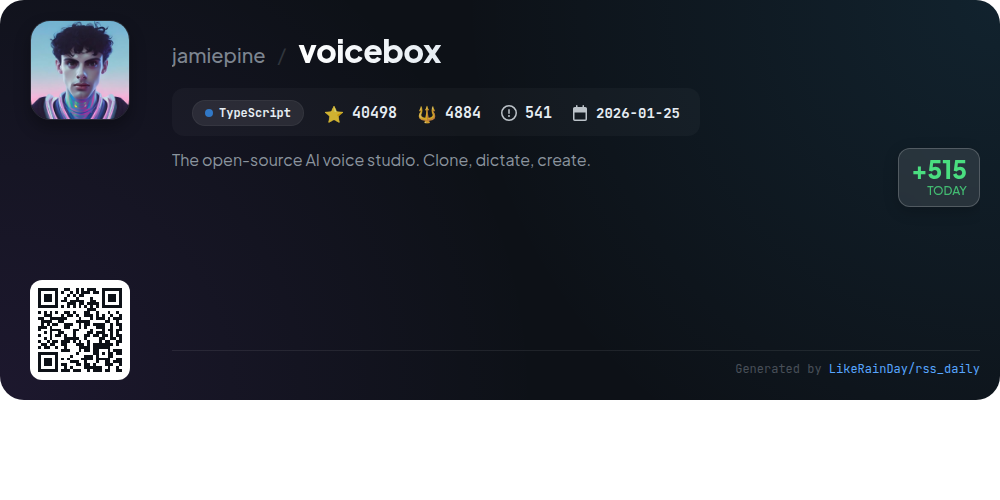
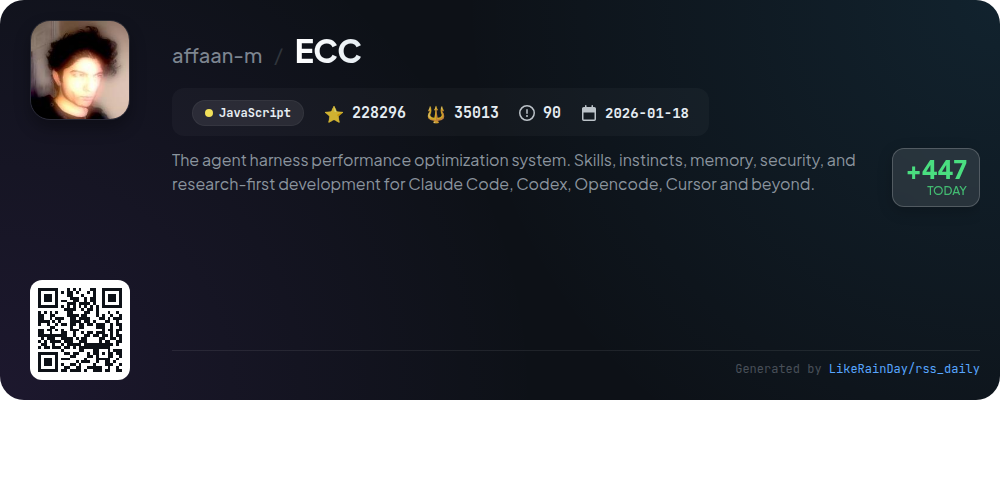
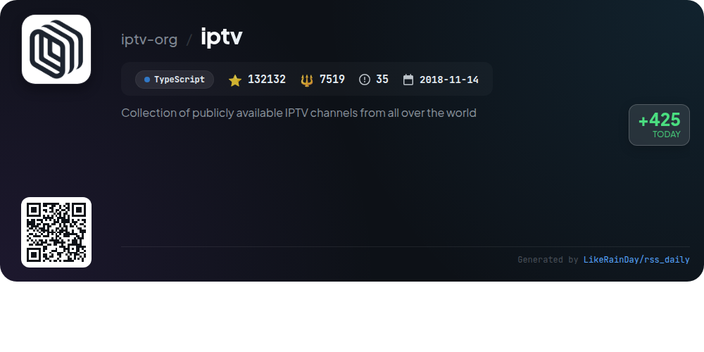
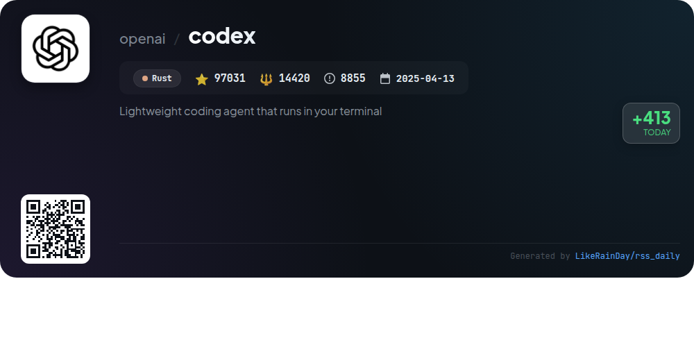
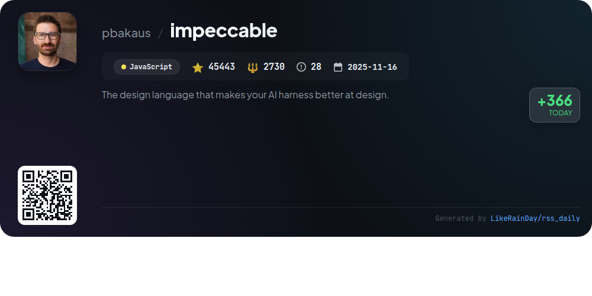
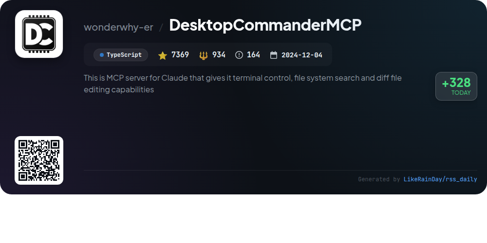

# 📊 🌟 GitHub Trending Daily - 2026-07-11

> > 📅 每日精选 GitHub 热门仓库 | 基于智能算法推荐

## 📋 Overview

**10** 个项目 | **733066** ⭐ | **87985** 🍴

**热门语言:** `JavaScript` (4) · `TypeScript` (3) · `C` (1)

**更新时间:** 2026-07-11 03:22 UTC

**分类分布:**

- 🌟 每日 Top 10 精选 (10 项)

---

## 🌟 每日 Top 10 精选

### 1. [agent-skills](https://github.com/addyosmani/agent-skills)

> 🤖 **推荐理由**  
> *Agent Skills is a JavaScript project designed to enhance AI coding agents with production-grade engineering workflows. It features 24 structured skills covering the software development lifecycle, from defining and planning to building, verifying, reviewing, and shipping code. Key highlights include automated task execution, tailored commands for various development phases, and the incorporation of best practices from Google's engineering culture. The project supports integration with multiple AI agents, ensuring consistent adherence to quality standards and efficient development processes.*

- ⭐ 76884 stars
- 💻 JavaScript
- 📅 Updated: 2026-07-11

### 2. [system_prompts_leaks](https://github.com/asgeirtj/system_prompts_leaks)

> 🤖 **推荐理由**  
> *The "system_prompts_leaks" GitHub project serves as a comprehensive repository of extracted system prompts from various AI models, including Anthropic's Claude, OpenAI's ChatGPT, Google’s Gemini, and more. With over 55,000 stars, it documents prompt instructions for numerous chatbots, ensuring regular updates on new versions and features. Key highlights include detailed prompts for models like GPT-5.6, Claude Opus 4.8, and Gemini 3.5 Flash. This resource is invaluable for developers and researchers seeking insights into AI behavior and capabilities.*

- ⭐ 55872 stars
- 💻 JavaScript
- 📅 Updated: 2026-07-11

### 3. [pentagi](https://github.com/vxcontrol/pentagi)

> 🤖 **推荐理由**  
> *PentAGI is a cutting-edge autonomous AI agent system for advanced penetration testing, built on Go, with 19,799 stars on GitHub. Key features include a secure Docker-based environment, 20+ professional pentesting tools, a smart memory system for knowledge retention, and advanced agent supervision for efficient task execution. It integrates with various LLM providers (OpenAI, Anthropic, Google AI, AWS Bedrock) and offers extensive APIs and a modern web UI for management. The system also supports monitoring through Grafana and Langfuse, making it a comprehensive solution for security professionals.*

- ⭐ 19799 stars
- 💻 Go
- 📅 Updated: 2026-07-11

### 4. [codebase-memory-mcp](https://github.com/DeusData/codebase-memory-mcp)

> 🤖 **推荐理由**  
> *High-performance code intelligence MCP server. Indexes codebases into a persistent knowledge graph — average repo in milliseconds. 158 languages, su. popular project, actively maintained, recently updated*

- ⭐ 29742 stars
- 🍴 2363 forks
- 💻 C
- 📅 Updated: 2026-07-11

### 5. [voicebox](https://github.com/jamiepine/voicebox)

> 🤖 **推荐理由**  
> *Voicebox is an open-source AI voice studio that enables users to clone voices, generate speech, and dictate across applications while ensuring complete privacy. Key features include seven TTS engines, voice cloning from audio samples, support for 23 languages, and a multi-track editor for narratives. Its local-first design enhances performance and security, while an API facilitates integration with other applications. Voicebox also offers global dictation capabilities, emotional speech synthesis, and personality-driven voice profiles, making it a versatile tool for voice output and input.*

- ⭐ 40498 stars
- 💻 TypeScript
- 📅 Updated: 2026-07-11

### 6. [ECC](https://github.com/affaan-m/ECC)

> 🤖 **推荐理由**  
> *ECC is a powerful performance optimization system designed for AI agent workflows, supporting platforms like Claude Code, Codex, and Cursor. Key features include skills management, instinct-based learning, memory optimization, and security scanning through tools like AgentShield. With over 67 specialized agents and 278 skills, ECC facilitates seamless integration and automation across various coding environments. It empowers users with advanced capabilities, such as multi-agent orchestration and a comprehensive security audit framework, enhancing productivity and code quality.*

- ⭐ 228296 stars
- 💻 JavaScript
- 📅 Updated: 2026-07-11

### 7. [iptv](https://github.com/iptv-org/iptv)

> 🤖 **推荐理由**  
> *IPTV is a comprehensive collection of publicly available IPTV channels from around the globe, built in TypeScript and boasting over 132,000 stars on GitHub. Key features include easy playlist access, support for various video players, and an Electronic Program Guide (EPG) for most channels. The repository provides a centralized database of channel data and an API for extended functionality. Users can contribute, engage in discussions, and access a wealth of IPTV-related resources. The project emphasizes legal considerations, ensuring all links are user-submitted and publicly available.*

- ⭐ 132132 stars
- 💻 TypeScript
- 📅 Updated: 2026-07-11

### 8. [codex](https://github.com/openai/codex)

> 🤖 **推荐理由**  
> *Codex is a lightweight coding agent from OpenAI, designed to run locally in your terminal. It allows seamless integration with popular code editors like VS Code and offers a desktop app experience. Users can install Codex using simple commands for Mac, Linux, or Windows, as well as through npm and Homebrew. It supports ChatGPT account sign-in for enhanced functionality and can be accessed via an API key. With over 97,000 stars on GitHub, Codex aims to streamline coding tasks and improve developer productivity. Comprehensive documentation is available for users and contributors.*

- ⭐ 97031 stars
- 💻 Rust
- 📅 Updated: 2026-07-11

### 9. [impeccable](https://github.com/pbakaus/impeccable)

> 🤖 **推荐理由**  
> *Impeccable is a design language for AI coding agents, enabling better frontend design through 23 commands and 46 deterministic rules. It simplifies setup with `/impeccable init`, providing context for projects. Key features include a shared design vocabulary, live browser iteration, and commands for crafting, critiquing, and auditing designs. Impeccable supports multiple AI tools like Claude Code and GitHub Copilot, ensuring quality by detecting common design issues. For installation, simply run `npx impeccable install` and explore full documentation at impeccable.style.*

- ⭐ 45443 stars
- 💻 JavaScript
- 📅 Updated: 2026-07-11

### 10. [DesktopCommanderMCP](https://github.com/wonderwhy-er/DesktopCommanderMCP)

> 🤖 **推荐理由**  
> *This is MCP server for Claude that gives it terminal control, file system search and diff file editing capabilities. popular project, actively maintained, recently updated*

- ⭐ 7369 stars
- 🍴 934 forks
- 💻 TypeScript
- 📅 Updated: 2026-07-11

---

## 📡 RSS订阅

通过 RSS 订阅，第一时间获取每日精选项目：

- 🔔 [RSS 订阅源] (../../daily-top.xml)
- 🔔 [每日简报] (../../GITHUB_TODAY_CN.md)
- 🔔 [每日 Top 10 精选](../../daily-top.xml)

---

*⚡ Powered by Smart Trending Algorithm | Generated at 2026-07-11 03:22:05 UTC
