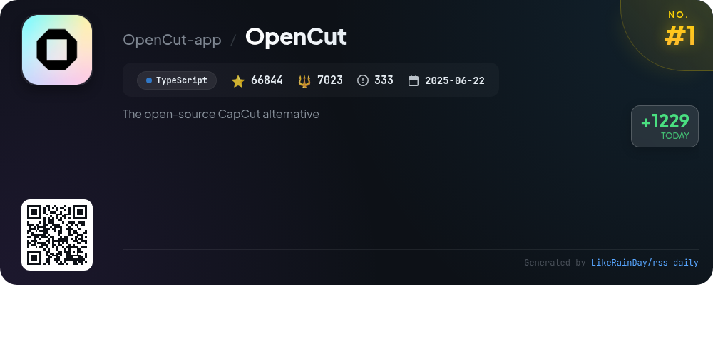
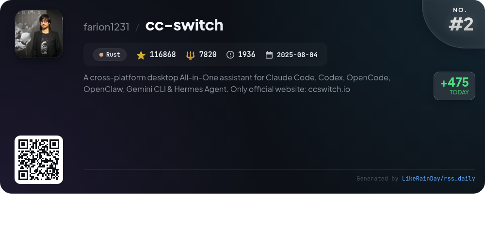
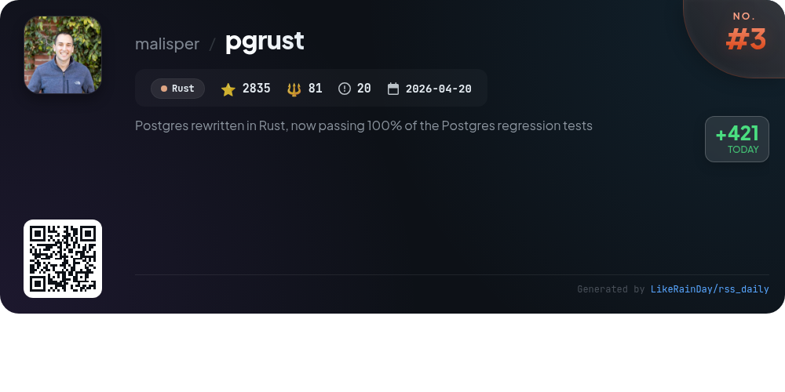
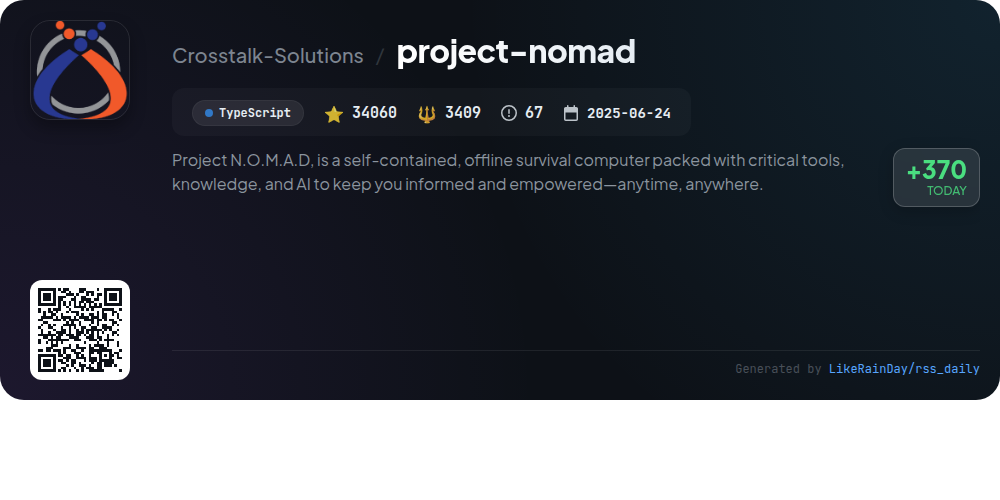
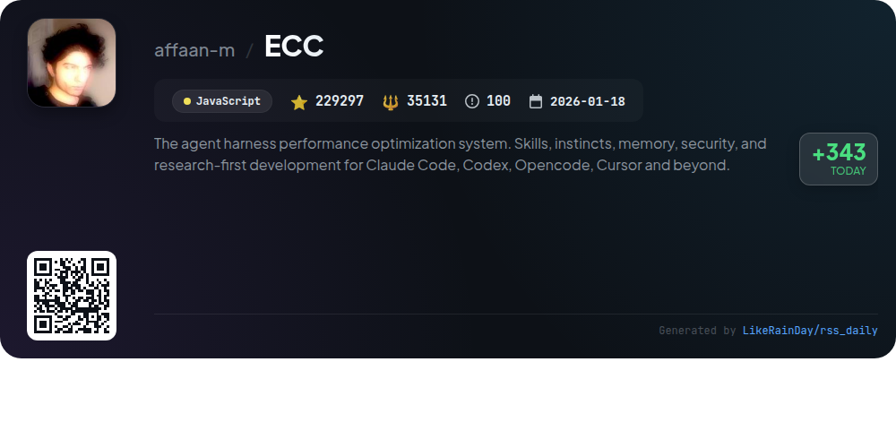
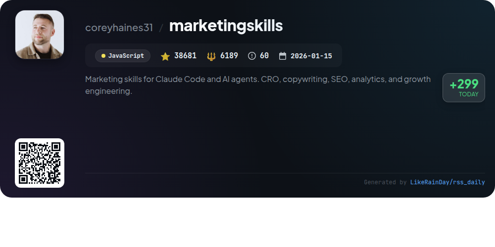
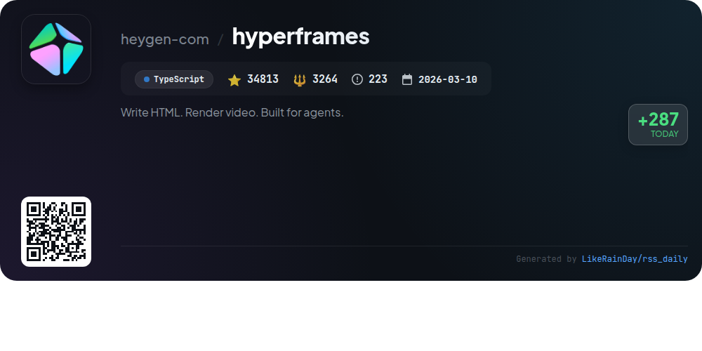
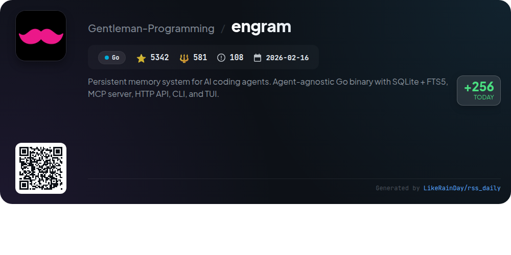
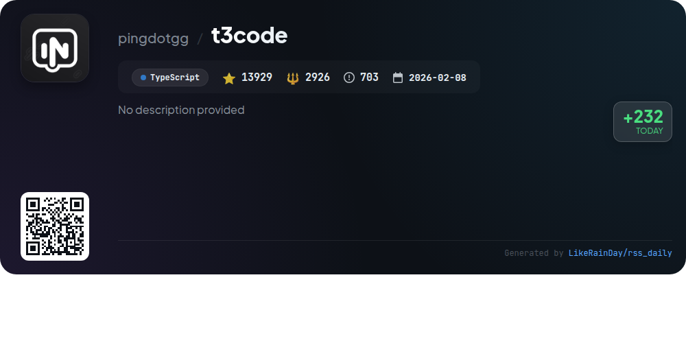
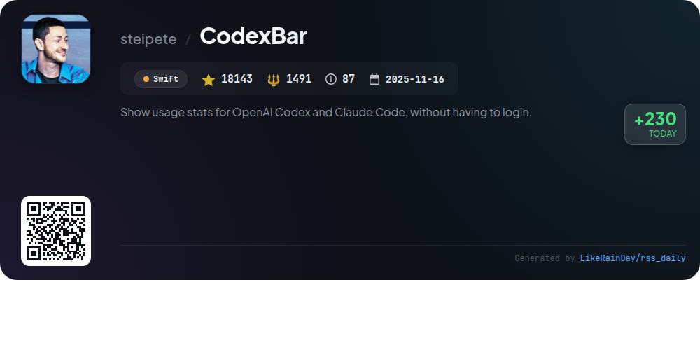

# 📊 🌟 GitHub Trending Daily - 2026-07-14

> > 📅 每日精选 GitHub 热门仓库 | 基于智能算法推荐

## 📋 Overview

**10** 个项目 | **560812** ⭐ | **67915** 🍴

**热门语言:** `TypeScript` (4) · `JavaScript` (2) · `Rust` (2)

**更新时间:** 2026-07-14 02:58 UTC

**分类分布:**

- 🌟 每日 Top 10 精选 (10 项)

---

## 🌟 每日 Top 10 精选

### 1. [OpenCut](https://github.com/OpenCut-app/OpenCut)

> 🤖 **推荐理由**  
> *OpenCut is an open-source, free video editor designed for web, desktop, and mobile platforms, boasting over 66,000 stars on GitHub. It features a plugin-first architecture for third-party extensions, an Editor API, and a core built in Rust for efficiency. Upcoming enhancements include a multi-client processing server for AI agents, headless mode for automation, and an in-editor scripting tab. While a major rewrite is underway, the classic version remains available at opencut.app. Join the community on Discord for updates and discussions.*

- ⭐ 66844 stars
- 💻 TypeScript
- 📅 Updated: 2026-07-14

### 2. [cc-switch](https://github.com/farion1231/cc-switch)

> 🤖 **推荐理由**  
> *CC Switch is a cross-platform desktop assistant for managing multiple AI tools, including Claude Code, Codex, Gemini CLI, OpenCode, and Hermes. Key features include a unified interface for switching between over 50 provider presets, real-time MCP and Skills management, and cloud sync capabilities. Users benefit from instant provider switching via the system tray, detailed usage tracking, and built-in utilities for configuration management. The app is built with Rust and Tauri, ensuring reliability across Windows, macOS, and Linux, making AI-assisted coding seamless and efficient. Visit ccswitch.io for more details.*

- ⭐ 116868 stars
- 💻 Rust
- 📅 Updated: 2026-07-14

### 3. [pgrust](https://github.com/malisper/pgrust)

> 🤖 **推荐理由**  
> *Postgres rewritten in Rust, now passing 100% of the Postgres regression tests. popular project, recently updated*

- ⭐ 2835 stars
- 🍴 81 forks
- 💻 Rust
- 📅 Updated: 2026-07-14

### 4. [project-nomad](https://github.com/Crosstalk-Solutions/project-nomad)

> 🤖 **推荐理由**  
> *Project N.O.M.A.D. is an offline-first survival computer offering essential tools and AI for knowledge and education, designed for any Debian-based OS. Key features include a local AI chat with semantic search, an offline information library (Wikipedia, medical references), education platform with Khan Academy courses, offline maps, data analysis tools, and local note-taking. It provides a user-friendly management UI, automatic updates, and a supply depot for additional apps. With a focus on privacy, it operates without telemetry, ensuring a secure experience.*

- ⭐ 34060 stars
- 💻 TypeScript
- 📅 Updated: 2026-07-14

### 5. [ECC](https://github.com/affaan-m/ECC)

> 🤖 **推荐理由**  
> *ECC is a robust agent harness performance optimization system that enhances coding workflows across platforms like Codex, Claude Code, and Cursor. Key features include skills, instincts, memory optimization, security scanning, and continuous learning. With over 229,000 stars, it supports 67 agents and 278 skills for diverse tasks such as code review, debugging, and project planning. ECC also offers security auditing through AgentShield and a user-friendly dashboard for component management. This MIT-licensed tool is designed for seamless integration and efficient resource management in AI-driven development environments.*

- ⭐ 229297 stars
- 💻 JavaScript
- 📅 Updated: 2026-07-14

### 6. [marketingskills](https://github.com/coreyhaines31/marketingskills)

> 🤖 **推荐理由**  
> *The "marketingskills" project offers a collection of AI agent skills focused on marketing tasks, designed for technical marketers and founders. Key features include skills for conversion optimization (CRO), copywriting, SEO, analytics, and growth engineering, compatible with agents like Claude Code and OpenAI Codex. With 38,681 stars on GitHub, it provides a structured framework for AI to assist with various marketing functions through interconnected markdown skills. Additional services include hands-on help via Conversion Factory and training resources for mastering AI in marketing.*

- ⭐ 38681 stars
- 💻 JavaScript
- 📅 Updated: 2026-07-14

### 7. [hyperframes](https://github.com/heygen-com/hyperframes)

> 🤖 **推荐理由**  
> *HyperFrames is an open-source framework that converts HTML, CSS, and media into deterministic MP4 videos, designed for use with AI coding agents. Key features include a CLI for local use, 20 integrated skills for various video workflows, and support for seekable animations via popular libraries like GSAP and Lottie. Users can create product launch videos, explainer videos, and more without requiring React. With a focus on HTML-native authoring and deterministic rendering, HyperFrames streamlines video production while being community-driven and free of per-render fees.*

- ⭐ 34813 stars
- 💻 TypeScript
- 📅 Updated: 2026-07-14

### 8. [engram](https://github.com/Gentleman-Programming/engram)

> 🤖 **推荐理由**  
> *Engram is a persistent memory system designed for AI coding agents, offering an agent-agnostic Go binary with SQLite and FTS5 full-text search capabilities. It features a CLI, HTTP API, MCP server, and an interactive TUI, enabling seamless integration with various agents like Claude Code and VS Code. Key functionalities include memory saving, search, conflict detection, and cloud synchronization for collaborative projects. Engram provides a simple, dependency-free setup, ensuring efficient memory management for AI coding tasks, both locally and in the cloud.*

- ⭐ 5342 stars
- 💻 Go
- 📅 Updated: 2026-07-14

### 9. [t3code](https://github.com/pingdotgg/t3code)

> 🤖 **推荐理由**  
> *T3 Code is a minimal web GUI for coding agents, currently supporting Codex, Claude, Cursor, and OpenCode. With over 13,000 stars, it allows users to quickly integrate and authenticate with various coding providers. Users can run T3 Code without installation via `npx`, or install desktop applications for Windows, macOS, and Arch Linux. The project is in early development, with ongoing updates and features expected. Documentation includes quick-start guides, architecture overviews, and provider-specific instructions. Join the community on Discord for support.*

- ⭐ 13929 stars
- 💻 TypeScript
- 📅 Updated: 2026-07-14

### 10. [CodexBar](https://github.com/steipete/CodexBar)

> 🤖 **推荐理由**  
> *CodexBar is a macOS 14+ menu bar app that provides real-time usage stats for various AI coding providers like OpenAI Codex, Claude, and many others, without requiring login. It features multi-provider support with usage meters, reset countdowns, credit balances, and incident status polling. Users can track session limits, costs, and billing summaries while maintaining privacy by reusing existing sessions. Additionally, it offers a CLI for automation and integration with scripts, making it a powerful tool for developers managing multiple AI services.*

- ⭐ 18143 stars
- 💻 Swift
- 📅 Updated: 2026-07-14

---

## 📡 RSS订阅

通过 RSS 订阅，第一时间获取每日精选项目：

- 🔔 [RSS 订阅源] (../../daily-top.xml)
- 🔔 [每日简报] (../../GITHUB_TODAY_CN.md)
- 🔔 [每日 Top 10 精选](../../daily-top.xml)

---

*⚡ Powered by Smart Trending Algorithm | Generated at 2026-07-14 02:58:55 UTC
