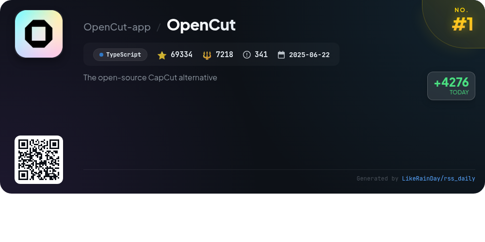
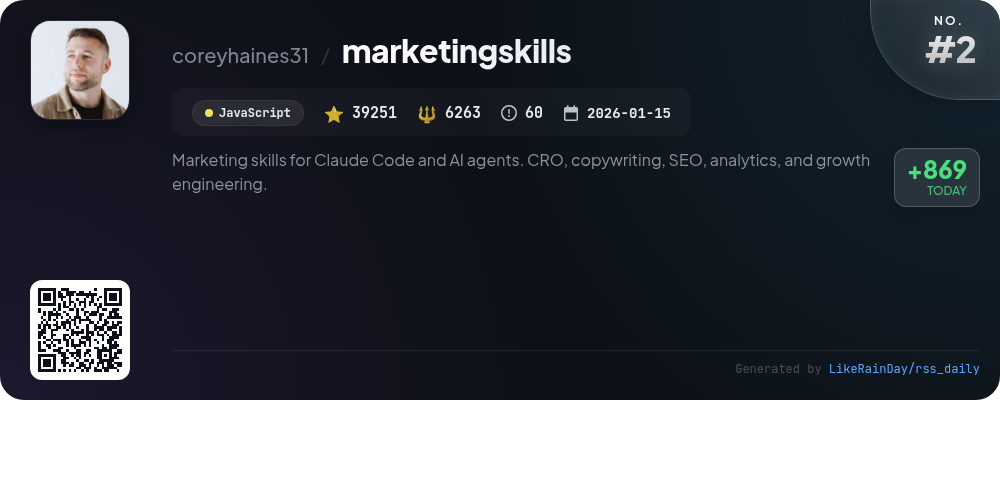
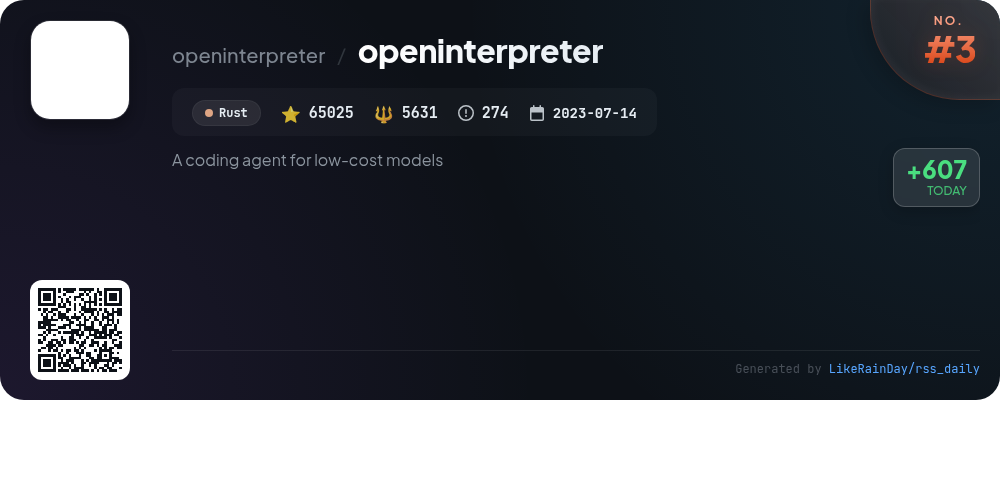
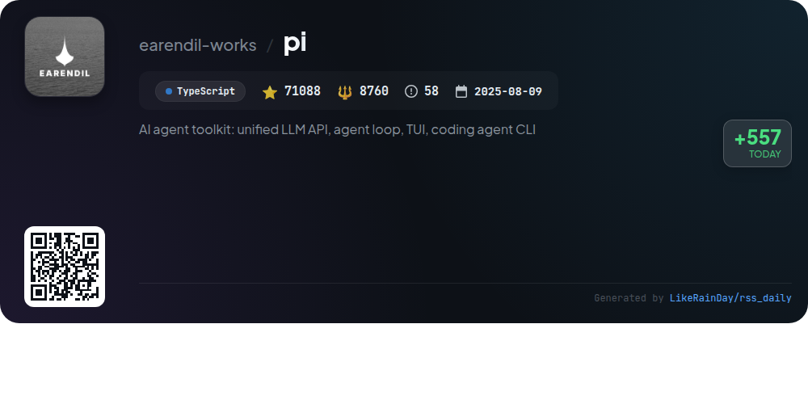
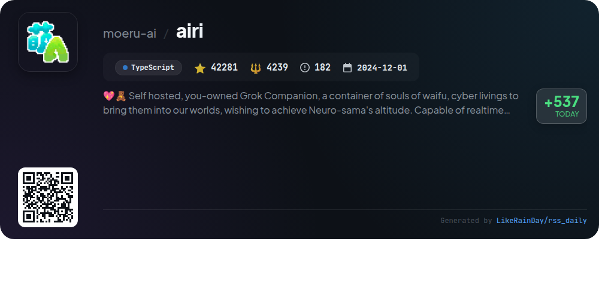
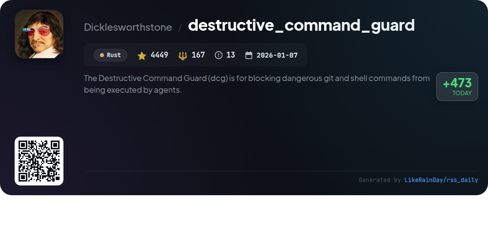
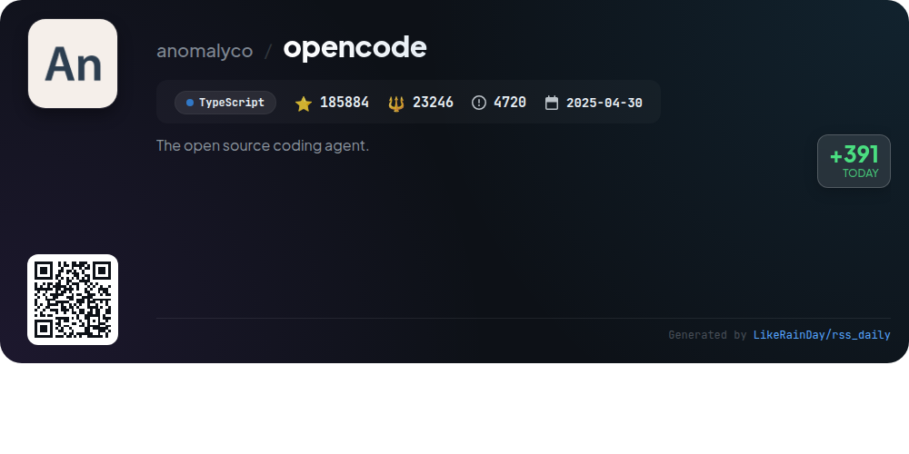
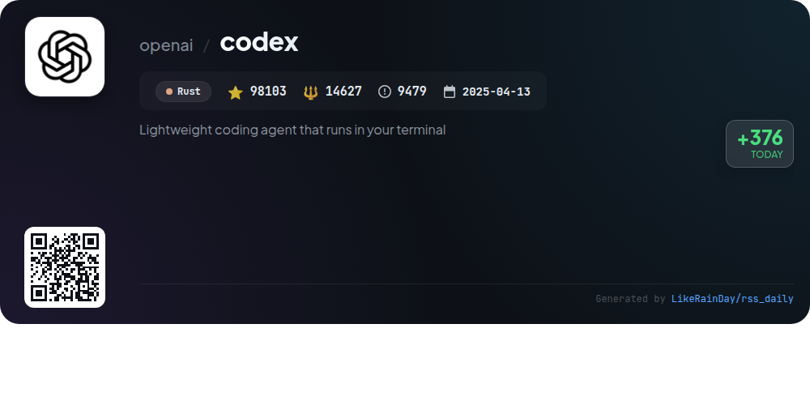
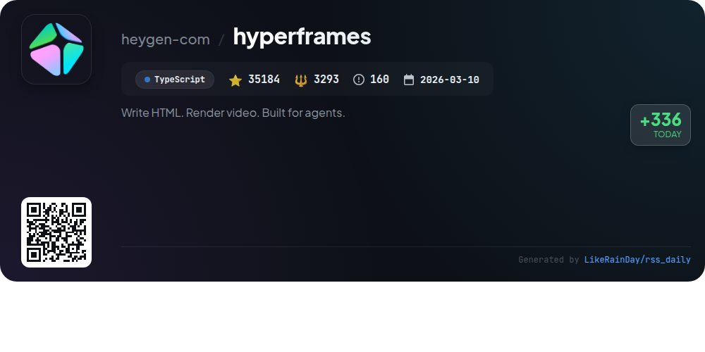
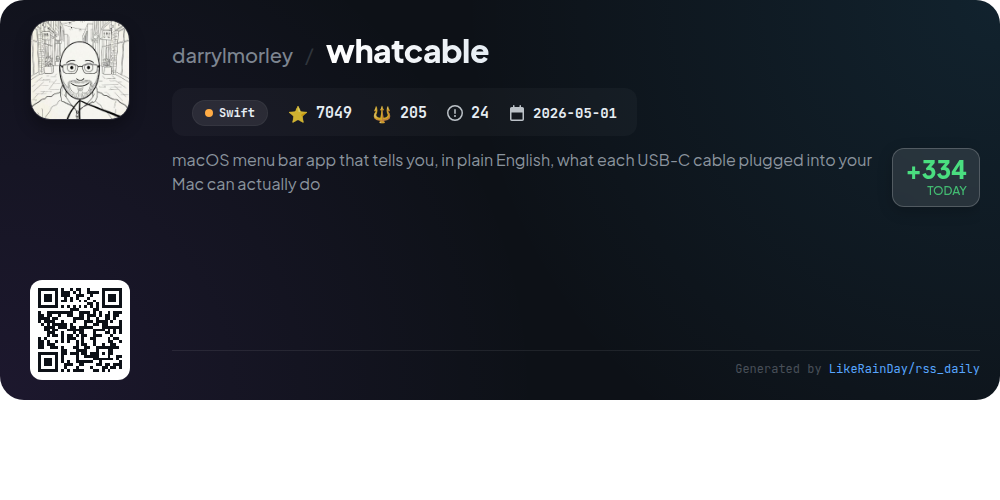

# 📊 🌟 GitHub Trending Daily - 2026-07-15

> > 📅 Daily Picks of GitHub Trending Repositories | Powered by Smart Algorithms

## 📋 Overview

**10** Projects | **617648** ⭐ | **73649** 🍴

**Top Languages:** `TypeScript` (5) · `Rust` (3) · `JavaScript` (1)

**Updated:** 2026-07-15 02:57 UTC

**Categories:**

- 🌟 Daily Top 10 (10 items)

---

## 🌟 Daily Top 10

### 1. [OpenCut](https://github.com/OpenCut-app/OpenCut)

> 🤖 **Why Recommend**  
> *OpenCut is an open-source video editor designed for web, desktop, and mobile platforms, serving as a free alternative to CapCut. With over 69,000 stars on GitHub, its upcoming features include an Editor API, support for third-party plugins, and a unified codebase using Rust. The project will also introduce a MCP server for AI agents and a headless mode for automation. While the current version is accessible at opencut.app, the rewritten version will be available at new.opencut.app. Join the Discord for updates and community engagement.*

- ⭐ 69334 stars
- 💻 TypeScript
- 📅 Updated: 2026-07-15

### 2. [marketingskills](https://github.com/coreyhaines31/marketingskills)

> 🤖 **Why Recommend**  
> *Marketingskills is a comprehensive collection of AI agent skills tailored for marketing tasks, including conversion optimization, copywriting, SEO, analytics, and growth engineering. Designed for technical marketers and founders, it integrates seamlessly with Claude Code and other AI agents, enhancing their capabilities in marketing. Key features include customizable skills for various marketing functions, a foundational product marketing skill, and a range of tools for analytics, paid ads, and customer retention. The project encourages contributions and offers hands-on support through Conversion Factory and training resources.*

- ⭐ 39251 stars
- 💻 JavaScript
- 📅 Updated: 2026-07-15

### 3. [openinterpreter](https://github.com/openinterpreter/openinterpreter)

> 🤖 **Why Recommend**  
> *Open Interpreter is a powerful coding agent optimized for low-cost models, built in Rust. It features seamless command execution within a sandbox on macOS, Linux, and Windows, and allows users to switch between various model harnesses and providers through an intuitive TUI. Key functionalities include a built-in QA skill for testing web and native applications, local configuration management, and support for the Agent Client Protocol. With extensive documentation available, Open Interpreter facilitates efficient coding and application testing, making it an invaluable tool for developers.*

- ⭐ 65025 stars
- 💻 Rust
- 📅 Updated: 2026-07-15

### 4. [pi](https://github.com/earendil-works/pi)

> 🤖 **Why Recommend**  
> *Pi is an AI agent toolkit featuring a unified LLM API, agent runtime, and interactive coding agent CLI, developed in TypeScript with over 71,000 stars on GitHub. Key components include the multi-provider LLM API for seamless integration with OpenAI and Google, the core agent for tool calling and state management, and a terminal UI library. The project emphasizes security with options for containerization and supply-chain hardening. For more information, demos, and documentation, visit pi.dev.*

- ⭐ 71088 stars
- 💻 TypeScript
- 📅 Updated: 2026-07-15

### 5. [airi](https://github.com/moeru-ai/airi)

> 🤖 **Why Recommend**  
> *AIRI is a self-hosted digital companion project designed to recreate Neuro-sama, enabling users to interact with AI waifus and virtual characters. Key features include real-time voice chat, and the ability to play popular games like Minecraft and Factorio. The project supports web, macOS, and Windows platforms, utilizing modern web technologies for versatility. AIRI prioritizes user ownership of digital identities, offering a customizable experience. With over 42,000 stars on GitHub, it invites developers to contribute to its ongoing evolution.*

- ⭐ 42281 stars
- 💻 TypeScript
- 📅 Updated: 2026-07-15

### 6. [destructive_command_guard](https://github.com/Dicklesworthstone/destructive_command_guard)

> 🤖 **Why Recommend**  
> *The Destructive Command Guard (dcg) is for blocking dangerous git and shell commands from being executed by agents.. popular project, actively maintained, recently updated*

- ⭐ 4449 stars
- 🍴 167 forks
- 💻 Rust
- 📅 Updated: 2026-07-15

### 7. [opencode](https://github.com/anomalyco/opencode)

> 🤖 **Why Recommend**  
> *OpenCode is an open-source AI coding agent designed to enhance development efficiency. With over 185,000 stars on GitHub, it offers a desktop application for macOS, Windows, and Linux. Core features include two built-in agents: a full-access "build" agent for development and a read-only "plan" agent for code exploration. It supports multiple languages and provides comprehensive documentation. OpenCode is easily installable via various package managers and offers a community-driven platform for contributions and collaboration. Join the community on Discord for support and updates.*

- ⭐ 185884 stars
- 💻 TypeScript
- 📅 Updated: 2026-07-15

### 8. [codex](https://github.com/openai/codex)

> 🤖 **Why Recommend**  
> *Codex is a lightweight coding agent by OpenAI that operates directly in your terminal, offering seamless integration for coding tasks. With over 98,000 stars on GitHub, it supports installation on various platforms, including macOS, Linux, and Windows via simple commands or package managers like npm and Homebrew. Users can enhance their coding experience by signing in with their ChatGPT account or using an API key. Codex also provides options for IDE integration and a desktop app for a comprehensive coding environment. For detailed documentation, visit the project's GitHub page.*

- ⭐ 98103 stars
- 💻 Rust
- 📅 Updated: 2026-07-15

### 9. [hyperframes](https://github.com/heygen-com/hyperframes)

> 🤖 **Why Recommend**  
> *HyperFrames is an open-source framework designed to transform HTML, CSS, and media into deterministic MP4 videos. With 35,184 stars on GitHub, it enables users to create videos using a command-line interface (CLI) or AI agents, offering 20 built-in skills for various workflows, such as product launch videos, website-to-video conversions, and more. Key features include HTML-native composition, no build step, and support for popular animation libraries like GSAP and Lottie. HyperFrames supports local rendering and AWS Lambda, making it ideal for automated content generation. Explore it at hyperframes.dev.*

- ⭐ 35184 stars
- 💻 TypeScript
- 📅 Updated: 2026-07-15

### 10. [whatcable](https://github.com/darrylmorley/whatcable)

> 🤖 **Why Recommend**  
> *WhatCable is a macOS menu bar app that provides users with clear, detailed information about USB-C cables connected to their Mac. Key features include charging diagnostics, data-speed assessments, cable e-marker info, and fault warnings. Users can view connected device identities, charging profiles, and even track cable performance over time with the Pro version. The app supports multiple languages and offers customizable settings. WhatCable enhances user awareness of cable capabilities and potential limitations, making it a valuable tool for Mac users.*

- ⭐ 7049 stars
- 💻 Swift
- 📅 Updated: 2026-07-15

---

## 📡 RSS Subscription

Subscribe via RSS to get daily trending updates:

- 🔔 [RSS XML] (../../daily-top.xml)
- 🔔 [Daily Report] (../../GITHUB_TODAY.md)
- 🔔 [Daily Top 10](../../daily-top.xml)

---

*⚡ Powered by Smart Trending Algorithm | Generated at 2026-07-15 02:57:44 UTC
