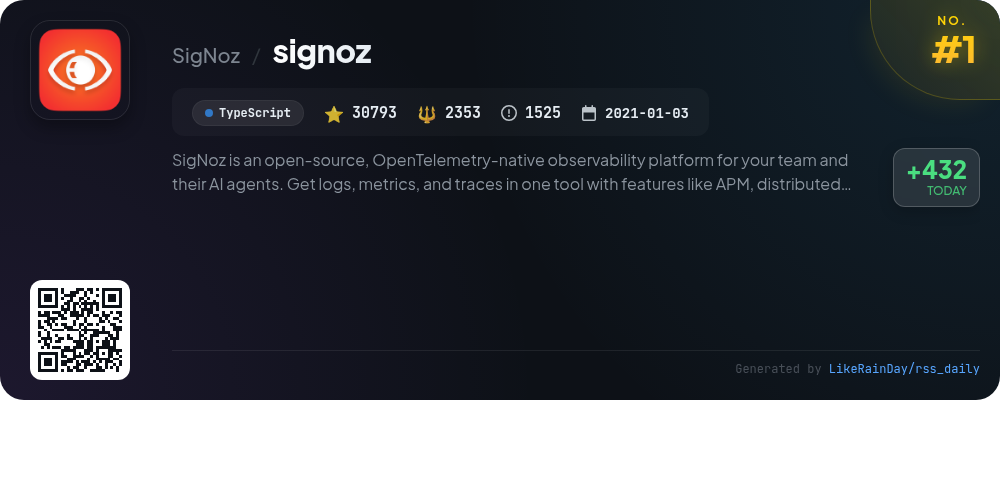
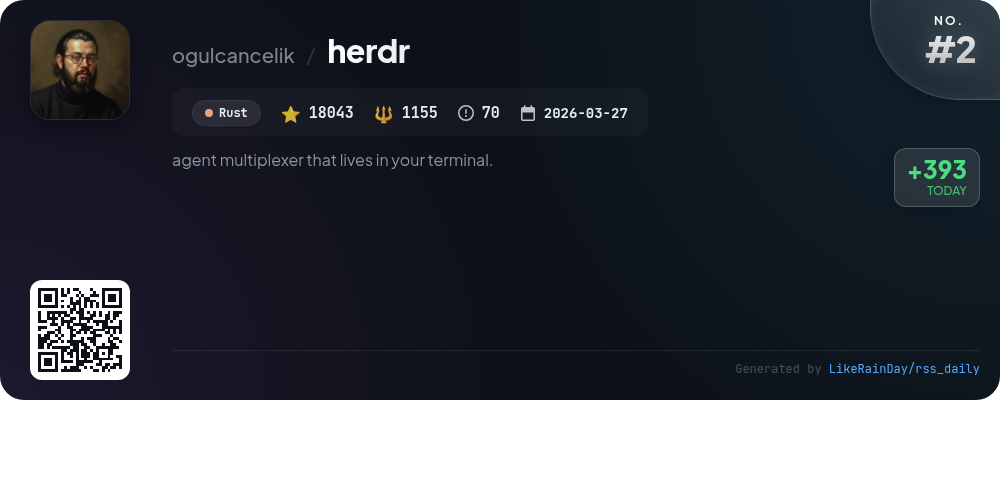
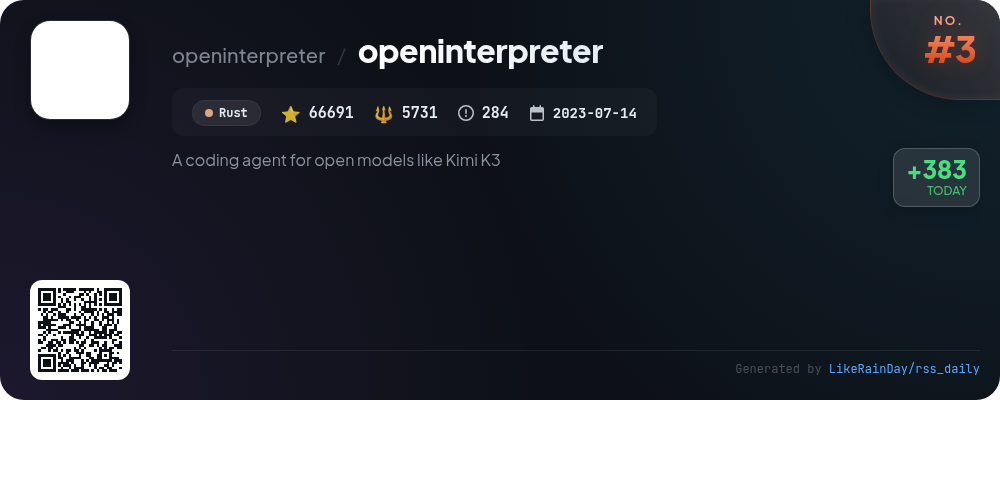
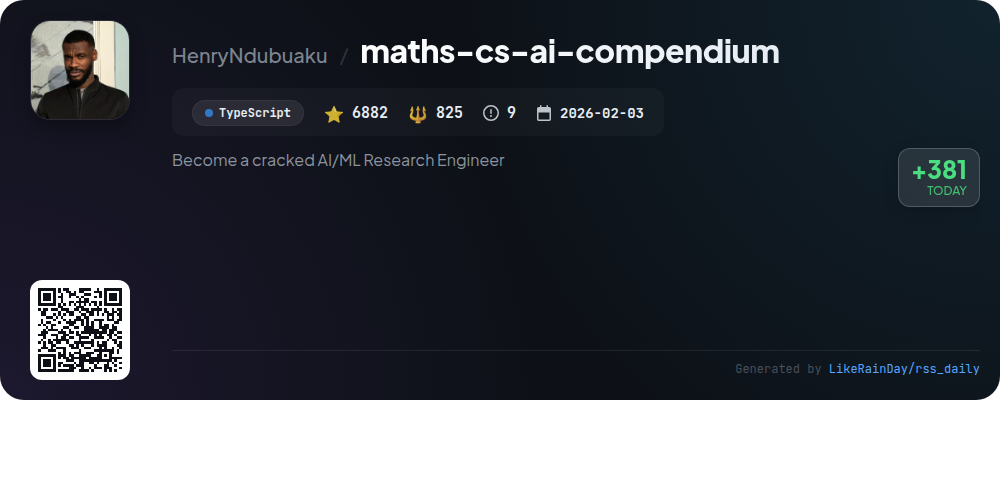
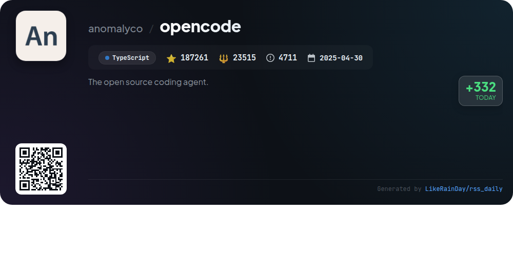
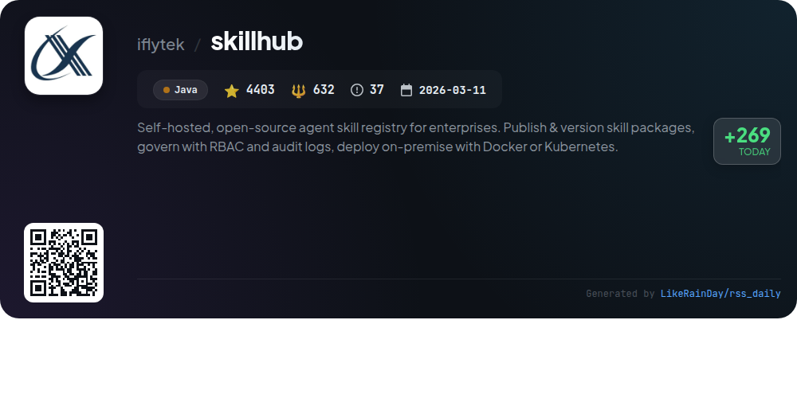
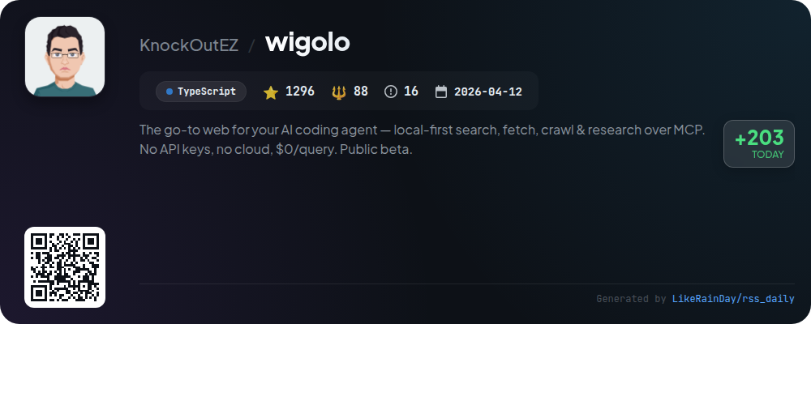
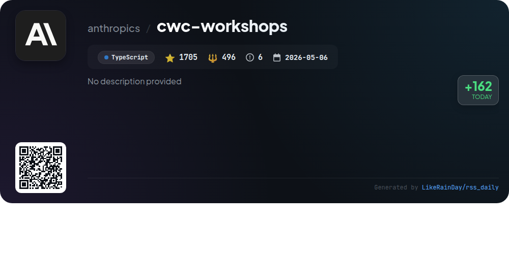
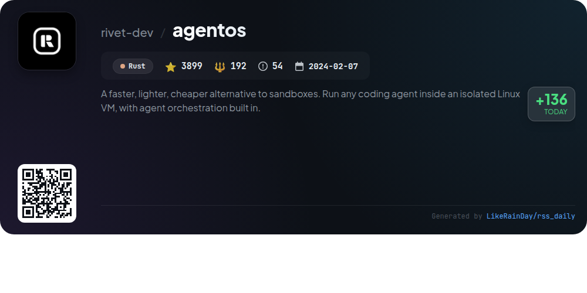
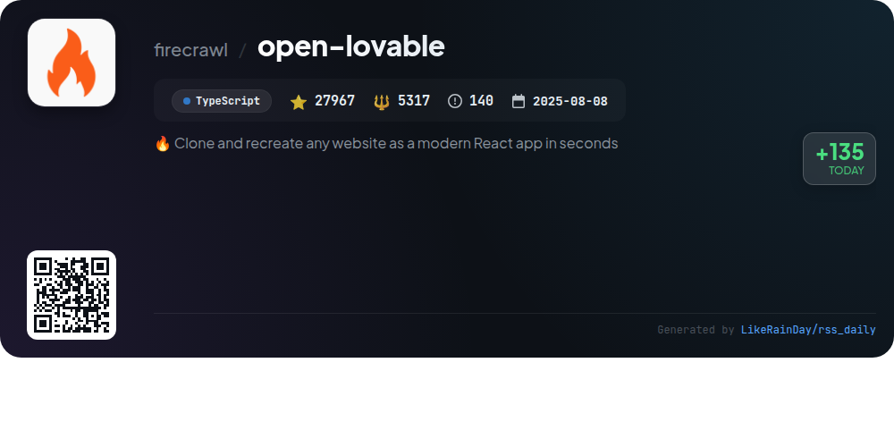

# 📊 🌟 GitHub Trending Daily - 2026-07-19

> > 📅 每日精选 GitHub 热门仓库 | 基于智能算法推荐

## 📋 Overview

**10** 个项目 | **348940** ⭐ | **40304** 🍴

**热门语言:** `TypeScript` (6) · `Rust` (3) · `Java` (1)

**更新时间:** 2026-07-19 03:31 UTC

**分类分布:**

- 🌟 每日 Top 10 精选 (10 项)

---

## 🌟 每日 Top 10 精选

### 1. [signoz](https://github.com/SigNoz/signoz)

> 🤖 **推荐理由**  
> *SigNoz is an open-source, OpenTelemetry-native observability platform designed for seamless monitoring of applications and AI agents. It integrates logs, metrics, traces, and alerts in one tool, featuring APM, distributed tracing, log management, and infrastructure monitoring. Users can choose between a managed SigNoz Cloud service or self-hosting options. Key highlights include correlated signals for efficient debugging, predictable pricing, and enterprise readiness with compliance features. SigNoz enables teams to build resilient applications while maintaining full control over their telemetry.*

- ⭐ 30793 stars
- 💻 TypeScript
- 📅 Updated: 2026-07-19

### 2. [herdr](https://github.com/ogulcancelik/herdr)

> 🤖 **推荐理由**  
> *Herdr is a Rust-based agent multiplexer designed for terminal use, boasting over 18,000 stars on GitHub. It enables users to manage multiple agents simultaneously, providing real-time terminal views of their status—blocked, working, or done. Key features include session persistence, a pure socket API for agent interactions, and support for both keyboard and mouse operations. Users can also enhance functionality through plugins. Herdr is lightweight, requiring only a single binary, making it a powerful tool for developers looking to streamline their workflows. For more information, visit herdr.dev.*

- ⭐ 18043 stars
- 💻 Rust
- 📅 Updated: 2026-07-19

### 3. [openinterpreter](https://github.com/openinterpreter/openinterpreter)

> 🤖 **推荐理由**  
> *Open Interpreter is a Rust-based coding agent designed for optimal performance with low-cost models like Kimi K3. With over 66,000 stars, it features seamless command execution in a sandbox environment across macOS, Linux, and Windows. Users can switch providers and models via a terminal user interface, utilize built-in QA skills for testing web and native apps, and maintain local configuration. It is compatible with the Agent Client Protocol (ACP) and retains Codex SDK compatibility, making it a versatile tool for developers. Comprehensive documentation is available online.*

- ⭐ 66691 stars
- 💻 Rust
- 📅 Updated: 2026-07-19

### 4. [maths-cs-ai-compendium](https://github.com/HenryNdubuaku/maths-cs-ai-compendium)

> 🤖 **推荐理由**  
> *The Maths, CS & AI Compendium is an unconventional, open textbook designed for aspiring AI/ML engineers, offering comprehensive insights into mathematics, computing, and AI. It includes 18 chapters covering topics from vectors and calculus to machine learning and neural networks, emphasizing intuitive understanding over rote learning. The project features an MCP server for integrating AI assistants as knowledge bases, along with practical tools and implementation examples. Ideal for those seeking deep knowledge in fast-evolving fields, it empowers learners to excel in interviews and real-world applications.*

- ⭐ 6882 stars
- 💻 TypeScript
- 📅 Updated: 2026-07-19

### 5. [opencode](https://github.com/anomalyco/opencode)

> 🤖 **推荐理由**  
> *OpenCode is an open-source AI coding agent, built with TypeScript, designed for developers to enhance their coding experience. With over 187,000 stars, it features a dual-agent system: a full-access "build" agent for development and a "plan" agent for code exploration, ensuring safety during unfamiliar tasks. OpenCode supports multiple installation methods across various platforms, including a desktop app in beta. Comprehensive documentation and community engagement via Discord are available, making it an invaluable tool for both novice and experienced programmers.*

- ⭐ 187261 stars
- 💻 TypeScript
- 📅 Updated: 2026-07-19

### 6. [skillhub](https://github.com/iflytek/skillhub)

> 🤖 **推荐理由**  
> *SkillHub is a self-hosted, open-source agent skill registry designed for enterprises to publish, discover, and manage reusable skill packages. Key features include RBAC governance, audit logs, and on-premise deployment via Docker or Kubernetes. Users can publish and version skills, organize them in namespaces, and access them through a native CLI or REST API. The platform supports full-text search, social features for community engagement, and pluggable storage options. With robust documentation and a focus on data sovereignty, SkillHub streamlines skill management for organizations.*

- ⭐ 4403 stars
- 💻 Java
- 📅 Updated: 2026-07-19

### 7. [wigolo](https://github.com/KnockOutEZ/wigolo)

> 🤖 **推荐理由**  
> *wigolo is a local-first web intelligence tool for AI coding agents, offering a range of services without the need for API keys or cloud dependency, all at $0 per query. Key features include multi-engine search, web fetching, crawling, structured data extraction, caching, and an autonomous research agent. It integrates seamlessly with various AI frameworks and tools, providing users with detailed, evidence-based results. Designed for privacy and efficiency, wigolo ensures that all operations remain local, making it a robust alternative to paid services.*

- ⭐ 1296 stars
- 💻 TypeScript
- 📅 Updated: 2026-07-19

### 8. [cwc-workshops](https://github.com/anthropics/cwc-workshops)

> 🤖 **推荐理由**  
> *The cwc-workshops repository offers materials from Anthropic's "Code with Claude" workshops, featuring hands-on projects to enhance AI capabilities. Core workshops include model selection with `rightmodel`, multi-agent system composition in `agent-decomposition`, and an AI-assisted product workflow in `how-we-claude-code`. Key highlights are agent configuration competitions in `agent-battle` and persistent memory integration in `agents-that-remember`. The repository, though no longer maintained, serves as a comprehensive resource for developing and deploying Claude Managed Agents.*

- ⭐ 1705 stars
- 💻 TypeScript
- 📅 Updated: 2026-07-19

### 9. [agentos](https://github.com/rivet-dev/agentos)

> 🤖 **推荐理由**  
> *A faster, lighter, cheaper alternative to sandboxes. Run any coding agent inside an isolated Linux VM, with agent orchestration built in.. popular project, actively maintained, recently updated*

- ⭐ 3899 stars
- 🍴 192 forks
- 💻 Rust
- 📅 Updated: 2026-07-19

### 10. [open-lovable](https://github.com/firecrawl/open-lovable)

> 🤖 **推荐理由**  
> *Open Lovable is a powerful tool that allows users to clone and recreate any website as a modern React app in seconds, leveraging AI for instant development. With over 27,000 stars on GitHub, it integrates seamlessly with various AI providers, including OpenAI and Anthropic, enabling customizable app creation. The project supports easy setup via a straightforward installation process and offers a choice of sandbox providers like Vercel for deployment. For a complete cloud solution, users can explore Lovable.dev.*

- ⭐ 27967 stars
- 💻 TypeScript
- 📅 Updated: 2026-07-19

---

## 📡 RSS订阅

通过 RSS 订阅，第一时间获取每日精选项目：

- 🔔 [RSS 订阅源] (../../daily-top.xml)
- 🔔 [每日简报] (../../GITHUB_TODAY_CN.md)
- 🔔 [每日 Top 10 精选](../../daily-top.xml)

---

*⚡ Powered by Smart Trending Algorithm | Generated at 2026-07-19 03:31:04 UTC
