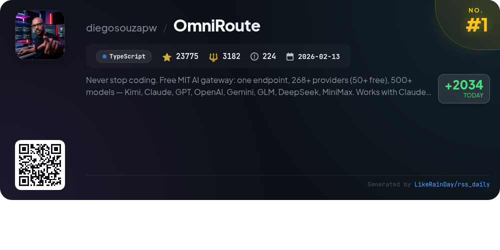
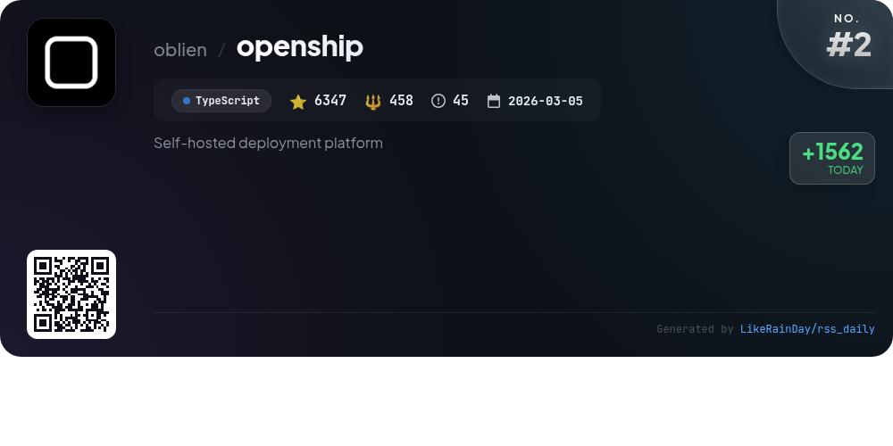
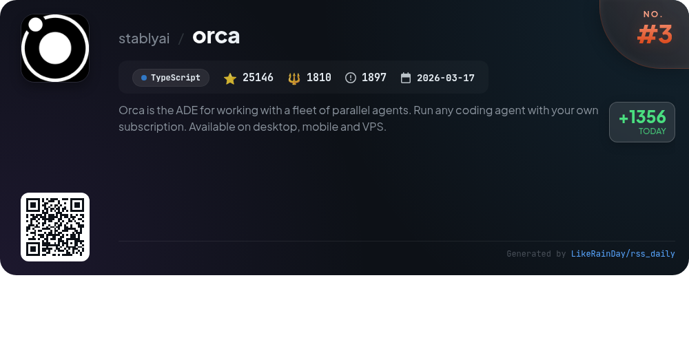
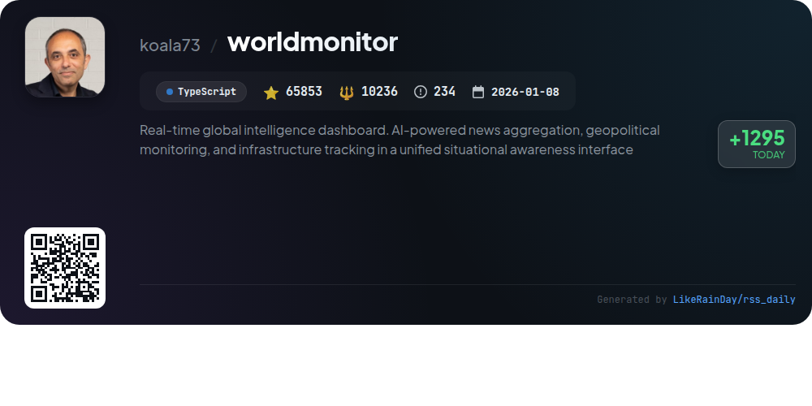
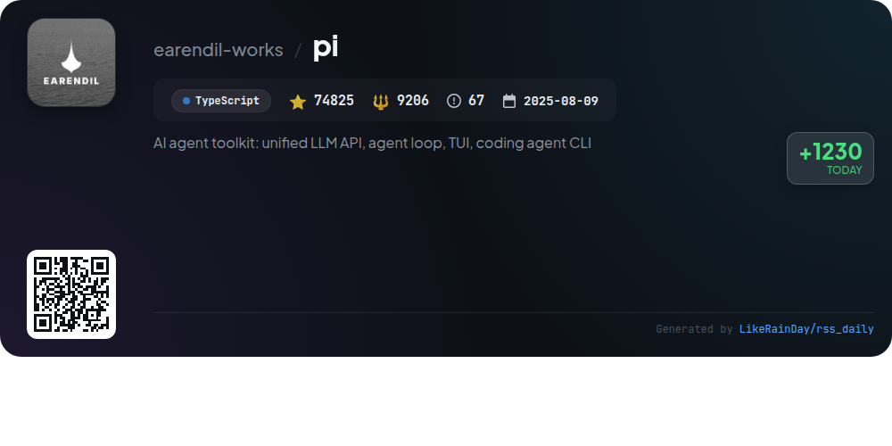
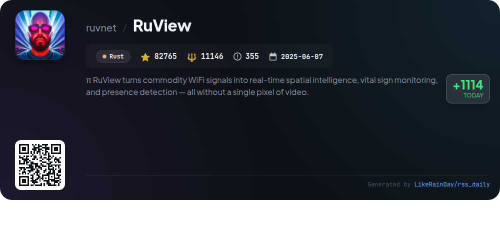
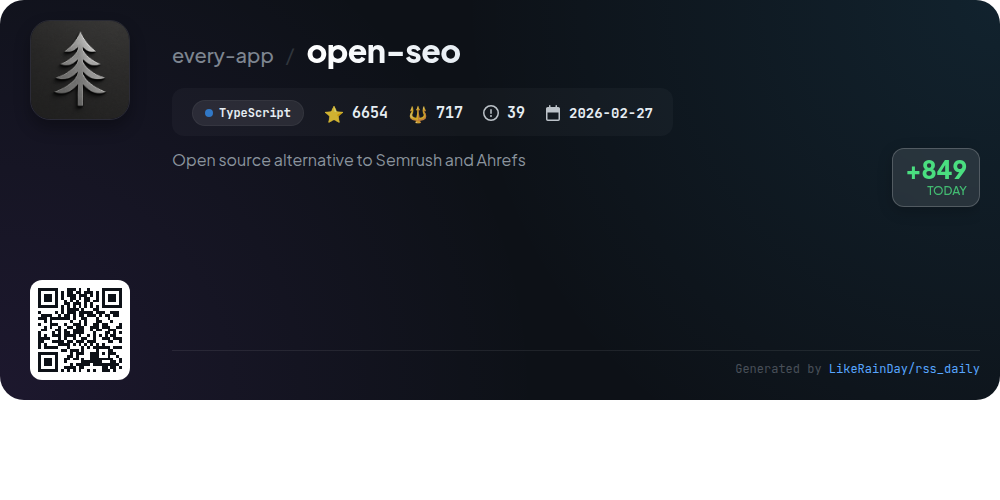
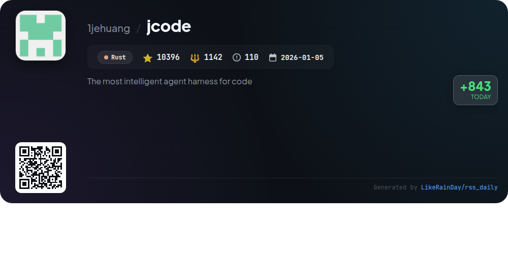
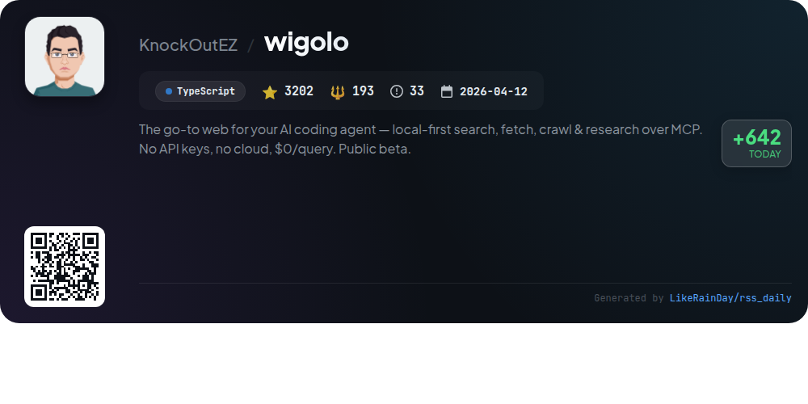
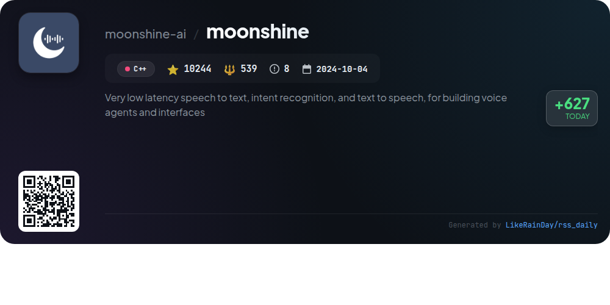

# 📊 🌟 GitHub Trending Daily - 2026-07-22

> > 📅 每日精选 GitHub 热门仓库 | 基于智能算法推荐

## 📋 Overview

**10** 个项目 | **309207** ⭐ | **38629** 🍴

**热门语言:** `TypeScript` (7) · `Rust` (2) · `C++` (1)

**更新时间:** 2026-07-22 03:22 UTC

**分类分布:**

- 🌟 每日 Top 10 精选 (10 项)

---

## 🌟 每日 Top 10 精选

### 1. [OmniRoute](https://github.com/diegosouzapw/OmniRoute)

> 🤖 **推荐理由**  
> *OmniRoute is a powerful AI gateway offering seamless access to over 268 providers, including 50+ free options and 500+ models like Kimi, Claude, and GPT. Key features include quota-aware auto-fallback, robust compression techniques saving 15-95% tokens, and support for various coding agents such as Codex and Copilot. OmniRoute provides a unified endpoint for easy integration, real-time analytics, and a user-friendly dashboard. Built by over 500 contributors, it ensures a cost-effective, high-performance solution for AI-driven development.*

- ⭐ 23775 stars
- 💻 TypeScript
- 📅 Updated: 2026-07-22

### 2. [openship](https://github.com/oblien/openship)

> 🤖 **推荐理由**  
> *Self-hosted deployment platform. popular project, actively maintained, recently updated*

- ⭐ 6347 stars
- 🍴 458 forks
- 💻 TypeScript
- 📅 Updated: 2026-07-22

### 3. [orca](https://github.com/stablyai/orca)

> 🤖 **推荐理由**  
> *Orca is an advanced development environment (ADE) designed for managing parallel coding agents, supporting platforms like macOS, Windows, and Linux. With over 25,000 stars on GitHub, its core features include parallel worktrees for running multiple agents simultaneously, a mobile companion app for remote monitoring, and ghostty-class terminals with infinite splits. Users can integrate GitHub and Linear directly in-app, annotate AI-generated diffs, and utilize a powerful CLI. Orca empowers developers to orchestrate workflows efficiently while providing seamless collaboration and monitoring capabilities.*

- ⭐ 25146 stars
- 💻 TypeScript
- 📅 Updated: 2026-07-22

### 4. [worldmonitor](https://github.com/koala73/worldmonitor)

> 🤖 **推荐理由**  
> *WorldMonitor is a real-time global intelligence dashboard that integrates AI-powered news aggregation, geopolitical monitoring, and infrastructure tracking into a single interface. Key features include 500+ curated news feeds across 15 categories, a dual map engine with 3D and flat map views, and a Country Instability Index for 31 Tier-1 countries. The platform supports multiple languages and offers six site variants, along with a native desktop app for macOS, Windows, and Linux. It also provides robust APIs and SDKs for programmatic access, making it ideal for developers and analysts.*

- ⭐ 65853 stars
- 💻 TypeScript
- 📅 Updated: 2026-07-22

### 5. [pi](https://github.com/earendil-works/pi)

> 🤖 **推荐理由**  
> *Pi is an AI agent toolkit featuring a unified multi-provider LLM API, agent runtime, and interactive coding agent CLI, built in TypeScript. Key components include the `@earendil-works/pi-ai` for seamless integration with providers like OpenAI and Google, the `@earendil-works/pi-agent-core` for state management, and the `@earendil-works/pi-coding-agent` for command-line interactions. The toolkit also offers a terminal UI library and robust development practices for supply-chain integrity. Visit pi.dev for demos and documentation.*

- ⭐ 74825 stars
- 💻 TypeScript
- 📅 Updated: 2026-07-22

### 6. [RuView](https://github.com/ruvnet/RuView)

> 🤖 **推荐理由**  
> *RuView is an innovative project that transforms standard WiFi signals into real-time spatial intelligence, enabling vital sign monitoring and presence detection without the use of video. Leveraging Rust for high performance, RuView offers seamless integration and privacy-focused solutions for various applications, including health monitoring and smart home environments. With over 82,000 stars on GitHub, RuView stands out for its groundbreaking approach to utilizing existing WiFi infrastructure for advanced sensing capabilities, making it a valuable tool for developers and researchers alike.*

- ⭐ 82765 stars
- 💻 Rust
- 📅 Updated: 2026-07-22

### 7. [open-seo](https://github.com/every-app/open-seo)

> 🤖 **推荐理由**  
> *OpenSEO is an open-source SEO tool designed as an affordable alternative to Semrush and Ahrefs, garnering 6,654 stars on GitHub. It features a modern UI focused on streamlined workflows for keyword research, rank tracking, competitor insights, backlinks, and site audits. Users can connect with AI agents like Claude Code for customized SEO tasks. OpenSEO supports self-hosting via Docker or Cloudflare and operates on a pay-as-you-go model using a DataForSEO API key. A hosted version is available for $10/month, making it accessible for all users.*

- ⭐ 6654 stars
- 💻 TypeScript
- 📅 Updated: 2026-07-22

### 8. [jcode](https://github.com/1jehuang/jcode)

> 🤖 **推荐理由**  
> *jcode is an advanced coding agent designed for multi-session workflows, built with Rust for optimal performance and resource efficiency. Key features include a human-like memory system for recalling information, real-time collaboration through swarm capabilities, and flexible integration with various AI providers like OpenAI and GitHub Copilot. jcode supports extensive customization, allowing self-development and code editing within sessions. Additional services include browser automation and a rich user interface with side panels for auxiliary information, enhancing coding productivity and collaboration.*

- ⭐ 10396 stars
- 💻 Rust
- 📅 Updated: 2026-07-22

### 9. [wigolo](https://github.com/KnockOutEZ/wigolo)

> 🤖 **推荐理由**  
> *wigolo is a local-first web intelligence tool for AI coding agents, enabling search, fetch, crawl, extract, cache, and research without API keys or cloud reliance, costing $0 per query. It supports various agents (e.g., Claude Code, VS Code) and operates as an MCP server or REST endpoint. Key features include multi-engine search with explainable scoring, structured data extraction, and persistent caching. It offers SDKs for TypeScript and Python, making integration seamless. Wigolo is in public beta, emphasizing privacy and performance without hidden costs.*

- ⭐ 3202 stars
- 💻 TypeScript
- 📅 Updated: 2026-07-22

### 10. [moonshine](https://github.com/moonshine-ai/moonshine)

> 🤖 **推荐理由**  
> *Moonshine is an open-source AI toolkit for developers, offering low-latency speech-to-text, intent recognition, and text-to-speech capabilities for real-time voice interfaces. Key features include on-device processing for privacy and speed, support for multiple languages, and a unified API across various platforms like Python, iOS, Android, and more. The library provides high-level abstractions for common tasks like transcription, command recognition, and conversational agents, enabling seamless integration into applications without requiring API keys or accounts.*

- ⭐ 10244 stars
- 💻 C++
- 📅 Updated: 2026-07-22

---

## 📡 RSS订阅

通过 RSS 订阅，第一时间获取每日精选项目：

- 🔔 [RSS 订阅源] (../../daily-top.xml)
- 🔔 [每日简报] (../../GITHUB_TODAY_CN.md)
- 🔔 [每日 Top 10 精选](../../daily-top.xml)

---

*⚡ Powered by Smart Trending Algorithm | Generated at 2026-07-22 03:22:37 UTC
